# Results — DenseNet-121 encoder

Encoder: `densenet121` (ImageNet pretrained, multi-scale features projected to 768@14x14).
Training stopped early at epoch 68 (no Val Dice improvement for 15 epochs after epoch 53).

## Dataset: Image Segmentation + Video Segmentation Dataset

| Split | Image seg | Video seg  |
|-------|-----------|------------|
| Train | 800       | 934 pairs  |
| Val   | 100       | 259 pairs  |
| Test  | 100       | 1009 pairs |

**Trainable params:** 93,598,913 / **Total:** 289,501,634

## Test Results

### Image Test (100 images)

| Metric | Value |
|--------|-------|
| Dice | 0.9008 |
| IoU | 0.8408 |
| F1 | 0.9008 |
| Hausdorff Distance | 21.99 |
| Loss | 0.9377 |

### Video Test (1009 pairs)

| Metric | Value |
|--------|-------|
| Dice | 0.7463 |
| IoU | 0.6840 |
| F1 | 0.7463 |
| Hausdorff Distance | 43.62 |
| Loss | 3.0898 |

**Best validation Dice:** 0.9249 (epoch 53)

## Qualitative Predictions

Predictions from the best model checkpoint on one held-out test sample from each dataset. Overlay shows the predicted mask in green at threshold 0.5.

### Image Test — `cju1cnnziug1l0835yh4ropyg.jpg` (prompt: "medium round polyp")

| Input | Ground Truth | Prediction (overlay) |
|-------|--------------|----------------------|
| 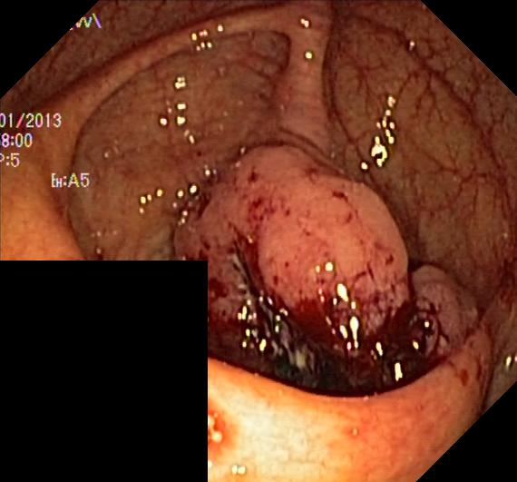 |  | 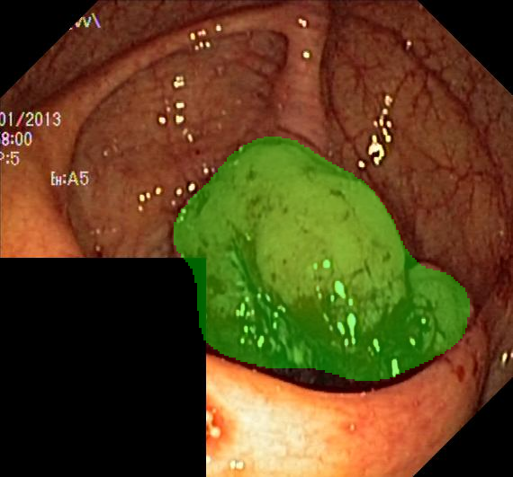 |

### Video Test — seq5 frames 0 & 1 (prompt: "medium round polyp")

| Frame 1 (segmented) | Frame 2 (correspondence) | Ground Truth (frame 1) | Prediction (overlay on frame 1) |
|---------------------|--------------------------|------------------------|---------------------------------|
|  |  |  | 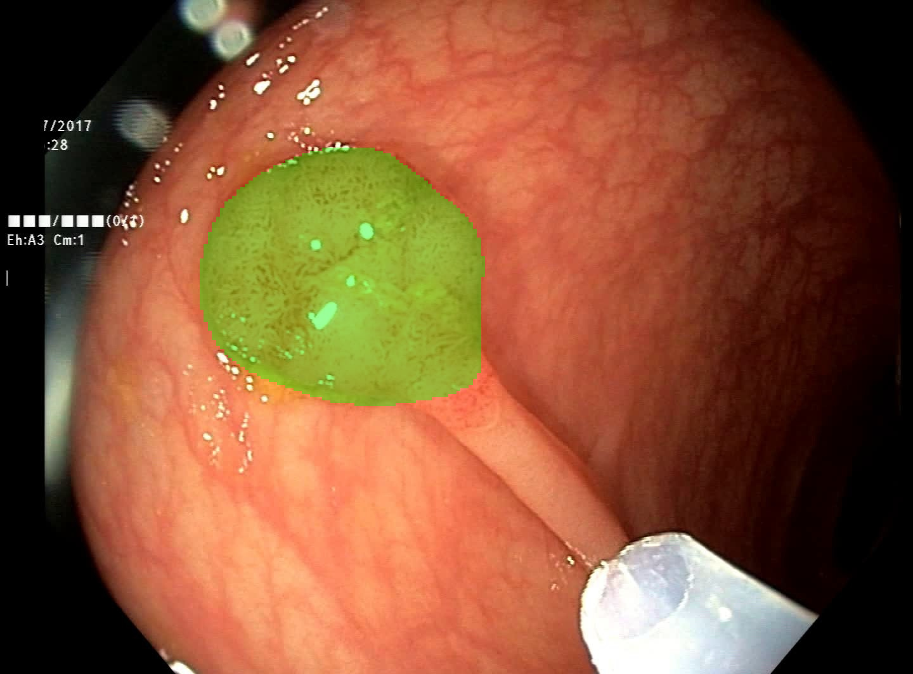 |

## Training Curves

Overview of the full run (best image-val Dice marked at epoch 53):

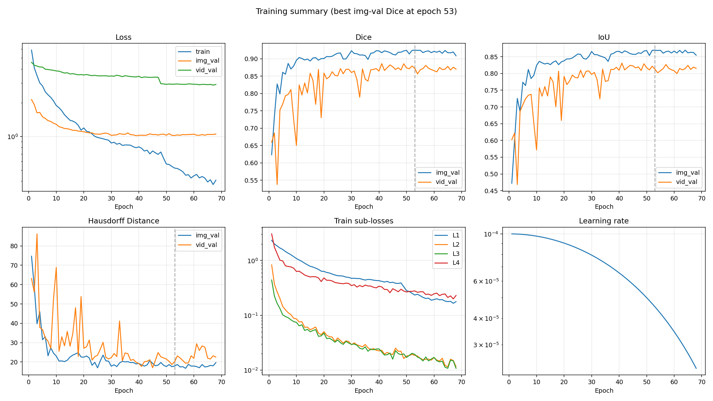

Individual plots:

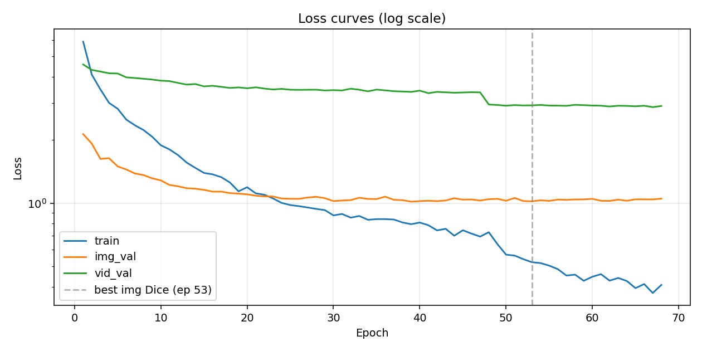

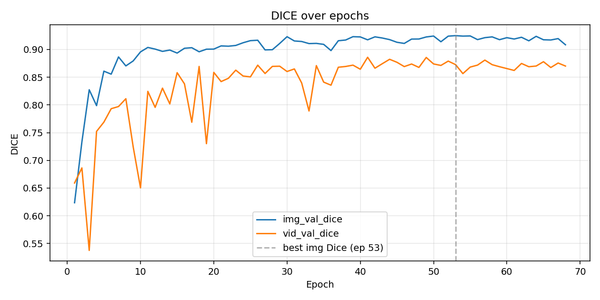

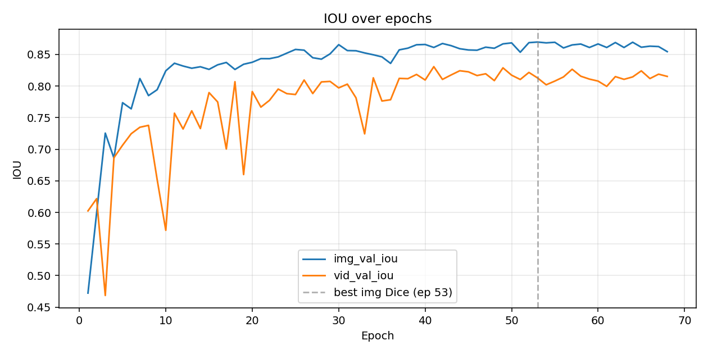

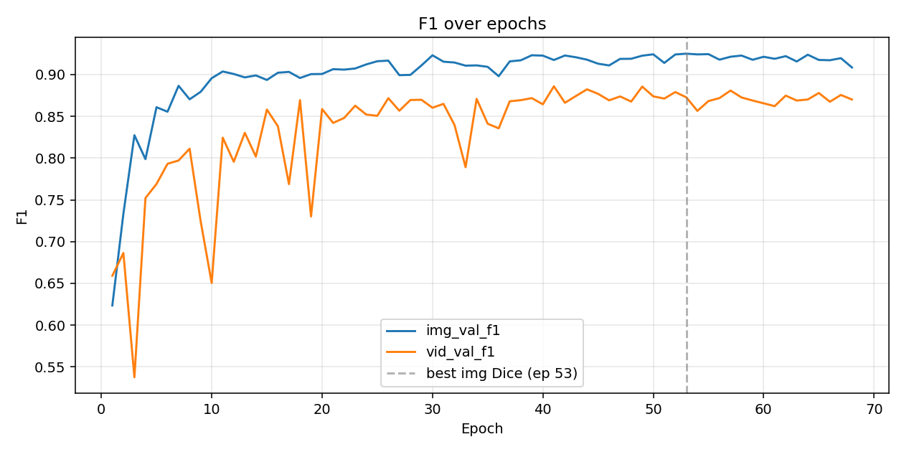

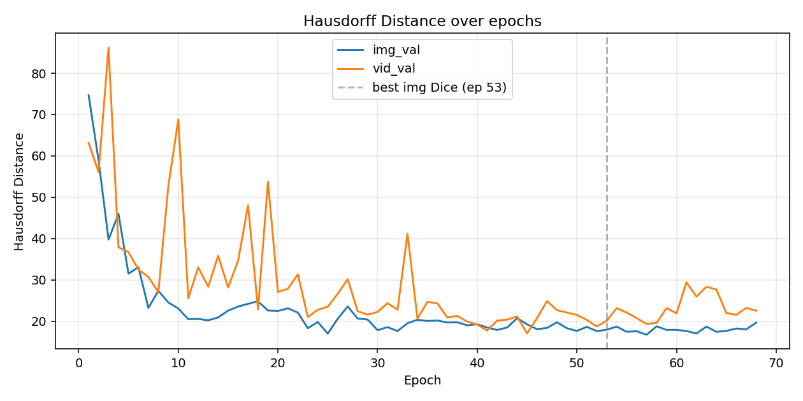

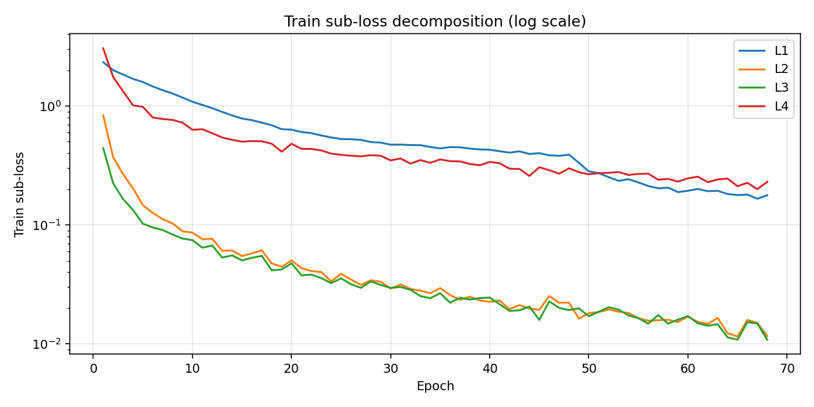

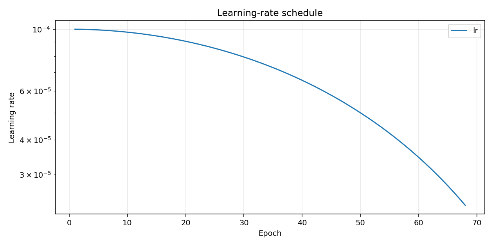

## Training Log

```
Epoch 001/100 (72.4s) | LR: 1.00e-04 | Train Loss: 5.8842 (L1: 2.3369, L2: 0.8311, L3: 0.4420, L4: 3.0542)
  Img Val  | Loss: 2.1357 | Dice: 0.6236 | IoU: 0.4724 | F1: 0.6236 | HD: 74.67
  Vid Val  | Loss: 4.5827 | Dice: 0.6592 | IoU: 0.6024 | F1: 0.6592 | HD: 63.13
  -> New best model saved (Dice: 0.6236)
Epoch 002/100 (56.8s) | LR: 9.99e-05 | Train Loss: 4.0995 (L1: 2.0015, L2: 0.3706, L3: 0.2239, L4: 1.7505)
  Img Val  | Loss: 1.9237 | Dice: 0.7332 | IoU: 0.5993 | F1: 0.7332 | HD: 58.92
  Vid Val  | Loss: 4.3168 | Dice: 0.6863 | IoU: 0.6217 | F1: 0.6863 | HD: 56.11
  -> New best model saved (Dice: 0.7332)
Epoch 003/100 (43.4s) | LR: 9.98e-05 | Train Loss: 3.4855 (L1: 1.8388, L2: 0.2673, L3: 0.1650, L4: 1.3284)
  Img Val  | Loss: 1.6261 | Dice: 0.8273 | IoU: 0.7254 | F1: 0.8273 | HD: 39.77
  Vid Val  | Loss: 4.2404 | Dice: 0.5376 | IoU: 0.4685 | F1: 0.5376 | HD: 86.19
  -> New best model saved (Dice: 0.8273)
Epoch 004/100 (51.6s) | LR: 9.96e-05 | Train Loss: 3.0069 (L1: 1.6901, L2: 0.2030, L3: 0.1336, L4: 1.0132)
  Img Val  | Loss: 1.6396 | Dice: 0.7987 | IoU: 0.6861 | F1: 0.7987 | HD: 45.97
  Vid Val  | Loss: 4.1612 | Dice: 0.7522 | IoU: 0.6865 | F1: 0.7522 | HD: 37.88
Epoch 005/100 (39.9s) | LR: 9.94e-05 | Train Loss: 2.8196 (L1: 1.5908, L2: 0.1464, L3: 0.1025, L4: 0.9828)
  Img Val  | Loss: 1.4981 | Dice: 0.8608 | IoU: 0.7736 | F1: 0.8608 | HD: 31.51
  Vid Val  | Loss: 4.1516 | Dice: 0.7689 | IoU: 0.7063 | F1: 0.7689 | HD: 36.72
  -> New best model saved (Dice: 0.8608)
Epoch 006/100 (41.2s) | LR: 9.91e-05 | Train Loss: 2.5028 (L1: 1.4596, L2: 0.1262, L3: 0.0951, L4: 0.8008)
  Img Val  | Loss: 1.4482 | Dice: 0.8554 | IoU: 0.7639 | F1: 0.8554 | HD: 33.07
  Vid Val  | Loss: 3.9788 | Dice: 0.7931 | IoU: 0.7245 | F1: 0.7931 | HD: 32.51
Epoch 007/100 (40.5s) | LR: 9.88e-05 | Train Loss: 2.3516 (L1: 1.3572, L2: 0.1117, L3: 0.0906, L4: 0.7773)
  Img Val  | Loss: 1.3863 | Dice: 0.8865 | IoU: 0.8118 | F1: 0.8865 | HD: 23.21
  Vid Val  | Loss: 3.9504 | Dice: 0.7971 | IoU: 0.7347 | F1: 0.7971 | HD: 30.70
  -> New best model saved (Dice: 0.8865)
Epoch 008/100 (40.7s) | LR: 9.84e-05 | Train Loss: 2.2315 (L1: 1.2729, L2: 0.1029, L3: 0.0830, L4: 0.7639)
  Img Val  | Loss: 1.3622 | Dice: 0.8703 | IoU: 0.7848 | F1: 0.8703 | HD: 27.36
  Vid Val  | Loss: 3.9196 | Dice: 0.8111 | IoU: 0.7378 | F1: 0.8111 | HD: 27.07
Epoch 009/100 (42.6s) | LR: 9.80e-05 | Train Loss: 2.0740 (L1: 1.1768, L2: 0.0885, L3: 0.0768, L4: 0.7241)
  Img Val  | Loss: 1.3142 | Dice: 0.8792 | IoU: 0.7941 | F1: 0.8792 | HD: 24.55
  Vid Val  | Loss: 3.8843 | Dice: 0.7244 | IoU: 0.6520 | F1: 0.7244 | HD: 52.67
Epoch 010/100 (40.6s) | LR: 9.76e-05 | Train Loss: 1.8889 (L1: 1.0862, L2: 0.0862, L3: 0.0745, L4: 0.6313)
  Img Val  | Loss: 1.2856 | Dice: 0.8956 | IoU: 0.8241 | F1: 0.8956 | HD: 23.07
  Vid Val  | Loss: 3.8366 | Dice: 0.6505 | IoU: 0.5717 | F1: 0.6505 | HD: 68.84
  -> New best model saved (Dice: 0.8956)
Epoch 011/100 (39.6s) | LR: 9.70e-05 | Train Loss: 1.8056 (L1: 1.0209, L2: 0.0759, L3: 0.0644, L4: 0.6380)
  Img Val  | Loss: 1.2228 | Dice: 0.9036 | IoU: 0.8360 | F1: 0.9036 | HD: 20.49
  Vid Val  | Loss: 3.8198 | Dice: 0.8244 | IoU: 0.7570 | F1: 0.8244 | HD: 25.54
  -> New best model saved (Dice: 0.9036)
Epoch 012/100 (41.1s) | LR: 9.65e-05 | Train Loss: 1.6951 (L1: 0.9591, L2: 0.0766, L3: 0.0672, L4: 0.5904)
  Img Val  | Loss: 1.2045 | Dice: 0.9006 | IoU: 0.8316 | F1: 0.9006 | HD: 20.55
  Vid Val  | Loss: 3.7426 | Dice: 0.7955 | IoU: 0.7320 | F1: 0.7955 | HD: 33.05
Epoch 013/100 (40.4s) | LR: 9.59e-05 | Train Loss: 1.5619 (L1: 0.8921, L2: 0.0605, L3: 0.0531, L4: 0.5432)
  Img Val  | Loss: 1.1794 | Dice: 0.8965 | IoU: 0.8281 | F1: 0.8965 | HD: 20.23
  Vid Val  | Loss: 3.6755 | Dice: 0.8302 | IoU: 0.7608 | F1: 0.8302 | HD: 28.35
Epoch 014/100 (40.6s) | LR: 9.52e-05 | Train Loss: 1.4741 (L1: 0.8333, L2: 0.0610, L3: 0.0555, L4: 0.5199)
  Img Val  | Loss: 1.1734 | Dice: 0.8989 | IoU: 0.8305 | F1: 0.8989 | HD: 20.91
  Vid Val  | Loss: 3.6976 | Dice: 0.8018 | IoU: 0.7327 | F1: 0.8018 | HD: 35.82
Epoch 015/100 (40.7s) | LR: 9.46e-05 | Train Loss: 1.3949 (L1: 0.7844, L2: 0.0547, L3: 0.0503, L4: 0.5014)
  Img Val  | Loss: 1.1585 | Dice: 0.8935 | IoU: 0.8263 | F1: 0.8935 | HD: 22.57
  Vid Val  | Loss: 3.6042 | Dice: 0.8581 | IoU: 0.7896 | F1: 0.8581 | HD: 28.18
Epoch 016/100 (40.8s) | LR: 9.38e-05 | Train Loss: 1.3733 (L1: 0.7601, L2: 0.0577, L3: 0.0529, L4: 0.5073)
  Img Val  | Loss: 1.1363 | Dice: 0.9021 | IoU: 0.8336 | F1: 0.9021 | HD: 23.55
  Vid Val  | Loss: 3.6285 | Dice: 0.8379 | IoU: 0.7748 | F1: 0.8379 | HD: 34.61
Epoch 017/100 (41.1s) | LR: 9.30e-05 | Train Loss: 1.3315 (L1: 0.7246, L2: 0.0612, L3: 0.0549, L4: 0.5048)
  Img Val  | Loss: 1.1362 | Dice: 0.9031 | IoU: 0.8373 | F1: 0.9031 | HD: 24.21
  Vid Val  | Loss: 3.5865 | Dice: 0.7688 | IoU: 0.7004 | F1: 0.7688 | HD: 48.08
Epoch 018/100 (40.0s) | LR: 9.22e-05 | Train Loss: 1.2564 (L1: 0.6888, L2: 0.0475, L3: 0.0415, L4: 0.4817)
  Img Val  | Loss: 1.1185 | Dice: 0.8958 | IoU: 0.8262 | F1: 0.8958 | HD: 24.84
  Vid Val  | Loss: 3.5434 | Dice: 0.8693 | IoU: 0.8068 | F1: 0.8693 | HD: 22.85
Epoch 019/100 (40.3s) | LR: 9.14e-05 | Train Loss: 1.1402 (L1: 0.6390, L2: 0.0444, L3: 0.0422, L4: 0.4126)
  Img Val  | Loss: 1.1114 | Dice: 0.9004 | IoU: 0.8344 | F1: 0.9004 | HD: 22.58
  Vid Val  | Loss: 3.5636 | Dice: 0.7301 | IoU: 0.6599 | F1: 0.7301 | HD: 53.79
Epoch 020/100 (40.1s) | LR: 9.05e-05 | Train Loss: 1.1923 (L1: 0.6320, L2: 0.0504, L3: 0.0476, L4: 0.4812)
  Img Val  | Loss: 1.1029 | Dice: 0.9006 | IoU: 0.8376 | F1: 0.9006 | HD: 22.49
  Vid Val  | Loss: 3.5303 | Dice: 0.8586 | IoU: 0.7912 | F1: 0.8586 | HD: 27.08
Epoch 021/100 (41.1s) | LR: 8.95e-05 | Train Loss: 1.1149 (L1: 0.6045, L2: 0.0434, L3: 0.0377, L4: 0.4362)
  Img Val  | Loss: 1.0872 | Dice: 0.9064 | IoU: 0.8433 | F1: 0.9064 | HD: 23.12
  Vid Val  | Loss: 3.5671 | Dice: 0.8420 | IoU: 0.7666 | F1: 0.8420 | HD: 27.86
  -> New best model saved (Dice: 0.9064)
Epoch 022/100 (40.2s) | LR: 8.85e-05 | Train Loss: 1.0981 (L1: 0.5915, L2: 0.0409, L3: 0.0382, L4: 0.4359)
  Img Val  | Loss: 1.0783 | Dice: 0.9058 | IoU: 0.8433 | F1: 0.9058 | HD: 22.09
  Vid Val  | Loss: 3.5186 | Dice: 0.8480 | IoU: 0.7774 | F1: 0.8480 | HD: 31.35
Epoch 023/100 (40.6s) | LR: 8.75e-05 | Train Loss: 1.0547 (L1: 0.5653, L2: 0.0402, L3: 0.0357, L4: 0.4230)
  Img Val  | Loss: 1.0774 | Dice: 0.9072 | IoU: 0.8461 | F1: 0.9072 | HD: 18.31
  Vid Val  | Loss: 3.4835 | Dice: 0.8627 | IoU: 0.7952 | F1: 0.8627 | HD: 21.01
  -> New best model saved (Dice: 0.9072)
Epoch 024/100 (40.4s) | LR: 8.64e-05 | Train Loss: 1.0040 (L1: 0.5441, L2: 0.0335, L3: 0.0324, L4: 0.3977)
  Img Val  | Loss: 1.0538 | Dice: 0.9120 | IoU: 0.8520 | F1: 0.9120 | HD: 19.82
  Vid Val  | Loss: 3.5077 | Dice: 0.8521 | IoU: 0.7879 | F1: 0.8521 | HD: 22.76
  -> New best model saved (Dice: 0.9120)
Epoch 025/100 (40.9s) | LR: 8.54e-05 | Train Loss: 0.9809 (L1: 0.5273, L2: 0.0388, L3: 0.0355, L4: 0.3886)
  Img Val  | Loss: 1.0505 | Dice: 0.9159 | IoU: 0.8579 | F1: 0.9159 | HD: 16.99
  Vid Val  | Loss: 3.4740 | Dice: 0.8505 | IoU: 0.7866 | F1: 0.8505 | HD: 23.50
  -> New best model saved (Dice: 0.9159)
Epoch 026/100 (40.2s) | LR: 8.42e-05 | Train Loss: 0.9691 (L1: 0.5253, L2: 0.0347, L3: 0.0317, L4: 0.3819)
  Img Val  | Loss: 1.0498 | Dice: 0.9166 | IoU: 0.8567 | F1: 0.9166 | HD: 20.61
  Vid Val  | Loss: 3.4693 | Dice: 0.8716 | IoU: 0.8095 | F1: 0.8716 | HD: 26.63
  -> New best model saved (Dice: 0.9166)
Epoch 027/100 (40.3s) | LR: 8.31e-05 | Train Loss: 0.9549 (L1: 0.5189, L2: 0.0313, L3: 0.0296, L4: 0.3773)
  Img Val  | Loss: 1.0653 | Dice: 0.8992 | IoU: 0.8447 | F1: 0.8992 | HD: 23.58
  Vid Val  | Loss: 3.4724 | Dice: 0.8566 | IoU: 0.7881 | F1: 0.8566 | HD: 30.19
Epoch 028/100 (40.4s) | LR: 8.19e-05 | Train Loss: 0.9403 (L1: 0.4978, L2: 0.0343, L3: 0.0335, L4: 0.3863)
  Img Val  | Loss: 1.0737 | Dice: 0.8995 | IoU: 0.8425 | F1: 0.8995 | HD: 20.64
  Vid Val  | Loss: 3.4756 | Dice: 0.8695 | IoU: 0.8065 | F1: 0.8695 | HD: 22.42
Epoch 029/100 (40.7s) | LR: 8.06e-05 | Train Loss: 0.9279 (L1: 0.4920, L2: 0.0333, L3: 0.0313, L4: 0.3815)
  Img Val  | Loss: 1.0576 | Dice: 0.9108 | IoU: 0.8509 | F1: 0.9108 | HD: 20.42
  Vid Val  | Loss: 3.4468 | Dice: 0.8698 | IoU: 0.8073 | F1: 0.8698 | HD: 21.59
Epoch 030/100 (40.7s) | LR: 7.94e-05 | Train Loss: 0.8757 (L1: 0.4729, L2: 0.0292, L3: 0.0295, L4: 0.3486)
  Img Val  | Loss: 1.0241 | Dice: 0.9230 | IoU: 0.8654 | F1: 0.9230 | HD: 17.83
  Vid Val  | Loss: 3.4593 | Dice: 0.8602 | IoU: 0.7970 | F1: 0.8602 | HD: 22.24
  -> New best model saved (Dice: 0.9230)
Epoch 031/100 (42.2s) | LR: 7.81e-05 | Train Loss: 0.8892 (L1: 0.4740, L2: 0.0316, L3: 0.0301, L4: 0.3621)
  Img Val  | Loss: 1.0308 | Dice: 0.9153 | IoU: 0.8561 | F1: 0.9153 | HD: 18.57
  Vid Val  | Loss: 3.4465 | Dice: 0.8649 | IoU: 0.8030 | F1: 0.8649 | HD: 24.37
Epoch 032/100 (41.8s) | LR: 7.68e-05 | Train Loss: 0.8543 (L1: 0.4693, L2: 0.0290, L3: 0.0285, L4: 0.3280)
  Img Val  | Loss: 1.0354 | Dice: 0.9143 | IoU: 0.8558 | F1: 0.9143 | HD: 17.62
  Vid Val  | Loss: 3.5142 | Dice: 0.8395 | IoU: 0.7813 | F1: 0.8395 | HD: 22.79
Epoch 033/100 (41.7s) | LR: 7.55e-05 | Train Loss: 0.8698 (L1: 0.4687, L2: 0.0280, L3: 0.0252, L4: 0.3509)
  Img Val  | Loss: 1.0628 | Dice: 0.9106 | IoU: 0.8524 | F1: 0.9106 | HD: 19.51
  Vid Val  | Loss: 3.4745 | Dice: 0.7890 | IoU: 0.7243 | F1: 0.7890 | HD: 41.17
Epoch 034/100 (41.7s) | LR: 7.41e-05 | Train Loss: 0.8343 (L1: 0.4522, L2: 0.0267, L3: 0.0242, L4: 0.3328)
  Img Val  | Loss: 1.0488 | Dice: 0.9109 | IoU: 0.8494 | F1: 0.9109 | HD: 20.36
  Vid Val  | Loss: 3.4134 | Dice: 0.8708 | IoU: 0.8130 | F1: 0.8708 | HD: 20.64
Epoch 035/100 (41.0s) | LR: 7.27e-05 | Train Loss: 0.8406 (L1: 0.4400, L2: 0.0294, L3: 0.0267, L4: 0.3557)
  Img Val  | Loss: 1.0473 | Dice: 0.9091 | IoU: 0.8461 | F1: 0.9091 | HD: 20.06
  Vid Val  | Loss: 3.4793 | Dice: 0.8411 | IoU: 0.7763 | F1: 0.8411 | HD: 24.67
Epoch 036/100 (41.9s) | LR: 7.13e-05 | Train Loss: 0.8406 (L1: 0.4515, L2: 0.0257, L3: 0.0222, L4: 0.3436)
  Img Val  | Loss: 1.0758 | Dice: 0.8979 | IoU: 0.8358 | F1: 0.8979 | HD: 20.17
  Vid Val  | Loss: 3.4499 | Dice: 0.8355 | IoU: 0.7783 | F1: 0.8355 | HD: 24.34
Epoch 037/100 (40.5s) | LR: 6.99e-05 | Train Loss: 0.8369 (L1: 0.4495, L2: 0.0235, L3: 0.0244, L4: 0.3420)
  Img Val  | Loss: 1.0389 | Dice: 0.9157 | IoU: 0.8572 | F1: 0.9157 | HD: 19.70
  Vid Val  | Loss: 3.4184 | Dice: 0.8679 | IoU: 0.8121 | F1: 0.8679 | HD: 20.89
Epoch 038/100 (40.7s) | LR: 6.84e-05 | Train Loss: 0.8103 (L1: 0.4382, L2: 0.0249, L3: 0.0236, L4: 0.3253)
  Img Val  | Loss: 1.0352 | Dice: 0.9170 | IoU: 0.8599 | F1: 0.9170 | HD: 19.74
  Vid Val  | Loss: 3.4062 | Dice: 0.8693 | IoU: 0.8116 | F1: 0.8693 | HD: 21.29
Epoch 039/100 (41.4s) | LR: 6.69e-05 | Train Loss: 0.7952 (L1: 0.4314, L2: 0.0232, L3: 0.0243, L4: 0.3172)
  Img Val  | Loss: 1.0179 | Dice: 0.9230 | IoU: 0.8653 | F1: 0.9230 | HD: 19.00
  Vid Val  | Loss: 3.3926 | Dice: 0.8717 | IoU: 0.8183 | F1: 0.8717 | HD: 19.90
  -> New best model saved (Dice: 0.9230)
Epoch 040/100 (41.1s) | LR: 6.55e-05 | Train Loss: 0.8094 (L1: 0.4289, L2: 0.0225, L3: 0.0245, L4: 0.3391)
  Img Val  | Loss: 1.0240 | Dice: 0.9226 | IoU: 0.8657 | F1: 0.9226 | HD: 19.26
  Vid Val  | Loss: 3.4393 | Dice: 0.8643 | IoU: 0.8095 | F1: 0.8643 | HD: 19.18
Epoch 041/100 (40.7s) | LR: 6.39e-05 | Train Loss: 0.7862 (L1: 0.4166, L2: 0.0231, L3: 0.0215, L4: 0.3299)
  Img Val  | Loss: 1.0283 | Dice: 0.9173 | IoU: 0.8610 | F1: 0.9173 | HD: 18.47
  Vid Val  | Loss: 3.3450 | Dice: 0.8859 | IoU: 0.8307 | F1: 0.8859 | HD: 17.72
Epoch 042/100 (39.9s) | LR: 6.24e-05 | Train Loss: 0.7430 (L1: 0.4053, L2: 0.0196, L3: 0.0189, L4: 0.2968)
  Img Val  | Loss: 1.0234 | Dice: 0.9227 | IoU: 0.8673 | F1: 0.9227 | HD: 17.89
  Vid Val  | Loss: 3.3921 | Dice: 0.8661 | IoU: 0.8105 | F1: 0.8661 | HD: 20.17
Epoch 043/100 (41.0s) | LR: 6.09e-05 | Train Loss: 0.7559 (L1: 0.4161, L2: 0.0212, L3: 0.0192, L4: 0.2955)
  Img Val  | Loss: 1.0313 | Dice: 0.9206 | IoU: 0.8639 | F1: 0.9206 | HD: 18.47
  Vid Val  | Loss: 3.3766 | Dice: 0.8743 | IoU: 0.8175 | F1: 0.8743 | HD: 20.38
Epoch 044/100 (41.3s) | LR: 5.94e-05 | Train Loss: 0.7004 (L1: 0.3948, L2: 0.0198, L3: 0.0206, L4: 0.2581)
  Img Val  | Loss: 1.0567 | Dice: 0.9177 | IoU: 0.8590 | F1: 0.9177 | HD: 20.74
  Vid Val  | Loss: 3.3619 | Dice: 0.8822 | IoU: 0.8242 | F1: 0.8822 | HD: 21.15
Epoch 045/100 (41.0s) | LR: 5.78e-05 | Train Loss: 0.7439 (L1: 0.4014, L2: 0.0193, L3: 0.0159, L4: 0.3058)
  Img Val  | Loss: 1.0405 | Dice: 0.9129 | IoU: 0.8571 | F1: 0.9129 | HD: 19.26
  Vid Val  | Loss: 3.3706 | Dice: 0.8769 | IoU: 0.8225 | F1: 0.8769 | HD: 17.05
Epoch 046/100 (41.1s) | LR: 5.63e-05 | Train Loss: 0.7170 (L1: 0.3850, L2: 0.0252, L3: 0.0228, L4: 0.2886)
  Img Val  | Loss: 1.0425 | Dice: 0.9108 | IoU: 0.8567 | F1: 0.9108 | HD: 18.07
  Vid Val  | Loss: 3.3805 | Dice: 0.8691 | IoU: 0.8166 | F1: 0.8691 | HD: 20.74
Epoch 047/100 (40.4s) | LR: 5.47e-05 | Train Loss: 0.6940 (L1: 0.3811, L2: 0.0221, L3: 0.0200, L4: 0.2695)
  Img Val  | Loss: 1.0310 | Dice: 0.9187 | IoU: 0.8615 | F1: 0.9187 | HD: 18.37
  Vid Val  | Loss: 3.3748 | Dice: 0.8737 | IoU: 0.8194 | F1: 0.8737 | HD: 24.88
Epoch 048/100 (41.4s) | LR: 5.31e-05 | Train Loss: 0.7282 (L1: 0.3901, L2: 0.0222, L3: 0.0192, L4: 0.2992)
  Img Val  | Loss: 1.0454 | Dice: 0.9188 | IoU: 0.8598 | F1: 0.9188 | HD: 19.75
  Vid Val  | Loss: 2.9542 | Dice: 0.8676 | IoU: 0.8086 | F1: 0.8676 | HD: 22.69
Epoch 049/100 (40.6s) | LR: 5.16e-05 | Train Loss: 0.6391 (L1: 0.3326, L2: 0.0163, L3: 0.0199, L4: 0.2773)
  Img Val  | Loss: 1.0501 | Dice: 0.9225 | IoU: 0.8667 | F1: 0.9225 | HD: 18.31
  Vid Val  | Loss: 2.9383 | Dice: 0.8855 | IoU: 0.8288 | F1: 0.8855 | HD: 22.09
Epoch 050/100 (40.4s) | LR: 5.00e-05 | Train Loss: 0.5694 (L1: 0.2822, L2: 0.0181, L3: 0.0171, L4: 0.2665)
  Img Val  | Loss: 1.0281 | Dice: 0.9241 | IoU: 0.8682 | F1: 0.9241 | HD: 17.65
  Vid Val  | Loss: 2.9166 | Dice: 0.8739 | IoU: 0.8171 | F1: 0.8739 | HD: 21.53
  -> New best model saved (Dice: 0.9241)
Epoch 051/100 (42.3s) | LR: 4.84e-05 | Train Loss: 0.5633 (L1: 0.2722, L2: 0.0185, L3: 0.0186, L4: 0.2727)
  Img Val  | Loss: 1.0601 | Dice: 0.9139 | IoU: 0.8535 | F1: 0.9139 | HD: 18.64
  Vid Val  | Loss: 2.9354 | Dice: 0.8712 | IoU: 0.8103 | F1: 0.8712 | HD: 20.32
Epoch 052/100 (40.7s) | LR: 4.69e-05 | Train Loss: 0.5418 (L1: 0.2521, L2: 0.0194, L3: 0.0203, L4: 0.2743)
  Img Val  | Loss: 1.0248 | Dice: 0.9240 | IoU: 0.8686 | F1: 0.9240 | HD: 17.59
  Vid Val  | Loss: 2.9244 | Dice: 0.8790 | IoU: 0.8215 | F1: 0.8790 | HD: 18.72
Epoch 053/100 (40.4s) | LR: 4.53e-05 | Train Loss: 0.5239 (L1: 0.2348, L2: 0.0187, L3: 0.0194, L4: 0.2788)
  Img Val  | Loss: 1.0220 | Dice: 0.9249 | IoU: 0.8696 | F1: 0.9249 | HD: 17.95
  Vid Val  | Loss: 2.9272 | Dice: 0.8726 | IoU: 0.8128 | F1: 0.8726 | HD: 20.13
  -> New best model saved (Dice: 0.9249)
Epoch 054/100 (41.1s) | LR: 4.37e-05 | Train Loss: 0.5190 (L1: 0.2422, L2: 0.0182, L3: 0.0174, L4: 0.2632)
  Img Val  | Loss: 1.0331 | Dice: 0.9240 | IoU: 0.8683 | F1: 0.9240 | HD: 18.70
  Vid Val  | Loss: 2.9395 | Dice: 0.8564 | IoU: 0.8020 | F1: 0.8564 | HD: 23.16
Epoch 055/100 (40.3s) | LR: 4.22e-05 | Train Loss: 0.5046 (L1: 0.2278, L2: 0.0164, L3: 0.0165, L4: 0.2685)
  Img Val  | Loss: 1.0266 | Dice: 0.9243 | IoU: 0.8692 | F1: 0.9243 | HD: 17.45
  Vid Val  | Loss: 2.9210 | Dice: 0.8682 | IoU: 0.8078 | F1: 0.8682 | HD: 22.09
Epoch 056/100 (40.8s) | LR: 4.06e-05 | Train Loss: 0.4857 (L1: 0.2123, L2: 0.0156, L3: 0.0148, L4: 0.2696)
  Img Val  | Loss: 1.0412 | Dice: 0.9177 | IoU: 0.8603 | F1: 0.9177 | HD: 17.57
  Vid Val  | Loss: 2.9173 | Dice: 0.8718 | IoU: 0.8144 | F1: 0.8718 | HD: 20.75
Epoch 057/100 (40.7s) | LR: 3.91e-05 | Train Loss: 0.4526 (L1: 0.2034, L2: 0.0158, L3: 0.0174, L4: 0.2398)
  Img Val  | Loss: 1.0381 | Dice: 0.9212 | IoU: 0.8650 | F1: 0.9212 | HD: 16.74
  Vid Val  | Loss: 2.9119 | Dice: 0.8808 | IoU: 0.8266 | F1: 0.8808 | HD: 19.34
Epoch 058/100 (41.4s) | LR: 3.76e-05 | Train Loss: 0.4572 (L1: 0.2056, L2: 0.0159, L3: 0.0148, L4: 0.2438)
  Img Val  | Loss: 1.0427 | Dice: 0.9226 | IoU: 0.8664 | F1: 0.9226 | HD: 18.77
  Vid Val  | Loss: 2.9433 | Dice: 0.8725 | IoU: 0.8155 | F1: 0.8725 | HD: 19.59
Epoch 059/100 (41.6s) | LR: 3.61e-05 | Train Loss: 0.4274 (L1: 0.1888, L2: 0.0153, L3: 0.0160, L4: 0.2314)
  Img Val  | Loss: 1.0433 | Dice: 0.9176 | IoU: 0.8610 | F1: 0.9176 | HD: 17.90
  Vid Val  | Loss: 2.9342 | Dice: 0.8688 | IoU: 0.8109 | F1: 0.8688 | HD: 23.17
Epoch 060/100 (40.8s) | LR: 3.45e-05 | Train Loss: 0.4468 (L1: 0.1937, L2: 0.0170, L3: 0.0171, L4: 0.2466)
  Img Val  | Loss: 1.0495 | Dice: 0.9212 | IoU: 0.8666 | F1: 0.9212 | HD: 17.91
  Vid Val  | Loss: 2.9209 | Dice: 0.8655 | IoU: 0.8078 | F1: 0.8655 | HD: 21.91
Epoch 061/100 (40.9s) | LR: 3.31e-05 | Train Loss: 0.4597 (L1: 0.2008, L2: 0.0153, L3: 0.0149, L4: 0.2546)
  Img Val  | Loss: 1.0280 | Dice: 0.9188 | IoU: 0.8610 | F1: 0.9188 | HD: 17.64
  Vid Val  | Loss: 2.9158 | Dice: 0.8621 | IoU: 0.7994 | F1: 0.8621 | HD: 29.43
Epoch 062/100 (41.0s) | LR: 3.16e-05 | Train Loss: 0.4281 (L1: 0.1922, L2: 0.0147, L3: 0.0142, L4: 0.2288)
  Img Val  | Loss: 1.0263 | Dice: 0.9219 | IoU: 0.8688 | F1: 0.9219 | HD: 17.03
  Vid Val  | Loss: 2.8910 | Dice: 0.8747 | IoU: 0.8149 | F1: 0.8747 | HD: 25.96
Epoch 063/100 (44.3s) | LR: 3.01e-05 | Train Loss: 0.4409 (L1: 0.1935, L2: 0.0165, L3: 0.0146, L4: 0.2413)
  Img Val  | Loss: 1.0405 | Dice: 0.9156 | IoU: 0.8609 | F1: 0.9156 | HD: 18.70
  Vid Val  | Loss: 2.9143 | Dice: 0.8688 | IoU: 0.8106 | F1: 0.8688 | HD: 28.34
Epoch 064/100 (42.2s) | LR: 2.87e-05 | Train Loss: 0.4263 (L1: 0.1819, L2: 0.0123, L3: 0.0113, L4: 0.2453)
  Img Val  | Loss: 1.0282 | Dice: 0.9236 | IoU: 0.8693 | F1: 0.9236 | HD: 17.44
  Vid Val  | Loss: 2.9096 | Dice: 0.8701 | IoU: 0.8144 | F1: 0.8701 | HD: 27.68
Epoch 065/100 (41.4s) | LR: 2.73e-05 | Train Loss: 0.3942 (L1: 0.1781, L2: 0.0115, L3: 0.0108, L4: 0.2117)
  Img Val  | Loss: 1.0441 | Dice: 0.9174 | IoU: 0.8614 | F1: 0.9174 | HD: 17.66
  Vid Val  | Loss: 2.8965 | Dice: 0.8779 | IoU: 0.8240 | F1: 0.8779 | HD: 21.98
Epoch 066/100 (39.7s) | LR: 2.59e-05 | Train Loss: 0.4123 (L1: 0.1800, L2: 0.0159, L3: 0.0153, L4: 0.2260)
  Img Val  | Loss: 1.0439 | Dice: 0.9170 | IoU: 0.8631 | F1: 0.9170 | HD: 18.24
  Vid Val  | Loss: 2.9138 | Dice: 0.8674 | IoU: 0.8118 | F1: 0.8674 | HD: 21.56
Epoch 067/100 (40.4s) | LR: 2.45e-05 | Train Loss: 0.3739 (L1: 0.1660, L2: 0.0150, L3: 0.0148, L4: 0.1997)
  Img Val  | Loss: 1.0432 | Dice: 0.9195 | IoU: 0.8624 | F1: 0.9195 | HD: 18.04
  Vid Val  | Loss: 2.8707 | Dice: 0.8755 | IoU: 0.8188 | F1: 0.8755 | HD: 23.22
Epoch 068/100 (41.0s) | LR: 2.32e-05 | Train Loss: 0.4086 (L1: 0.1777, L2: 0.0116, L3: 0.0108, L4: 0.2302)
  Img Val  | Loss: 1.0524 | Dice: 0.9084 | IoU: 0.8544 | F1: 0.9084 | HD: 19.66
  Vid Val  | Loss: 2.9069 | Dice: 0.8701 | IoU: 0.8152 | F1: 0.8701 | HD: 22.54

Early stopping: Val Dice did not improve for 15 epochs.

Training complete. Best validation Dice: 0.9249```
