# Results — Inception v3 encoder

Encoder: `inception_v3` (ImageNet pretrained, multi-scale features projected to 768@14x14).
Training stopped early at epoch 54 (no Val Dice improvement for 15 epochs after epoch 39).

## Dataset: Image Segmentation + Video Segmentation Dataset

| Split | Image seg | Video seg  |
|-------|-----------|------------|
| Train | 800       | 934 pairs  |
| Val   | 100       | 259 pairs  |
| Test  | 100       | 1009 pairs |

**Trainable params:** 108,799,265 / **Total:** 304,701,986

## Test Results

### Image Test (100 images)

| Metric | Value |
|--------|-------|
| Dice | 0.8886 |
| IoU | 0.8110 |
| F1 | 0.8886 |
| Hausdorff Distance | 22.66 |
| Loss | 0.9817 |

### Video Test (1009 pairs)

| Metric | Value |
|--------|-------|
| Dice | 0.6775 |
| IoU | 0.6069 |
| F1 | 0.6775 |
| Hausdorff Distance | 47.46 |
| Loss | 3.4392 |

**Best validation Dice:** 0.9075 (epoch 39)

## Qualitative Predictions

Predictions from the best model checkpoint on one held-out test sample from each dataset. Overlay shows the predicted mask in green at threshold 0.5.

### Image Test — `cju424hy5lckr085073fva1ok.jpg` (prompt: "medium round polyp")

| Input | Ground Truth | Prediction (overlay) |
|-------|--------------|----------------------|
| 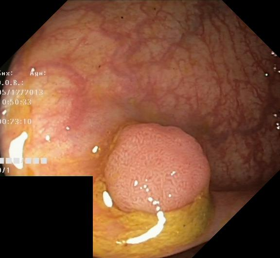 |  | 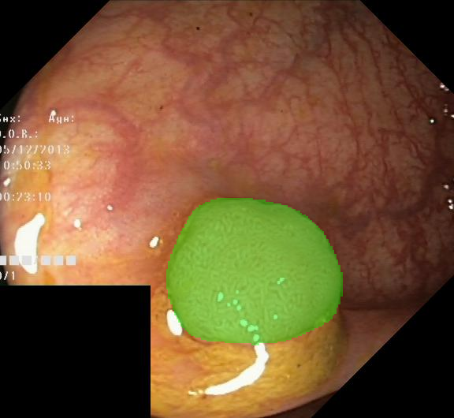 |

### Video Test — seq6 frames 24 & 25 (prompt: "medium irregular polyp")

| Frame 1 (segmented) | Frame 2 (correspondence) | Ground Truth (frame 1) | Prediction (overlay on frame 1) |
|---------------------|--------------------------|------------------------|---------------------------------|
|  | 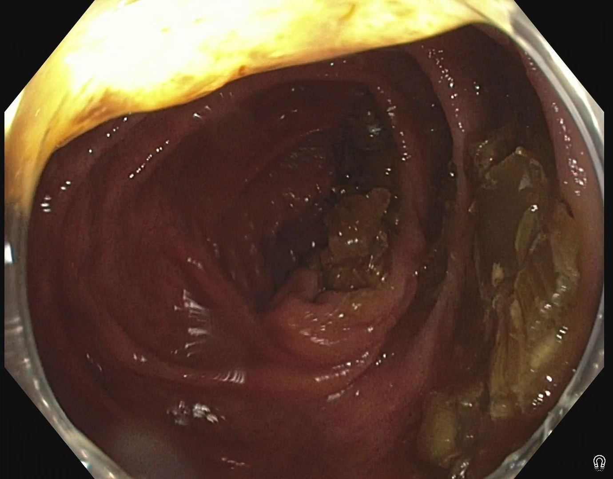 |  | 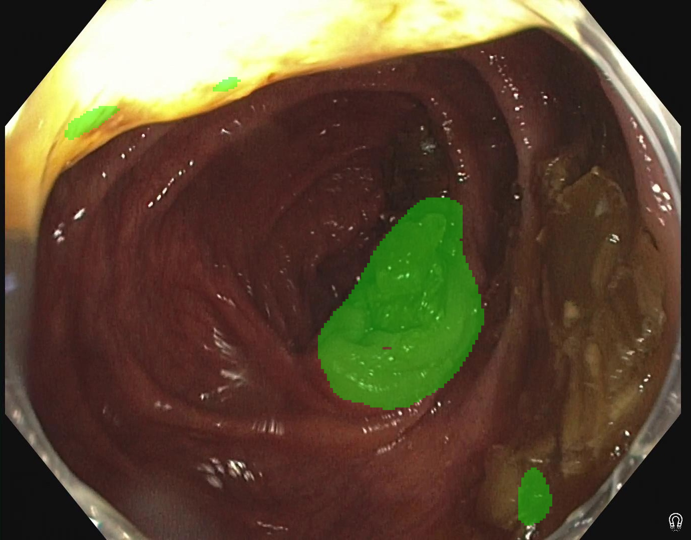 |

## Training Curves

Overview of the full run (best image-val Dice marked at epoch 39):

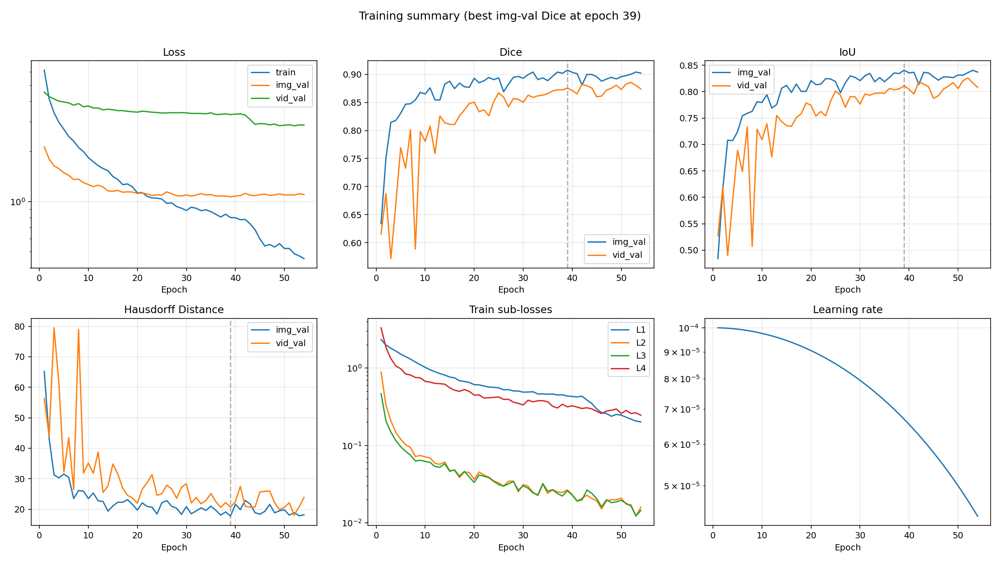

Individual plots:

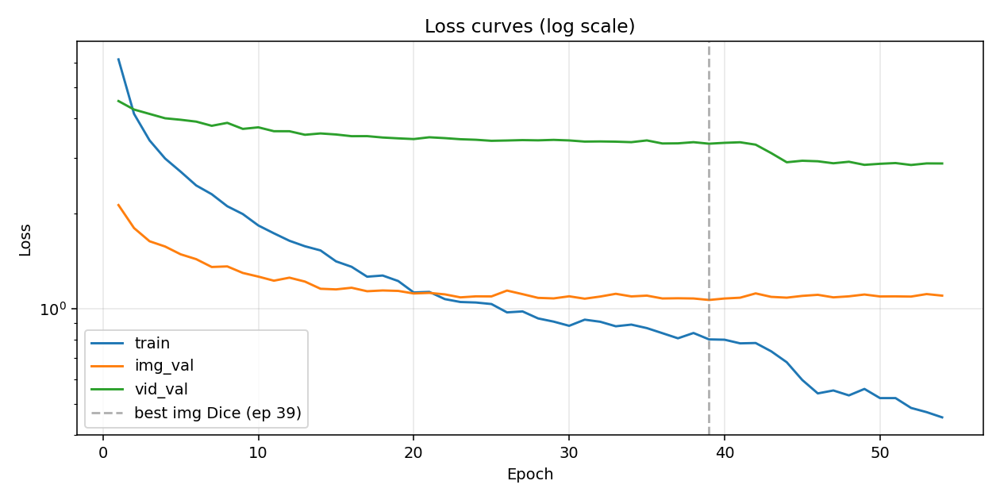

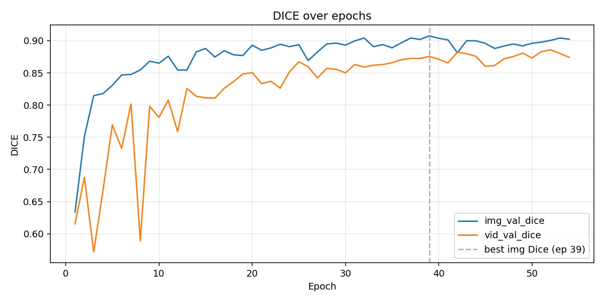

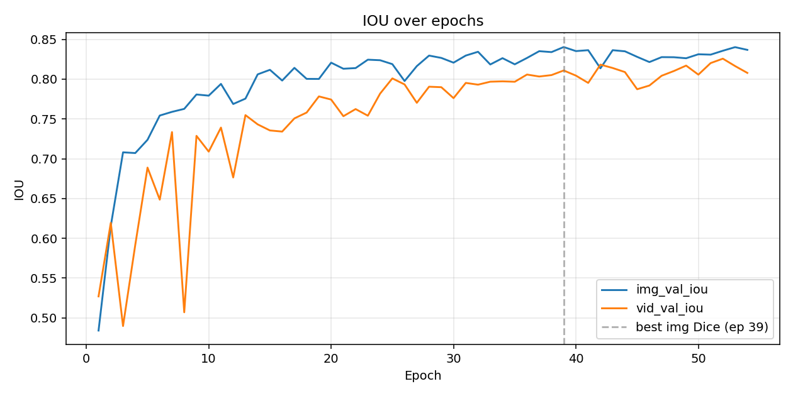

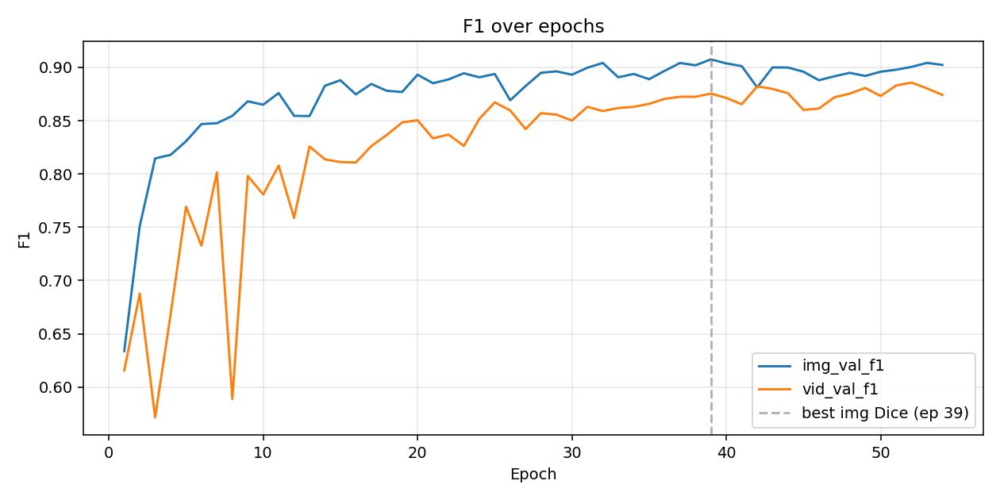

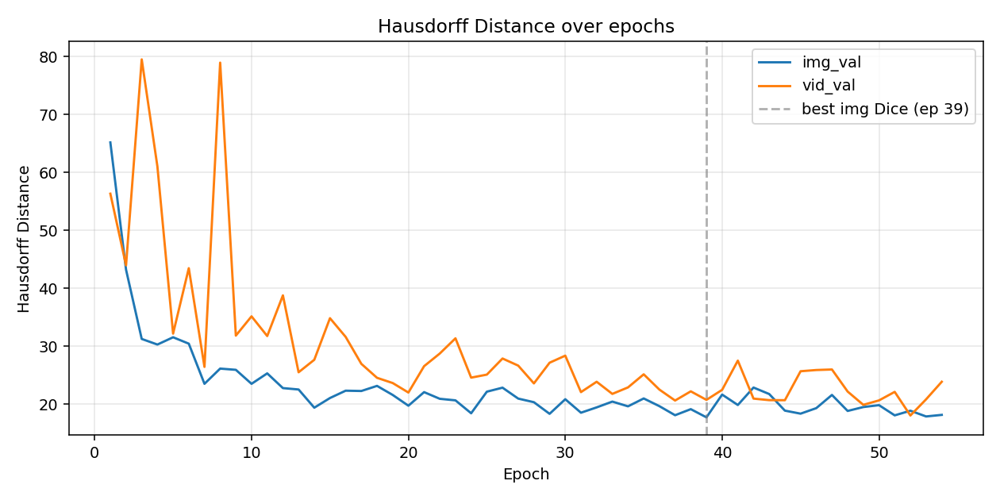

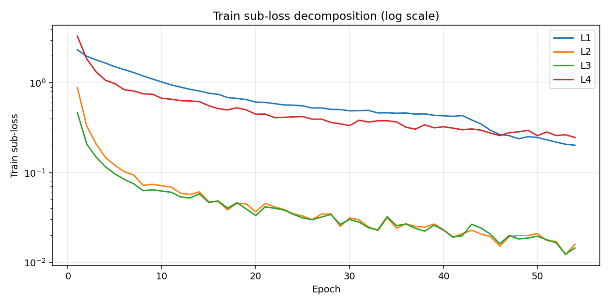

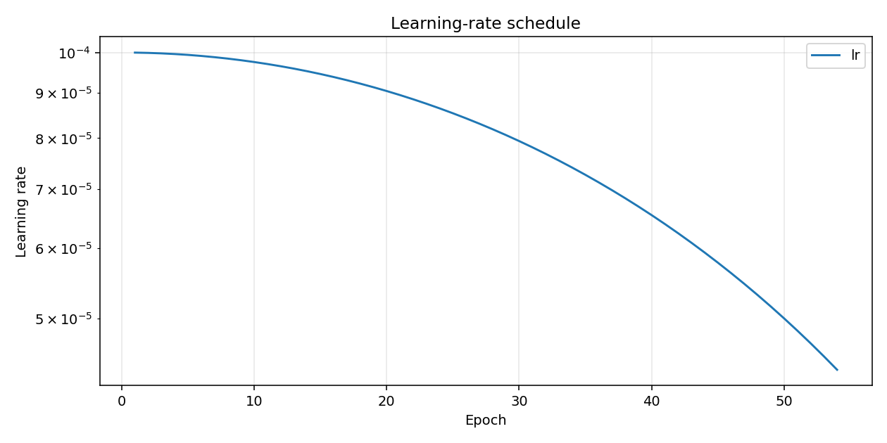

## Training Log

```
Epoch 001/100 (59.9s) | LR: 1.00e-04 | Train Loss: 6.1316 (L1: 2.3349, L2: 0.8891, L3: 0.4666, L4: 3.3149)
  Img Val  | Loss: 2.1266 | Dice: 0.6339 | IoU: 0.4841 | F1: 0.6339 | HD: 65.18
  Vid Val  | Loss: 4.5292 | Dice: 0.6156 | IoU: 0.5270 | F1: 0.6156 | HD: 56.33
  -> New best model saved (Dice: 0.6339)
Epoch 002/100 (48.7s) | LR: 9.99e-05 | Train Loss: 4.1274 (L1: 1.9844, L2: 0.3295, L3: 0.2074, L4: 1.8472)
  Img Val  | Loss: 1.7993 | Dice: 0.7510 | IoU: 0.6155 | F1: 0.7510 | HD: 43.20
  Vid Val  | Loss: 4.2582 | Dice: 0.6877 | IoU: 0.6194 | F1: 0.6877 | HD: 43.95
  -> New best model saved (Dice: 0.7510)
Epoch 003/100 (40.4s) | LR: 9.98e-05 | Train Loss: 3.4030 (L1: 1.8025, L2: 0.2083, L3: 0.1488, L4: 1.3268)
  Img Val  | Loss: 1.6345 | Dice: 0.8146 | IoU: 0.7081 | F1: 0.8146 | HD: 31.24
  Vid Val  | Loss: 4.1250 | Dice: 0.5716 | IoU: 0.4897 | F1: 0.5716 | HD: 79.52
  -> New best model saved (Dice: 0.8146)
Epoch 004/100 (42.3s) | LR: 9.96e-05 | Train Loss: 2.9827 (L1: 1.6634, L2: 0.1475, L3: 0.1162, L4: 1.0684)
  Img Val  | Loss: 1.5734 | Dice: 0.8179 | IoU: 0.7072 | F1: 0.8179 | HD: 30.27
  Vid Val  | Loss: 3.9965 | Dice: 0.6680 | IoU: 0.5918 | F1: 0.6680 | HD: 61.01
  -> New best model saved (Dice: 0.8179)
Epoch 005/100 (41.7s) | LR: 9.94e-05 | Train Loss: 2.7106 (L1: 1.5145, L2: 0.1204, L3: 0.0965, L4: 0.9809)
  Img Val  | Loss: 1.4867 | Dice: 0.8307 | IoU: 0.7238 | F1: 0.8307 | HD: 31.53
  Vid Val  | Loss: 3.9533 | Dice: 0.7692 | IoU: 0.6889 | F1: 0.7692 | HD: 32.16
  -> New best model saved (Dice: 0.8307)
Epoch 006/100 (40.8s) | LR: 9.91e-05 | Train Loss: 2.4524 (L1: 1.4077, L2: 0.1026, L3: 0.0842, L4: 0.8373)
  Img Val  | Loss: 1.4352 | Dice: 0.8469 | IoU: 0.7543 | F1: 0.8469 | HD: 30.42
  Vid Val  | Loss: 3.9003 | Dice: 0.7327 | IoU: 0.6486 | F1: 0.7327 | HD: 43.45
  -> New best model saved (Dice: 0.8469)
Epoch 007/100 (37.9s) | LR: 9.88e-05 | Train Loss: 2.3009 (L1: 1.3044, L2: 0.0941, L3: 0.0750, L4: 0.8138)
  Img Val  | Loss: 1.3557 | Dice: 0.8476 | IoU: 0.7589 | F1: 0.8476 | HD: 23.49
  Vid Val  | Loss: 3.7837 | Dice: 0.8015 | IoU: 0.7335 | F1: 0.8015 | HD: 26.41
  -> New best model saved (Dice: 0.8476)
Epoch 008/100 (44.1s) | LR: 9.84e-05 | Train Loss: 2.1085 (L1: 1.1970, L2: 0.0721, L3: 0.0629, L4: 0.7557)
  Img Val  | Loss: 1.3615 | Dice: 0.8545 | IoU: 0.7627 | F1: 0.8545 | HD: 26.11
  Vid Val  | Loss: 3.8654 | Dice: 0.5888 | IoU: 0.5070 | F1: 0.5888 | HD: 78.96
  -> New best model saved (Dice: 0.8545)
Epoch 009/100 (37.9s) | LR: 9.80e-05 | Train Loss: 1.9920 (L1: 1.1042, L2: 0.0740, L3: 0.0643, L4: 0.7472)
  Img Val  | Loss: 1.2983 | Dice: 0.8682 | IoU: 0.7808 | F1: 0.8682 | HD: 25.90
  Vid Val  | Loss: 3.6994 | Dice: 0.7981 | IoU: 0.7288 | F1: 0.7981 | HD: 31.81
  -> New best model saved (Dice: 0.8682)
Epoch 010/100 (38.9s) | LR: 9.76e-05 | Train Loss: 1.8333 (L1: 1.0233, L2: 0.0712, L3: 0.0623, L4: 0.6733)
  Img Val  | Loss: 1.2642 | Dice: 0.8650 | IoU: 0.7793 | F1: 0.8650 | HD: 23.49
  Vid Val  | Loss: 3.7417 | Dice: 0.7807 | IoU: 0.7090 | F1: 0.7807 | HD: 35.14
Epoch 011/100 (38.1s) | LR: 9.70e-05 | Train Loss: 1.7319 (L1: 0.9508, L2: 0.0690, L3: 0.0604, L4: 0.6578)
  Img Val  | Loss: 1.2272 | Dice: 0.8759 | IoU: 0.7941 | F1: 0.8759 | HD: 25.29
  Vid Val  | Loss: 3.6377 | Dice: 0.8079 | IoU: 0.7392 | F1: 0.8079 | HD: 31.74
  -> New best model saved (Dice: 0.8759)
Epoch 012/100 (41.1s) | LR: 9.65e-05 | Train Loss: 1.6404 (L1: 0.8974, L2: 0.0588, L3: 0.0535, L4: 0.6342)
  Img Val  | Loss: 1.2544 | Dice: 0.8546 | IoU: 0.7688 | F1: 0.8546 | HD: 22.75
  Vid Val  | Loss: 3.6368 | Dice: 0.7588 | IoU: 0.6765 | F1: 0.7588 | HD: 38.76
Epoch 013/100 (41.0s) | LR: 9.59e-05 | Train Loss: 1.5761 (L1: 0.8486, L2: 0.0570, L3: 0.0522, L4: 0.6290)
  Img Val  | Loss: 1.2192 | Dice: 0.8543 | IoU: 0.7756 | F1: 0.8543 | HD: 22.51
  Vid Val  | Loss: 3.5447 | Dice: 0.8259 | IoU: 0.7548 | F1: 0.8259 | HD: 25.48
Epoch 014/100 (39.0s) | LR: 9.52e-05 | Train Loss: 1.5292 (L1: 0.8123, L2: 0.0610, L3: 0.0580, L4: 0.6186)
  Img Val  | Loss: 1.1573 | Dice: 0.8828 | IoU: 0.8061 | F1: 0.8828 | HD: 19.36
  Vid Val  | Loss: 3.5793 | Dice: 0.8137 | IoU: 0.7432 | F1: 0.8137 | HD: 27.64
  -> New best model saved (Dice: 0.8828)
Epoch 015/100 (38.0s) | LR: 9.46e-05 | Train Loss: 1.4122 (L1: 0.7666, L2: 0.0473, L3: 0.0464, L4: 0.5568)
  Img Val  | Loss: 1.1521 | Dice: 0.8879 | IoU: 0.8118 | F1: 0.8879 | HD: 21.03
  Vid Val  | Loss: 3.5520 | Dice: 0.8112 | IoU: 0.7356 | F1: 0.8112 | HD: 34.82
  -> New best model saved (Dice: 0.8879)
Epoch 016/100 (40.6s) | LR: 9.38e-05 | Train Loss: 1.3577 (L1: 0.7468, L2: 0.0477, L3: 0.0483, L4: 0.5168)
  Img Val  | Loss: 1.1658 | Dice: 0.8747 | IoU: 0.7983 | F1: 0.8747 | HD: 22.30
  Vid Val  | Loss: 3.5085 | Dice: 0.8108 | IoU: 0.7342 | F1: 0.8108 | HD: 31.59
Epoch 017/100 (38.0s) | LR: 9.30e-05 | Train Loss: 1.2633 (L1: 0.6862, L2: 0.0384, L3: 0.0402, L4: 0.5007)
  Img Val  | Loss: 1.1366 | Dice: 0.8844 | IoU: 0.8142 | F1: 0.8844 | HD: 22.25
  Vid Val  | Loss: 3.5097 | Dice: 0.8261 | IoU: 0.7507 | F1: 0.8261 | HD: 26.94
Epoch 018/100 (39.3s) | LR: 9.22e-05 | Train Loss: 1.2742 (L1: 0.6717, L2: 0.0455, L3: 0.0463, L4: 0.5278)
  Img Val  | Loss: 1.1430 | Dice: 0.8781 | IoU: 0.8004 | F1: 0.8781 | HD: 23.13
  Vid Val  | Loss: 3.4747 | Dice: 0.8365 | IoU: 0.7581 | F1: 0.8365 | HD: 24.52
Epoch 019/100 (37.2s) | LR: 9.14e-05 | Train Loss: 1.2242 (L1: 0.6519, L2: 0.0447, L3: 0.0392, L4: 0.4999)
  Img Val  | Loss: 1.1394 | Dice: 0.8769 | IoU: 0.8003 | F1: 0.8769 | HD: 21.56
  Vid Val  | Loss: 3.4536 | Dice: 0.8483 | IoU: 0.7784 | F1: 0.8483 | HD: 23.62
Epoch 020/100 (38.0s) | LR: 9.05e-05 | Train Loss: 1.1265 (L1: 0.6112, L2: 0.0366, L3: 0.0333, L4: 0.4476)
  Img Val  | Loss: 1.1183 | Dice: 0.8932 | IoU: 0.8208 | F1: 0.8932 | HD: 19.71
  Vid Val  | Loss: 3.4360 | Dice: 0.8504 | IoU: 0.7744 | F1: 0.8504 | HD: 21.98
  -> New best model saved (Dice: 0.8932)
Epoch 021/100 (41.3s) | LR: 8.95e-05 | Train Loss: 1.1313 (L1: 0.6067, L2: 0.0454, L3: 0.0416, L4: 0.4497)
  Img Val  | Loss: 1.1230 | Dice: 0.8852 | IoU: 0.8131 | F1: 0.8852 | HD: 22.05
  Vid Val  | Loss: 3.4808 | Dice: 0.8334 | IoU: 0.7535 | F1: 0.8334 | HD: 26.53
Epoch 022/100 (38.2s) | LR: 8.85e-05 | Train Loss: 1.0735 (L1: 0.5871, L2: 0.0415, L3: 0.0401, L4: 0.4103)
  Img Val  | Loss: 1.1111 | Dice: 0.8887 | IoU: 0.8140 | F1: 0.8887 | HD: 20.90
  Vid Val  | Loss: 3.4594 | Dice: 0.8370 | IoU: 0.7624 | F1: 0.8370 | HD: 28.72
Epoch 023/100 (37.3s) | LR: 8.75e-05 | Train Loss: 1.0511 (L1: 0.5681, L2: 0.0389, L3: 0.0383, L4: 0.4135)
  Img Val  | Loss: 1.0872 | Dice: 0.8945 | IoU: 0.8245 | F1: 0.8945 | HD: 20.63
  Vid Val  | Loss: 3.4318 | Dice: 0.8263 | IoU: 0.7541 | F1: 0.8263 | HD: 31.34
  -> New best model saved (Dice: 0.8945)
Epoch 024/100 (37.3s) | LR: 8.64e-05 | Train Loss: 1.0472 (L1: 0.5650, L2: 0.0348, L3: 0.0343, L4: 0.4183)
  Img Val  | Loss: 1.0952 | Dice: 0.8907 | IoU: 0.8238 | F1: 0.8907 | HD: 18.40
  Vid Val  | Loss: 3.4183 | Dice: 0.8517 | IoU: 0.7819 | F1: 0.8517 | HD: 24.55
Epoch 025/100 (37.3s) | LR: 8.54e-05 | Train Loss: 1.0356 (L1: 0.5548, L2: 0.0328, L3: 0.0312, L4: 0.4223)
  Img Val  | Loss: 1.0947 | Dice: 0.8939 | IoU: 0.8189 | F1: 0.8939 | HD: 22.13
  Vid Val  | Loss: 3.3926 | Dice: 0.8672 | IoU: 0.8010 | F1: 0.8672 | HD: 25.08
Epoch 026/100 (37.7s) | LR: 8.42e-05 | Train Loss: 0.9747 (L1: 0.5247, L2: 0.0299, L3: 0.0299, L4: 0.3940)
  Img Val  | Loss: 1.1422 | Dice: 0.8692 | IoU: 0.7977 | F1: 0.8692 | HD: 22.82
  Vid Val  | Loss: 3.4001 | Dice: 0.8596 | IoU: 0.7934 | F1: 0.8596 | HD: 27.86
Epoch 027/100 (37.9s) | LR: 8.31e-05 | Train Loss: 0.9816 (L1: 0.5268, L2: 0.0345, L3: 0.0319, L4: 0.3953)
  Img Val  | Loss: 1.1129 | Dice: 0.8825 | IoU: 0.8164 | F1: 0.8825 | HD: 20.93
  Vid Val  | Loss: 3.4099 | Dice: 0.8421 | IoU: 0.7703 | F1: 0.8421 | HD: 26.63
Epoch 028/100 (38.4s) | LR: 8.19e-05 | Train Loss: 0.9328 (L1: 0.5069, L2: 0.0346, L3: 0.0342, L4: 0.3627)
  Img Val  | Loss: 1.0831 | Dice: 0.8950 | IoU: 0.8297 | F1: 0.8950 | HD: 20.31
  Vid Val  | Loss: 3.4040 | Dice: 0.8571 | IoU: 0.7905 | F1: 0.8571 | HD: 23.56
  -> New best model saved (Dice: 0.8950)
Epoch 029/100 (37.9s) | LR: 8.06e-05 | Train Loss: 0.9114 (L1: 0.5049, L2: 0.0252, L3: 0.0265, L4: 0.3497)
  Img Val  | Loss: 1.0789 | Dice: 0.8963 | IoU: 0.8267 | F1: 0.8963 | HD: 18.31
  Vid Val  | Loss: 3.4157 | Dice: 0.8557 | IoU: 0.7899 | F1: 0.8557 | HD: 27.13
  -> New best model saved (Dice: 0.8963)
Epoch 030/100 (40.0s) | LR: 7.94e-05 | Train Loss: 0.8841 (L1: 0.4884, L2: 0.0313, L3: 0.0300, L4: 0.3341)
  Img Val  | Loss: 1.0956 | Dice: 0.8931 | IoU: 0.8208 | F1: 0.8931 | HD: 20.83
  Vid Val  | Loss: 3.4018 | Dice: 0.8501 | IoU: 0.7762 | F1: 0.8501 | HD: 28.35
Epoch 031/100 (37.8s) | LR: 7.81e-05 | Train Loss: 0.9244 (L1: 0.4903, L2: 0.0297, L3: 0.0281, L4: 0.3839)
  Img Val  | Loss: 1.0767 | Dice: 0.8997 | IoU: 0.8297 | F1: 0.8997 | HD: 18.50
  Vid Val  | Loss: 3.3734 | Dice: 0.8630 | IoU: 0.7953 | F1: 0.8630 | HD: 22.06
  -> New best model saved (Dice: 0.8997)
Epoch 032/100 (37.1s) | LR: 7.68e-05 | Train Loss: 0.9105 (L1: 0.4942, L2: 0.0249, L3: 0.0243, L4: 0.3660)
  Img Val  | Loss: 1.0936 | Dice: 0.9042 | IoU: 0.8345 | F1: 0.9042 | HD: 19.42
  Vid Val  | Loss: 3.3770 | Dice: 0.8591 | IoU: 0.7931 | F1: 0.8591 | HD: 23.84
  -> New best model saved (Dice: 0.9042)
Epoch 033/100 (38.2s) | LR: 7.55e-05 | Train Loss: 0.8811 (L1: 0.4630, L2: 0.0225, L3: 0.0230, L4: 0.3784)
  Img Val  | Loss: 1.1156 | Dice: 0.8907 | IoU: 0.8185 | F1: 0.8907 | HD: 20.42
  Vid Val  | Loss: 3.3714 | Dice: 0.8619 | IoU: 0.7968 | F1: 0.8619 | HD: 21.75
Epoch 034/100 (36.7s) | LR: 7.41e-05 | Train Loss: 0.8919 (L1: 0.4642, L2: 0.0314, L3: 0.0323, L4: 0.3788)
  Img Val  | Loss: 1.0947 | Dice: 0.8939 | IoU: 0.8264 | F1: 0.8939 | HD: 19.60
  Vid Val  | Loss: 3.3591 | Dice: 0.8630 | IoU: 0.7973 | F1: 0.8630 | HD: 22.87
Epoch 035/100 (37.5s) | LR: 7.27e-05 | Train Loss: 0.8694 (L1: 0.4591, L2: 0.0241, L3: 0.0256, L4: 0.3670)
  Img Val  | Loss: 1.1010 | Dice: 0.8890 | IoU: 0.8187 | F1: 0.8890 | HD: 20.96
  Vid Val  | Loss: 3.4019 | Dice: 0.8658 | IoU: 0.7968 | F1: 0.8658 | HD: 25.13
Epoch 036/100 (38.0s) | LR: 7.13e-05 | Train Loss: 0.8380 (L1: 0.4621, L2: 0.0269, L3: 0.0268, L4: 0.3208)
  Img Val  | Loss: 1.0785 | Dice: 0.8968 | IoU: 0.8267 | F1: 0.8968 | HD: 19.63
  Vid Val  | Loss: 3.3274 | Dice: 0.8705 | IoU: 0.8058 | F1: 0.8705 | HD: 22.49
Epoch 037/100 (38.8s) | LR: 6.99e-05 | Train Loss: 0.8073 (L1: 0.4489, L2: 0.0251, L3: 0.0239, L4: 0.3051)
  Img Val  | Loss: 1.0801 | Dice: 0.9042 | IoU: 0.8352 | F1: 0.9042 | HD: 18.06
  Vid Val  | Loss: 3.3307 | Dice: 0.8724 | IoU: 0.8034 | F1: 0.8724 | HD: 20.60
Epoch 038/100 (37.7s) | LR: 6.84e-05 | Train Loss: 0.8391 (L1: 0.4521, L2: 0.0247, L3: 0.0222, L4: 0.3414)
  Img Val  | Loss: 1.0784 | Dice: 0.9020 | IoU: 0.8340 | F1: 0.9020 | HD: 19.11
  Vid Val  | Loss: 3.3587 | Dice: 0.8725 | IoU: 0.8051 | F1: 0.8725 | HD: 22.19
Epoch 039/100 (37.0s) | LR: 6.69e-05 | Train Loss: 0.8010 (L1: 0.4351, L2: 0.0267, L3: 0.0260, L4: 0.3157)
  Img Val  | Loss: 1.0668 | Dice: 0.9075 | IoU: 0.8404 | F1: 0.9075 | HD: 17.70
  Vid Val  | Loss: 3.3220 | Dice: 0.8754 | IoU: 0.8110 | F1: 0.8754 | HD: 20.71
  -> New best model saved (Dice: 0.9075)
Epoch 040/100 (37.4s) | LR: 6.55e-05 | Train Loss: 0.7991 (L1: 0.4302, L2: 0.0232, L3: 0.0228, L4: 0.3248)
  Img Val  | Loss: 1.0781 | Dice: 0.9038 | IoU: 0.8353 | F1: 0.9038 | HD: 21.63
  Vid Val  | Loss: 3.3432 | Dice: 0.8714 | IoU: 0.8045 | F1: 0.8714 | HD: 22.45
Epoch 041/100 (37.0s) | LR: 6.39e-05 | Train Loss: 0.7783 (L1: 0.4238, L2: 0.0190, L3: 0.0192, L4: 0.3133)
  Img Val  | Loss: 1.0845 | Dice: 0.9012 | IoU: 0.8365 | F1: 0.9012 | HD: 19.83
  Vid Val  | Loss: 3.3567 | Dice: 0.8654 | IoU: 0.7953 | F1: 0.8654 | HD: 27.49
Epoch 042/100 (38.0s) | LR: 6.24e-05 | Train Loss: 0.7801 (L1: 0.4329, L2: 0.0208, L3: 0.0198, L4: 0.3004)
  Img Val  | Loss: 1.1190 | Dice: 0.8813 | IoU: 0.8137 | F1: 0.8813 | HD: 22.84
  Vid Val  | Loss: 3.2988 | Dice: 0.8823 | IoU: 0.8183 | F1: 0.8823 | HD: 20.93
Epoch 043/100 (37.4s) | LR: 6.09e-05 | Train Loss: 0.7345 (L1: 0.3869, L2: 0.0228, L3: 0.0266, L4: 0.3069)
  Img Val  | Loss: 1.0911 | Dice: 0.9000 | IoU: 0.8365 | F1: 0.9000 | HD: 21.72
  Vid Val  | Loss: 3.1026 | Dice: 0.8798 | IoU: 0.8141 | F1: 0.8798 | HD: 20.67
Epoch 044/100 (38.1s) | LR: 5.94e-05 | Train Loss: 0.6784 (L1: 0.3486, L2: 0.0206, L3: 0.0241, L4: 0.2971)
  Img Val  | Loss: 1.0848 | Dice: 0.8999 | IoU: 0.8350 | F1: 0.8999 | HD: 18.86
  Vid Val  | Loss: 2.9026 | Dice: 0.8757 | IoU: 0.8090 | F1: 0.8757 | HD: 20.66
Epoch 045/100 (39.0s) | LR: 5.78e-05 | Train Loss: 0.5962 (L1: 0.2964, L2: 0.0194, L3: 0.0205, L4: 0.2758)
  Img Val  | Loss: 1.0989 | Dice: 0.8959 | IoU: 0.8281 | F1: 0.8959 | HD: 18.33
  Vid Val  | Loss: 2.9349 | Dice: 0.8601 | IoU: 0.7874 | F1: 0.8601 | HD: 25.66
Epoch 046/100 (38.3s) | LR: 5.63e-05 | Train Loss: 0.5409 (L1: 0.2652, L2: 0.0152, L3: 0.0161, L4: 0.2588)
  Img Val  | Loss: 1.1075 | Dice: 0.8880 | IoU: 0.8215 | F1: 0.8880 | HD: 19.28
  Vid Val  | Loss: 2.9235 | Dice: 0.8614 | IoU: 0.7920 | F1: 0.8614 | HD: 25.87
Epoch 047/100 (38.0s) | LR: 5.47e-05 | Train Loss: 0.5525 (L1: 0.2585, L2: 0.0193, L3: 0.0199, L4: 0.2783)
  Img Val  | Loss: 1.0873 | Dice: 0.8917 | IoU: 0.8277 | F1: 0.8917 | HD: 21.57
  Vid Val  | Loss: 2.8814 | Dice: 0.8719 | IoU: 0.8043 | F1: 0.8719 | HD: 25.96
Epoch 048/100 (38.3s) | LR: 5.31e-05 | Train Loss: 0.5331 (L1: 0.2384, L2: 0.0199, L3: 0.0182, L4: 0.2850)
  Img Val  | Loss: 1.0953 | Dice: 0.8949 | IoU: 0.8276 | F1: 0.8949 | HD: 18.80
  Vid Val  | Loss: 2.9133 | Dice: 0.8754 | IoU: 0.8103 | F1: 0.8754 | HD: 22.15
Epoch 049/100 (38.2s) | LR: 5.16e-05 | Train Loss: 0.5587 (L1: 0.2518, L2: 0.0199, L3: 0.0187, L4: 0.2966)
  Img Val  | Loss: 1.1099 | Dice: 0.8920 | IoU: 0.8263 | F1: 0.8920 | HD: 19.48
  Vid Val  | Loss: 2.8486 | Dice: 0.8807 | IoU: 0.8171 | F1: 0.8807 | HD: 19.86
Epoch 050/100 (38.2s) | LR: 5.00e-05 | Train Loss: 0.5227 (L1: 0.2465, L2: 0.0209, L3: 0.0196, L4: 0.2584)
  Img Val  | Loss: 1.0944 | Dice: 0.8960 | IoU: 0.8313 | F1: 0.8960 | HD: 19.80
  Vid Val  | Loss: 2.8705 | Dice: 0.8732 | IoU: 0.8057 | F1: 0.8732 | HD: 20.62
Epoch 051/100 (37.3s) | LR: 4.84e-05 | Train Loss: 0.5228 (L1: 0.2318, L2: 0.0175, L3: 0.0179, L4: 0.2836)
  Img Val  | Loss: 1.0950 | Dice: 0.8978 | IoU: 0.8308 | F1: 0.8978 | HD: 18.04
  Vid Val  | Loss: 2.8858 | Dice: 0.8830 | IoU: 0.8202 | F1: 0.8830 | HD: 22.10
Epoch 052/100 (37.7s) | LR: 4.69e-05 | Train Loss: 0.4867 (L1: 0.2189, L2: 0.0171, L3: 0.0165, L4: 0.2591)
  Img Val  | Loss: 1.0934 | Dice: 0.9005 | IoU: 0.8358 | F1: 0.9005 | HD: 18.84
  Vid Val  | Loss: 2.8459 | Dice: 0.8857 | IoU: 0.8258 | F1: 0.8857 | HD: 18.02
Epoch 053/100 (38.2s) | LR: 4.53e-05 | Train Loss: 0.4720 (L1: 0.2070, L2: 0.0122, L3: 0.0123, L4: 0.2642)
  Img Val  | Loss: 1.1134 | Dice: 0.9043 | IoU: 0.8403 | F1: 0.9043 | HD: 17.85
  Vid Val  | Loss: 2.8785 | Dice: 0.8803 | IoU: 0.8165 | F1: 0.8803 | HD: 20.81
Epoch 054/100 (37.3s) | LR: 4.37e-05 | Train Loss: 0.4545 (L1: 0.2019, L2: 0.0159, L3: 0.0145, L4: 0.2463)
  Img Val  | Loss: 1.1009 | Dice: 0.9023 | IoU: 0.8368 | F1: 0.9023 | HD: 18.12
  Vid Val  | Loss: 2.8770 | Dice: 0.8742 | IoU: 0.8079 | F1: 0.8742 | HD: 23.84

Early stopping: Val Dice did not improve for 15 epochs.

Training complete. Best validation Dice: 0.9075```
