# Results — ResNet-50 encoder

Encoder: `resnet50` (ImageNet pretrained, multi-scale features projected to 768@14x14).
Training stopped early at epoch 49 (no Val Dice improvement for 15 epochs after epoch 34).

## Dataset: Image Segmentation + Video Segmentation Dataset

| Split | Image seg | Video seg  |
|-------|-----------|------------|
| Train | 800       | 934 pairs  |
| Val   | 100       | 259 pairs  |
| Test  | 100       | 1009 pairs |

**Trainable params:** 110,939,521 / **Total:** 306,842,242

## Test Results

### Image Test (100 images)

| Metric | Value |
|--------|-------|
| Dice | 0.8880 |
| IoU | 0.8156 |
| F1 | 0.8880 |
| Hausdorff Distance | 26.75 |
| Loss | 1.0168 |

### Video Test (1009 pairs)

| Metric | Value |
|--------|-------|
| Dice | 0.6960 |
| IoU | 0.6345 |
| F1 | 0.6960 |
| Hausdorff Distance | 44.59 |
| Loss | 3.4502 |

**Best validation Dice:** 0.9107 (epoch 34)

## Qualitative Predictions

Predictions from the best model checkpoint on one held-out test sample from each dataset. Overlay shows the predicted mask in green at threshold 0.5.

### Image Test — `cju2x7vw87mu30878hye2ca0m.jpg` (prompt: "large irregular polyp")

| Input | Ground Truth | Prediction (overlay) |
|-------|--------------|----------------------|
| 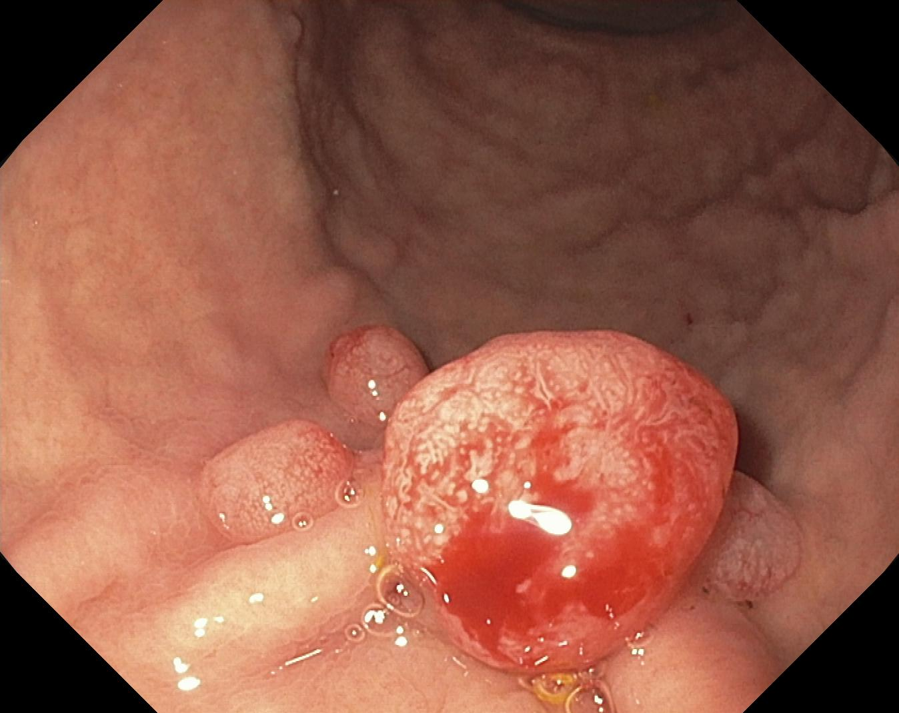 | 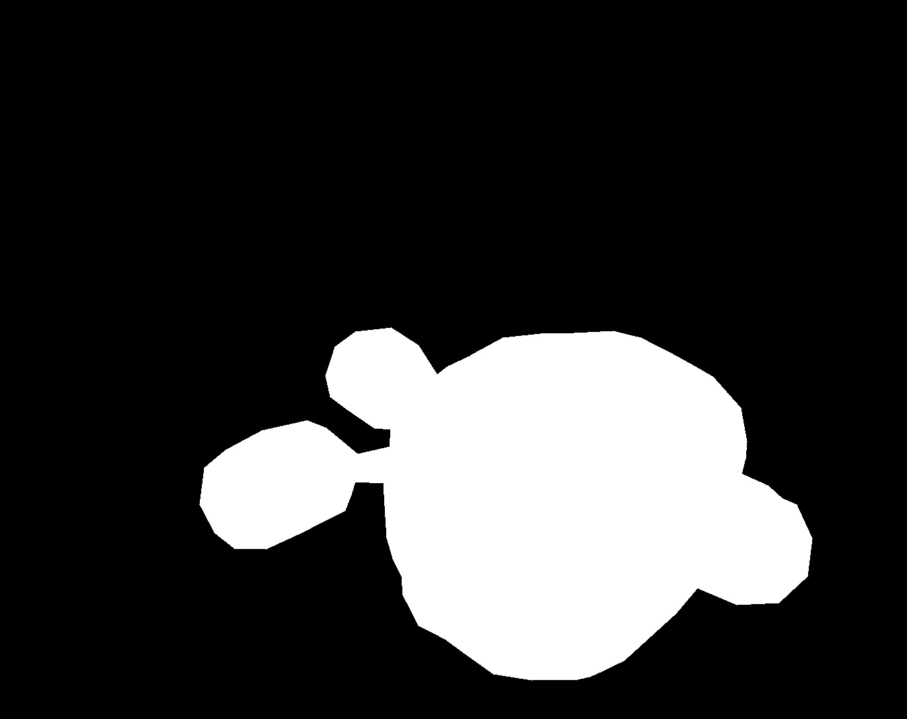 | 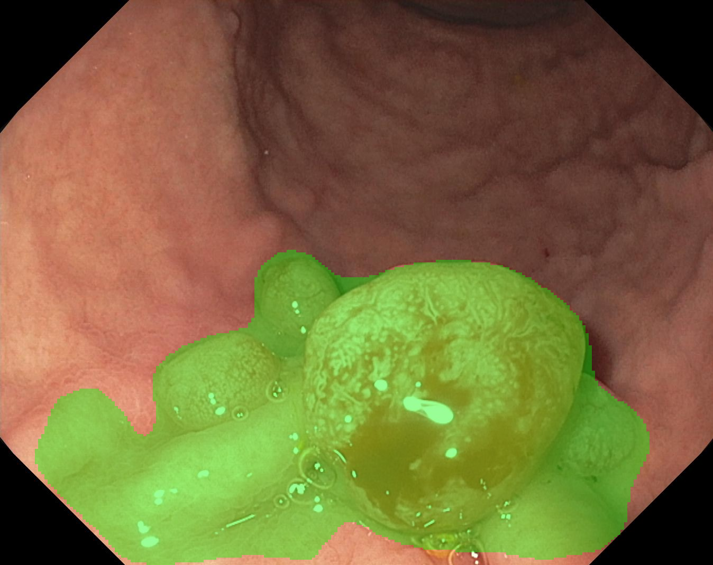 |

### Video Test — seq16 frames 2 & 3 (prompt: "large round polyp")

| Frame 1 (segmented) | Frame 2 (correspondence) | Ground Truth (frame 1) | Prediction (overlay on frame 1) |
|---------------------|--------------------------|------------------------|---------------------------------|
|  | 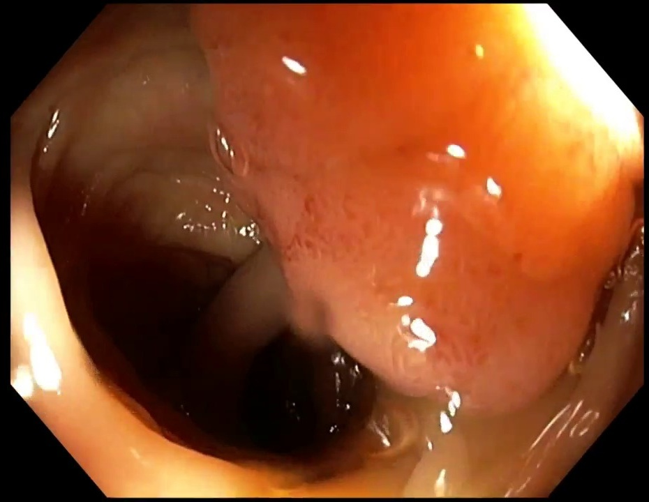 |  | 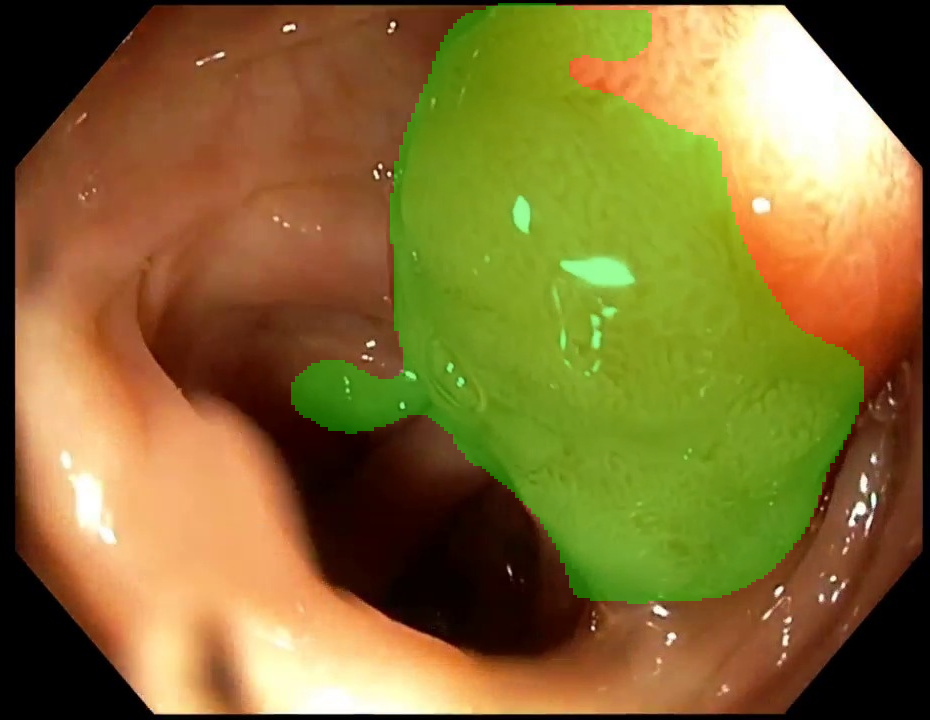 |

## Training Curves

Overview of the full run (best image-val Dice marked at epoch 34):

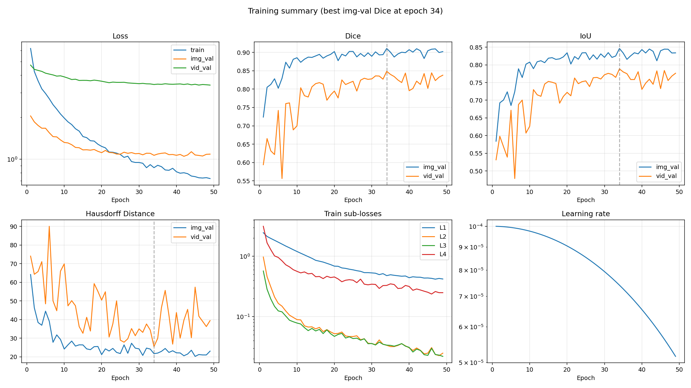

Individual plots:

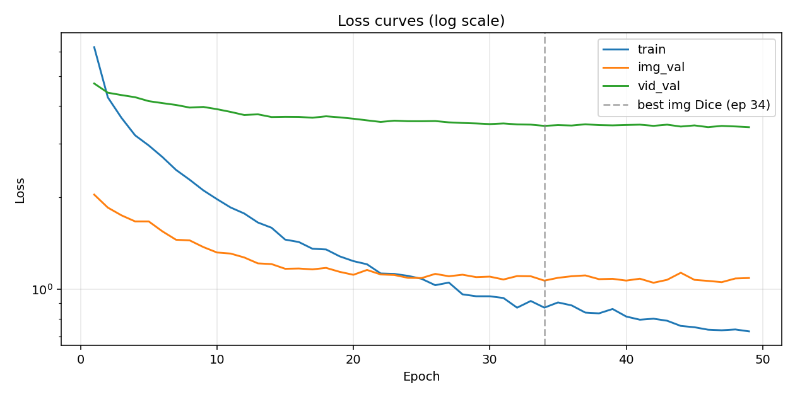

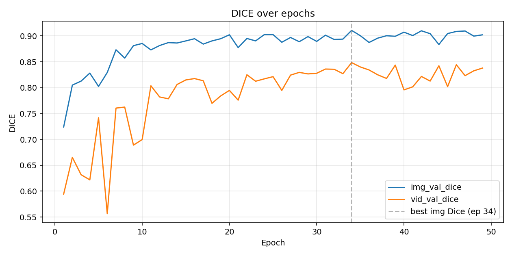

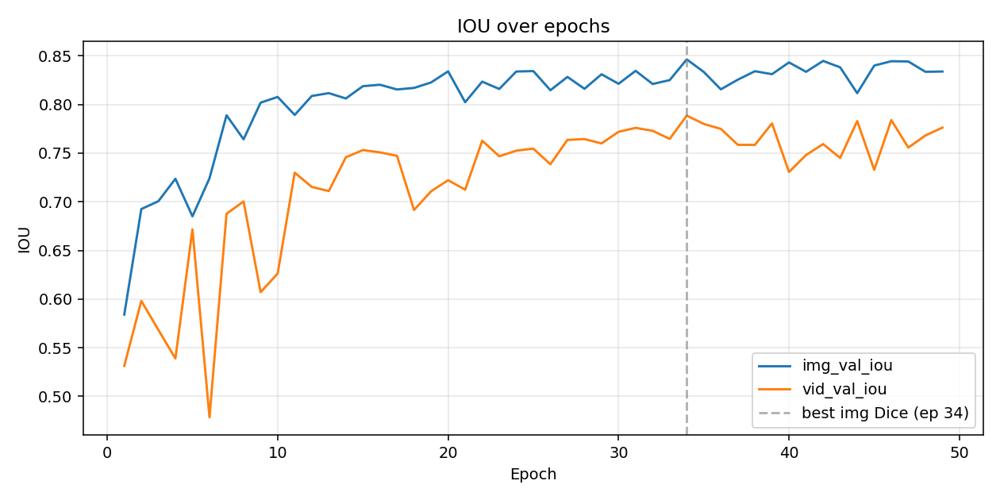

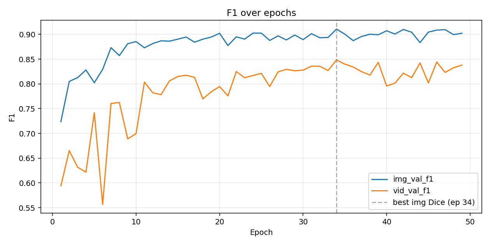

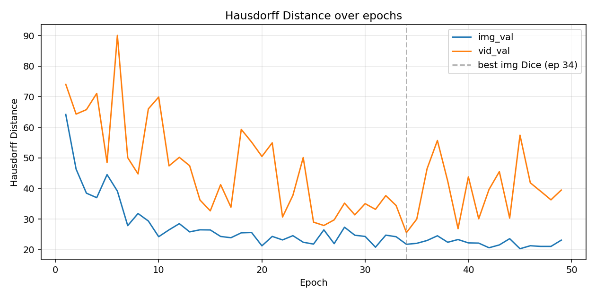

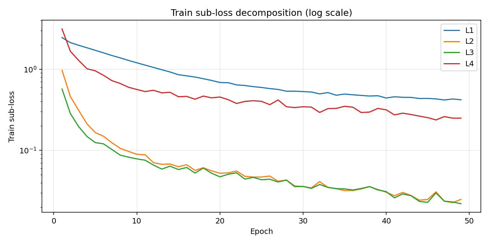

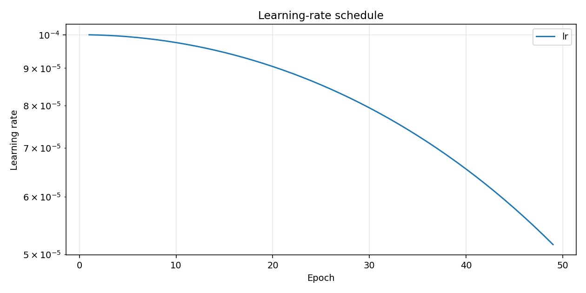

## Training Log

```
Epoch 001/100 (43.5s) | LR: 1.00e-04 | Train Loss: 6.2181 (L1: 2.4540, L2: 0.9691, L3: 0.5698, L4: 3.1299)
  Img Val  | Loss: 2.0423 | Dice: 0.7239 | IoU: 0.5841 | F1: 0.7239 | HD: 64.19
  Vid Val  | Loss: 4.7258 | Dice: 0.5942 | IoU: 0.5315 | F1: 0.5942 | HD: 74.06
  -> New best model saved (Dice: 0.7239)
Epoch 002/100 (34.3s) | LR: 9.99e-05 | Train Loss: 4.2546 (L1: 2.1259, L2: 0.4600, L3: 0.2844, L4: 1.6641)
  Img Val  | Loss: 1.8513 | Dice: 0.8050 | IoU: 0.6926 | F1: 0.8050 | HD: 46.32
  Vid Val  | Loss: 4.4084 | Dice: 0.6653 | IoU: 0.5982 | F1: 0.6653 | HD: 64.31
  -> New best model saved (Dice: 0.8050)
Epoch 003/100 (34.0s) | LR: 9.98e-05 | Train Loss: 3.6461 (L1: 1.9717, L2: 0.3112, L3: 0.1962, L4: 1.2830)
  Img Val  | Loss: 1.7463 | Dice: 0.8127 | IoU: 0.7006 | F1: 0.8127 | HD: 38.45
  Vid Val  | Loss: 4.3301 | Dice: 0.6318 | IoU: 0.5684 | F1: 0.6318 | HD: 65.76
  -> New best model saved (Dice: 0.8127)
Epoch 004/100 (41.6s) | LR: 9.96e-05 | Train Loss: 3.1946 (L1: 1.8365, L2: 0.2119, L3: 0.1482, L4: 1.0134)
  Img Val  | Loss: 1.6681 | Dice: 0.8281 | IoU: 0.7237 | F1: 0.8281 | HD: 36.98
  Vid Val  | Loss: 4.2603 | Dice: 0.6218 | IoU: 0.5390 | F1: 0.6218 | HD: 71.08
  -> New best model saved (Dice: 0.8281)
Epoch 005/100 (42.4s) | LR: 9.94e-05 | Train Loss: 2.9594 (L1: 1.7087, L2: 0.1657, L3: 0.1246, L4: 0.9549)
  Img Val  | Loss: 1.6678 | Dice: 0.8024 | IoU: 0.6851 | F1: 0.8024 | HD: 44.52
  Vid Val  | Loss: 4.1362 | Dice: 0.7420 | IoU: 0.6717 | F1: 0.7420 | HD: 48.45
Epoch 006/100 (36.4s) | LR: 9.91e-05 | Train Loss: 2.7124 (L1: 1.5885, L2: 0.1490, L3: 0.1201, L4: 0.8396)
  Img Val  | Loss: 1.5474 | Dice: 0.8293 | IoU: 0.7242 | F1: 0.8293 | HD: 39.13
  Vid Val  | Loss: 4.0751 | Dice: 0.5564 | IoU: 0.4785 | F1: 0.5564 | HD: 90.05
  -> New best model saved (Dice: 0.8293)
Epoch 007/100 (34.1s) | LR: 9.88e-05 | Train Loss: 2.4608 (L1: 1.4745, L2: 0.1242, L3: 0.1024, L4: 0.7226)
  Img Val  | Loss: 1.4524 | Dice: 0.8732 | IoU: 0.7889 | F1: 0.8732 | HD: 27.84
  Vid Val  | Loss: 4.0184 | Dice: 0.7605 | IoU: 0.6877 | F1: 0.7605 | HD: 50.05
  -> New best model saved (Dice: 0.8732)
Epoch 008/100 (35.0s) | LR: 9.84e-05 | Train Loss: 2.2846 (L1: 1.3787, L2: 0.1059, L3: 0.0873, L4: 0.6669)
  Img Val  | Loss: 1.4454 | Dice: 0.8572 | IoU: 0.7642 | F1: 0.8572 | HD: 31.80
  Vid Val  | Loss: 3.9406 | Dice: 0.7625 | IoU: 0.7004 | F1: 0.7625 | HD: 44.75
Epoch 009/100 (35.8s) | LR: 9.80e-05 | Train Loss: 2.1089 (L1: 1.2833, L2: 0.0971, L3: 0.0824, L4: 0.5991)
  Img Val  | Loss: 1.3745 | Dice: 0.8812 | IoU: 0.8019 | F1: 0.8812 | HD: 29.34
  Vid Val  | Loss: 3.9596 | Dice: 0.6890 | IoU: 0.6071 | F1: 0.6890 | HD: 66.02
  -> New best model saved (Dice: 0.8812)
Epoch 010/100 (35.5s) | LR: 9.76e-05 | Train Loss: 1.9733 (L1: 1.1994, L2: 0.0894, L3: 0.0785, L4: 0.5626)
  Img Val  | Loss: 1.3192 | Dice: 0.8854 | IoU: 0.8077 | F1: 0.8854 | HD: 24.21
  Vid Val  | Loss: 3.8928 | Dice: 0.6997 | IoU: 0.6263 | F1: 0.6997 | HD: 69.88
  -> New best model saved (Dice: 0.8854)
Epoch 011/100 (35.0s) | LR: 9.70e-05 | Train Loss: 1.8530 (L1: 1.1222, L2: 0.0883, L3: 0.0756, L4: 0.5305)
  Img Val  | Loss: 1.3085 | Dice: 0.8730 | IoU: 0.7892 | F1: 0.8730 | HD: 26.45
  Vid Val  | Loss: 3.8134 | Dice: 0.8037 | IoU: 0.7299 | F1: 0.8037 | HD: 47.38
Epoch 012/100 (33.9s) | LR: 9.65e-05 | Train Loss: 1.7707 (L1: 1.0520, L2: 0.0705, L3: 0.0659, L4: 0.5502)
  Img Val  | Loss: 1.2704 | Dice: 0.8815 | IoU: 0.8087 | F1: 0.8815 | HD: 28.48
  Vid Val  | Loss: 3.7251 | Dice: 0.7821 | IoU: 0.7153 | F1: 0.7821 | HD: 50.17
Epoch 013/100 (34.9s) | LR: 9.59e-05 | Train Loss: 1.6543 (L1: 0.9852, L2: 0.0673, L3: 0.0587, L4: 0.5114)
  Img Val  | Loss: 1.2151 | Dice: 0.8871 | IoU: 0.8117 | F1: 0.8871 | HD: 25.79
  Vid Val  | Loss: 3.7443 | Dice: 0.7785 | IoU: 0.7110 | F1: 0.7785 | HD: 47.42
  -> New best model saved (Dice: 0.8871)
Epoch 014/100 (34.3s) | LR: 9.52e-05 | Train Loss: 1.5902 (L1: 0.9241, L2: 0.0678, L3: 0.0639, L4: 0.5193)
  Img Val  | Loss: 1.2087 | Dice: 0.8863 | IoU: 0.8062 | F1: 0.8863 | HD: 26.47
  Vid Val  | Loss: 3.6683 | Dice: 0.8062 | IoU: 0.7458 | F1: 0.8062 | HD: 36.21
Epoch 015/100 (35.3s) | LR: 9.46e-05 | Train Loss: 1.4539 (L1: 0.8558, L2: 0.0629, L3: 0.0580, L4: 0.4581)
  Img Val  | Loss: 1.1665 | Dice: 0.8904 | IoU: 0.8188 | F1: 0.8904 | HD: 26.43
  Vid Val  | Loss: 3.6743 | Dice: 0.8149 | IoU: 0.7531 | F1: 0.8149 | HD: 32.67
  -> New best model saved (Dice: 0.8904)
Epoch 016/100 (35.3s) | LR: 9.38e-05 | Train Loss: 1.4277 (L1: 0.8281, L2: 0.0665, L3: 0.0615, L4: 0.4624)
  Img Val  | Loss: 1.1690 | Dice: 0.8946 | IoU: 0.8203 | F1: 0.8946 | HD: 24.29
  Vid Val  | Loss: 3.6721 | Dice: 0.8176 | IoU: 0.7508 | F1: 0.8176 | HD: 41.24
  -> New best model saved (Dice: 0.8946)
Epoch 017/100 (34.9s) | LR: 9.30e-05 | Train Loss: 1.3569 (L1: 0.8007, L2: 0.0567, L3: 0.0525, L4: 0.4268)
  Img Val  | Loss: 1.1614 | Dice: 0.8843 | IoU: 0.8154 | F1: 0.8843 | HD: 23.88
  Vid Val  | Loss: 3.6495 | Dice: 0.8133 | IoU: 0.7473 | F1: 0.8133 | HD: 33.86
Epoch 018/100 (34.4s) | LR: 9.22e-05 | Train Loss: 1.3496 (L1: 0.7632, L2: 0.0610, L3: 0.0605, L4: 0.4663)
  Img Val  | Loss: 1.1743 | Dice: 0.8904 | IoU: 0.8170 | F1: 0.8904 | HD: 25.48
  Vid Val  | Loss: 3.6888 | Dice: 0.7698 | IoU: 0.6916 | F1: 0.7698 | HD: 59.30
Epoch 019/100 (33.4s) | LR: 9.14e-05 | Train Loss: 1.2810 (L1: 0.7266, L2: 0.0559, L3: 0.0522, L4: 0.4438)
  Img Val  | Loss: 1.1397 | Dice: 0.8946 | IoU: 0.8226 | F1: 0.8946 | HD: 25.59
  Vid Val  | Loss: 3.6594 | Dice: 0.7841 | IoU: 0.7108 | F1: 0.7841 | HD: 55.16
Epoch 020/100 (33.3s) | LR: 9.05e-05 | Train Loss: 1.2360 (L1: 0.6858, L2: 0.0522, L3: 0.0472, L4: 0.4542)
  Img Val  | Loss: 1.1147 | Dice: 0.9023 | IoU: 0.8340 | F1: 0.9023 | HD: 21.23
  Vid Val  | Loss: 3.6222 | Dice: 0.7947 | IoU: 0.7222 | F1: 0.7947 | HD: 50.46
  -> New best model saved (Dice: 0.9023)
Epoch 021/100 (33.6s) | LR: 8.95e-05 | Train Loss: 1.2068 (L1: 0.6817, L2: 0.0528, L3: 0.0507, L4: 0.4211)
  Img Val  | Loss: 1.1562 | Dice: 0.8775 | IoU: 0.8023 | F1: 0.8775 | HD: 24.31
  Vid Val  | Loss: 3.5776 | Dice: 0.7759 | IoU: 0.7125 | F1: 0.7759 | HD: 54.92
Epoch 022/100 (33.7s) | LR: 8.85e-05 | Train Loss: 1.1260 (L1: 0.6410, L2: 0.0557, L3: 0.0529, L4: 0.3782)
  Img Val  | Loss: 1.1177 | Dice: 0.8951 | IoU: 0.8235 | F1: 0.8951 | HD: 23.16
  Vid Val  | Loss: 3.5350 | Dice: 0.8250 | IoU: 0.7628 | F1: 0.8250 | HD: 30.65
Epoch 023/100 (34.4s) | LR: 8.75e-05 | Train Loss: 1.1222 (L1: 0.6296, L2: 0.0479, L3: 0.0443, L4: 0.4008)
  Img Val  | Loss: 1.1129 | Dice: 0.8904 | IoU: 0.8159 | F1: 0.8904 | HD: 24.55
  Vid Val  | Loss: 3.5691 | Dice: 0.8125 | IoU: 0.7468 | F1: 0.8125 | HD: 37.73
Epoch 024/100 (33.7s) | LR: 8.64e-05 | Train Loss: 1.1058 (L1: 0.6101, L2: 0.0469, L3: 0.0464, L4: 0.4088)
  Img Val  | Loss: 1.0894 | Dice: 0.9026 | IoU: 0.8339 | F1: 0.9026 | HD: 22.40
  Vid Val  | Loss: 3.5549 | Dice: 0.8171 | IoU: 0.7525 | F1: 0.8171 | HD: 50.09
  -> New best model saved (Dice: 0.9026)
Epoch 025/100 (35.2s) | LR: 8.54e-05 | Train Loss: 1.0814 (L1: 0.5955, L2: 0.0469, L3: 0.0434, L4: 0.4019)
  Img Val  | Loss: 1.0875 | Dice: 0.9026 | IoU: 0.8343 | F1: 0.9026 | HD: 21.80
  Vid Val  | Loss: 3.5542 | Dice: 0.8213 | IoU: 0.7546 | F1: 0.8213 | HD: 28.97
Epoch 026/100 (33.8s) | LR: 8.42e-05 | Train Loss: 1.0306 (L1: 0.5767, L2: 0.0482, L3: 0.0441, L4: 0.3655)
  Img Val  | Loss: 1.1225 | Dice: 0.8878 | IoU: 0.8146 | F1: 0.8878 | HD: 26.45
  Vid Val  | Loss: 3.5589 | Dice: 0.7947 | IoU: 0.7386 | F1: 0.7947 | HD: 27.88
Epoch 027/100 (535.3s) | LR: 8.31e-05 | Train Loss: 1.0511 (L1: 0.5631, L2: 0.0416, L3: 0.0408, L4: 0.4178)
  Img Val  | Loss: 1.1025 | Dice: 0.8970 | IoU: 0.8283 | F1: 0.8970 | HD: 21.94
  Vid Val  | Loss: 3.5241 | Dice: 0.8243 | IoU: 0.7636 | F1: 0.8243 | HD: 29.72
Epoch 028/100 (34.1s) | LR: 8.19e-05 | Train Loss: 0.9618 (L1: 0.5357, L2: 0.0431, L3: 0.0430, L4: 0.3449)
  Img Val  | Loss: 1.1154 | Dice: 0.8888 | IoU: 0.8161 | F1: 0.8888 | HD: 27.31
  Vid Val  | Loss: 3.5073 | Dice: 0.8295 | IoU: 0.7644 | F1: 0.8295 | HD: 35.19
Epoch 029/100 (34.3s) | LR: 8.06e-05 | Train Loss: 0.9480 (L1: 0.5355, L2: 0.0364, L3: 0.0357, L4: 0.3367)
  Img Val  | Loss: 1.0953 | Dice: 0.8987 | IoU: 0.8310 | F1: 0.8987 | HD: 24.70
  Vid Val  | Loss: 3.4952 | Dice: 0.8266 | IoU: 0.7600 | F1: 0.8266 | HD: 31.36
Epoch 030/100 (34.0s) | LR: 7.94e-05 | Train Loss: 0.9478 (L1: 0.5301, L2: 0.0358, L3: 0.0359, L4: 0.3447)
  Img Val  | Loss: 1.0994 | Dice: 0.8894 | IoU: 0.8212 | F1: 0.8894 | HD: 24.30
  Vid Val  | Loss: 3.4785 | Dice: 0.8278 | IoU: 0.7719 | F1: 0.8278 | HD: 35.02
Epoch 031/100 (33.9s) | LR: 7.81e-05 | Train Loss: 0.9356 (L1: 0.5234, L2: 0.0344, L3: 0.0340, L4: 0.3416)
  Img Val  | Loss: 1.0758 | Dice: 0.9014 | IoU: 0.8346 | F1: 0.9014 | HD: 20.78
  Vid Val  | Loss: 3.4950 | Dice: 0.8360 | IoU: 0.7759 | F1: 0.8360 | HD: 33.16
Epoch 032/100 (34.4s) | LR: 7.68e-05 | Train Loss: 0.8696 (L1: 0.4963, L2: 0.0412, L3: 0.0380, L4: 0.2931)
  Img Val  | Loss: 1.1041 | Dice: 0.8932 | IoU: 0.8210 | F1: 0.8932 | HD: 24.72
  Vid Val  | Loss: 3.4702 | Dice: 0.8356 | IoU: 0.7729 | F1: 0.8356 | HD: 37.65
Epoch 033/100 (33.9s) | LR: 7.55e-05 | Train Loss: 0.9147 (L1: 0.5151, L2: 0.0349, L3: 0.0349, L4: 0.3270)
  Img Val  | Loss: 1.1025 | Dice: 0.8939 | IoU: 0.8250 | F1: 0.8939 | HD: 24.21
  Vid Val  | Loss: 3.4641 | Dice: 0.8271 | IoU: 0.7646 | F1: 0.8271 | HD: 34.42
Epoch 034/100 (34.7s) | LR: 7.41e-05 | Train Loss: 0.8700 (L1: 0.4776, L2: 0.0336, L3: 0.0338, L4: 0.3288)
  Img Val  | Loss: 1.0667 | Dice: 0.9107 | IoU: 0.8463 | F1: 0.9107 | HD: 21.73
  Vid Val  | Loss: 3.4317 | Dice: 0.8484 | IoU: 0.7886 | F1: 0.8484 | HD: 25.55
  -> New best model saved (Dice: 0.9107)
Epoch 035/100 (33.7s) | LR: 7.27e-05 | Train Loss: 0.9047 (L1: 0.4939, L2: 0.0320, L3: 0.0335, L4: 0.3492)
  Img Val  | Loss: 1.0896 | Dice: 0.9004 | IoU: 0.8334 | F1: 0.9004 | HD: 22.05
  Vid Val  | Loss: 3.4517 | Dice: 0.8400 | IoU: 0.7800 | F1: 0.8400 | HD: 29.98
Epoch 036/100 (34.0s) | LR: 7.13e-05 | Train Loss: 0.8846 (L1: 0.4835, L2: 0.0320, L3: 0.0325, L4: 0.3401)
  Img Val  | Loss: 1.1026 | Dice: 0.8874 | IoU: 0.8156 | F1: 0.8874 | HD: 22.97
  Vid Val  | Loss: 3.4407 | Dice: 0.8342 | IoU: 0.7749 | F1: 0.8342 | HD: 46.45
Epoch 037/100 (33.7s) | LR: 6.99e-05 | Train Loss: 0.8380 (L1: 0.4752, L2: 0.0334, L3: 0.0339, L4: 0.2926)
  Img Val  | Loss: 1.1096 | Dice: 0.8958 | IoU: 0.8255 | F1: 0.8958 | HD: 24.52
  Vid Val  | Loss: 3.4727 | Dice: 0.8248 | IoU: 0.7585 | F1: 0.8248 | HD: 55.67
Epoch 038/100 (33.9s) | LR: 6.84e-05 | Train Loss: 0.8331 (L1: 0.4670, L2: 0.0357, L3: 0.0358, L4: 0.2962)
  Img Val  | Loss: 1.0786 | Dice: 0.9004 | IoU: 0.8342 | F1: 0.9004 | HD: 22.39
  Vid Val  | Loss: 3.4519 | Dice: 0.8178 | IoU: 0.7585 | F1: 0.8178 | HD: 42.38
Epoch 039/100 (34.6s) | LR: 6.69e-05 | Train Loss: 0.8610 (L1: 0.4712, L2: 0.0329, L3: 0.0325, L4: 0.3286)
  Img Val  | Loss: 1.0814 | Dice: 0.8993 | IoU: 0.8311 | F1: 0.8993 | HD: 23.29
  Vid Val  | Loss: 3.4445 | Dice: 0.8436 | IoU: 0.7806 | F1: 0.8436 | HD: 26.84
Epoch 040/100 (651.1s) | LR: 6.55e-05 | Train Loss: 0.8134 (L1: 0.4414, L2: 0.0305, L3: 0.0310, L4: 0.3162)
  Img Val  | Loss: 1.0670 | Dice: 0.9073 | IoU: 0.8432 | F1: 0.9073 | HD: 22.19
  Vid Val  | Loss: 3.4543 | Dice: 0.7957 | IoU: 0.7306 | F1: 0.7957 | HD: 43.79
Epoch 041/100 (34.1s) | LR: 6.39e-05 | Train Loss: 0.7940 (L1: 0.4572, L2: 0.0276, L3: 0.0260, L4: 0.2732)
  Img Val  | Loss: 1.0823 | Dice: 0.9008 | IoU: 0.8336 | F1: 0.9008 | HD: 22.12
  Vid Val  | Loss: 3.4632 | Dice: 0.8016 | IoU: 0.7481 | F1: 0.8016 | HD: 30.06
Epoch 042/100 (34.0s) | LR: 6.24e-05 | Train Loss: 0.8001 (L1: 0.4505, L2: 0.0303, L3: 0.0290, L4: 0.2873)
  Img Val  | Loss: 1.0496 | Dice: 0.9099 | IoU: 0.8447 | F1: 0.9099 | HD: 20.60
  Vid Val  | Loss: 3.4327 | Dice: 0.8217 | IoU: 0.7593 | F1: 0.8217 | HD: 39.67
Epoch 043/100 (34.2s) | LR: 6.09e-05 | Train Loss: 0.7879 (L1: 0.4493, L2: 0.0278, L3: 0.0276, L4: 0.2764)
  Img Val  | Loss: 1.0734 | Dice: 0.9044 | IoU: 0.8382 | F1: 0.9044 | HD: 21.53
  Vid Val  | Loss: 3.4630 | Dice: 0.8128 | IoU: 0.7451 | F1: 0.8128 | HD: 45.49
Epoch 044/100 (34.5s) | LR: 5.94e-05 | Train Loss: 0.7577 (L1: 0.4354, L2: 0.0243, L3: 0.0235, L4: 0.2641)
  Img Val  | Loss: 1.1320 | Dice: 0.8834 | IoU: 0.8116 | F1: 0.8834 | HD: 23.57
  Vid Val  | Loss: 3.4143 | Dice: 0.8424 | IoU: 0.7830 | F1: 0.8424 | HD: 30.28
Epoch 045/100 (33.8s) | LR: 5.78e-05 | Train Loss: 0.7502 (L1: 0.4365, L2: 0.0249, L3: 0.0229, L4: 0.2532)
  Img Val  | Loss: 1.0729 | Dice: 0.9046 | IoU: 0.8400 | F1: 0.9046 | HD: 20.28
  Vid Val  | Loss: 3.4441 | Dice: 0.8020 | IoU: 0.7328 | F1: 0.8020 | HD: 57.41
Epoch 046/100 (33.8s) | LR: 5.63e-05 | Train Loss: 0.7364 (L1: 0.4304, L2: 0.0308, L3: 0.0299, L4: 0.2370)
  Img Val  | Loss: 1.0645 | Dice: 0.9087 | IoU: 0.8444 | F1: 0.9087 | HD: 21.26
  Vid Val  | Loss: 3.3989 | Dice: 0.8443 | IoU: 0.7840 | F1: 0.8443 | HD: 41.83
Epoch 047/100 (34.0s) | LR: 5.47e-05 | Train Loss: 0.7333 (L1: 0.4176, L2: 0.0237, L3: 0.0236, L4: 0.2607)
  Img Val  | Loss: 1.0543 | Dice: 0.9096 | IoU: 0.8442 | F1: 0.9096 | HD: 21.04
  Vid Val  | Loss: 3.4308 | Dice: 0.8232 | IoU: 0.7557 | F1: 0.8232 | HD: 39.07
Epoch 048/100 (34.2s) | LR: 5.31e-05 | Train Loss: 0.7377 (L1: 0.4294, L2: 0.0227, L3: 0.0231, L4: 0.2494)
  Img Val  | Loss: 1.0842 | Dice: 0.8997 | IoU: 0.8336 | F1: 0.8997 | HD: 21.04
  Vid Val  | Loss: 3.4166 | Dice: 0.8326 | IoU: 0.7681 | F1: 0.8326 | HD: 36.27
Epoch 049/100 (34.1s) | LR: 5.16e-05 | Train Loss: 0.7271 (L1: 0.4201, L2: 0.0249, L3: 0.0220, L4: 0.2494)
  Img Val  | Loss: 1.0878 | Dice: 0.9022 | IoU: 0.8339 | F1: 0.9022 | HD: 23.09
  Vid Val  | Loss: 3.3980 | Dice: 0.8379 | IoU: 0.7762 | F1: 0.8379 | HD: 39.46

Early stopping: Val Dice did not improve for 15 epochs.

Training complete. Best validation Dice: 0.9107
```
