# Results — VGG-16 encoder

Encoder: `vgg16` (ImageNet pretrained, multi-scale features projected to 768@14x14).
Training stopped early at epoch 55 (no Val Dice improvement for 15 epochs after epoch 40).

## Dataset: Image Segmentation + Video Segmentation Dataset

| Split | Image seg | Video seg  |
|-------|-----------|------------|
| Train | 800       | 934 pairs  |
| Val   | 100       | 259 pairs  |
| Test  | 100       | 1009 pairs |

**Trainable params:** 100,278,401 / **Total:** 296,181,122

## Test Results

### Image Test (100 images)

| Metric | Value |
|--------|-------|
| Dice | 0.9011 |
| IoU | 0.8314 |
| F1 | 0.9011 |
| Hausdorff Distance | 25.41 |
| Loss | 0.9710 |

### Video Test (1009 pairs)

| Metric | Value |
|--------|-------|
| Dice | 0.7496 |
| IoU | 0.6854 |
| F1 | 0.7496 |
| Hausdorff Distance | 42.25 |
| Loss | 3.5007 |

**Best validation Dice:** 0.9158 (epoch 40)

## Qualitative Predictions

Predictions from the best model checkpoint on one held-out test sample from each dataset. Overlay shows the predicted mask in green at threshold 0.5.

### Image Test — `cju5eyfe9cpk90987laa7tsl3.jpg` (prompt: "large round polyp")

| Input | Ground Truth | Prediction (overlay) |
|-------|--------------|----------------------|
| 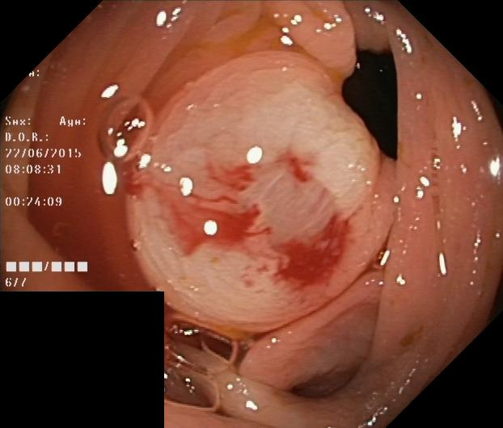 |  | 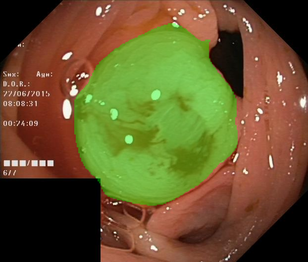 |

### Video Test — seq14 frames 0 & 1 (prompt: "medium round polyp")

| Frame 1 (segmented) | Frame 2 (correspondence) | Ground Truth (frame 1) | Prediction (overlay on frame 1) |
|---------------------|--------------------------|------------------------|---------------------------------|
| 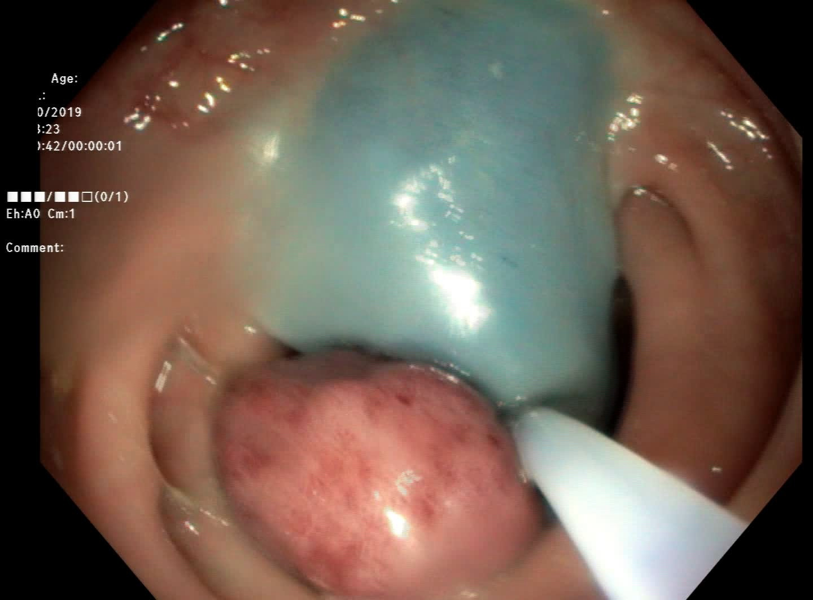 |  |  | 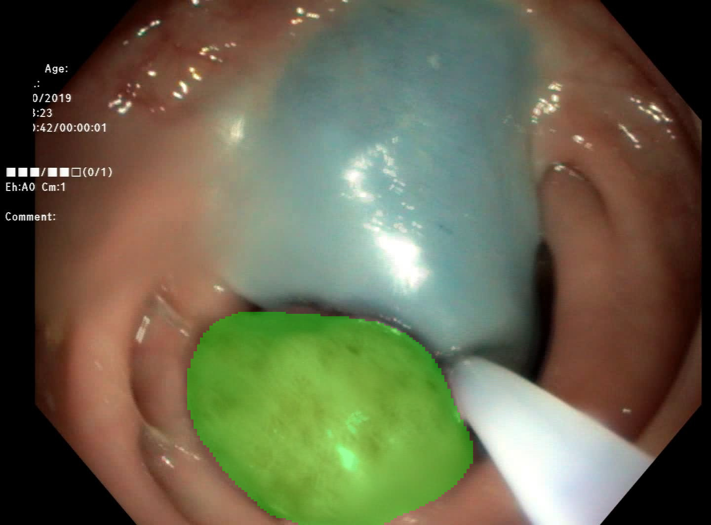 |

## Training Curves

Overview of the full run (best image-val Dice marked at epoch 40):

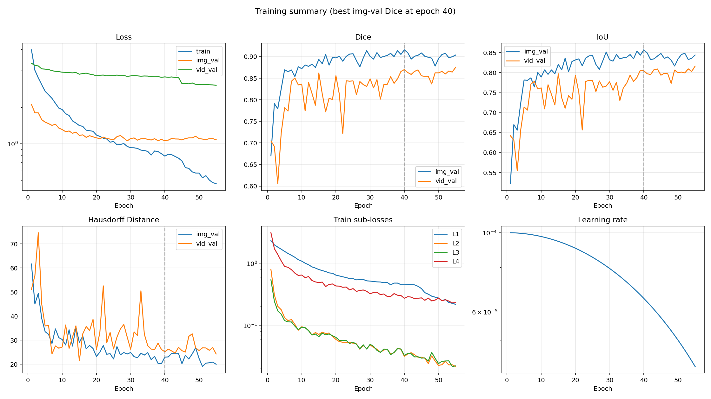

Individual plots:

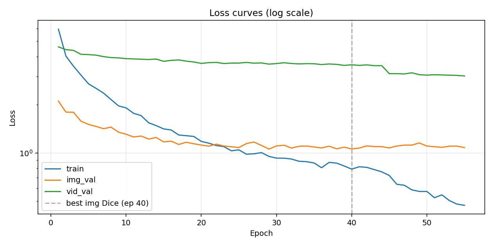

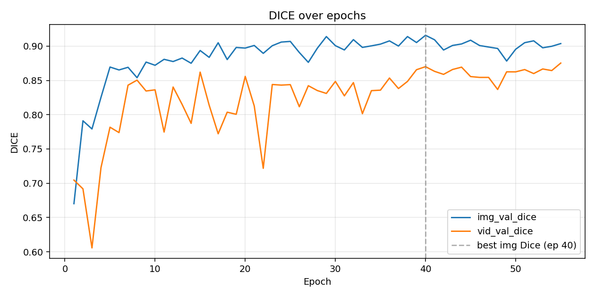

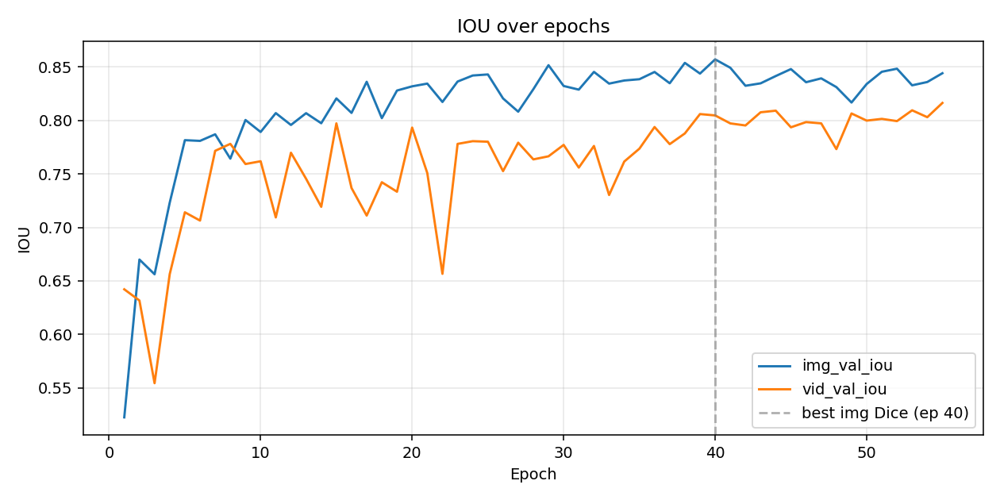

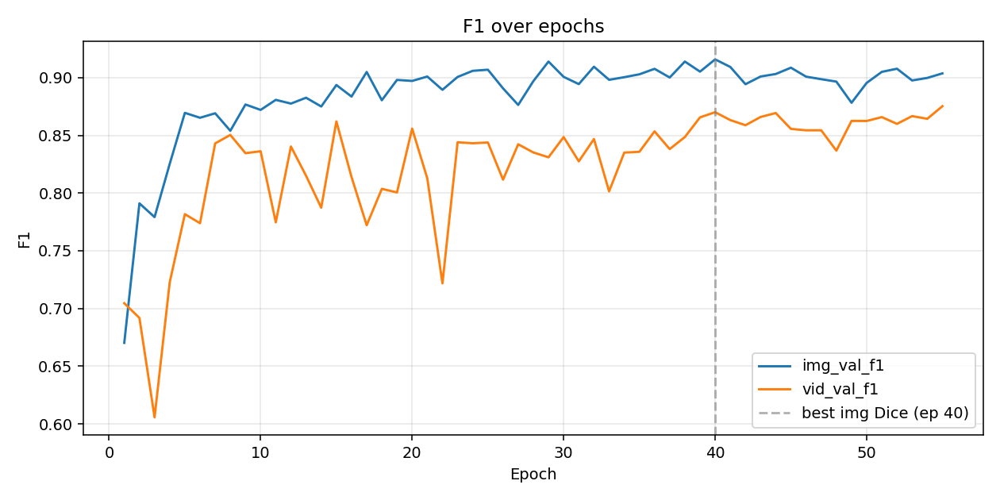

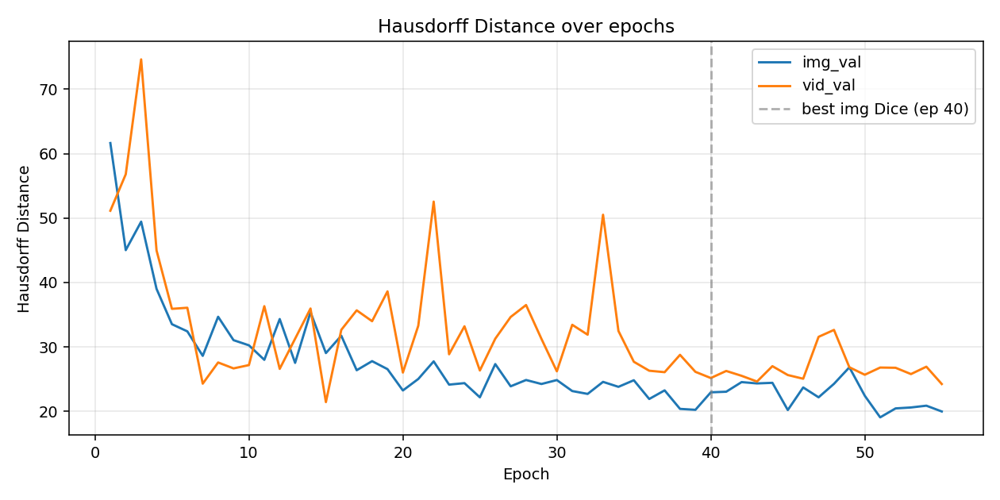

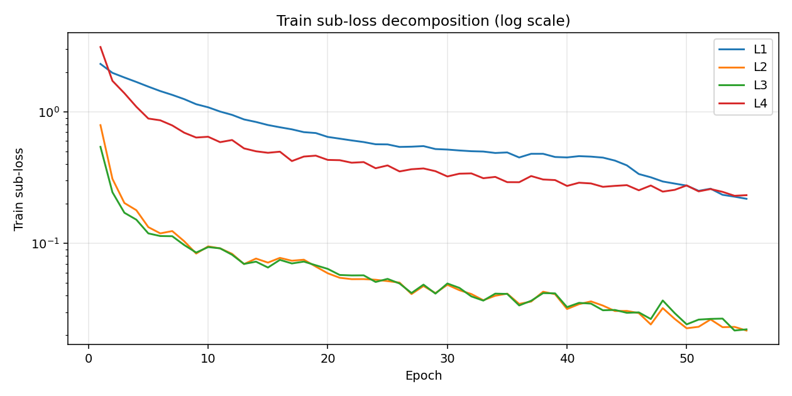

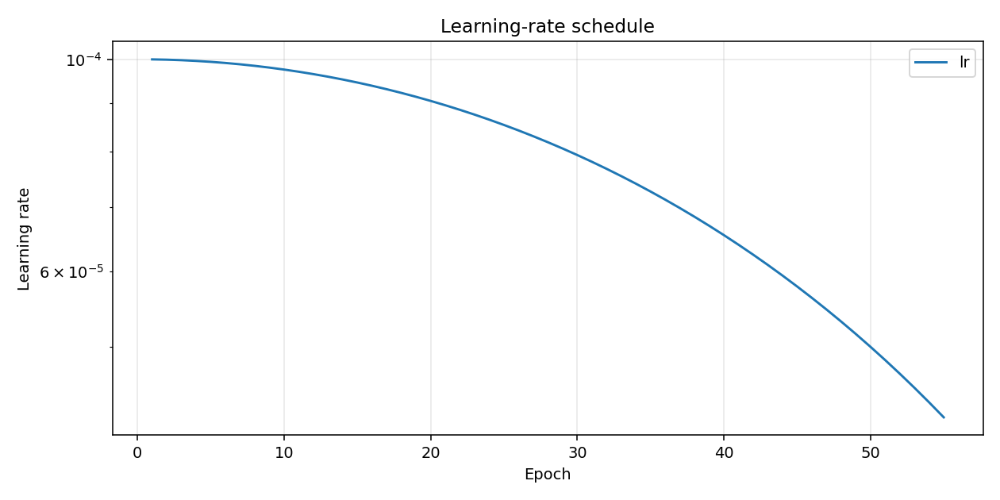

## Training Log

```
Epoch 001/100 (51.3s) | LR: 1.00e-04 | Train Loss: 5.9365 (L1: 2.3157, L2: 0.7927, L3: 0.5420, L4: 3.1128)
  Img Val  | Loss: 2.1072 | Dice: 0.6702 | IoU: 0.5225 | F1: 0.6702 | HD: 61.63
  Vid Val  | Loss: 4.6029 | Dice: 0.7046 | IoU: 0.6421 | F1: 0.7046 | HD: 51.13
  -> New best model saved (Dice: 0.6702)
Epoch 002/100 (41.9s) | LR: 9.99e-05 | Train Loss: 4.0310 (L1: 1.9802, L2: 0.3096, L3: 0.2448, L4: 1.7221)
  Img Val  | Loss: 1.7984 | Dice: 0.7911 | IoU: 0.6700 | F1: 0.7911 | HD: 45.03
  Vid Val  | Loss: 4.4229 | Dice: 0.6918 | IoU: 0.6317 | F1: 0.6918 | HD: 56.79
  -> New best model saved (Dice: 0.7911)
Epoch 003/100 (47.2s) | LR: 9.98e-05 | Train Loss: 3.4870 (L1: 1.8258, L2: 0.2027, L3: 0.1709, L4: 1.3866)
  Img Val  | Loss: 1.7960 | Dice: 0.7792 | IoU: 0.6562 | F1: 0.7792 | HD: 49.44
  Vid Val  | Loss: 4.3748 | Dice: 0.6057 | IoU: 0.5544 | F1: 0.6057 | HD: 74.62
Epoch 004/100 (43.7s) | LR: 9.96e-05 | Train Loss: 3.0660 (L1: 1.6886, L2: 0.1786, L3: 0.1514, L4: 1.0934)
  Img Val  | Loss: 1.5780 | Dice: 0.8253 | IoU: 0.7231 | F1: 0.8253 | HD: 39.01
  Vid Val  | Loss: 4.1381 | Dice: 0.7227 | IoU: 0.6563 | F1: 0.7227 | HD: 44.98
  -> New best model saved (Dice: 0.8253)
Epoch 005/100 (39.7s) | LR: 9.94e-05 | Train Loss: 2.7047 (L1: 1.5559, L2: 0.1329, L3: 0.1190, L4: 0.8895)
  Img Val  | Loss: 1.5068 | Dice: 0.8695 | IoU: 0.7815 | F1: 0.8695 | HD: 33.53
  Vid Val  | Loss: 4.1185 | Dice: 0.7817 | IoU: 0.7141 | F1: 0.7817 | HD: 35.91
  -> New best model saved (Dice: 0.8695)
Epoch 006/100 (38.6s) | LR: 9.91e-05 | Train Loss: 2.5335 (L1: 1.4392, L2: 0.1191, L3: 0.1137, L4: 0.8626)
  Img Val  | Loss: 1.4642 | Dice: 0.8652 | IoU: 0.7809 | F1: 0.8652 | HD: 32.42
  Vid Val  | Loss: 4.0872 | Dice: 0.7739 | IoU: 0.7064 | F1: 0.7739 | HD: 36.08
Epoch 007/100 (36.8s) | LR: 9.88e-05 | Train Loss: 2.3652 (L1: 1.3463, L2: 0.1240, L3: 0.1133, L4: 0.7887)
  Img Val  | Loss: 1.4171 | Dice: 0.8691 | IoU: 0.7870 | F1: 0.8691 | HD: 28.62
  Vid Val  | Loss: 3.9994 | Dice: 0.8430 | IoU: 0.7716 | F1: 0.8430 | HD: 24.30
Epoch 008/100 (42.0s) | LR: 9.84e-05 | Train Loss: 2.1556 (L1: 1.2498, L2: 0.1037, L3: 0.0971, L4: 0.6943)
  Img Val  | Loss: 1.4486 | Dice: 0.8540 | IoU: 0.7643 | F1: 0.8540 | HD: 34.68
  Vid Val  | Loss: 3.9471 | Dice: 0.8504 | IoU: 0.7781 | F1: 0.8504 | HD: 27.59
Epoch 009/100 (36.7s) | LR: 9.80e-05 | Train Loss: 1.9669 (L1: 1.1435, L2: 0.0836, L3: 0.0851, L4: 0.6379)
  Img Val  | Loss: 1.3470 | Dice: 0.8767 | IoU: 0.8004 | F1: 0.8767 | HD: 31.05
  Vid Val  | Loss: 3.9268 | Dice: 0.8345 | IoU: 0.7593 | F1: 0.8345 | HD: 26.67
  -> New best model saved (Dice: 0.8767)
Epoch 010/100 (36.9s) | LR: 9.76e-05 | Train Loss: 1.9116 (L1: 1.0833, L2: 0.0948, L3: 0.0937, L4: 0.6467)
  Img Val  | Loss: 1.3085 | Dice: 0.8721 | IoU: 0.7892 | F1: 0.8721 | HD: 30.25
  Vid Val  | Loss: 3.8843 | Dice: 0.8362 | IoU: 0.7618 | F1: 0.8362 | HD: 27.18
Epoch 011/100 (35.5s) | LR: 9.70e-05 | Train Loss: 1.7687 (L1: 1.0054, L2: 0.0916, L3: 0.0916, L4: 0.5883)
  Img Val  | Loss: 1.2574 | Dice: 0.8808 | IoU: 0.8069 | F1: 0.8808 | HD: 28.00
  Vid Val  | Loss: 3.8699 | Dice: 0.7747 | IoU: 0.7094 | F1: 0.7747 | HD: 36.32
  -> New best model saved (Dice: 0.8808)
Epoch 012/100 (38.8s) | LR: 9.65e-05 | Train Loss: 1.7098 (L1: 0.9489, L2: 0.0832, L3: 0.0819, L4: 0.6108)
  Img Val  | Loss: 1.2743 | Dice: 0.8775 | IoU: 0.7958 | F1: 0.8775 | HD: 34.33
  Vid Val  | Loss: 3.8540 | Dice: 0.8403 | IoU: 0.7698 | F1: 0.8403 | HD: 26.60
Epoch 013/100 (36.8s) | LR: 9.59e-05 | Train Loss: 1.5428 (L1: 0.8760, L2: 0.0696, L3: 0.0697, L4: 0.5275)
  Img Val  | Loss: 1.2200 | Dice: 0.8826 | IoU: 0.8068 | F1: 0.8826 | HD: 27.53
  Vid Val  | Loss: 3.8379 | Dice: 0.8150 | IoU: 0.7455 | F1: 0.8150 | HD: 31.28
  -> New best model saved (Dice: 0.8826)
Epoch 014/100 (35.8s) | LR: 9.52e-05 | Train Loss: 1.4812 (L1: 0.8379, L2: 0.0766, L3: 0.0726, L4: 0.5014)
  Img Val  | Loss: 1.2477 | Dice: 0.8750 | IoU: 0.7974 | F1: 0.8750 | HD: 35.40
  Vid Val  | Loss: 3.8628 | Dice: 0.7874 | IoU: 0.7193 | F1: 0.7874 | HD: 35.96
Epoch 015/100 (35.6s) | LR: 9.46e-05 | Train Loss: 1.4121 (L1: 0.7942, L2: 0.0714, L3: 0.0655, L4: 0.4883)
  Img Val  | Loss: 1.1717 | Dice: 0.8936 | IoU: 0.8206 | F1: 0.8936 | HD: 29.05
  Vid Val  | Loss: 3.7389 | Dice: 0.8621 | IoU: 0.7973 | F1: 0.8621 | HD: 21.44
  -> New best model saved (Dice: 0.8936)
Epoch 016/100 (37.1s) | LR: 9.38e-05 | Train Loss: 1.3909 (L1: 0.7636, L2: 0.0775, L3: 0.0749, L4: 0.4980)
  Img Val  | Loss: 1.1843 | Dice: 0.8836 | IoU: 0.8070 | F1: 0.8836 | HD: 31.74
  Vid Val  | Loss: 3.7901 | Dice: 0.8139 | IoU: 0.7368 | F1: 0.8139 | HD: 32.65
Epoch 017/100 (35.3s) | LR: 9.30e-05 | Train Loss: 1.2936 (L1: 0.7363, L2: 0.0737, L3: 0.0703, L4: 0.4225)
  Img Val  | Loss: 1.1290 | Dice: 0.9049 | IoU: 0.8361 | F1: 0.9049 | HD: 26.39
  Vid Val  | Loss: 3.8155 | Dice: 0.7722 | IoU: 0.7111 | F1: 0.7722 | HD: 35.68
  -> New best model saved (Dice: 0.9049)
Epoch 018/100 (38.8s) | LR: 9.22e-05 | Train Loss: 1.2810 (L1: 0.7011, L2: 0.0751, L3: 0.0726, L4: 0.4572)
  Img Val  | Loss: 1.1653 | Dice: 0.8804 | IoU: 0.8021 | F1: 0.8804 | HD: 27.80
  Vid Val  | Loss: 3.7481 | Dice: 0.8037 | IoU: 0.7422 | F1: 0.8037 | HD: 34.00
Epoch 019/100 (36.0s) | LR: 9.14e-05 | Train Loss: 1.2670 (L1: 0.6901, L2: 0.0666, L3: 0.0681, L4: 0.4645)
  Img Val  | Loss: 1.1405 | Dice: 0.8980 | IoU: 0.8279 | F1: 0.8980 | HD: 26.56
  Vid Val  | Loss: 3.7031 | Dice: 0.8006 | IoU: 0.7334 | F1: 0.8006 | HD: 38.62
Epoch 020/100 (35.5s) | LR: 9.05e-05 | Train Loss: 1.1801 (L1: 0.6447, L2: 0.0592, L3: 0.0639, L4: 0.4311)
  Img Val  | Loss: 1.1190 | Dice: 0.8972 | IoU: 0.8319 | F1: 0.8972 | HD: 23.25
  Vid Val  | Loss: 3.6296 | Dice: 0.8558 | IoU: 0.7933 | F1: 0.8558 | HD: 26.03
Epoch 021/100 (35.2s) | LR: 8.95e-05 | Train Loss: 1.1499 (L1: 0.6255, L2: 0.0547, L3: 0.0575, L4: 0.4290)
  Img Val  | Loss: 1.1008 | Dice: 0.9010 | IoU: 0.8344 | F1: 0.9010 | HD: 25.03
  Vid Val  | Loss: 3.6677 | Dice: 0.8128 | IoU: 0.7508 | F1: 0.8128 | HD: 33.29
Epoch 022/100 (36.0s) | LR: 8.85e-05 | Train Loss: 1.1112 (L1: 0.6063, L2: 0.0534, L3: 0.0570, L4: 0.4104)
  Img Val  | Loss: 1.1343 | Dice: 0.8895 | IoU: 0.8172 | F1: 0.8895 | HD: 27.76
  Vid Val  | Loss: 3.6803 | Dice: 0.7218 | IoU: 0.6566 | F1: 0.7218 | HD: 52.55
Epoch 023/100 (35.4s) | LR: 8.75e-05 | Train Loss: 1.0945 (L1: 0.5894, L2: 0.0535, L3: 0.0571, L4: 0.4150)
  Img Val  | Loss: 1.1037 | Dice: 0.9006 | IoU: 0.8363 | F1: 0.9006 | HD: 24.15
  Vid Val  | Loss: 3.6218 | Dice: 0.8440 | IoU: 0.7781 | F1: 0.8440 | HD: 28.87
Epoch 024/100 (35.2s) | LR: 8.64e-05 | Train Loss: 1.0303 (L1: 0.5670, L2: 0.0529, L3: 0.0508, L4: 0.3726)
  Img Val  | Loss: 1.0928 | Dice: 0.9059 | IoU: 0.8420 | F1: 0.9059 | HD: 24.38
  Vid Val  | Loss: 3.6453 | Dice: 0.8432 | IoU: 0.7806 | F1: 0.8432 | HD: 33.21
  -> New best model saved (Dice: 0.9059)
Epoch 025/100 (35.9s) | LR: 8.54e-05 | Train Loss: 1.0445 (L1: 0.5656, L2: 0.0516, L3: 0.0537, L4: 0.3915)
  Img Val  | Loss: 1.0794 | Dice: 0.9069 | IoU: 0.8430 | F1: 0.9069 | HD: 22.19
  Vid Val  | Loss: 3.6461 | Dice: 0.8438 | IoU: 0.7801 | F1: 0.8438 | HD: 26.35
  -> New best model saved (Dice: 0.9069)
Epoch 026/100 (37.1s) | LR: 8.42e-05 | Train Loss: 0.9811 (L1: 0.5412, L2: 0.0503, L3: 0.0495, L4: 0.3523)
  Img Val  | Loss: 1.1440 | Dice: 0.8907 | IoU: 0.8206 | F1: 0.8907 | HD: 27.34
  Vid Val  | Loss: 3.6794 | Dice: 0.8116 | IoU: 0.7526 | F1: 0.8116 | HD: 31.28
Epoch 027/100 (35.7s) | LR: 8.31e-05 | Train Loss: 0.9868 (L1: 0.5436, L2: 0.0412, L3: 0.0419, L4: 0.3661)
  Img Val  | Loss: 1.1692 | Dice: 0.8764 | IoU: 0.8082 | F1: 0.8764 | HD: 23.89
  Vid Val  | Loss: 3.6412 | Dice: 0.8423 | IoU: 0.7792 | F1: 0.8423 | HD: 34.65
Epoch 028/100 (37.7s) | LR: 8.19e-05 | Train Loss: 1.0039 (L1: 0.5491, L2: 0.0474, L3: 0.0485, L4: 0.3713)
  Img Val  | Loss: 1.1132 | Dice: 0.8970 | IoU: 0.8292 | F1: 0.8970 | HD: 24.87
  Vid Val  | Loss: 3.6536 | Dice: 0.8352 | IoU: 0.7636 | F1: 0.8352 | HD: 36.50
Epoch 029/100 (36.0s) | LR: 8.06e-05 | Train Loss: 0.9506 (L1: 0.5215, L2: 0.0419, L3: 0.0415, L4: 0.3539)
  Img Val  | Loss: 1.0562 | Dice: 0.9139 | IoU: 0.8516 | F1: 0.9139 | HD: 24.25
  Vid Val  | Loss: 3.5900 | Dice: 0.8310 | IoU: 0.7665 | F1: 0.8310 | HD: 31.25
  -> New best model saved (Dice: 0.9139)
Epoch 030/100 (37.4s) | LR: 7.94e-05 | Train Loss: 0.9272 (L1: 0.5168, L2: 0.0484, L3: 0.0495, L4: 0.3226)
  Img Val  | Loss: 1.1053 | Dice: 0.9007 | IoU: 0.8322 | F1: 0.9007 | HD: 24.86
  Vid Val  | Loss: 3.6209 | Dice: 0.8485 | IoU: 0.7771 | F1: 0.8485 | HD: 26.22
Epoch 031/100 (35.4s) | LR: 7.81e-05 | Train Loss: 0.9263 (L1: 0.5086, L2: 0.0440, L3: 0.0459, L4: 0.3387)
  Img Val  | Loss: 1.1163 | Dice: 0.8944 | IoU: 0.8288 | F1: 0.8944 | HD: 23.16
  Vid Val  | Loss: 3.6628 | Dice: 0.8275 | IoU: 0.7559 | F1: 0.8275 | HD: 33.44
Epoch 032/100 (36.7s) | LR: 7.68e-05 | Train Loss: 0.9152 (L1: 0.5021, L2: 0.0412, L3: 0.0395, L4: 0.3404)
  Img Val  | Loss: 1.0718 | Dice: 0.9095 | IoU: 0.8454 | F1: 0.9095 | HD: 22.71
  Vid Val  | Loss: 3.6237 | Dice: 0.8468 | IoU: 0.7761 | F1: 0.8468 | HD: 31.90
Epoch 033/100 (35.9s) | LR: 7.55e-05 | Train Loss: 0.8862 (L1: 0.4992, L2: 0.0369, L3: 0.0367, L4: 0.3128)
  Img Val  | Loss: 1.0995 | Dice: 0.8981 | IoU: 0.8344 | F1: 0.8981 | HD: 24.58
  Vid Val  | Loss: 3.6017 | Dice: 0.8015 | IoU: 0.7303 | F1: 0.8015 | HD: 50.51
Epoch 034/100 (35.4s) | LR: 7.41e-05 | Train Loss: 0.8810 (L1: 0.4868, L2: 0.0399, L3: 0.0414, L4: 0.3202)
  Img Val  | Loss: 1.1032 | Dice: 0.9004 | IoU: 0.8373 | F1: 0.9004 | HD: 23.81
  Vid Val  | Loss: 3.6161 | Dice: 0.8351 | IoU: 0.7616 | F1: 0.8351 | HD: 32.48
Epoch 035/100 (37.3s) | LR: 7.27e-05 | Train Loss: 0.8646 (L1: 0.4914, L2: 0.0414, L3: 0.0412, L4: 0.2920)
  Img Val  | Loss: 1.0887 | Dice: 0.9029 | IoU: 0.8385 | F1: 0.9029 | HD: 24.83
  Vid Val  | Loss: 3.6104 | Dice: 0.8358 | IoU: 0.7736 | F1: 0.8358 | HD: 27.70
Epoch 036/100 (35.7s) | LR: 7.13e-05 | Train Loss: 0.8075 (L1: 0.4499, L2: 0.0346, L3: 0.0337, L4: 0.2917)
  Img Val  | Loss: 1.0735 | Dice: 0.9076 | IoU: 0.8453 | F1: 0.9076 | HD: 21.93
  Vid Val  | Loss: 3.5670 | Dice: 0.8535 | IoU: 0.7938 | F1: 0.8535 | HD: 26.31
Epoch 037/100 (36.3s) | LR: 6.99e-05 | Train Loss: 0.8721 (L1: 0.4798, L2: 0.0361, L3: 0.0366, L4: 0.3250)
  Img Val  | Loss: 1.1011 | Dice: 0.9001 | IoU: 0.8347 | F1: 0.9001 | HD: 23.26
  Vid Val  | Loss: 3.5995 | Dice: 0.8381 | IoU: 0.7778 | F1: 0.8381 | HD: 26.09
Epoch 038/100 (36.4s) | LR: 6.84e-05 | Train Loss: 0.8628 (L1: 0.4797, L2: 0.0429, L3: 0.0418, L4: 0.3060)
  Img Val  | Loss: 1.0600 | Dice: 0.9140 | IoU: 0.8538 | F1: 0.9140 | HD: 20.39
  Vid Val  | Loss: 3.5763 | Dice: 0.8485 | IoU: 0.7878 | F1: 0.8485 | HD: 28.77
  -> New best model saved (Dice: 0.9140)
Epoch 039/100 (36.1s) | LR: 6.69e-05 | Train Loss: 0.8281 (L1: 0.4537, L2: 0.0411, L3: 0.0416, L4: 0.3028)
  Img Val  | Loss: 1.0853 | Dice: 0.9052 | IoU: 0.8438 | F1: 0.9052 | HD: 20.24
  Vid Val  | Loss: 3.5267 | Dice: 0.8656 | IoU: 0.8059 | F1: 0.8656 | HD: 26.14
Epoch 040/100 (36.1s) | LR: 6.55e-05 | Train Loss: 0.7912 (L1: 0.4503, L2: 0.0317, L3: 0.0327, L4: 0.2733)
  Img Val  | Loss: 1.0582 | Dice: 0.9158 | IoU: 0.8571 | F1: 0.9158 | HD: 22.96
  Vid Val  | Loss: 3.5546 | Dice: 0.8701 | IoU: 0.8047 | F1: 0.8701 | HD: 25.18
  -> New best model saved (Dice: 0.9158)
Epoch 041/100 (35.7s) | LR: 6.39e-05 | Train Loss: 0.8189 (L1: 0.4606, L2: 0.0345, L3: 0.0353, L4: 0.2892)
  Img Val  | Loss: 1.0717 | Dice: 0.9093 | IoU: 0.8492 | F1: 0.9093 | HD: 23.05
  Vid Val  | Loss: 3.5267 | Dice: 0.8632 | IoU: 0.7972 | F1: 0.8632 | HD: 26.28
Epoch 042/100 (36.1s) | LR: 6.24e-05 | Train Loss: 0.8120 (L1: 0.4568, L2: 0.0362, L3: 0.0348, L4: 0.2855)
  Img Val  | Loss: 1.1058 | Dice: 0.8943 | IoU: 0.8324 | F1: 0.8943 | HD: 24.55
  Vid Val  | Loss: 3.5510 | Dice: 0.8588 | IoU: 0.7953 | F1: 0.8588 | HD: 25.52
Epoch 043/100 (36.2s) | LR: 6.09e-05 | Train Loss: 0.7862 (L1: 0.4488, L2: 0.0336, L3: 0.0310, L4: 0.2691)
  Img Val  | Loss: 1.0954 | Dice: 0.9010 | IoU: 0.8347 | F1: 0.9010 | HD: 24.34
  Vid Val  | Loss: 3.5121 | Dice: 0.8659 | IoU: 0.8076 | F1: 0.8659 | HD: 24.63
Epoch 044/100 (36.3s) | LR: 5.94e-05 | Train Loss: 0.7611 (L1: 0.4261, L2: 0.0306, L3: 0.0311, L4: 0.2736)
  Img Val  | Loss: 1.0939 | Dice: 0.9032 | IoU: 0.8415 | F1: 0.9032 | HD: 24.43
  Vid Val  | Loss: 3.5133 | Dice: 0.8693 | IoU: 0.8091 | F1: 0.8693 | HD: 27.02
Epoch 045/100 (36.9s) | LR: 5.78e-05 | Train Loss: 0.7221 (L1: 0.3919, L2: 0.0306, L3: 0.0296, L4: 0.2771)
  Img Val  | Loss: 1.0745 | Dice: 0.9086 | IoU: 0.8480 | F1: 0.9086 | HD: 20.21
  Vid Val  | Loss: 3.1285 | Dice: 0.8556 | IoU: 0.7936 | F1: 0.8556 | HD: 25.64
Epoch 046/100 (36.8s) | LR: 5.63e-05 | Train Loss: 0.6363 (L1: 0.3367, L2: 0.0295, L3: 0.0299, L4: 0.2532)
  Img Val  | Loss: 1.1040 | Dice: 0.9009 | IoU: 0.8357 | F1: 0.9009 | HD: 23.72
  Vid Val  | Loss: 3.1286 | Dice: 0.8544 | IoU: 0.7985 | F1: 0.8544 | HD: 25.07
Epoch 047/100 (38.8s) | LR: 5.47e-05 | Train Loss: 0.6272 (L1: 0.3180, L2: 0.0242, L3: 0.0266, L4: 0.2753)
  Img Val  | Loss: 1.1180 | Dice: 0.8987 | IoU: 0.8393 | F1: 0.8987 | HD: 22.19
  Vid Val  | Loss: 3.1166 | Dice: 0.8544 | IoU: 0.7972 | F1: 0.8544 | HD: 31.57
Epoch 048/100 (37.1s) | LR: 5.31e-05 | Train Loss: 0.5870 (L1: 0.2955, L2: 0.0322, L3: 0.0368, L4: 0.2474)
  Img Val  | Loss: 1.1186 | Dice: 0.8966 | IoU: 0.8312 | F1: 0.8966 | HD: 24.28
  Vid Val  | Loss: 3.1693 | Dice: 0.8368 | IoU: 0.7732 | F1: 0.8368 | HD: 32.64
Epoch 049/100 (36.5s) | LR: 5.16e-05 | Train Loss: 0.5740 (L1: 0.2848, L2: 0.0266, L3: 0.0295, L4: 0.2552)
  Img Val  | Loss: 1.1532 | Dice: 0.8782 | IoU: 0.8167 | F1: 0.8782 | HD: 26.84
  Vid Val  | Loss: 3.0845 | Dice: 0.8625 | IoU: 0.8065 | F1: 0.8625 | HD: 26.85
Epoch 050/100 (36.3s) | LR: 5.00e-05 | Train Loss: 0.5739 (L1: 0.2749, L2: 0.0226, L3: 0.0242, L4: 0.2758)
  Img Val  | Loss: 1.1032 | Dice: 0.8954 | IoU: 0.8340 | F1: 0.8954 | HD: 22.43
  Vid Val  | Loss: 3.0648 | Dice: 0.8625 | IoU: 0.7998 | F1: 0.8625 | HD: 25.69
Epoch 051/100 (37.8s) | LR: 4.84e-05 | Train Loss: 0.5245 (L1: 0.2508, L2: 0.0232, L3: 0.0263, L4: 0.2485)
  Img Val  | Loss: 1.0932 | Dice: 0.9050 | IoU: 0.8455 | F1: 0.9050 | HD: 19.08
  Vid Val  | Loss: 3.0821 | Dice: 0.8658 | IoU: 0.8014 | F1: 0.8658 | HD: 26.80
Epoch 052/100 (35.9s) | LR: 4.69e-05 | Train Loss: 0.5460 (L1: 0.2604, L2: 0.0264, L3: 0.0266, L4: 0.2588)
  Img Val  | Loss: 1.0830 | Dice: 0.9077 | IoU: 0.8483 | F1: 0.9077 | HD: 20.46
  Vid Val  | Loss: 3.0733 | Dice: 0.8600 | IoU: 0.7994 | F1: 0.8600 | HD: 26.77
Epoch 053/100 (36.3s) | LR: 4.53e-05 | Train Loss: 0.5027 (L1: 0.2339, L2: 0.0230, L3: 0.0268, L4: 0.2464)
  Img Val  | Loss: 1.1010 | Dice: 0.8976 | IoU: 0.8328 | F1: 0.8976 | HD: 20.61
  Vid Val  | Loss: 3.0623 | Dice: 0.8667 | IoU: 0.8095 | F1: 0.8667 | HD: 25.79
Epoch 054/100 (36.7s) | LR: 4.37e-05 | Train Loss: 0.4782 (L1: 0.2264, L2: 0.0232, L3: 0.0217, L4: 0.2300)
  Img Val  | Loss: 1.1025 | Dice: 0.8998 | IoU: 0.8359 | F1: 0.8998 | HD: 20.89
  Vid Val  | Loss: 3.0538 | Dice: 0.8643 | IoU: 0.8030 | F1: 0.8643 | HD: 26.94
Epoch 055/100 (35.9s) | LR: 4.22e-05 | Train Loss: 0.4697 (L1: 0.2182, L2: 0.0217, L3: 0.0222, L4: 0.2325)
  Img Val  | Loss: 1.0791 | Dice: 0.9037 | IoU: 0.8441 | F1: 0.9037 | HD: 19.99
  Vid Val  | Loss: 3.0286 | Dice: 0.8753 | IoU: 0.8163 | F1: 0.8753 | HD: 24.25

Early stopping: Val Dice did not improve for 15 epochs.

Training complete. Best validation Dice: 0.9158
```
