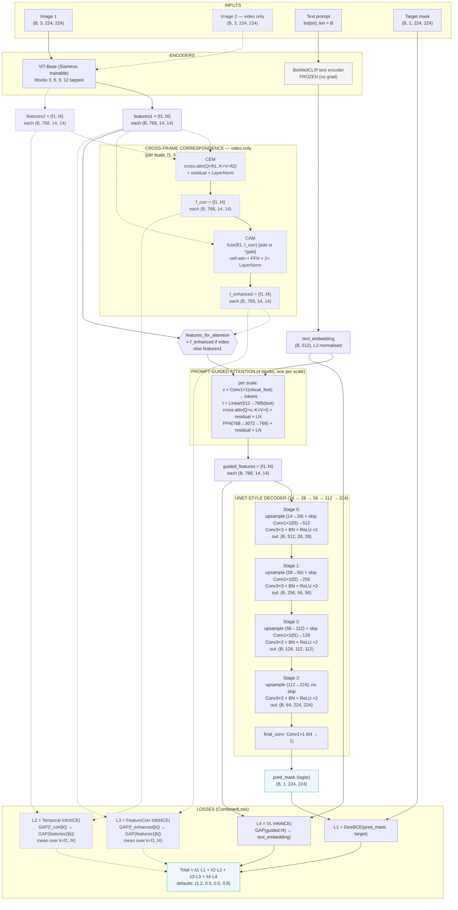

# Model Architecture — Polyp Segmentation with ViT + BioMed CLIP + Cross-Frame Correspondence

This document is a deep, end-to-end walkthrough of every component that composes the polyp segmentation model in this repository, the exact tensor shapes that flow between them, the math each module performs, the four loss terms, and how training and inference orchestrate everything together.

The whole pipeline lives under `models/` and is wired together by `models/segmentation_model.py`. Configuration defaults referenced below come from `configs/config.yaml`.

---

## 1. Bird's-eye view

The model is a multi-modal, multi-scale encoder–decoder for binary polyp segmentation that can optionally consume a *pair* of video frames in order to learn temporal correspondence. There are three computational branches that get assembled at runtime:

```
                 text prompt (str)
                        |
                        v
              BioMedCLIP text encoder (frozen)
                        |
                        v
                  text_embedding (B, 512)
                        |
   image  ->  ViT-Base  ->  features1 {f1..f4} ----+
                                                   |
                                                   |  (single image path)
                                                   v
                                        Prompt-Guided Attention
                                                   |
                                                   v
                                          UNet-style Decoder
                                                   |
                                                   v
                                        pred_mask (B, 1, 224, 224)


   image  ->  ViT-Base  ->  features1 {f1..f4} \
                                                 \
                                                  Cross-Frame Correspondence
                                                 /        (CEM + CAM)
   image2 ->  ViT-Base  ->  features2 {f1..f4} /
                                                   |
                                                   v
                                        f_enhanced {f1..f4}
                                                   |
                                                   v
                                        Prompt-Guided Attention
                                                   |
                                                   v
                                          UNet-style Decoder
                                                   |
                                                   v
                                        pred_mask (B, 1, 224, 224)
```

The same encoder, prompt-attention, and decoder weights are used in both branches; the only branch-specific module is `CrossFrameCorrespondence`, which is bypassed when no second frame is provided.

The four loss terms (Dice+BCE, Temporal InfoNCE, Feature Correspondence InfoNCE, Vision-Language InfoNCE) are then computed by `models/losses.py::CombinedLoss`. Per the training script, the **image branch** activates `{L1, L4}` and the **video branch** activates `{L1, L2, L3, L4}`.

Defaults (from `configs/config.yaml`):
- input image size `224 × 224`
- ViT patch size `16` ⇒ token grid `14 × 14` (`N = 196` tokens)
- encoder embedding dim `D = 768`
- text embedding dim `512`
- decoder channel ladder `[512, 256, 128, 64]`
- attention heads `8`
- correspondence fusion `add`

---

## 2. Inputs

There are three logical inputs to `PolypSegmentationModel.forward`:

| Argument        | Shape / Type                           | Meaning                                  |
|-----------------|-----------------------------------------|------------------------------------------|
| `images`        | `(B, 3, 224, 224)` float tensor         | Primary frame, ImageNet-normalized       |
| `text_prompts`  | `list[str]` of length `B`               | One prompt per image                     |
| `images2`       | `(B, 3, 224, 224)` or `None`            | Optional second frame for correspondence |

Image preprocessing (`data/transforms.py::JointTransform` and `data/video_dataset.py`):

- Resize to `224 × 224` (bilinear for images, nearest for masks).
- Train-time joint augmentations: random horizontal/vertical flip, random rotation in `{0, 90, 180, 270}`, color-jitter on the image only. For the **video** dataset both frames *and* both masks receive identical geometric/color perturbations so that pixel correspondence is preserved.
- Normalize with ImageNet mean `[0.485, 0.456, 0.406]` and std `[0.229, 0.224, 0.225]`.
- Mask is binarised with threshold `> 128/255`, returned as `(1, 224, 224)` float tensor.

Text prompts are *pre-computed* offline by `data/prompt_generator.py` from each ground-truth mask, producing one of seven phrases:

```
"normal mucosa"               # empty mask
"small  round polyp"          # area_ratio < 0.05, circularity > 0.7
"small  irregular polyp"      # area_ratio < 0.05, circularity <= 0.7
"medium round polyp"          # 0.05 <= area_ratio < 0.20, circularity > 0.7
"medium irregular polyp"      # 0.05 <= area_ratio < 0.20, circularity <= 0.7
"large  round polyp"          # area_ratio >= 0.20, circularity > 0.7
"large  irregular polyp"      # area_ratio >= 0.20, circularity <= 0.7
```

where `area_ratio = mask_pixels / total_pixels` and circularity uses the isoperimetric estimator
`4·π·area / perimeter²` with perimeter approximated by `mask − 4-connected erosion(mask)`.

Prompts are cached in `data/prompt_cache.json` (image dataset) and `data/video_prompt_cache.json` (video dataset) and looked up by filename at dataset-load time.

---

## 3. Visual encoder — `models/vit_encoder.py::ViTEncoder`

The visual backbone is `vit_base_patch16_224` from `timm`, optionally pretrained on ImageNet-21k+1k.

### 3.1 Tokenization

The patch embedding splits the `224 × 224 × 3` input into `14 × 14 = 196` non-overlapping `16 × 16` patches and projects each to a `768`-d token. A learnable `[CLS]` token is prepended and learnable positional encodings are added, yielding the token sequence `T₀ ∈ ℝ^{B × 197 × 768}`. This sequence then flows through 12 Transformer blocks `T_{ℓ} = Block_ℓ(T_{ℓ-1})`.

### 3.2 Multi-scale feature taps

Rather than using only the final block output, the encoder taps four intermediate depths defined by `feature_blocks: [3, 6, 9, 12]`:

```
ViT block index:  1  2  3  4  5  6  7  8  9 10 11 12
                       ^        ^        ^         ^
                       f1       f2       f3        f4
                     shallow  ----semantic depth---->  deep
```

Implementation detail: the encoder registers a `forward_hook` on each tapped block (`models/vit_encoder.py:20`). On the forward pass it discards the `[CLS]` token, permutes from sequence to spatial layout, and reshapes to a 2-D feature map:

```
tokens: (B, 197, 768)  --drop CLS-->  (B, 196, 768)
              --permute(0,2,1)-->     (B, 768, 196)
              --reshape-->            (B, 768, 14, 14)
```

The encoder returns

```python
features = {
    "f1": (B, 768, 14, 14),  # shallow  (block 3)
    "f2": (B, 768, 14, 14),  # mid-shallow (block 6)
    "f3": (B, 768, 14, 14),  # mid-deep    (block 9)
    "f4": (B, 768, 14, 14),  # deep        (block 12)
}
```

Note that **all four feature maps share the same `14 × 14` spatial resolution** because ViT does not downsample between blocks. The "multi-scale" nature here is therefore *semantic depth* (different abstraction levels), not spatial resolution — a fact the decoder exploits with explicit upsampling.

### 3.3 Why these blocks

- `f1` (block 3) — low-level edges, color, texture.
- `f2` (block 6) — local shape and part composition.
- `f3` (block 9) — object-level semantics.
- `f4` (block 12) — global, fully semantic features. Used as the decoder's starting tensor and as the visual side of the vision-language alignment loss.

The encoder is **trainable** (no `requires_grad=False`), so all 12 blocks are fine-tuned on polyp data starting from ImageNet weights.

---

## 4. Text encoder — `models/segmentation_model.py::BioMedCLIPTextEncoder`

A frozen BioMed-CLIP text tower from `microsoft/BiomedCLIP-PubMedBERT_256-vit_base_patch16_224` is loaded via `open_clip.create_model_and_transforms`. All parameters are frozen with `requires_grad = False` and the forward pass runs under `torch.no_grad()`.

For each of the `B` prompt strings:

1. Tokenize via the BioMed-CLIP tokenizer.
2. Move tokens to the model's device.
3. `clip_model.encode_text(tokens)` ⇒ `(B, 512)` raw text embedding.
4. L2-normalise across the embedding dim ⇒ unit-norm `text_embedding ∈ ℝ^{B × 512}`.

This embedding is reused twice downstream: as the `key/value` of the prompt-guided cross-attention, and as the text side of the vision-language alignment loss. Because the text encoder is frozen, no gradients flow into BioMed-CLIP — only the small projection layers (`text_proj` in `PromptGuidedAttentionBlock` and `VisionLanguageAlignmentLoss.text_proj`) adapt the 512-d embedding to the rest of the model.

---

## 5. Cross-frame correspondence — `models/cross_frame_correspondence.py`

Active **only when `images2 is not None`** (i.e., the video branch). It is inspired by the CALICO temporal correspondence design, and it sits between the encoder and the prompt-guided attention. It contains two stacked sub-modules per scale, applied independently to each of `f1..f4`:

### 5.1 Correspondence Extraction Module (CEM)

For a given scale, with `ft1, ft2 ∈ ℝ^{B × 768 × 14 × 14}`:

```
q = Conv1x1(ft1).flatten(2).permute(0,2,1)          # (B, 196, 768)
k = ft2.flatten(2).permute(0,2,1)                   # (B, 196, 768)
v = ft2.flatten(2).permute(0,2,1)                   # (B, 196, 768)

attn  = MultiHeadAttention(q=q, k=k, v=v)           # (B, 196, 768),  num_heads=8
out   = LayerNorm(attn + q)                         # residual + post-LN
f_corr = out.permute(0,2,1).reshape(B,768,14,14)
```

Intuitively, every spatial location of frame 1 attends to every spatial location of frame 2 and pulls back the most semantically related frame-2 features. The `1 × 1` conv on `q` plus the residual `+ q` lets the layer choose how much to perturb frame-1 features.

### 5.2 Correspondence Adaptation Module (CAM)

CAM fuses the correspondence map back into the original frame-1 features. With `fusion_mode="add"` (the default) or `"multiply"`:

```
if fusion_mode == "add":
    fused = ft1 + f_corr
elif fusion_mode == "multiply":
    g     = sigmoid(Conv1x1(f_corr))     # gate in [0,1], (B,768,14,14)
    fused = ft1 * g

x = fused.flatten(2).permute(0,2,1)      # (B, 196, 768)

# Standard Transformer block on the fused tokens:
x = LayerNorm(x + SelfAttention(x, x, x))
x = LayerNorm(x + FFN(x))                # FFN: Linear(D, 4D) -> GELU -> Linear(4D, D)

f_enhanced = x.permute(0,2,1).reshape(B, 768, 14, 14)
```

So CAM is a small Transformer block (self-attention + MLP) applied on top of a fused tensor that already has temporal information injected.

### 5.3 Stacking over scales — `CrossFrameCorrespondence`

The `CrossFrameCorrespondence` module owns four `(CEM, CAM)` pairs (one per scale `f1..f4`) and, given two encoder dictionaries, returns:

```python
f_corr     = {"f1": ..., "f2": ..., "f3": ..., "f4": ...}   # CEM outputs
f_enhanced = {"f1": ..., "f2": ..., "f3": ..., "f4": ...}   # CAM outputs
```

Both dictionaries preserve the `(B, 768, 14, 14)` shape. `f_enhanced` becomes the input to the prompt-guided attention; `f_corr` and `features2` are also returned to the loss functions for the temporal/correspondence losses.

When `images2` is `None`, this entire module is skipped and `features1` is forwarded directly.

---

## 6. Prompt-Guided Attention — `models/prompt_guided_attention.py`

This module conditions the visual features on the BioMed-CLIP text embedding via cross-attention. There are four `PromptGuidedAttentionBlock`s (one per scale).

### 6.1 Single block

For one scale, with `visual_feat ∈ ℝ^{B × 768 × 14 × 14}` and `text_embedding ∈ ℝ^{B × 512}`:

```
v = Conv1x1(visual_feat).flatten(2).permute(0,2,1)       # (B, 196, 768)
t = Linear(512 -> 768)(text_embedding).unsqueeze(1)      # (B,   1, 768)

# Cross-attention: visual queries, text key/value.
attn, _ = MultiHeadAttention(q=v, k=t, v=t)              # (B, 196, 768),  num_heads=8
v       = LayerNorm(v + attn)                            # residual + LN

# Position-wise FFN on the visual tokens.
v = LayerNorm(v + FFN(v))                                # FFN: 768 -> 3072 -> 768

guided  = v.permute(0,2,1).reshape(B, 768, 14, 14)
```

Because the text side has only one token, this is effectively a *single-key* attention: every spatial position computes one attention weight against the prompt vector and uses it to mix the prompt back into the visual representation. The benefit is that the visual features are nudged toward the semantic concept described by the prompt (e.g. "small irregular polyp"), which serves as a soft spatial prior.

### 6.2 Stacking over scales — `PromptGuidedAttention`

`PromptGuidedAttention` holds four such blocks and applies one to each scale:

```python
guided = {f"f{i}": block_i(features[f"f{i}"], text_embedding)  for i in 1..4}
```

The output dictionary `guided_features` keeps the `(B, 768, 14, 14)` shape per scale and is consumed by the decoder. The deepest scale `guided_features["f4"]` is also routed to the vision-language alignment loss (`VisionLanguageAlignmentLoss`).

---

## 7. UNet-style decoder — `models/decoder.py`

The decoder takes the four `(B, 768, 14, 14)` guided maps and progressively up-samples them to a `(B, 1, 224, 224)` mask. It uses the standard UNet recipe: at each stage, upsample `×2`, concatenate a (channel-projected) skip from the encoder, then run two `3 × 3` Conv-BN-ReLU blocks.

### 7.1 Skip projections

Because all encoder outputs share `768` channels and `14 × 14` spatial size, the decoder uses dedicated `1 × 1` convs to bring each skip down to the target decoder width:

```
skip_proj_i: Conv1x1(768 -> decoder_channels[i])  +  BN  +  ReLU,   for i=0,1,2
```

For decoder channels `[512, 256, 128, 64]` there are `len(decoder_channels) − 1 = 3` skip projections, used at the first three decoder stages. The last stage has no skip.

### 7.2 Decoder block

`DecoderBlock(in_channels, skip_channels, out_channels)`:

```
x = bilinear_upsample(x, scale=2)
if skip is not None:
    if x.shape != skip.shape:
        skip = bilinear_resize(skip, x.shape)
    x = concat(x, skip, dim=1)
x = Conv3x3(in_channels + skip_channels -> out_channels) + BN + ReLU
x = Conv3x3(out_channels        -> out_channels)         + BN + ReLU
```

### 7.3 Stage-by-stage flow

Starting from `x = guided_features["f4"]` (the deepest scale), the decoder unrolls four stages with the channel ladder `[512, 256, 128, 64]`:

| Stage | Input (in_ch, H, W) | Skip src       | Skip ch (after `skip_proj`) | Output (out_ch, H, W) |
|-------|---------------------|----------------|-----------------------------|-----------------------|
| 0     | (768,  14, 14)      | `f3`           | 512                         | (512, 28, 28)         |
| 1     | (512,  28, 28)      | `f2`           | 256                         | (256, 56, 56)         |
| 2     | (256,  56, 56)      | `f1`           | 128                         | (128, 112, 112)       |
| 3     | (128, 112, 112)     | (none)         |  —                          | (64, 224, 224)        |

A few practical details:

- The skip from `f3/f2/f1` originally lives at `14 × 14`. Inside `UNetDecoder.forward`, the projected skip is *additionally* bilinearly resized to match the upsampled-`x` size (`target = (x.H * 2, x.W * 2)`), so the concatenation along the channel dim always lines up.
- After all four stages, `final_conv = Conv1x1(64 -> 1)` produces raw logits `pred_mask ∈ ℝ^{B × 1 × 224 × 224}`. **No sigmoid is applied** in the model — sigmoid is only applied for inference and in the Dice term inside the loss. BCE is computed with logits.

---

## 8. Putting it together — `models/segmentation_model.py::PolypSegmentationModel`

`PolypSegmentationModel.__init__` reads the config and instantiates one of each module above:

```python
self.encoder            = ViTEncoder(...)                 # 12-block ViT-Base, taps {3,6,9,12}
self.text_encoder       = BioMedCLIPTextEncoder()         # frozen
self.prompt_attention   = PromptGuidedAttention(...)
self.decoder            = UNetDecoder(...)
self.correspondence     = CrossFrameCorrespondence(...)   # used only with images2
```

The `forward` method has two execution paths based on whether `images2` is provided:

```python
def forward(self, images, text_prompts, images2=None):
    features1      = self.encoder(images)              # dict of (B, 768, 14, 14)
    text_embedding = self.text_encoder(text_prompts)   # (B, 512), no grad

    corr_outputs = None
    if images2 is not None:
        features2          = self.encoder(images2)     # weights are *shared* with above
        f_corr, f_enhanced = self.correspondence(features1, features2)
        corr_outputs = {
            "f_corr":     f_corr,
            "f_enhanced": f_enhanced,
            "features1":  features1,
            "features2":  features2,
        }
        features_for_attention = f_enhanced
    else:
        features_for_attention = features1

    guided_features = self.prompt_attention(features_for_attention, text_embedding)
    pred_mask       = self.decoder(guided_features)    # (B, 1, 224, 224) logits

    return pred_mask, guided_features, text_embedding, corr_outputs
```

Important properties:

- The encoder is invoked **twice** for video pairs but with the *same* parameters — i.e. it is a Siamese encoder. Backprop for the video branch therefore sums gradients from both calls into one set of encoder weights.
- `corr_outputs` is `None` for the single-image branch; downstream losses gate on this to skip `L2`/`L3`.
- The model returns four objects: the mask, the prompt-guided multi-scale dict (only `f4` is used by the VL loss), the text embedding, and the correspondence bundle. These match the inputs `CombinedLoss.forward` expects.

---

## 9. Losses — `models/losses.py::CombinedLoss`

The total objective is

```
Loss = λ₁ · DiceBCE  +  λ₂ · TemporalInfoNCE  +  λ₃ · FeatureCorrInfoNCE  +  λ₄ · VLInfoNCE
```

with default weights `λ = (1.2, 0.5, 0.5, 0.8)` from `configs/config.yaml`. Each term is only computed if its inputs are provided, so the same `CombinedLoss` instance handles both the image and video branches.

### 9.1 L1 — Dice + Binary Cross-Entropy (`DiceBCELoss`)

Inputs: `pred ∈ ℝ^{B × 1 × 224 × 224}` raw logits, `target ∈ {0,1}^{B × 1 × 224 × 224}`.

```
p̂   = sigmoid(pred)
dice = (2 · Σ(p̂ · y) + s) / (Σ p̂ + Σ y + s)        # per-sample, smoothing s = 1.0
L_dice = 1 − mean(dice)

L_bce  = BCEWithLogits(pred, y)

L1 = L_dice + L_bce
```

This is the only term that consumes the actual segmentation target. It anchors the model's pixel predictions and is used in *both* branches.

### 9.2 L4 — Vision-Language alignment InfoNCE (`VisionLanguageAlignmentLoss`)

Inputs: `visual_features = guided_features["f4"]` shape `(B, 768, 14, 14)` and `text_embedding` shape `(B, 512)`.

The loss has its own learnable projections and CLIP-style temperature:

```
v = Linear(768 -> 256)( GAP(visual_features) )      # (B, 256)
t = Linear(512 -> 256)( text_embedding )            # (B, 256)
v = L2-normalize(v);  t = L2-normalize(t)

scale  = exp( clamp(logit_scale, max=ln 100) )      # CLIP-style temperature
logits = scale · v · tᵀ                             # (B, B)
target = arange(B)
L4 = 0.5 · (CE(logits, target) + CE(logitsᵀ, target))
```

This is a symmetric InfoNCE over the batch: positives are `(vᵢ, tᵢ)` pairs, negatives are all off-diagonal `(vᵢ, tⱼ)`. If `B == 1` (no negatives available), it falls back to plain cosine alignment `1 − cos(v, t)`.

The InfoNCE formulation prevents the trivial collapse where the model could map everything to the same direction to minimise plain cosine distance.

### 9.3 L2 — Temporal InfoNCE (`TemporalLoss`)

Inputs: `f_corr` and `features2`, both dicts `{f1..f4}` of `(B, 768, 14, 14)`.

For each scale:

```
c = GAP(f_corr[k]).flatten(1)         # (B, 768)
t = GAP(features2[k]).flatten(1)      # (B, 768)
loss_k = InfoNCE(c, t, scale)         # symmetric, in-batch negatives
```

`L2 = mean over scales(loss_k)`.

This pushes the *correspondence map* (CEM output) to remain semantically aligned with the actual frame-2 features, while in-batch negatives prevent collapse.

### 9.4 L3 — Feature Correspondence InfoNCE (`FeatureCorrespondenceLoss`)

Inputs: `f_enhanced` (CAM output) and `features1` (raw frame-1 encoder features). Same shape.

```
e = GAP(f_enhanced[k]).flatten(1)
t = GAP(features1[k]).flatten(1)
loss_k = InfoNCE(e, t, scale)
L3 = mean over scales(loss_k)
```

This regularises CAM so the *enhanced* features still resemble the original frame-1 features at the global level — i.e. CEM/CAM may *augment* the representation but should not drift away from the source frame's identity.

### 9.5 The shared InfoNCE helper

```python
def _info_nce(a, b, scale):
    a = F.normalize(a, dim=-1)
    b = F.normalize(b, dim=-1)
    if a.size(0) < 2:
        return 1.0 - (a * b).sum(dim=-1).mean()    # cosine fallback
    logits  = scale * a @ b.t()
    targets = torch.arange(a.size(0), device=a.device)
    return 0.5 * (CE(logits, targets) + CE(logits.t(), targets))
```

L2, L3, and L4 each carry their own learnable `logit_scale` parameter (initialised so the temperature is `0.07`) which the optimizer updates jointly with the model.

### 9.6 Branch-conditional activation

Inside `CombinedLoss.forward`, each loss is computed only when its required tensors are passed:

- **Image branch** (`images2 is None`): the training script provides `pred_mask`, `target_mask`, `visual_features`, `text_embedding`. Only `L1 + L4` are active.
- **Video branch** (`images2 is not None`): the training script *additionally* provides `f_corr`, `features2`, `f_enhanced`, `features1`. All four losses `L1 + L2 + L3 + L4` are active.

The total loss returned is `Σ λᵢ · Lᵢ` over only the active terms, plus a `loss_dict` containing each individual term for logging.

---

## 10. Training flow — `train.py`

### 10.1 Data assembly

`get_mixed_dataloaders(cfg)` builds:

- An **image segmentation** dataloader from `Kvasir-SEG/{images,masks}` with prompts from `data/prompt_cache.json`. Splits are deterministic by `data.seed` with ratios `(0.8, 0.1, 0.1)` by default.
- A **video segmentation** dataloader from `video.dataset_root` (default PolypGen-style layout) with `data/video_prompt_cache.json`. Frame pairs are enumerated for every valid `(i, j = i + d)` with `d ∈ [video.frame_distance_min, video.frame_distance_max]`. Splits are by sequence (not by frame) to avoid leakage.

### 10.2 Optimization

```
optimizer = AdamW( model.parameters() ⊕ criterion.parameters(), lr=1e-4, wd=1e-4 )
scheduler = CosineAnnealingLR(T_max = epochs)        # default 100
```

The criterion's parameters (visual/text projection layers and the three `logit_scale`s) are added to the optimizer alongside model weights.

### 10.3 Mixed training step (`train_one_epoch_mixed`)

For each mini-batch index `b`:

1. Pull a `seg_batch` `(images, masks, prompts)` from the image loader.
2. Pull a `vid_batch` `(imgs1, imgs2, masks1, masks2, prompts1)` from the video loader, restarting the video iterator if exhausted.
3. **Image forward**:
   ```python
   pred, guided, txt, _ = model(images, prompts, images2=None)
   seg_loss, seg_d = criterion(pred_mask=pred, target_mask=masks,
                               visual_features=guided["f4"], text_embedding=txt)
   ```
   Active: `L1 + L4`.
4. **Video forward**:
   ```python
   vpred, vguided, vtxt, corr = model(imgs1, prompts1, images2=imgs2)
   vid_loss, vid_d = criterion(pred_mask=vpred, target_mask=masks1,
                               visual_features=vguided["f4"], text_embedding=vtxt,
                               f_corr=corr["f_corr"],     features2=corr["features2"],
                               f_enhanced=corr["f_enhanced"], features1=corr["features1"])
   ```
   Active: `L1 + L2 + L3 + L4`.
5. **Combined backward**: `loss = seg_loss + vid_loss`, then `loss.backward()`, `optimizer.step()`. Both forward passes share the same encoder/attention/decoder weights, so a single `.backward()` accumulates gradients from the union of both branches.
6. Per-component scalar losses are summed across the two branches for logging.

If `--no-video` is passed, only step 3 runs (`train_one_epoch`), so only `L1 + L4` are ever used.

### 10.4 Validation and checkpointing

After every epoch:

- `validate(model, val_loader, …)` runs on the image validation split and reports loss, Dice, IoU, F1, Hausdorff (`utils/metrics.py`).
- `validate_video(model, video_val_loader, …)` runs on the video validation split, computes the same metrics on `pred` vs `masks1`, and additionally reports `L2`/`L3`.
- The cosine LR scheduler steps by `1` per epoch.
- A row is appended to `<save_dir>/metrics.jsonl` with all train/val numbers.
- If image-validation Dice improved, `best_model.pth` is overwritten with `{model, optimizer, scheduler, criterion, best_dice, cfg, epoch}`.
- Every 100 epochs, a `checkpoint_epoch_<N>.pth` snapshot is saved.
- Optional early stopping triggers if image-val Dice fails to improve for `early_stopping_patience` epochs (`0` disables it).

### 10.5 Test

After training, the best checkpoint is reloaded and `validate`/`validate_video` are run on the held-out image and video test splits. Final metrics are printed.

---

## 11. Inference flow

### 11.1 Single image (`predict.py`)

1. Load checkpoint (`weights_only=False` because the optimizer/scheduler/criterion state is also serialised).
2. Resize/normalise input image to `224 × 224`.
3. Run `model(images, [prompt], images2=None)` — the prompt defaults to `"polyp"` if the user does not pass `--prompt`.
4. `mask = sigmoid(pred_mask) > threshold` (default `0.5`).
5. Save `_mask.png` (binary) and `_overlay.png` (green overlay) to `predictions/`.

### 11.2 Video / frame pair (`predict_video.py`)

For each target frame `i`, pick a partner frame at distance `frame_distance` and run

```
pred, _, _, _ = model(images=frame_i, text_prompts=[prompt], images2=frame_partner)
```

so that the cross-frame correspondence path is active. The mask for frame `i` is post-processed identically to the single-image case.

### 11.3 Video test (`test_video.py`)

Either the held-out test sequences from the config or a custom `--image_dir`/`--mask_dir`/`--frame_distance` are evaluated. The full `L1+L2+L3+L4` breakdown is reported in addition to the four metrics, since ground-truth masks and a second frame are both available.

---

## 12. End-to-end tensor-shape cheat-sheet

For `B = 8`, image size `224`, encoder dim `768`:

```
images           : (8, 3, 224, 224)
images2          : (8, 3, 224, 224)        # video branch only
text_prompts     : list[str] len=8
text_embedding   : (8, 512)                # frozen, L2-normalised

ViT.encoder(images):
  f1, f2, f3, f4 : each (8, 768, 14, 14)

CrossFrameCorrespondence(features1, features2):     # video branch only
  f_corr     {f1..f4}: each (8, 768, 14, 14)
  f_enhanced {f1..f4}: each (8, 768, 14, 14)

PromptGuidedAttention(features_for_attention, text_embedding):
  guided     {f1..f4}: each (8, 768, 14, 14)

UNetDecoder(guided):
  stage 0 in: (8, 768,  14,  14)  +  skip from f3 -> (8, 512,  28,  28)
  stage 1 in: (8, 512,  28,  28)  +  skip from f2 -> (8, 256,  56,  56)
  stage 2 in: (8, 256,  56,  56)  +  skip from f1 -> (8, 128, 112, 112)
  stage 3 in: (8, 128, 112, 112)  +  no skip       -> (8,  64, 224, 224)
  final_conv 64 -> 1                                -> (8,   1, 224, 224)

pred_mask        : (8, 1, 224, 224)        # raw logits
```

---

## 13. Parameter count and what is trainable

- **ViT-Base encoder**: ~86 M parameters, all trainable.
- **BioMed-CLIP text encoder**: ~110 M parameters, **all frozen** (no gradients, no optimizer state).
- **PromptGuidedAttention** (4 blocks × {1×1 conv on visual, Linear text-proj, MHA, 2×LayerNorm, FFN 768↔3072}): a few M parameters, trainable.
- **CrossFrameCorrespondence** (4 × CEM + 4 × CAM): roughly an order of magnitude more than the prompt-attention because each CAM has its own self-attention plus FFN; trainable.
- **UNetDecoder**: 1×1 skip-projection convs + four DecoderBlocks (each two Conv3×3 + BN), trainable.
- **CombinedLoss**: small `Linear` projections in `VisionLanguageAlignmentLoss` plus three scalar `logit_scale` parameters, trainable, optimised together with the model.

`train.py` prints the trainable / total counts at startup so the exact numbers can be confirmed for a given config.

---

## 14. Design rationale recap

- **ViT over CNN**: Patch tokens + global self-attention give long-range context out of the box, which matches the diffuse appearance of polyps against gut mucosa. Multi-scale taps `{3, 6, 9, 12}` give the decoder access to features at different abstraction levels.
- **BioMed-CLIP text prior**: A frozen domain-specific text encoder turns simple, programmatically-derived prompts (size + shape) into a strong semantic prior. Cross-attention with text as key/value lets every spatial location of the image consult that prior.
- **Cross-frame correspondence**: CEM finds where each frame-1 location lives in frame 2; CAM fuses that information back into frame 1. Together they encourage the encoder to produce features that are temporally coherent across nearby colonoscopy frames.
- **InfoNCE everywhere**: All three contrastive losses (`L2, L3, L4`) use symmetric InfoNCE with a learned temperature so they cannot collapse to a trivial constant — a known failure mode of plain cosine-similarity objectives.
- **UNet decoder**: A standard, well-understood structure that re-introduces high-resolution detail back into the deep ViT features through skip connections and progressive ×2 upsampling.

---

## 15. File map

```
project/
├── configs/config.yaml                         # all hyperparameters
├── models/
│   ├── vit_encoder.py                          # ViT-Base + multi-scale taps {3,6,9,12}
│   ├── prompt_guided_attention.py              # 4× cross-attention blocks (text -> visual)
│   ├── cross_frame_correspondence.py           # 4× (CEM + CAM)
│   ├── decoder.py                              # UNet-style decoder, 14 -> 224
│   ├── losses.py                               # DiceBCE + InfoNCE x3 + CombinedLoss
│   └── segmentation_model.py                   # full pipeline + frozen BioMed-CLIP text encoder
├── data/
│   ├── dataset.py                              # ImageSegDataset + mixed dataloaders
│   ├── video_dataset.py                        # frame-pair video dataset (PolypGen layout)
│   ├── transforms.py                           # joint image/mask transforms
│   ├── prompt_generator.py                     # mask -> prompt category (size + shape)
│   ├── prompt_cache.json                       # cached image prompts
│   └── video_prompt_cache.json                 # cached video prompts
├── utils/metrics.py                            # Dice, IoU, F1, Hausdorff
├── train.py                                    # mixed image+video training loop
├── test.py / test_video.py                     # evaluation entry-points
└── predict.py / predict_video.py               # inference entry-points
```

---

## 16. Architecture flowchart (visual summary)

The following Mermaid flowchart compresses the entire pipeline — both branches, both encoders, the four loss terms, and the decoder ladder — into one diagram.

**Legend.** Solid arrows / solid nodes are always active. Dashed arrows / dashed nodes (`stroke-dasharray`) are only active in the **video** branch (i.e., when `images2 is not None`). Subgraphs group modules that live in the same source file.



### Data-flow narrative (matches the diagram, top to bottom)

1. **Inputs** — one image (always), an optional second frame, a text prompt, and (during training) the target mask.
2. **Encoders** — the same ViT-Base processes `Image 1` (and `Image 2` when present) producing four `(B, 768, 14, 14)` feature maps each. The frozen BioMed-CLIP text tower converts the prompt into a `(B, 512)` unit-norm embedding.
3. **Cross-frame correspondence** *(video only)* — at every scale, **CEM** computes `cross-attn(Q = features1, K = V = features2)` to extract `f_corr`; **CAM** fuses `f_corr` back into `features1` via add/multiply, then runs a small Transformer block to produce `f_enhanced`.
4. **Branch selector** — `features_for_attention` is `f_enhanced` for the video branch and `features1` for the image branch.
5. **Prompt-Guided Attention** — four cross-attention blocks (one per scale) where the visual tokens query the single text-token key/value, modulating each scale toward the prompt's semantics.
6. **UNet decoder** — starts from `guided.f4` and upsamples `14 → 28 → 56 → 112 → 224`, concatenating the channel-projected skips from `f3, f2, f1` at the first three stages, and finally producing raw logits.
7. **Losses** — `L1` (Dice + BCE) anchors pixels; `L4` (VL InfoNCE on `guided.f4` ↔ `text_embedding`) anchors semantics; `L2` and `L3` (only on the video branch) anchor temporal correspondence and CAM's fidelity to the source frame, respectively. The total is the λ-weighted sum of whichever terms were activated for the current branch.

