# Results — Baseline (DenseNet-121 encoder, no PGA / correspondence / text encoder)

**Ablation baseline.** Configuration: `configs/config_baseline_no_modules.yaml`
with `encoder_type: densenet121`. Encoder -> UNet decoder only. No prompt-guided
attention, no cross-frame correspondence, no BioMed CLIP text encoder.
Loss = L1 (Dice + BCE) only; L2/L3/L4 disabled (lambda_2 = lambda_3 = lambda_4 = 0).
Training stopped early at epoch 64 (no Val Dice improvement for 15 epochs after epoch 49).

## Dataset: Image Segmentation + Video Segmentation Dataset

| Split | Image seg | Video seg  |
|-------|-----------|------------|
| Train | 800       | 934 pairs  |
| Val   | 100       | 259 pairs  |
| Test  | 100       | 1009 pairs |

**Trainable params:** 21,139,649 / **Total:** 21,139,649
(All trainable: BioMed CLIP text encoder is absent in the baseline, so no frozen params.)

## Test Results

### Image Test (100 images)

| Metric | Value |
|--------|-------|
| Dice | 0.8887 |
| IoU | 0.8231 |
| F1 | 0.8887 |
| Hausdorff Distance | 22.53 |
| Loss | 0.2948 |

### Video Test (1009 pairs)

| Metric | Value |
|--------|-------|
| Dice | 0.6385 |
| IoU | 0.5849 |
| F1 | 0.6385 |
| Hausdorff Distance | 65.54 |
| Loss | 0.8510 |

**Best validation Dice:** 0.9013 (epoch 49)

## Comparison vs Full DenseNet-121 (with PGA + Correspondence + BioMed CLIP)

| Setting | Img Dice | Img IoU | Img HD | Vid Dice | Vid IoU | Vid HD | Best val Dice |
|---|---:|---:|---:|---:|---:|---:|---:|
| **Baseline (this run)** | 0.8887 | 0.8231 | 22.53 | 0.6385 | 0.5849 | 65.54 | 0.9013 |
| Full pipeline | 0.9008 | 0.8408 | 21.99 | 0.7463 | 0.6840 | 43.62 | 0.9249 |

Adding the prompt-guided attention, cross-frame correspondence, and VL-aligned losses
contributes roughly +1.2 Dice on image test and +10.8 Dice on video test, with a large
drop in video Hausdorff distance (65.54 -> 43.62) — the cross-frame correspondence
module clearly helps on the temporal task.

## Qualitative Predictions

Predictions from the best baseline checkpoint on one held-out test sample from each dataset. Overlay shows the predicted mask in green at threshold 0.5. Note: prompts are stored alongside each sample but the baseline does not consume them.

### Image Test — `cju2nbdpmlmcj0993s1cht0dz.jpg` (prompt: "large round polyp")

| Input | Ground Truth | Prediction (overlay) |
|-------|--------------|----------------------|
| 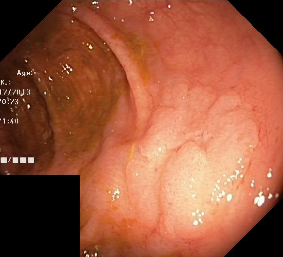 | 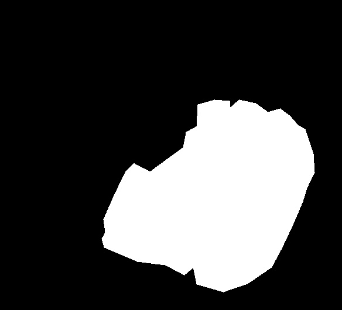 | 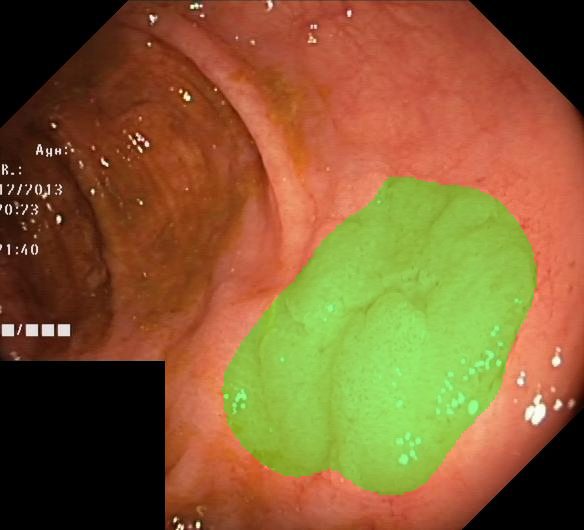 |

### Video Test — seq16 frames 32 & 33 (prompt: "medium round polyp")

(All 7 video-test sequences had been used as samples in earlier runs; for this
baseline a different frame range within seq16 was chosen.)

| Frame 1 (segmented) | Frame 2 (unused without correspondence) | Ground Truth (frame 1) | Prediction (overlay on frame 1) |
|---------------------|------------------------------------------|------------------------|---------------------------------|
| 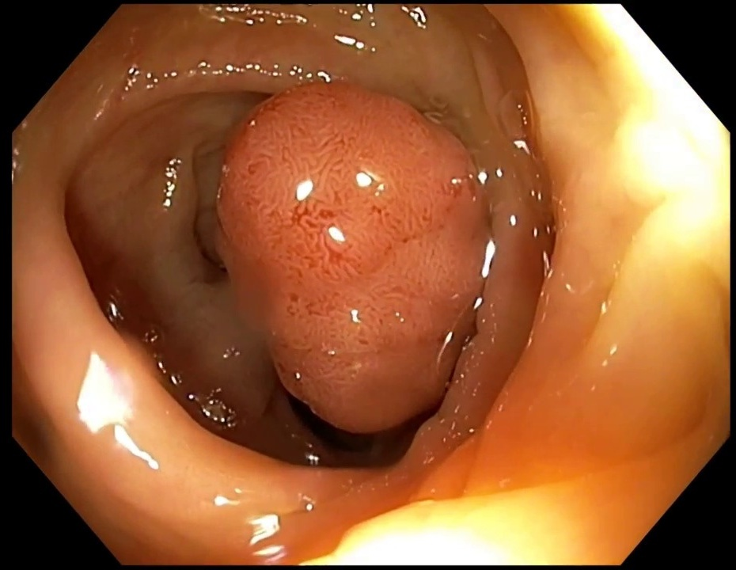 | 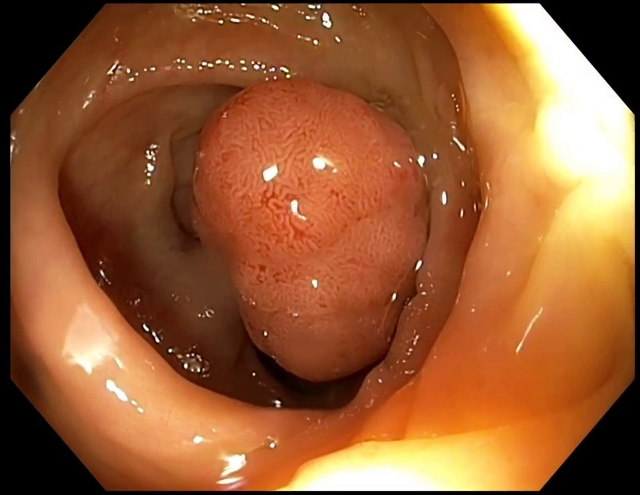 |  | 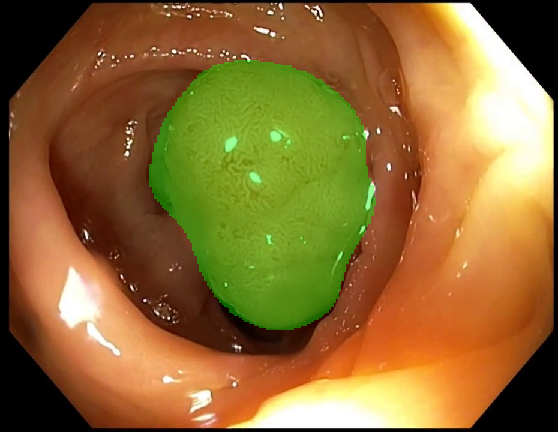 |

## Training Curves

Overview of the full run (best image-val Dice marked at epoch 49):

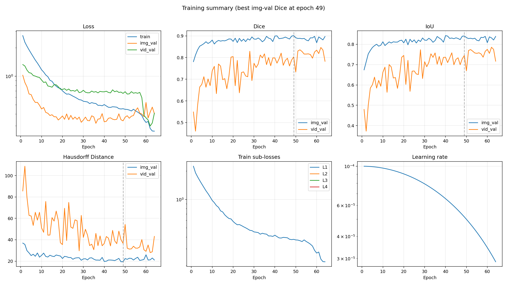

Individual plots:

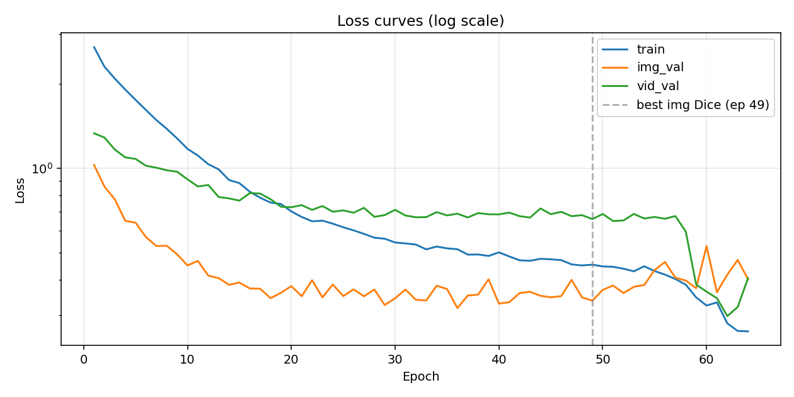


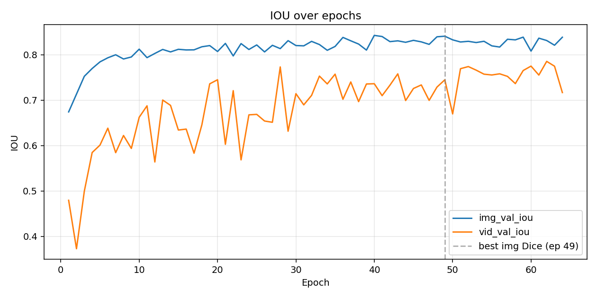

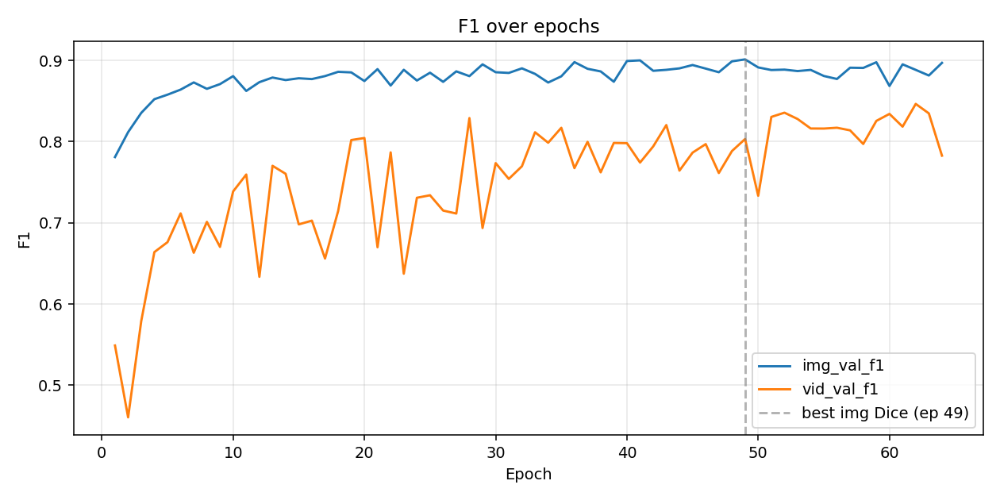

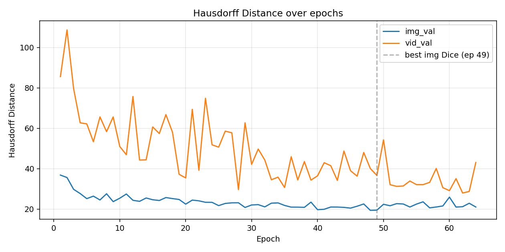

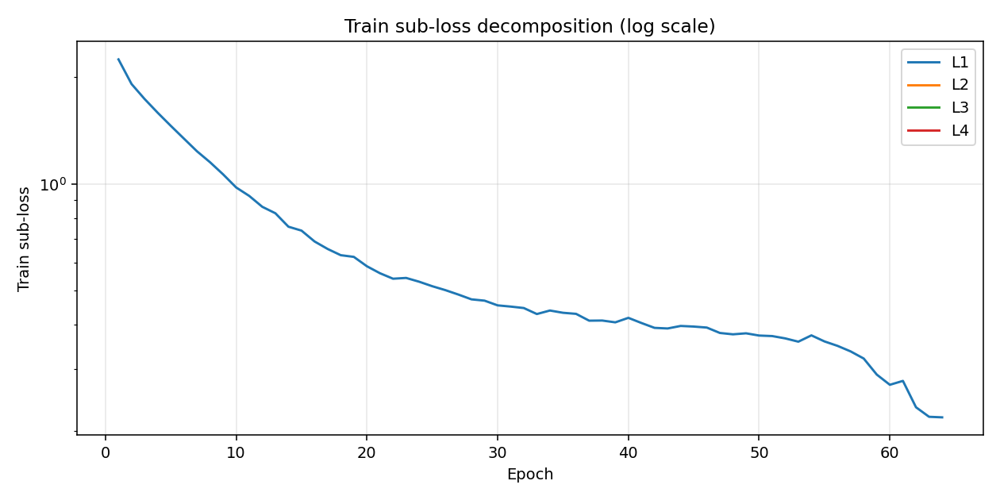

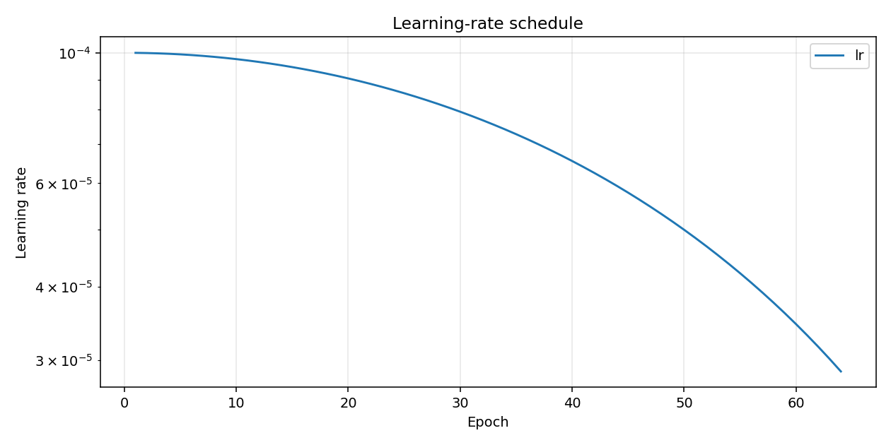

## Training Log

```
Epoch 001/100 (28.4s) | LR: 1.00e-04 | Train Loss: 2.6938 (L1: 2.2448)
  Img Val  | Loss: 1.0263 | Dice: 0.7810 | IoU: 0.6741 | F1: 0.7810 | HD: 36.88
  Vid Val  | Loss: 1.3304 | Dice: 0.5489 | IoU: 0.4795 | F1: 0.5489 | HD: 85.59
  -> New best model saved (Dice: 0.7810)
Epoch 002/100 (27.1s) | LR: 9.99e-05 | Train Loss: 2.2950 (L1: 1.9125)
  Img Val  | Loss: 0.8601 | Dice: 0.8117 | IoU: 0.7133 | F1: 0.8117 | HD: 35.66
  Vid Val  | Loss: 1.2846 | Dice: 0.4604 | IoU: 0.3728 | F1: 0.4604 | HD: 108.71
  -> New best model saved (Dice: 0.8117)
Epoch 003/100 (24.5s) | LR: 9.98e-05 | Train Loss: 2.0814 (L1: 1.7345)
  Img Val  | Loss: 0.7747 | Dice: 0.8354 | IoU: 0.7525 | F1: 0.8354 | HD: 29.82
  Vid Val  | Loss: 1.1644 | Dice: 0.5790 | IoU: 0.4996 | F1: 0.5790 | HD: 79.68
  -> New best model saved (Dice: 0.8354)
Epoch 004/100 (27.0s) | LR: 9.96e-05 | Train Loss: 1.9039 (L1: 1.5866)
  Img Val  | Loss: 0.6497 | Dice: 0.8523 | IoU: 0.7697 | F1: 0.8523 | HD: 27.71
  Vid Val  | Loss: 1.0925 | Dice: 0.6639 | IoU: 0.5846 | F1: 0.6639 | HD: 62.74
  -> New best model saved (Dice: 0.8523)
Epoch 005/100 (26.5s) | LR: 9.94e-05 | Train Loss: 1.7489 (L1: 1.4574)
  Img Val  | Loss: 0.6397 | Dice: 0.8578 | IoU: 0.7843 | F1: 0.8578 | HD: 25.21
  Vid Val  | Loss: 1.0785 | Dice: 0.6762 | IoU: 0.6010 | F1: 0.6762 | HD: 62.20
  -> New best model saved (Dice: 0.8578)
Epoch 006/100 (24.1s) | LR: 9.91e-05 | Train Loss: 1.6099 (L1: 1.3416)
  Img Val  | Loss: 0.5685 | Dice: 0.8641 | IoU: 0.7933 | F1: 0.8641 | HD: 26.45
  Vid Val  | Loss: 1.0198 | Dice: 0.7116 | IoU: 0.6383 | F1: 0.7116 | HD: 53.37
  -> New best model saved (Dice: 0.8641)
Epoch 007/100 (24.5s) | LR: 9.88e-05 | Train Loss: 1.4825 (L1: 1.2354)
  Img Val  | Loss: 0.5286 | Dice: 0.8729 | IoU: 0.7999 | F1: 0.8729 | HD: 24.55
  Vid Val  | Loss: 1.0038 | Dice: 0.6631 | IoU: 0.5844 | F1: 0.6631 | HD: 65.66
  -> New best model saved (Dice: 0.8729)
Epoch 008/100 (24.5s) | LR: 9.84e-05 | Train Loss: 1.3804 (L1: 1.1503)
  Img Val  | Loss: 0.5297 | Dice: 0.8650 | IoU: 0.7906 | F1: 0.8650 | HD: 27.62
  Vid Val  | Loss: 0.9829 | Dice: 0.7012 | IoU: 0.6222 | F1: 0.7012 | HD: 58.35
Epoch 009/100 (23.9s) | LR: 9.80e-05 | Train Loss: 1.2757 (L1: 1.0631)
  Img Val  | Loss: 0.4939 | Dice: 0.8708 | IoU: 0.7951 | F1: 0.8708 | HD: 23.72
  Vid Val  | Loss: 0.9711 | Dice: 0.6704 | IoU: 0.5936 | F1: 0.6704 | HD: 65.65
Epoch 010/100 (23.3s) | LR: 9.76e-05 | Train Loss: 1.1714 (L1: 0.9762)
  Img Val  | Loss: 0.4510 | Dice: 0.8807 | IoU: 0.8122 | F1: 0.8807 | HD: 25.42
  Vid Val  | Loss: 0.9128 | Dice: 0.7386 | IoU: 0.6622 | F1: 0.7386 | HD: 51.03
  -> New best model saved (Dice: 0.8807)
Epoch 011/100 (24.1s) | LR: 9.70e-05 | Train Loss: 1.1087 (L1: 0.9239)
  Img Val  | Loss: 0.4679 | Dice: 0.8624 | IoU: 0.7936 | F1: 0.8624 | HD: 27.50
  Vid Val  | Loss: 0.8605 | Dice: 0.7595 | IoU: 0.6875 | F1: 0.7595 | HD: 46.94
Epoch 012/100 (24.6s) | LR: 9.65e-05 | Train Loss: 1.0329 (L1: 0.8608)
  Img Val  | Loss: 0.4148 | Dice: 0.8732 | IoU: 0.8028 | F1: 0.8732 | HD: 24.40
  Vid Val  | Loss: 0.8713 | Dice: 0.6335 | IoU: 0.5638 | F1: 0.6335 | HD: 75.78
Epoch 013/100 (24.6s) | LR: 9.59e-05 | Train Loss: 0.9905 (L1: 0.8254)
  Img Val  | Loss: 0.4064 | Dice: 0.8789 | IoU: 0.8116 | F1: 0.8789 | HD: 23.87
  Vid Val  | Loss: 0.7898 | Dice: 0.7702 | IoU: 0.7002 | F1: 0.7702 | HD: 44.31
Epoch 014/100 (24.6s) | LR: 9.52e-05 | Train Loss: 0.9076 (L1: 0.7563)
  Img Val  | Loss: 0.3847 | Dice: 0.8758 | IoU: 0.8062 | F1: 0.8758 | HD: 25.53
  Vid Val  | Loss: 0.7806 | Dice: 0.7604 | IoU: 0.6885 | F1: 0.7604 | HD: 44.42
Epoch 015/100 (23.3s) | LR: 9.46e-05 | Train Loss: 0.8847 (L1: 0.7373)
  Img Val  | Loss: 0.3917 | Dice: 0.8780 | IoU: 0.8119 | F1: 0.8780 | HD: 24.66
  Vid Val  | Loss: 0.7666 | Dice: 0.6981 | IoU: 0.6341 | F1: 0.6981 | HD: 60.69
Epoch 016/100 (23.6s) | LR: 9.38e-05 | Train Loss: 0.8244 (L1: 0.6870)
  Img Val  | Loss: 0.3734 | Dice: 0.8770 | IoU: 0.8105 | F1: 0.8770 | HD: 24.29
  Vid Val  | Loss: 0.8154 | Dice: 0.7027 | IoU: 0.6363 | F1: 0.7027 | HD: 57.42
Epoch 017/100 (24.7s) | LR: 9.30e-05 | Train Loss: 0.7852 (L1: 0.6543)
  Img Val  | Loss: 0.3726 | Dice: 0.8807 | IoU: 0.8108 | F1: 0.8807 | HD: 25.75
  Vid Val  | Loss: 0.8122 | Dice: 0.6560 | IoU: 0.5831 | F1: 0.6560 | HD: 66.79
  -> New best model saved (Dice: 0.8807)
Epoch 018/100 (23.8s) | LR: 9.22e-05 | Train Loss: 0.7541 (L1: 0.6285)
  Img Val  | Loss: 0.3447 | Dice: 0.8860 | IoU: 0.8175 | F1: 0.8860 | HD: 25.24
  Vid Val  | Loss: 0.7757 | Dice: 0.7146 | IoU: 0.6457 | F1: 0.7146 | HD: 58.06
  -> New best model saved (Dice: 0.8860)
Epoch 019/100 (23.6s) | LR: 9.14e-05 | Train Loss: 0.7459 (L1: 0.6216)
  Img Val  | Loss: 0.3603 | Dice: 0.8853 | IoU: 0.8201 | F1: 0.8853 | HD: 24.80
  Vid Val  | Loss: 0.7293 | Dice: 0.8020 | IoU: 0.7359 | F1: 0.8020 | HD: 37.27
Epoch 020/100 (23.6s) | LR: 9.05e-05 | Train Loss: 0.7018 (L1: 0.5849)
  Img Val  | Loss: 0.3805 | Dice: 0.8746 | IoU: 0.8071 | F1: 0.8746 | HD: 22.49
  Vid Val  | Loss: 0.7261 | Dice: 0.8044 | IoU: 0.7449 | F1: 0.8044 | HD: 35.46
Epoch 021/100 (24.4s) | LR: 8.95e-05 | Train Loss: 0.6707 (L1: 0.5589)
  Img Val  | Loss: 0.3505 | Dice: 0.8893 | IoU: 0.8249 | F1: 0.8893 | HD: 24.49
  Vid Val  | Loss: 0.7386 | Dice: 0.6699 | IoU: 0.6027 | F1: 0.6699 | HD: 69.40
  -> New best model saved (Dice: 0.8893)
Epoch 022/100 (24.4s) | LR: 8.85e-05 | Train Loss: 0.6472 (L1: 0.5393)
  Img Val  | Loss: 0.3994 | Dice: 0.8691 | IoU: 0.7974 | F1: 0.8691 | HD: 24.13
  Vid Val  | Loss: 0.7106 | Dice: 0.7867 | IoU: 0.7209 | F1: 0.7867 | HD: 39.23
Epoch 023/100 (23.1s) | LR: 8.75e-05 | Train Loss: 0.6505 (L1: 0.5421)
  Img Val  | Loss: 0.3471 | Dice: 0.8885 | IoU: 0.8245 | F1: 0.8885 | HD: 23.41
  Vid Val  | Loss: 0.7334 | Dice: 0.6373 | IoU: 0.5685 | F1: 0.6373 | HD: 74.88
Epoch 024/100 (23.6s) | LR: 8.64e-05 | Train Loss: 0.6346 (L1: 0.5288)
  Img Val  | Loss: 0.3857 | Dice: 0.8753 | IoU: 0.8115 | F1: 0.8753 | HD: 23.38
  Vid Val  | Loss: 0.7000 | Dice: 0.7309 | IoU: 0.6676 | F1: 0.7309 | HD: 51.85
Epoch 025/100 (23.1s) | LR: 8.54e-05 | Train Loss: 0.6164 (L1: 0.5136)
  Img Val  | Loss: 0.3508 | Dice: 0.8849 | IoU: 0.8215 | F1: 0.8849 | HD: 21.76
  Vid Val  | Loss: 0.7075 | Dice: 0.7339 | IoU: 0.6687 | F1: 0.7339 | HD: 50.68
Epoch 026/100 (25.5s) | LR: 8.42e-05 | Train Loss: 0.6009 (L1: 0.5008)
  Img Val  | Loss: 0.3706 | Dice: 0.8736 | IoU: 0.8062 | F1: 0.8736 | HD: 22.84
  Vid Val  | Loss: 0.6945 | Dice: 0.7151 | IoU: 0.6540 | F1: 0.7151 | HD: 58.61
Epoch 027/100 (24.3s) | LR: 8.31e-05 | Train Loss: 0.5838 (L1: 0.4865)
  Img Val  | Loss: 0.3502 | Dice: 0.8865 | IoU: 0.8207 | F1: 0.8865 | HD: 23.14
  Vid Val  | Loss: 0.7227 | Dice: 0.7114 | IoU: 0.6512 | F1: 0.7114 | HD: 57.81
Epoch 028/100 (25.1s) | LR: 8.19e-05 | Train Loss: 0.5659 (L1: 0.4716)
  Img Val  | Loss: 0.3701 | Dice: 0.8806 | IoU: 0.8134 | F1: 0.8806 | HD: 23.17
  Vid Val  | Loss: 0.6714 | Dice: 0.8290 | IoU: 0.7731 | F1: 0.8290 | HD: 29.65
Epoch 029/100 (24.5s) | LR: 8.06e-05 | Train Loss: 0.5611 (L1: 0.4676)
  Img Val  | Loss: 0.3260 | Dice: 0.8952 | IoU: 0.8310 | F1: 0.8952 | HD: 20.84
  Vid Val  | Loss: 0.6808 | Dice: 0.6936 | IoU: 0.6315 | F1: 0.6936 | HD: 62.73
  -> New best model saved (Dice: 0.8952)
Epoch 030/100 (25.2s) | LR: 7.94e-05 | Train Loss: 0.5442 (L1: 0.4535)
  Img Val  | Loss: 0.3446 | Dice: 0.8855 | IoU: 0.8202 | F1: 0.8855 | HD: 22.08
  Vid Val  | Loss: 0.7110 | Dice: 0.7735 | IoU: 0.7142 | F1: 0.7735 | HD: 42.17
Epoch 031/100 (25.4s) | LR: 7.81e-05 | Train Loss: 0.5399 (L1: 0.4499)
  Img Val  | Loss: 0.3702 | Dice: 0.8846 | IoU: 0.8195 | F1: 0.8846 | HD: 22.24
  Vid Val  | Loss: 0.6783 | Dice: 0.7541 | IoU: 0.6896 | F1: 0.7541 | HD: 49.76
Epoch 032/100 (23.9s) | LR: 7.68e-05 | Train Loss: 0.5349 (L1: 0.4457)
  Img Val  | Loss: 0.3404 | Dice: 0.8903 | IoU: 0.8294 | F1: 0.8903 | HD: 21.13
  Vid Val  | Loss: 0.6689 | Dice: 0.7697 | IoU: 0.7105 | F1: 0.7697 | HD: 44.30
Epoch 033/100 (23.9s) | LR: 7.55e-05 | Train Loss: 0.5144 (L1: 0.4287)
  Img Val  | Loss: 0.3385 | Dice: 0.8834 | IoU: 0.8224 | F1: 0.8834 | HD: 22.97
  Vid Val  | Loss: 0.6696 | Dice: 0.8115 | IoU: 0.7529 | F1: 0.8115 | HD: 34.54
Epoch 034/100 (25.4s) | LR: 7.41e-05 | Train Loss: 0.5263 (L1: 0.4386)
  Img Val  | Loss: 0.3819 | Dice: 0.8728 | IoU: 0.8098 | F1: 0.8728 | HD: 23.11
  Vid Val  | Loss: 0.6979 | Dice: 0.7986 | IoU: 0.7357 | F1: 0.7986 | HD: 35.85
Epoch 035/100 (25.1s) | LR: 7.27e-05 | Train Loss: 0.5186 (L1: 0.4322)
  Img Val  | Loss: 0.3719 | Dice: 0.8804 | IoU: 0.8182 | F1: 0.8804 | HD: 21.85
  Vid Val  | Loss: 0.6793 | Dice: 0.8171 | IoU: 0.7572 | F1: 0.8171 | HD: 30.70
Epoch 036/100 (24.7s) | LR: 7.13e-05 | Train Loss: 0.5150 (L1: 0.4292)
  Img Val  | Loss: 0.3180 | Dice: 0.8979 | IoU: 0.8381 | F1: 0.8979 | HD: 21.01
  Vid Val  | Loss: 0.6888 | Dice: 0.7674 | IoU: 0.7019 | F1: 0.7674 | HD: 45.93
  -> New best model saved (Dice: 0.8979)
Epoch 037/100 (25.1s) | LR: 6.99e-05 | Train Loss: 0.4926 (L1: 0.4105)
  Img Val  | Loss: 0.3524 | Dice: 0.8897 | IoU: 0.8307 | F1: 0.8897 | HD: 21.00
  Vid Val  | Loss: 0.6678 | Dice: 0.7998 | IoU: 0.7401 | F1: 0.7998 | HD: 34.45
Epoch 038/100 (25.0s) | LR: 6.84e-05 | Train Loss: 0.4931 (L1: 0.4109)
  Img Val  | Loss: 0.3551 | Dice: 0.8865 | IoU: 0.8235 | F1: 0.8865 | HD: 20.90
  Vid Val  | Loss: 0.6922 | Dice: 0.7622 | IoU: 0.6967 | F1: 0.7622 | HD: 43.56
Epoch 039/100 (24.4s) | LR: 6.69e-05 | Train Loss: 0.4873 (L1: 0.4061)
  Img Val  | Loss: 0.4026 | Dice: 0.8738 | IoU: 0.8102 | F1: 0.8738 | HD: 23.49
  Vid Val  | Loss: 0.6855 | Dice: 0.7984 | IoU: 0.7356 | F1: 0.7984 | HD: 34.37
Epoch 040/100 (25.0s) | LR: 6.55e-05 | Train Loss: 0.5018 (L1: 0.4181)
  Img Val  | Loss: 0.3298 | Dice: 0.8993 | IoU: 0.8426 | F1: 0.8993 | HD: 19.75
  Vid Val  | Loss: 0.6849 | Dice: 0.7981 | IoU: 0.7362 | F1: 0.7981 | HD: 36.50
  -> New best model saved (Dice: 0.8993)
Epoch 041/100 (24.8s) | LR: 6.39e-05 | Train Loss: 0.4853 (L1: 0.4044)
  Img Val  | Loss: 0.3339 | Dice: 0.9001 | IoU: 0.8401 | F1: 0.9001 | HD: 19.95
  Vid Val  | Loss: 0.6949 | Dice: 0.7742 | IoU: 0.7099 | F1: 0.7742 | HD: 42.99
  -> New best model saved (Dice: 0.9001)
Epoch 042/100 (24.8s) | LR: 6.24e-05 | Train Loss: 0.4702 (L1: 0.3918)
  Img Val  | Loss: 0.3596 | Dice: 0.8872 | IoU: 0.8288 | F1: 0.8872 | HD: 21.06
  Vid Val  | Loss: 0.6748 | Dice: 0.7941 | IoU: 0.7330 | F1: 0.7941 | HD: 41.53
Epoch 043/100 (25.2s) | LR: 6.09e-05 | Train Loss: 0.4683 (L1: 0.3902)
  Img Val  | Loss: 0.3635 | Dice: 0.8884 | IoU: 0.8306 | F1: 0.8884 | HD: 21.04
  Vid Val  | Loss: 0.6671 | Dice: 0.8204 | IoU: 0.7579 | F1: 0.8204 | HD: 34.23
Epoch 044/100 (25.4s) | LR: 5.94e-05 | Train Loss: 0.4760 (L1: 0.3967)
  Img Val  | Loss: 0.3517 | Dice: 0.8902 | IoU: 0.8274 | F1: 0.8902 | HD: 20.88
  Vid Val  | Loss: 0.7190 | Dice: 0.7643 | IoU: 0.6991 | F1: 0.7643 | HD: 48.76
Epoch 045/100 (24.9s) | LR: 5.78e-05 | Train Loss: 0.4741 (L1: 0.3951)
  Img Val  | Loss: 0.3473 | Dice: 0.8943 | IoU: 0.8317 | F1: 0.8943 | HD: 20.53
  Vid Val  | Loss: 0.6859 | Dice: 0.7864 | IoU: 0.7257 | F1: 0.7864 | HD: 39.02
Epoch 046/100 (24.8s) | LR: 5.63e-05 | Train Loss: 0.4711 (L1: 0.3925)
  Img Val  | Loss: 0.3507 | Dice: 0.8900 | IoU: 0.8283 | F1: 0.8900 | HD: 21.45
  Vid Val  | Loss: 0.6994 | Dice: 0.7969 | IoU: 0.7335 | F1: 0.7969 | HD: 36.33
Epoch 047/100 (24.5s) | LR: 5.47e-05 | Train Loss: 0.4548 (L1: 0.3790)
  Img Val  | Loss: 0.4007 | Dice: 0.8855 | IoU: 0.8228 | F1: 0.8855 | HD: 22.58
  Vid Val  | Loss: 0.6748 | Dice: 0.7613 | IoU: 0.6994 | F1: 0.7613 | HD: 48.06
Epoch 048/100 (24.9s) | LR: 5.31e-05 | Train Loss: 0.4508 (L1: 0.3757)
  Img Val  | Loss: 0.3472 | Dice: 0.8989 | IoU: 0.8395 | F1: 0.8989 | HD: 19.42
  Vid Val  | Loss: 0.6806 | Dice: 0.7884 | IoU: 0.7288 | F1: 0.7884 | HD: 40.11
Epoch 049/100 (24.2s) | LR: 5.16e-05 | Train Loss: 0.4538 (L1: 0.3781)
  Img Val  | Loss: 0.3378 | Dice: 0.9013 | IoU: 0.8408 | F1: 0.9013 | HD: 19.52
  Vid Val  | Loss: 0.6591 | Dice: 0.8032 | IoU: 0.7447 | F1: 0.8032 | HD: 36.69
  -> New best model saved (Dice: 0.9013)
Epoch 050/100 (24.2s) | LR: 5.00e-05 | Train Loss: 0.4472 (L1: 0.3727)
  Img Val  | Loss: 0.3690 | Dice: 0.8914 | IoU: 0.8328 | F1: 0.8914 | HD: 22.42
  Vid Val  | Loss: 0.6869 | Dice: 0.7333 | IoU: 0.6697 | F1: 0.7333 | HD: 54.30
Epoch 051/100 (24.3s) | LR: 4.84e-05 | Train Loss: 0.4457 (L1: 0.3714)
  Img Val  | Loss: 0.3825 | Dice: 0.8882 | IoU: 0.8281 | F1: 0.8882 | HD: 21.70
  Vid Val  | Loss: 0.6487 | Dice: 0.8304 | IoU: 0.7693 | F1: 0.8304 | HD: 32.10
Epoch 052/100 (24.8s) | LR: 4.69e-05 | Train Loss: 0.4390 (L1: 0.3658)
  Img Val  | Loss: 0.3597 | Dice: 0.8887 | IoU: 0.8295 | F1: 0.8887 | HD: 22.74
  Vid Val  | Loss: 0.6516 | Dice: 0.8357 | IoU: 0.7739 | F1: 0.8357 | HD: 31.28
Epoch 053/100 (24.3s) | LR: 4.53e-05 | Train Loss: 0.4298 (L1: 0.3581)
  Img Val  | Loss: 0.3783 | Dice: 0.8869 | IoU: 0.8268 | F1: 0.8869 | HD: 22.56
  Vid Val  | Loss: 0.6874 | Dice: 0.8279 | IoU: 0.7660 | F1: 0.8279 | HD: 31.48
Epoch 054/100 (23.9s) | LR: 4.37e-05 | Train Loss: 0.4478 (L1: 0.3731)
  Img Val  | Loss: 0.3843 | Dice: 0.8883 | IoU: 0.8296 | F1: 0.8883 | HD: 21.06
  Vid Val  | Loss: 0.6621 | Dice: 0.8162 | IoU: 0.7572 | F1: 0.8162 | HD: 33.94
Epoch 055/100 (24.6s) | LR: 4.22e-05 | Train Loss: 0.4305 (L1: 0.3587)
  Img Val  | Loss: 0.4344 | Dice: 0.8808 | IoU: 0.8195 | F1: 0.8808 | HD: 22.51
  Vid Val  | Loss: 0.6705 | Dice: 0.8161 | IoU: 0.7554 | F1: 0.8161 | HD: 32.15
Epoch 056/100 (23.7s) | LR: 4.06e-05 | Train Loss: 0.4182 (L1: 0.3485)
  Img Val  | Loss: 0.4640 | Dice: 0.8772 | IoU: 0.8169 | F1: 0.8772 | HD: 23.64
  Vid Val  | Loss: 0.6608 | Dice: 0.8171 | IoU: 0.7580 | F1: 0.8171 | HD: 32.14
Epoch 057/100 (23.9s) | LR: 3.91e-05 | Train Loss: 0.4034 (L1: 0.3362)
  Img Val  | Loss: 0.4076 | Dice: 0.8910 | IoU: 0.8341 | F1: 0.8910 | HD: 20.66
  Vid Val  | Loss: 0.6754 | Dice: 0.8139 | IoU: 0.7523 | F1: 0.8139 | HD: 33.26
Epoch 058/100 (24.2s) | LR: 3.76e-05 | Train Loss: 0.3852 (L1: 0.3210)
  Img Val  | Loss: 0.3983 | Dice: 0.8908 | IoU: 0.8327 | F1: 0.8908 | HD: 21.08
  Vid Val  | Loss: 0.5948 | Dice: 0.7971 | IoU: 0.7364 | F1: 0.7971 | HD: 40.15
Epoch 059/100 (24.7s) | LR: 3.61e-05 | Train Loss: 0.3470 (L1: 0.2892)
  Img Val  | Loss: 0.3741 | Dice: 0.8978 | IoU: 0.8387 | F1: 0.8978 | HD: 21.59
  Vid Val  | Loss: 0.3854 | Dice: 0.8255 | IoU: 0.7652 | F1: 0.8255 | HD: 30.64
Epoch 060/100 (23.4s) | LR: 3.45e-05 | Train Loss: 0.3247 (L1: 0.2706)
  Img Val  | Loss: 0.5285 | Dice: 0.8685 | IoU: 0.8080 | F1: 0.8685 | HD: 25.96
  Vid Val  | Loss: 0.3637 | Dice: 0.8341 | IoU: 0.7750 | F1: 0.8341 | HD: 29.16
Epoch 061/100 (24.7s) | LR: 3.31e-05 | Train Loss: 0.3330 (L1: 0.2775)
  Img Val  | Loss: 0.3619 | Dice: 0.8952 | IoU: 0.8365 | F1: 0.8952 | HD: 21.04
  Vid Val  | Loss: 0.3448 | Dice: 0.8184 | IoU: 0.7552 | F1: 0.8184 | HD: 35.11
Epoch 062/100 (24.7s) | LR: 3.16e-05 | Train Loss: 0.2806 (L1: 0.2338)
  Img Val  | Loss: 0.4180 | Dice: 0.8884 | IoU: 0.8313 | F1: 0.8884 | HD: 21.23
  Vid Val  | Loss: 0.2979 | Dice: 0.8465 | IoU: 0.7853 | F1: 0.8465 | HD: 27.98
Epoch 063/100 (24.5s) | LR: 3.01e-05 | Train Loss: 0.2637 (L1: 0.2198)
  Img Val  | Loss: 0.4717 | Dice: 0.8814 | IoU: 0.8209 | F1: 0.8814 | HD: 22.93
  Vid Val  | Loss: 0.3206 | Dice: 0.8348 | IoU: 0.7747 | F1: 0.8348 | HD: 28.76
Epoch 064/100 (24.6s) | LR: 2.87e-05 | Train Loss: 0.2628 (L1: 0.2190)
  Img Val  | Loss: 0.4024 | Dice: 0.8970 | IoU: 0.8385 | F1: 0.8970 | HD: 21.07
  Vid Val  | Loss: 0.4066 | Dice: 0.7827 | IoU: 0.7167 | F1: 0.7827 | HD: 43.13

Early stopping: Val Dice did not improve for 15 epochs.

Training complete. Best validation Dice: 0.9013```
