# Results — Baseline (Inception v3 encoder, no PGA / correspondence / text encoder)

**Ablation baseline.** Configuration: `configs/config_baseline_no_modules.yaml`.
Encoder -> UNet decoder only. No prompt-guided attention, no cross-frame
correspondence, no BioMed CLIP text encoder. Loss = L1 (Dice + BCE) only;
L2/L3/L4 disabled (lambda_2 = lambda_3 = lambda_4 = 0).
Training stopped early at epoch 57 (no Val Dice improvement for 15 epochs after epoch 42).

## Dataset: Image Segmentation + Video Segmentation Dataset

| Split | Image seg | Video seg  |
|-------|-----------|------------|
| Train | 800       | 934 pairs  |
| Val   | 100       | 259 pairs  |
| Test  | 100       | 1009 pairs |

**Trainable params:** 36,340,001 / **Total:** 36,340,001
(All trainable: BioMed CLIP text encoder is absent in the baseline, so no frozen params.)

## Test Results

### Image Test (100 images)

| Metric | Value |
|--------|-------|
| Dice | 0.8764 |
| IoU | 0.8083 |
| F1 | 0.8764 |
| Hausdorff Distance | 23.45 |
| Loss | 0.3125 |

### Video Test (1009 pairs)

| Metric | Value |
|--------|-------|
| Dice | 0.5638 |
| IoU | 0.5138 |
| F1 | 0.5638 |
| Hausdorff Distance | 80.21 |
| Loss | 0.9805 |

**Best validation Dice:** 0.8893 (epoch 42)

## Comparison vs Full Inception-v3 (with PGA + Correspondence + BioMed CLIP)

| Setting | Img Dice | Img IoU | Img HD | Vid Dice | Vid IoU | Vid HD | Best val Dice |
|---|---:|---:|---:|---:|---:|---:|---:|
| **Baseline (this run)** | 0.8764 | 0.8083 | 23.45 | 0.5638 | 0.5138 | 80.21 | 0.8893 |
| Full pipeline | 0.8886 | 0.8110 | 22.66 | 0.6775 | 0.6069 | 47.46 | 0.9075 |

Adding the prompt-guided attention, cross-frame correspondence, and VL-aligned losses
contributes roughly +1.2 Dice on image test and +11.4 Dice on video test, with a large
drop in video Hausdorff distance (80.21 -> 47.46) — the cross-frame correspondence
module clearly helps on the temporal task.

## Qualitative Predictions

Predictions from the best baseline checkpoint on one held-out test sample from each dataset. Overlay shows the predicted mask in green at threshold 0.5. Note: prompts are stored alongside each sample but the baseline does not consume them.

### Image Test — `cju41lojblbs307555jdci937.jpg` (prompt: "medium round polyp")

| Input | Ground Truth | Prediction (overlay) |
|-------|--------------|----------------------|
| 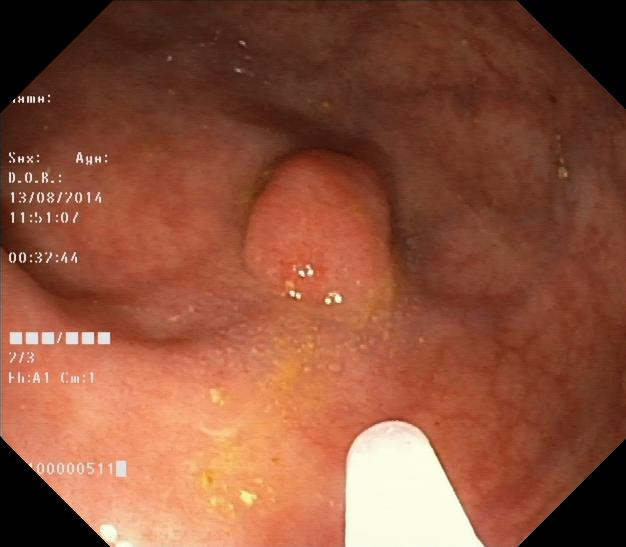 | 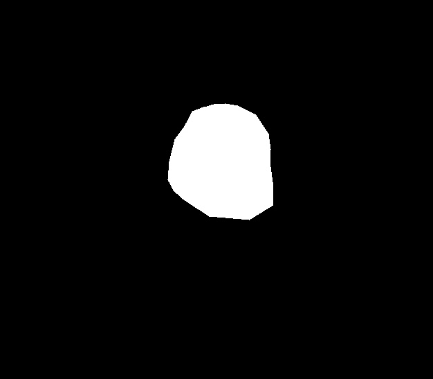 | 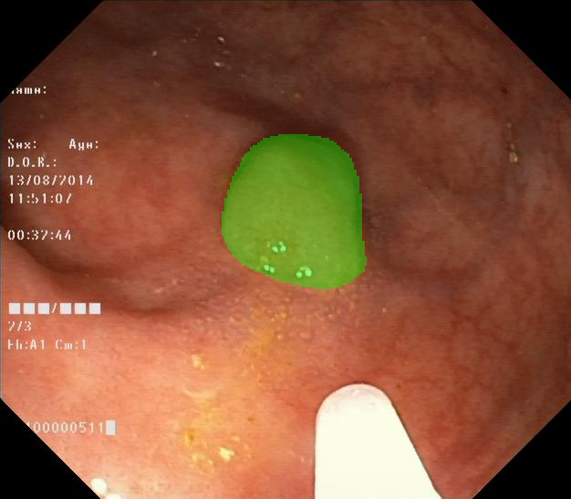 |

### Video Test — seq13 frames 1 & 2 (prompt: "small irregular polyp")

| Frame 1 (segmented) | Frame 2 (unused without correspondence) | Ground Truth (frame 1) | Prediction (overlay on frame 1) |
|---------------------|------------------------------------------|------------------------|---------------------------------|
| 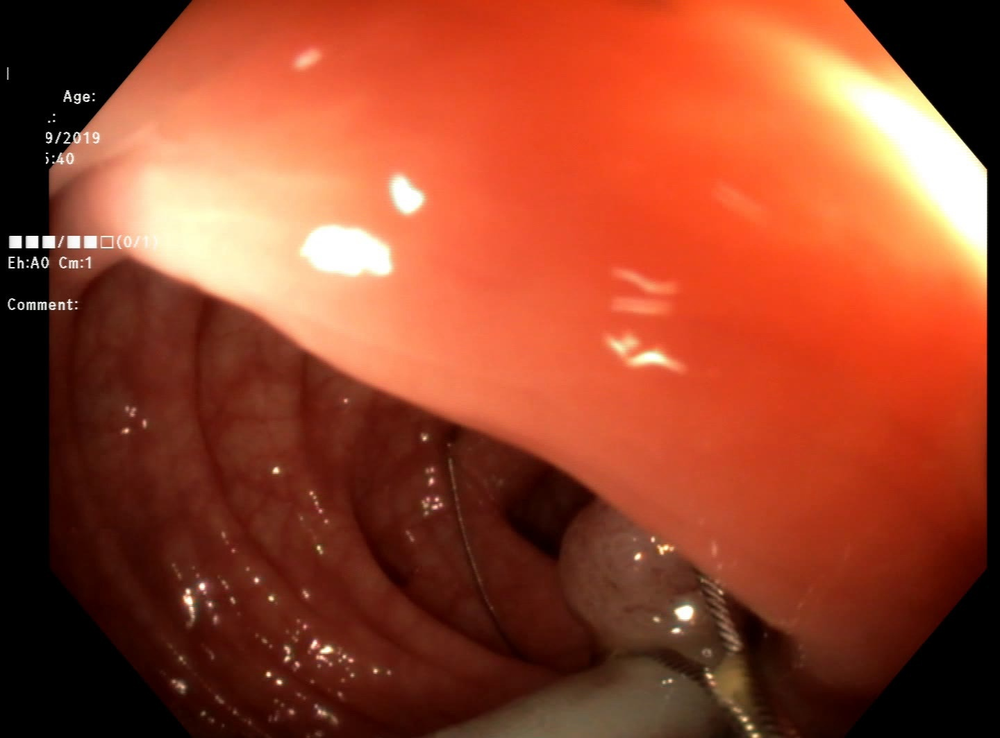 | 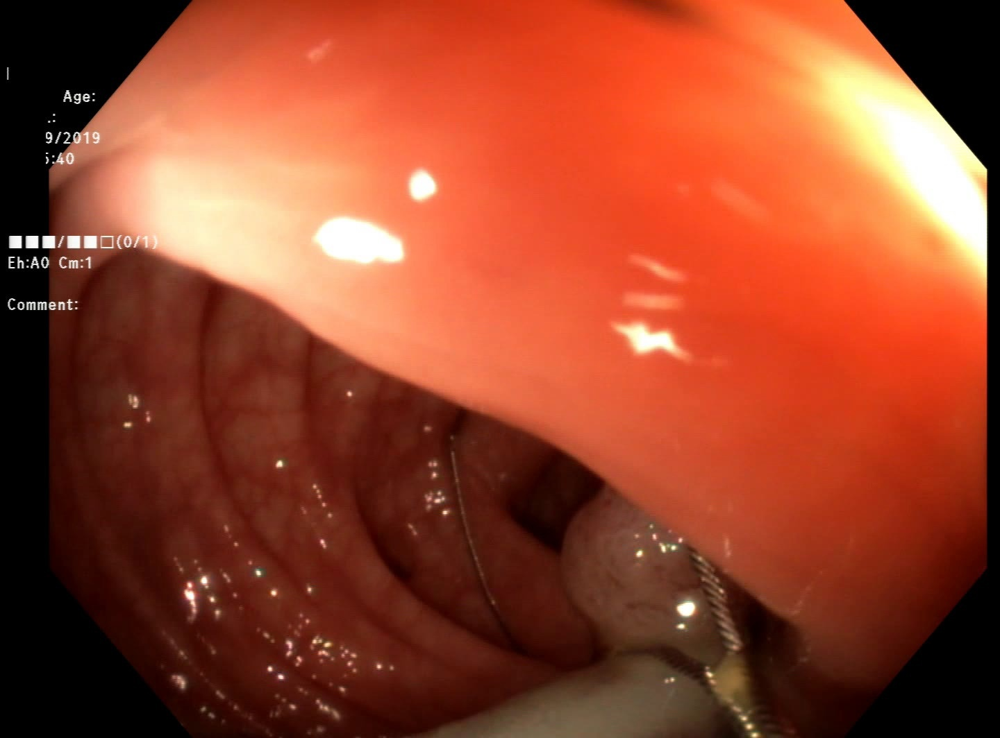 |  | 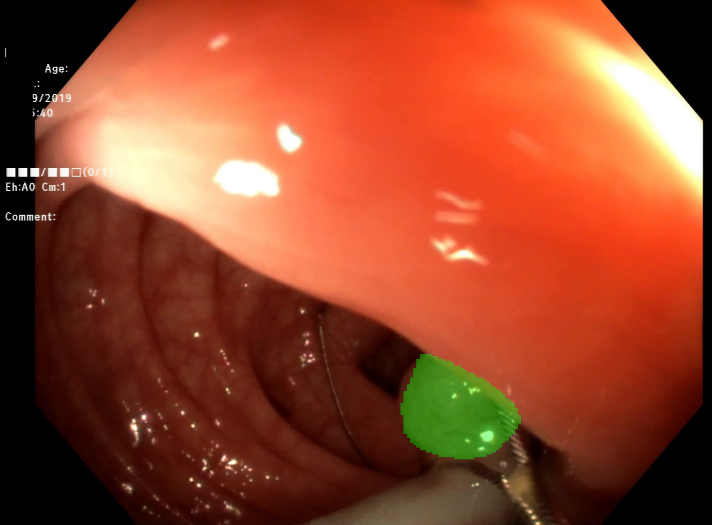 |

## Training Curves

Overview of the full run (best image-val Dice marked at epoch 42):

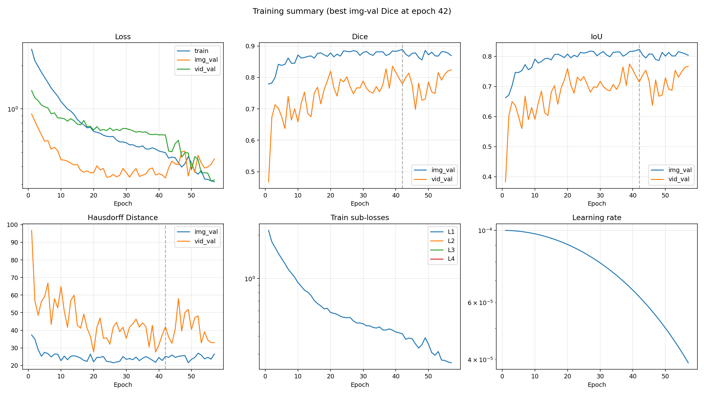

Individual plots:

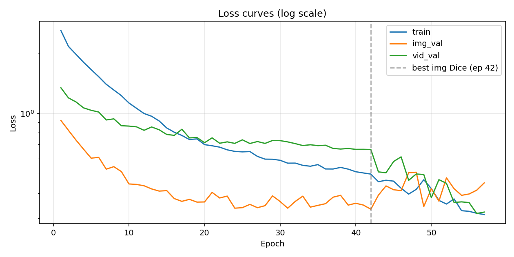

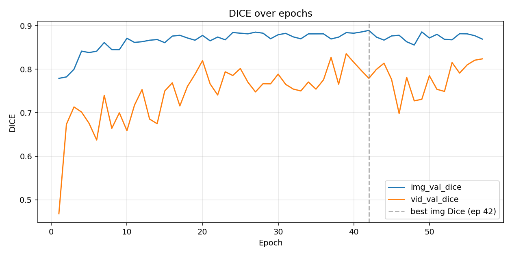

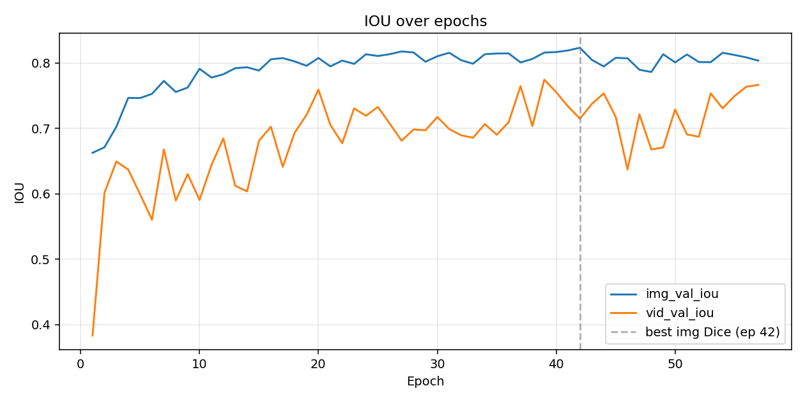

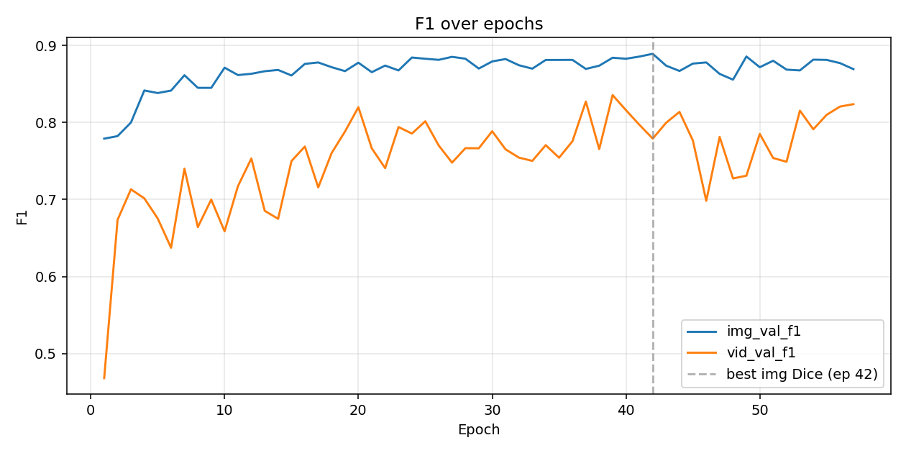

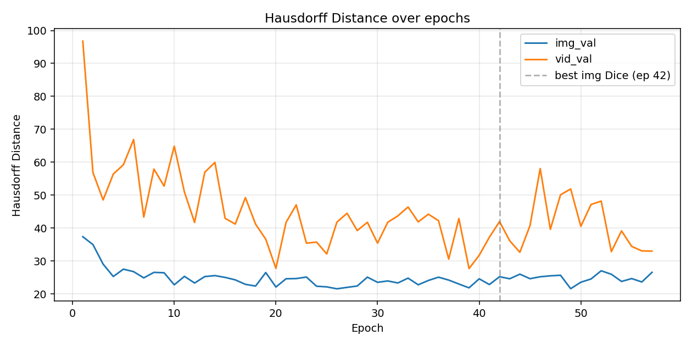

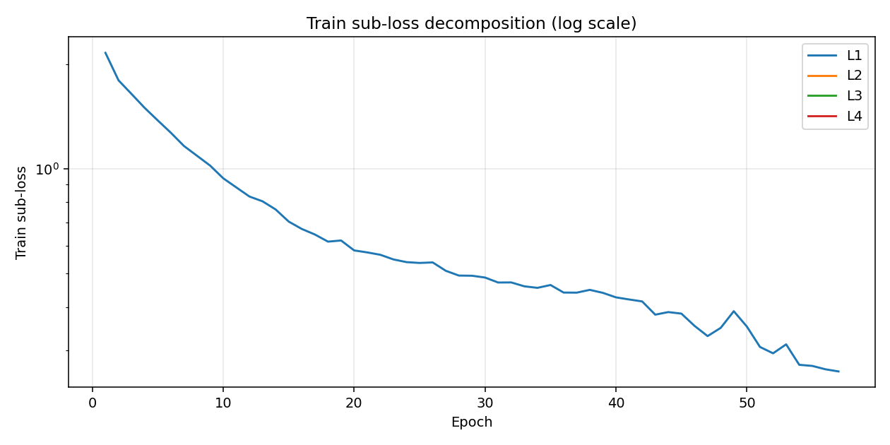

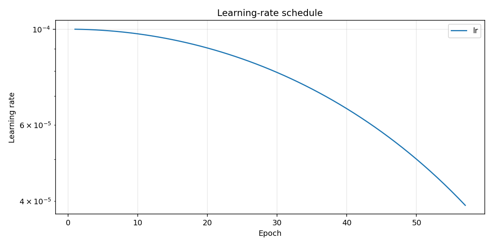

## Training Log

```
Epoch 001/100 (25.8s) | LR: 1.00e-04 | Train Loss: 2.5835 (L1: 2.1529)
  Img Val  | Loss: 0.9220 | Dice: 0.7791 | IoU: 0.6627 | F1: 0.7791 | HD: 37.35
  Vid Val  | Loss: 1.3399 | Dice: 0.4679 | IoU: 0.3835 | F1: 0.4679 | HD: 96.78
  -> New best model saved (Dice: 0.7791)
Epoch 002/100 (24.9s) | LR: 9.99e-05 | Train Loss: 2.1530 (L1: 1.7942)
  Img Val  | Loss: 0.8224 | Dice: 0.7824 | IoU: 0.6711 | F1: 0.7824 | HD: 34.96
  Vid Val  | Loss: 1.1934 | Dice: 0.6736 | IoU: 0.6014 | F1: 0.6736 | HD: 56.84
  -> New best model saved (Dice: 0.7824)
Epoch 003/100 (23.7s) | LR: 9.98e-05 | Train Loss: 1.9662 (L1: 1.6385)
  Img Val  | Loss: 0.7354 | Dice: 0.8000 | IoU: 0.7025 | F1: 0.8000 | HD: 29.02
  Vid Val  | Loss: 1.1388 | Dice: 0.7133 | IoU: 0.6495 | F1: 0.7133 | HD: 48.53
  -> New best model saved (Dice: 0.8000)
Epoch 004/100 (22.8s) | LR: 9.96e-05 | Train Loss: 1.7936 (L1: 1.4947)
  Img Val  | Loss: 0.6624 | Dice: 0.8417 | IoU: 0.7467 | F1: 0.8417 | HD: 25.27
  Vid Val  | Loss: 1.0643 | Dice: 0.7015 | IoU: 0.6369 | F1: 0.7015 | HD: 56.37
  -> New best model saved (Dice: 0.8417)
Epoch 005/100 (23.2s) | LR: 9.94e-05 | Train Loss: 1.6509 (L1: 1.3758)
  Img Val  | Loss: 0.5979 | Dice: 0.8384 | IoU: 0.7463 | F1: 0.8384 | HD: 27.49
  Vid Val  | Loss: 1.0350 | Dice: 0.6754 | IoU: 0.5993 | F1: 0.6754 | HD: 59.25
Epoch 006/100 (23.7s) | LR: 9.91e-05 | Train Loss: 1.5217 (L1: 1.2681)
  Img Val  | Loss: 0.6033 | Dice: 0.8416 | IoU: 0.7528 | F1: 0.8416 | HD: 26.74
  Vid Val  | Loss: 1.0147 | Dice: 0.6373 | IoU: 0.5603 | F1: 0.6373 | HD: 66.87
Epoch 007/100 (22.8s) | LR: 9.88e-05 | Train Loss: 1.3940 (L1: 1.1617)
  Img Val  | Loss: 0.5272 | Dice: 0.8615 | IoU: 0.7726 | F1: 0.8615 | HD: 24.85
  Vid Val  | Loss: 0.9265 | Dice: 0.7401 | IoU: 0.6679 | F1: 0.7401 | HD: 43.31
  -> New best model saved (Dice: 0.8615)
Epoch 008/100 (24.6s) | LR: 9.84e-05 | Train Loss: 1.3064 (L1: 1.0886)
  Img Val  | Loss: 0.5423 | Dice: 0.8451 | IoU: 0.7556 | F1: 0.8451 | HD: 26.52
  Vid Val  | Loss: 0.9384 | Dice: 0.6642 | IoU: 0.5897 | F1: 0.6642 | HD: 57.89
Epoch 009/100 (22.6s) | LR: 9.80e-05 | Train Loss: 1.2241 (L1: 1.0201)
  Img Val  | Loss: 0.5128 | Dice: 0.8451 | IoU: 0.7624 | F1: 0.8451 | HD: 26.40
  Vid Val  | Loss: 0.8676 | Dice: 0.6999 | IoU: 0.6302 | F1: 0.6999 | HD: 52.72
Epoch 010/100 (22.3s) | LR: 9.76e-05 | Train Loss: 1.1256 (L1: 0.9380)
  Img Val  | Loss: 0.4449 | Dice: 0.8713 | IoU: 0.7911 | F1: 0.8713 | HD: 22.74
  Vid Val  | Loss: 0.8636 | Dice: 0.6587 | IoU: 0.5906 | F1: 0.6587 | HD: 64.84
  -> New best model saved (Dice: 0.8713)
Epoch 011/100 (21.0s) | LR: 9.70e-05 | Train Loss: 1.0596 (L1: 0.8830)
  Img Val  | Loss: 0.4424 | Dice: 0.8617 | IoU: 0.7776 | F1: 0.8617 | HD: 25.31
  Vid Val  | Loss: 0.8562 | Dice: 0.7175 | IoU: 0.6439 | F1: 0.7175 | HD: 50.92
Epoch 012/100 (22.8s) | LR: 9.65e-05 | Train Loss: 0.9978 (L1: 0.8315)
  Img Val  | Loss: 0.4357 | Dice: 0.8634 | IoU: 0.7827 | F1: 0.8634 | HD: 23.28
  Vid Val  | Loss: 0.8229 | Dice: 0.7533 | IoU: 0.6847 | F1: 0.7533 | HD: 41.68
Epoch 013/100 (23.8s) | LR: 9.59e-05 | Train Loss: 0.9666 (L1: 0.8055)
  Img Val  | Loss: 0.4202 | Dice: 0.8667 | IoU: 0.7920 | F1: 0.8667 | HD: 25.24
  Vid Val  | Loss: 0.8550 | Dice: 0.6853 | IoU: 0.6122 | F1: 0.6853 | HD: 56.94
Epoch 014/100 (22.6s) | LR: 9.52e-05 | Train Loss: 0.9159 (L1: 0.7632)
  Img Val  | Loss: 0.4099 | Dice: 0.8684 | IoU: 0.7934 | F1: 0.8684 | HD: 25.54
  Vid Val  | Loss: 0.8277 | Dice: 0.6749 | IoU: 0.6037 | F1: 0.6749 | HD: 59.93
Epoch 015/100 (22.7s) | LR: 9.46e-05 | Train Loss: 0.8452 (L1: 0.7043)
  Img Val  | Loss: 0.4120 | Dice: 0.8612 | IoU: 0.7884 | F1: 0.8612 | HD: 24.99
  Vid Val  | Loss: 0.7847 | Dice: 0.7500 | IoU: 0.6812 | F1: 0.7500 | HD: 42.94
Epoch 016/100 (22.3s) | LR: 9.38e-05 | Train Loss: 0.8049 (L1: 0.6707)
  Img Val  | Loss: 0.3762 | Dice: 0.8762 | IoU: 0.8056 | F1: 0.8762 | HD: 24.24
  Vid Val  | Loss: 0.7766 | Dice: 0.7689 | IoU: 0.7026 | F1: 0.7689 | HD: 41.18
  -> New best model saved (Dice: 0.8762)
Epoch 017/100 (23.1s) | LR: 9.30e-05 | Train Loss: 0.7759 (L1: 0.6466)
  Img Val  | Loss: 0.3644 | Dice: 0.8781 | IoU: 0.8074 | F1: 0.8781 | HD: 22.88
  Vid Val  | Loss: 0.8328 | Dice: 0.7157 | IoU: 0.6412 | F1: 0.7157 | HD: 49.21
  -> New best model saved (Dice: 0.8781)
Epoch 018/100 (22.2s) | LR: 9.22e-05 | Train Loss: 0.7402 (L1: 0.6168)
  Img Val  | Loss: 0.3729 | Dice: 0.8719 | IoU: 0.8023 | F1: 0.8719 | HD: 22.36
  Vid Val  | Loss: 0.7544 | Dice: 0.7604 | IoU: 0.6935 | F1: 0.7604 | HD: 41.17
Epoch 019/100 (24.1s) | LR: 9.14e-05 | Train Loss: 0.7457 (L1: 0.6214)
  Img Val  | Loss: 0.3612 | Dice: 0.8668 | IoU: 0.7957 | F1: 0.8668 | HD: 26.46
  Vid Val  | Loss: 0.7575 | Dice: 0.7884 | IoU: 0.7207 | F1: 0.7884 | HD: 36.60
Epoch 020/100 (22.1s) | LR: 9.05e-05 | Train Loss: 0.6982 (L1: 0.5819)
  Img Val  | Loss: 0.3619 | Dice: 0.8778 | IoU: 0.8076 | F1: 0.8778 | HD: 22.07
  Vid Val  | Loss: 0.7140 | Dice: 0.8199 | IoU: 0.7592 | F1: 0.8199 | HD: 27.73
Epoch 021/100 (21.9s) | LR: 8.95e-05 | Train Loss: 0.6891 (L1: 0.5743)
  Img Val  | Loss: 0.4037 | Dice: 0.8654 | IoU: 0.7948 | F1: 0.8654 | HD: 24.58
  Vid Val  | Loss: 0.7547 | Dice: 0.7665 | IoU: 0.7054 | F1: 0.7665 | HD: 41.72
Epoch 022/100 (22.0s) | LR: 8.85e-05 | Train Loss: 0.6784 (L1: 0.5653)
  Img Val  | Loss: 0.3788 | Dice: 0.8740 | IoU: 0.8037 | F1: 0.8740 | HD: 24.64
  Vid Val  | Loss: 0.7093 | Dice: 0.7408 | IoU: 0.6773 | F1: 0.7408 | HD: 47.01
Epoch 023/100 (21.9s) | LR: 8.75e-05 | Train Loss: 0.6578 (L1: 0.5482)
  Img Val  | Loss: 0.3871 | Dice: 0.8677 | IoU: 0.7985 | F1: 0.8677 | HD: 25.10
  Vid Val  | Loss: 0.7208 | Dice: 0.7942 | IoU: 0.7306 | F1: 0.7942 | HD: 35.40
Epoch 024/100 (22.8s) | LR: 8.64e-05 | Train Loss: 0.6462 (L1: 0.5385)
  Img Val  | Loss: 0.3369 | Dice: 0.8845 | IoU: 0.8133 | F1: 0.8845 | HD: 22.31
  Vid Val  | Loss: 0.7083 | Dice: 0.7857 | IoU: 0.7193 | F1: 0.7857 | HD: 35.71
  -> New best model saved (Dice: 0.8845)
Epoch 025/100 (21.7s) | LR: 8.54e-05 | Train Loss: 0.6427 (L1: 0.5356)
  Img Val  | Loss: 0.3390 | Dice: 0.8829 | IoU: 0.8106 | F1: 0.8829 | HD: 22.12
  Vid Val  | Loss: 0.7377 | Dice: 0.8017 | IoU: 0.7328 | F1: 0.8017 | HD: 32.12
Epoch 026/100 (21.5s) | LR: 8.42e-05 | Train Loss: 0.6450 (L1: 0.5375)
  Img Val  | Loss: 0.3519 | Dice: 0.8815 | IoU: 0.8134 | F1: 0.8815 | HD: 21.53
  Vid Val  | Loss: 0.7074 | Dice: 0.7703 | IoU: 0.7072 | F1: 0.7703 | HD: 41.78
Epoch 027/100 (21.4s) | LR: 8.31e-05 | Train Loss: 0.6101 (L1: 0.5084)
  Img Val  | Loss: 0.3389 | Dice: 0.8854 | IoU: 0.8176 | F1: 0.8854 | HD: 21.96
  Vid Val  | Loss: 0.7234 | Dice: 0.7479 | IoU: 0.6812 | F1: 0.7479 | HD: 44.47
  -> New best model saved (Dice: 0.8854)
Epoch 028/100 (21.7s) | LR: 8.19e-05 | Train Loss: 0.5912 (L1: 0.4927)
  Img Val  | Loss: 0.3467 | Dice: 0.8830 | IoU: 0.8160 | F1: 0.8830 | HD: 22.38
  Vid Val  | Loss: 0.7081 | Dice: 0.7667 | IoU: 0.6983 | F1: 0.7667 | HD: 39.23
Epoch 029/100 (21.9s) | LR: 8.06e-05 | Train Loss: 0.5905 (L1: 0.4921)
  Img Val  | Loss: 0.3879 | Dice: 0.8702 | IoU: 0.8019 | F1: 0.8702 | HD: 25.07
  Vid Val  | Loss: 0.7323 | Dice: 0.7666 | IoU: 0.6971 | F1: 0.7666 | HD: 41.73
Epoch 030/100 (23.5s) | LR: 7.94e-05 | Train Loss: 0.5835 (L1: 0.4862)
  Img Val  | Loss: 0.3636 | Dice: 0.8794 | IoU: 0.8102 | F1: 0.8794 | HD: 23.49
  Vid Val  | Loss: 0.7310 | Dice: 0.7887 | IoU: 0.7174 | F1: 0.7887 | HD: 35.39
Epoch 031/100 (21.6s) | LR: 7.81e-05 | Train Loss: 0.5646 (L1: 0.4705)
  Img Val  | Loss: 0.3369 | Dice: 0.8825 | IoU: 0.8156 | F1: 0.8825 | HD: 23.92
  Vid Val  | Loss: 0.7205 | Dice: 0.7652 | IoU: 0.6990 | F1: 0.7652 | HD: 41.73
Epoch 032/100 (21.8s) | LR: 7.68e-05 | Train Loss: 0.5649 (L1: 0.4708)
  Img Val  | Loss: 0.3641 | Dice: 0.8745 | IoU: 0.8042 | F1: 0.8745 | HD: 23.30
  Vid Val  | Loss: 0.7064 | Dice: 0.7544 | IoU: 0.6895 | F1: 0.7544 | HD: 43.69
Epoch 033/100 (21.5s) | LR: 7.55e-05 | Train Loss: 0.5506 (L1: 0.4588)
  Img Val  | Loss: 0.3869 | Dice: 0.8700 | IoU: 0.7988 | F1: 0.8700 | HD: 24.77
  Vid Val  | Loss: 0.6909 | Dice: 0.7502 | IoU: 0.6857 | F1: 0.7502 | HD: 46.38
Epoch 034/100 (21.7s) | LR: 7.41e-05 | Train Loss: 0.5450 (L1: 0.4542)
  Img Val  | Loss: 0.3411 | Dice: 0.8813 | IoU: 0.8134 | F1: 0.8813 | HD: 22.75
  Vid Val  | Loss: 0.6972 | Dice: 0.7706 | IoU: 0.7066 | F1: 0.7706 | HD: 41.86
Epoch 035/100 (22.1s) | LR: 7.27e-05 | Train Loss: 0.5554 (L1: 0.4628)
  Img Val  | Loss: 0.3479 | Dice: 0.8814 | IoU: 0.8144 | F1: 0.8814 | HD: 24.07
  Vid Val  | Loss: 0.6903 | Dice: 0.7543 | IoU: 0.6902 | F1: 0.7543 | HD: 44.20
Epoch 036/100 (22.2s) | LR: 7.13e-05 | Train Loss: 0.5283 (L1: 0.4402)
  Img Val  | Loss: 0.3548 | Dice: 0.8814 | IoU: 0.8146 | F1: 0.8814 | HD: 25.06
  Vid Val  | Loss: 0.6934 | Dice: 0.7757 | IoU: 0.7094 | F1: 0.7757 | HD: 42.21
Epoch 037/100 (21.7s) | LR: 6.99e-05 | Train Loss: 0.5279 (L1: 0.4399)
  Img Val  | Loss: 0.3821 | Dice: 0.8697 | IoU: 0.8008 | F1: 0.8697 | HD: 24.18
  Vid Val  | Loss: 0.6685 | Dice: 0.8273 | IoU: 0.7646 | F1: 0.8273 | HD: 30.55
Epoch 038/100 (21.6s) | LR: 6.84e-05 | Train Loss: 0.5378 (L1: 0.4482)
  Img Val  | Loss: 0.3905 | Dice: 0.8739 | IoU: 0.8062 | F1: 0.8739 | HD: 22.98
  Vid Val  | Loss: 0.6637 | Dice: 0.7655 | IoU: 0.7036 | F1: 0.7655 | HD: 42.87
Epoch 039/100 (21.5s) | LR: 6.69e-05 | Train Loss: 0.5272 (L1: 0.4394)
  Img Val  | Loss: 0.3490 | Dice: 0.8842 | IoU: 0.8158 | F1: 0.8842 | HD: 21.82
  Vid Val  | Loss: 0.6683 | Dice: 0.8357 | IoU: 0.7744 | F1: 0.8357 | HD: 27.67
Epoch 040/100 (22.1s) | LR: 6.55e-05 | Train Loss: 0.5117 (L1: 0.4265)
  Img Val  | Loss: 0.3565 | Dice: 0.8829 | IoU: 0.8166 | F1: 0.8829 | HD: 24.56
  Vid Val  | Loss: 0.6613 | Dice: 0.8161 | IoU: 0.7554 | F1: 0.8161 | HD: 31.71
Epoch 041/100 (21.7s) | LR: 6.39e-05 | Train Loss: 0.5047 (L1: 0.4206)
  Img Val  | Loss: 0.3493 | Dice: 0.8857 | IoU: 0.8191 | F1: 0.8857 | HD: 22.82
  Vid Val  | Loss: 0.6616 | Dice: 0.7972 | IoU: 0.7335 | F1: 0.7972 | HD: 37.19
  -> New best model saved (Dice: 0.8857)
Epoch 042/100 (22.2s) | LR: 6.24e-05 | Train Loss: 0.4982 (L1: 0.4151)
  Img Val  | Loss: 0.3329 | Dice: 0.8893 | IoU: 0.8232 | F1: 0.8893 | HD: 25.20
  Vid Val  | Loss: 0.6601 | Dice: 0.7791 | IoU: 0.7149 | F1: 0.7791 | HD: 41.95
  -> New best model saved (Dice: 0.8893)
Epoch 043/100 (21.6s) | LR: 6.09e-05 | Train Loss: 0.4563 (L1: 0.3803)
  Img Val  | Loss: 0.3913 | Dice: 0.8739 | IoU: 0.8047 | F1: 0.8739 | HD: 24.58
  Vid Val  | Loss: 0.5109 | Dice: 0.7997 | IoU: 0.7374 | F1: 0.7997 | HD: 36.12
Epoch 044/100 (21.4s) | LR: 5.94e-05 | Train Loss: 0.4642 (L1: 0.3868)
  Img Val  | Loss: 0.4350 | Dice: 0.8670 | IoU: 0.7946 | F1: 0.8670 | HD: 25.97
  Vid Val  | Loss: 0.5055 | Dice: 0.8138 | IoU: 0.7536 | F1: 0.8138 | HD: 32.63
Epoch 045/100 (21.9s) | LR: 5.78e-05 | Train Loss: 0.4594 (L1: 0.3829)
  Img Val  | Loss: 0.4165 | Dice: 0.8766 | IoU: 0.8078 | F1: 0.8766 | HD: 24.60
  Vid Val  | Loss: 0.5751 | Dice: 0.7767 | IoU: 0.7178 | F1: 0.7767 | HD: 40.74
Epoch 046/100 (22.4s) | LR: 5.63e-05 | Train Loss: 0.4238 (L1: 0.3531)
  Img Val  | Loss: 0.4118 | Dice: 0.8781 | IoU: 0.8072 | F1: 0.8781 | HD: 25.19
  Vid Val  | Loss: 0.6070 | Dice: 0.6983 | IoU: 0.6373 | F1: 0.6983 | HD: 58.04
Epoch 047/100 (22.4s) | LR: 5.47e-05 | Train Loss: 0.3960 (L1: 0.3300)
  Img Val  | Loss: 0.5059 | Dice: 0.8632 | IoU: 0.7896 | F1: 0.8632 | HD: 25.47
  Vid Val  | Loss: 0.4636 | Dice: 0.7814 | IoU: 0.7215 | F1: 0.7814 | HD: 39.61
Epoch 048/100 (22.7s) | LR: 5.31e-05 | Train Loss: 0.4181 (L1: 0.3484)
  Img Val  | Loss: 0.5088 | Dice: 0.8557 | IoU: 0.7862 | F1: 0.8557 | HD: 25.64
  Vid Val  | Loss: 0.4987 | Dice: 0.7274 | IoU: 0.6678 | F1: 0.7274 | HD: 50.08
Epoch 049/100 (22.5s) | LR: 5.16e-05 | Train Loss: 0.4669 (L1: 0.3891)
  Img Val  | Loss: 0.3434 | Dice: 0.8858 | IoU: 0.8133 | F1: 0.8858 | HD: 21.57
  Vid Val  | Loss: 0.4956 | Dice: 0.7309 | IoU: 0.6708 | F1: 0.7309 | HD: 51.85
Epoch 050/100 (22.3s) | LR: 5.00e-05 | Train Loss: 0.4217 (L1: 0.3514)
  Img Val  | Loss: 0.4211 | Dice: 0.8719 | IoU: 0.8009 | F1: 0.8719 | HD: 23.53
  Vid Val  | Loss: 0.3799 | Dice: 0.7852 | IoU: 0.7288 | F1: 0.7852 | HD: 40.50
Epoch 051/100 (23.3s) | LR: 4.84e-05 | Train Loss: 0.3685 (L1: 0.3071)
  Img Val  | Loss: 0.3653 | Dice: 0.8803 | IoU: 0.8130 | F1: 0.8803 | HD: 24.51
  Vid Val  | Loss: 0.4672 | Dice: 0.7539 | IoU: 0.6909 | F1: 0.7539 | HD: 47.13
Epoch 052/100 (22.7s) | LR: 4.69e-05 | Train Loss: 0.3533 (L1: 0.2944)
  Img Val  | Loss: 0.4775 | Dice: 0.8688 | IoU: 0.8015 | F1: 0.8688 | HD: 27.00
  Vid Val  | Loss: 0.4482 | Dice: 0.7491 | IoU: 0.6872 | F1: 0.7491 | HD: 48.18
Epoch 053/100 (22.4s) | LR: 4.53e-05 | Train Loss: 0.3749 (L1: 0.3124)
  Img Val  | Loss: 0.4217 | Dice: 0.8678 | IoU: 0.8012 | F1: 0.8678 | HD: 25.95
  Vid Val  | Loss: 0.3599 | Dice: 0.8155 | IoU: 0.7535 | F1: 0.8155 | HD: 32.82
Epoch 054/100 (22.4s) | LR: 4.37e-05 | Train Loss: 0.3274 (L1: 0.2728)
  Img Val  | Loss: 0.3904 | Dice: 0.8817 | IoU: 0.8156 | F1: 0.8817 | HD: 23.76
  Vid Val  | Loss: 0.3622 | Dice: 0.7913 | IoU: 0.7306 | F1: 0.7913 | HD: 39.11
Epoch 055/100 (22.3s) | LR: 4.22e-05 | Train Loss: 0.3250 (L1: 0.2708)
  Img Val  | Loss: 0.3966 | Dice: 0.8814 | IoU: 0.8122 | F1: 0.8814 | HD: 24.64
  Vid Val  | Loss: 0.3592 | Dice: 0.8101 | IoU: 0.7495 | F1: 0.8101 | HD: 34.41
Epoch 056/100 (23.0s) | LR: 4.06e-05 | Train Loss: 0.3178 (L1: 0.2649)
  Img Val  | Loss: 0.4140 | Dice: 0.8772 | IoU: 0.8085 | F1: 0.8772 | HD: 23.60
  Vid Val  | Loss: 0.3171 | Dice: 0.8208 | IoU: 0.7637 | F1: 0.8208 | HD: 33.03
Epoch 057/100 (22.5s) | LR: 3.91e-05 | Train Loss: 0.3133 (L1: 0.2611)
  Img Val  | Loss: 0.4505 | Dice: 0.8694 | IoU: 0.8035 | F1: 0.8694 | HD: 26.52
  Vid Val  | Loss: 0.3222 | Dice: 0.8239 | IoU: 0.7666 | F1: 0.8239 | HD: 32.99

Early stopping: Val Dice did not improve for 15 epochs.

Training complete. Best validation Dice: 0.8893```
