# Results — Baseline (ResNet-50 encoder, no PGA / correspondence / text encoder)

**Ablation baseline.** Configuration: `configs/config_baseline_no_modules.yaml`
with `encoder_type: resnet50`. Encoder -> UNet decoder only. No prompt-guided
attention, no cross-frame correspondence, no BioMed CLIP text encoder.
Loss = L1 (Dice + BCE) only; L2/L3/L4 disabled (lambda_2 = lambda_3 = lambda_4 = 0).
Training stopped early at epoch 37 (no Val Dice improvement for 15 epochs after epoch 22).

## Dataset: Image Segmentation + Video Segmentation Dataset

| Split | Image seg | Video seg  |
|-------|-----------|------------|
| Train | 800       | 934 pairs  |
| Val   | 100       | 259 pairs  |
| Test  | 100       | 1009 pairs |

**Trainable params:** 38,480,257 / **Total:** 38,480,257
(All trainable: BioMed CLIP text encoder is absent in the baseline, so no frozen params.)

## Test Results

### Image Test (100 images)

| Metric | Value |
|--------|-------|
| Dice | 0.8736 |
| IoU | 0.8000 |
| F1 | 0.8736 |
| Hausdorff Distance | 31.38 |
| Loss | 0.3399 |

### Video Test (1009 pairs)

| Metric | Value |
|--------|-------|
| Dice | 0.6085 |
| IoU | 0.5559 |
| F1 | 0.6085 |
| Hausdorff Distance | 71.27 |
| Loss | 0.8895 |

**Best validation Dice:** 0.8804 (epoch 22)

## Comparison vs Full ResNet-50 (with PGA + Correspondence + BioMed CLIP)

| Setting | Img Dice | Img IoU | Img HD | Vid Dice | Vid IoU | Vid HD | Best val Dice |
|---|---:|---:|---:|---:|---:|---:|---:|
| **Baseline (this run)** | 0.8736 | 0.8000 | 31.38 | 0.6085 | 0.5559 | 71.27 | 0.8804 |
| Full pipeline | 0.8880 | 0.8156 | 26.75 | 0.6960 | 0.6345 | 44.59 | 0.9107 |

Adding the prompt-guided attention, cross-frame correspondence, and VL-aligned losses
contributes roughly +1.4 Dice on image test and +8.8 Dice on video test, with a large
drop in video Hausdorff distance (71.27 -> 44.59) — the cross-frame correspondence
module clearly helps on the temporal task.

## Qualitative Predictions

Predictions from the best baseline checkpoint on one held-out test sample from each dataset. Overlay shows the predicted mask in green at threshold 0.5. Note: prompts are stored alongside each sample but the baseline does not consume them.

### Image Test — `cju7fen322ou10817ziqkob4k.jpg` (prompt: "medium irregular polyp")

| Input | Ground Truth | Prediction (overlay) |
|-------|--------------|----------------------|
| 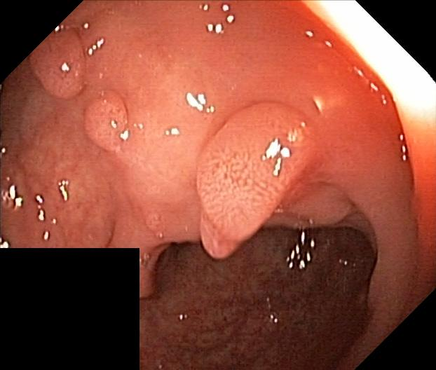 | 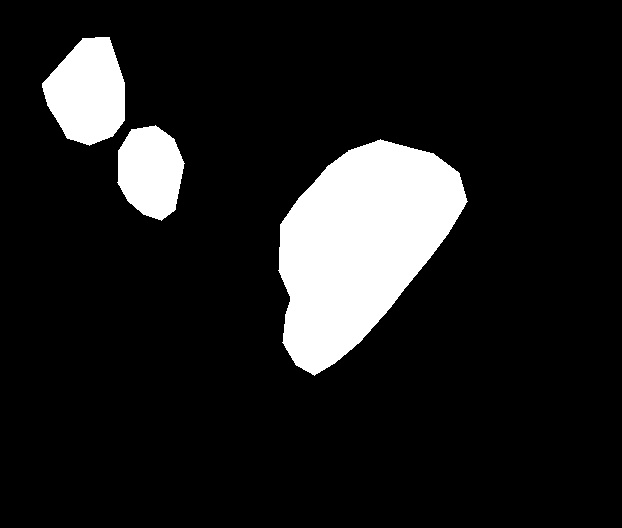 | 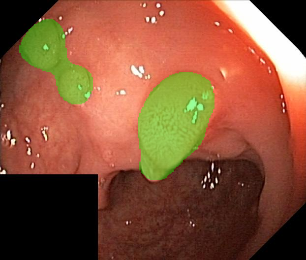 |

### Video Test — seq17 frames 10 & 11 (prompt: "small round polyp")

| Frame 1 (segmented) | Frame 2 (unused without correspondence) | Ground Truth (frame 1) | Prediction (overlay on frame 1) |
|---------------------|------------------------------------------|------------------------|---------------------------------|
| 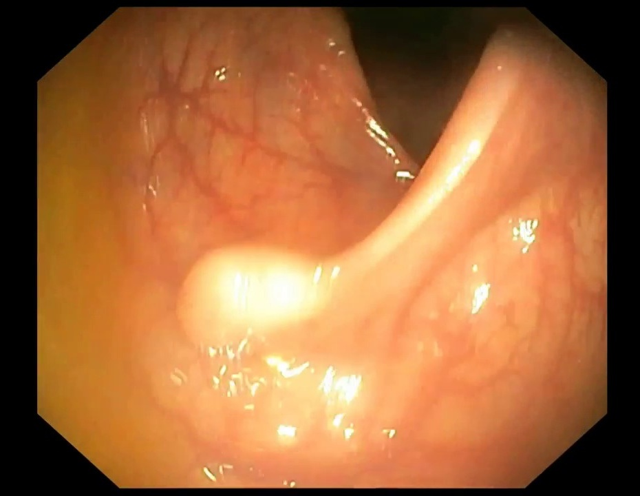 | 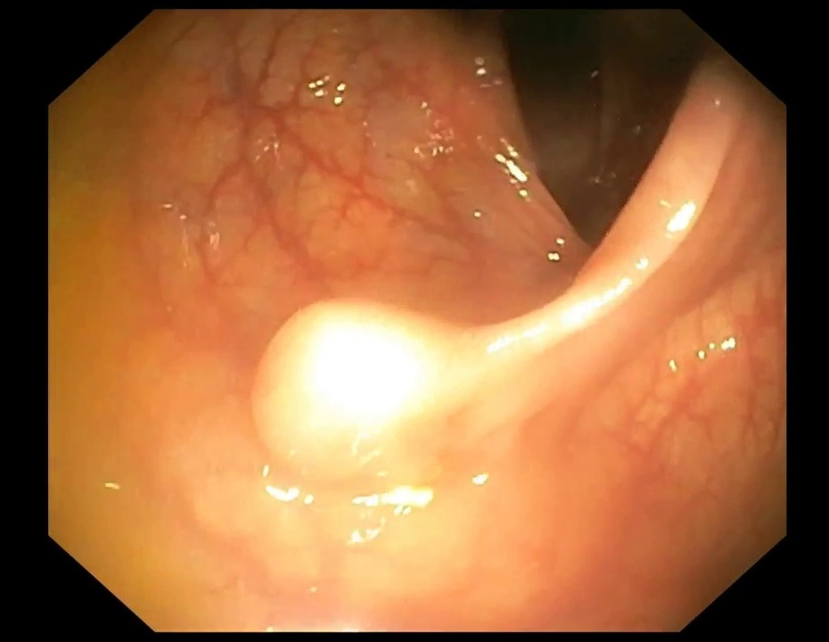 | 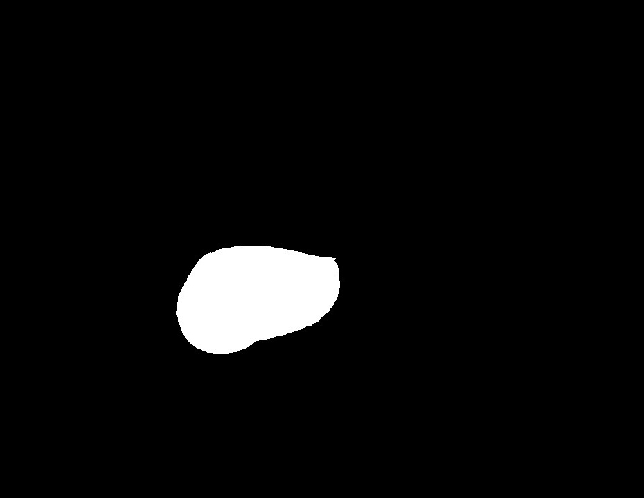 | 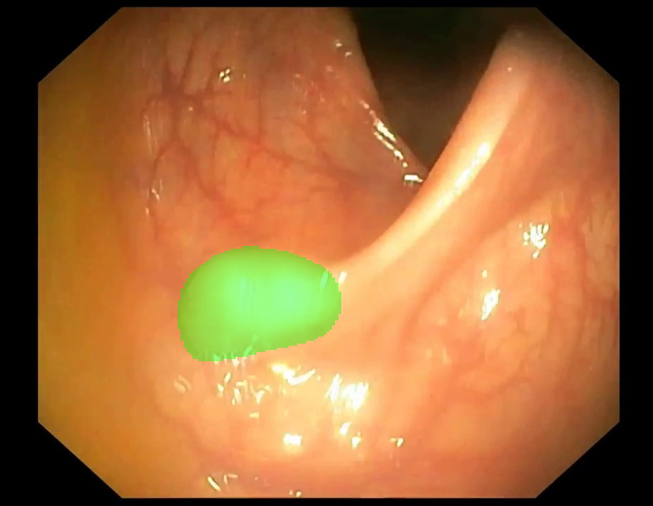 |

## Training Curves

Overview of the full run (best image-val Dice marked at epoch 22):

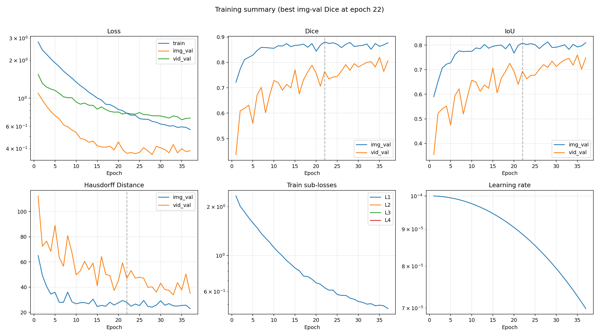

Individual plots:

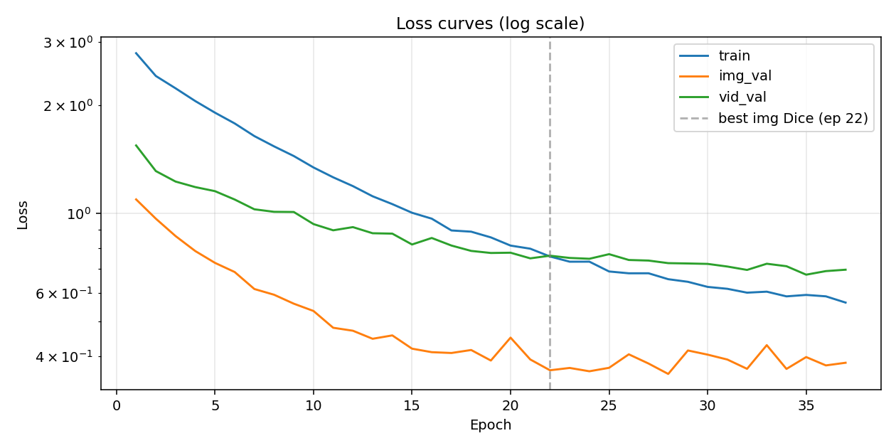

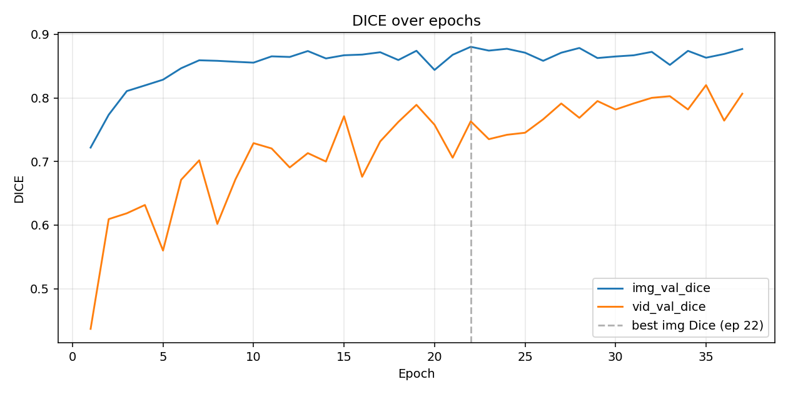

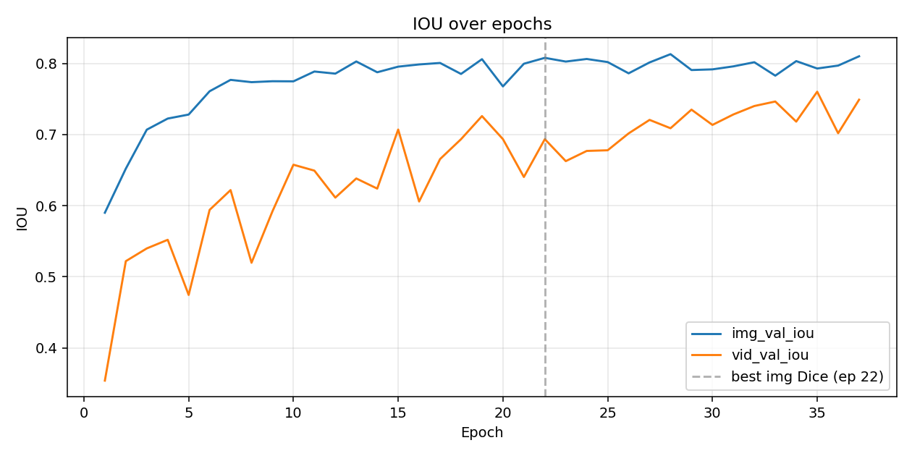

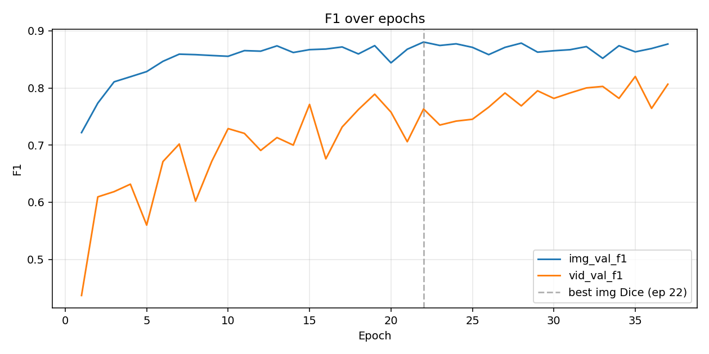

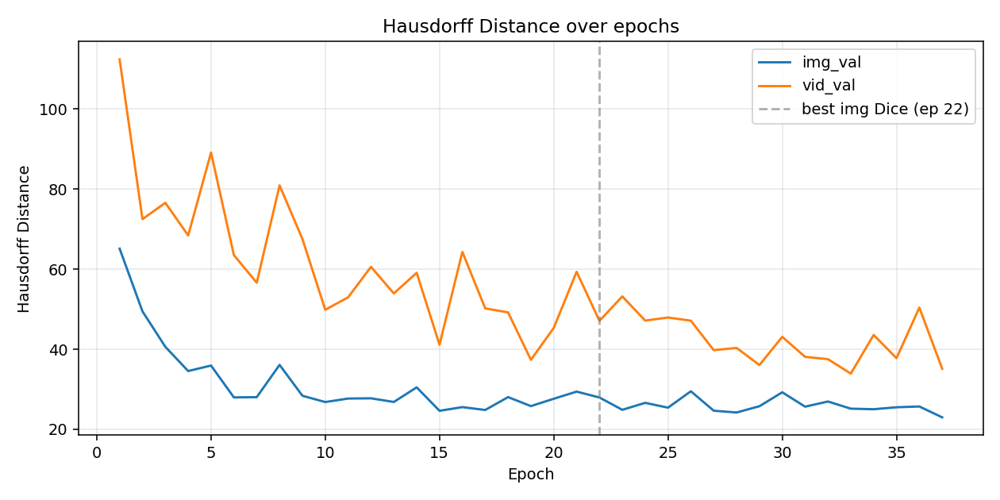

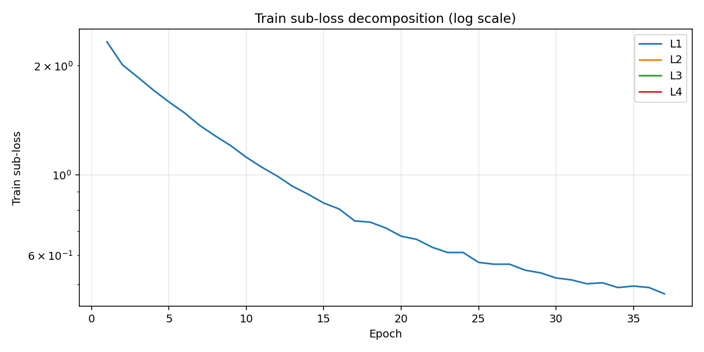

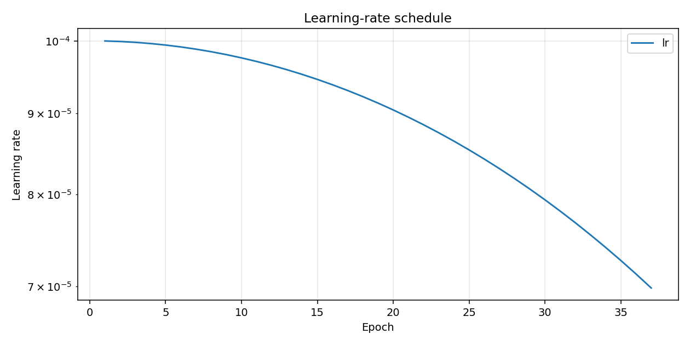

## Training Log

```
Epoch 001/100 (24.3s) | LR: 1.00e-04 | Train Loss: 2.7903 (L1: 2.3252)
  Img Val  | Loss: 1.0937 | Dice: 0.7219 | IoU: 0.5901 | F1: 0.7219 | HD: 65.11
  Vid Val  | Loss: 1.5455 | Dice: 0.4368 | IoU: 0.3541 | F1: 0.4368 | HD: 112.37
  -> New best model saved (Dice: 0.7219)
Epoch 002/100 (22.8s) | LR: 9.99e-05 | Train Loss: 2.4116 (L1: 2.0097)
  Img Val  | Loss: 0.9668 | Dice: 0.7735 | IoU: 0.6520 | F1: 0.7735 | HD: 49.45
  Vid Val  | Loss: 1.3115 | Dice: 0.6094 | IoU: 0.5220 | F1: 0.6094 | HD: 72.47
  -> New best model saved (Dice: 0.7735)
Epoch 003/100 (19.1s) | LR: 9.98e-05 | Train Loss: 2.2287 (L1: 1.8572)
  Img Val  | Loss: 0.8650 | Dice: 0.8107 | IoU: 0.7068 | F1: 0.8107 | HD: 40.60
  Vid Val  | Loss: 1.2263 | Dice: 0.6186 | IoU: 0.5399 | F1: 0.6186 | HD: 76.56
  -> New best model saved (Dice: 0.8107)
Epoch 004/100 (19.8s) | LR: 9.96e-05 | Train Loss: 2.0539 (L1: 1.7116)
  Img Val  | Loss: 0.7858 | Dice: 0.8196 | IoU: 0.7224 | F1: 0.8196 | HD: 34.55
  Vid Val  | Loss: 1.1836 | Dice: 0.6316 | IoU: 0.5520 | F1: 0.6316 | HD: 68.41
  -> New best model saved (Dice: 0.8196)
Epoch 005/100 (21.9s) | LR: 9.94e-05 | Train Loss: 1.9066 (L1: 1.5888)
  Img Val  | Loss: 0.7285 | Dice: 0.8287 | IoU: 0.7281 | F1: 0.8287 | HD: 35.92
  Vid Val  | Loss: 1.1531 | Dice: 0.5600 | IoU: 0.4746 | F1: 0.5600 | HD: 89.10
  -> New best model saved (Dice: 0.8287)
Epoch 006/100 (19.0s) | LR: 9.91e-05 | Train Loss: 1.7796 (L1: 1.4830)
  Img Val  | Loss: 0.6870 | Dice: 0.8467 | IoU: 0.7608 | F1: 0.8467 | HD: 27.97
  Vid Val  | Loss: 1.0931 | Dice: 0.6712 | IoU: 0.5941 | F1: 0.6712 | HD: 63.51
  -> New best model saved (Dice: 0.8467)
Epoch 007/100 (19.6s) | LR: 9.88e-05 | Train Loss: 1.6409 (L1: 1.3674)
  Img Val  | Loss: 0.6161 | Dice: 0.8592 | IoU: 0.7768 | F1: 0.8592 | HD: 28.02
  Vid Val  | Loss: 1.0266 | Dice: 0.7019 | IoU: 0.6219 | F1: 0.7019 | HD: 56.60
  -> New best model saved (Dice: 0.8592)
Epoch 008/100 (19.7s) | LR: 9.84e-05 | Train Loss: 1.5362 (L1: 1.2802)
  Img Val  | Loss: 0.5939 | Dice: 0.8583 | IoU: 0.7736 | F1: 0.8583 | HD: 36.09
  Vid Val  | Loss: 1.0101 | Dice: 0.6019 | IoU: 0.5198 | F1: 0.6019 | HD: 80.91
Epoch 009/100 (20.5s) | LR: 9.80e-05 | Train Loss: 1.4442 (L1: 1.2035)
  Img Val  | Loss: 0.5609 | Dice: 0.8568 | IoU: 0.7749 | F1: 0.8568 | HD: 28.38
  Vid Val  | Loss: 1.0091 | Dice: 0.6719 | IoU: 0.5921 | F1: 0.6719 | HD: 67.51
Epoch 010/100 (20.2s) | LR: 9.76e-05 | Train Loss: 1.3422 (L1: 1.1185)
  Img Val  | Loss: 0.5353 | Dice: 0.8555 | IoU: 0.7747 | F1: 0.8555 | HD: 26.81
  Vid Val  | Loss: 0.9339 | Dice: 0.7289 | IoU: 0.6575 | F1: 0.7289 | HD: 49.85
Epoch 011/100 (19.3s) | LR: 9.70e-05 | Train Loss: 1.2600 (L1: 1.0500)
  Img Val  | Loss: 0.4807 | Dice: 0.8654 | IoU: 0.7885 | F1: 0.8654 | HD: 27.69
  Vid Val  | Loss: 0.8974 | Dice: 0.7205 | IoU: 0.6493 | F1: 0.7205 | HD: 52.96
  -> New best model saved (Dice: 0.8654)
Epoch 012/100 (21.4s) | LR: 9.65e-05 | Train Loss: 1.1910 (L1: 0.9925)
  Img Val  | Loss: 0.4716 | Dice: 0.8644 | IoU: 0.7856 | F1: 0.8644 | HD: 27.74
  Vid Val  | Loss: 0.9159 | Dice: 0.6906 | IoU: 0.6114 | F1: 0.6906 | HD: 60.57
Epoch 013/100 (20.4s) | LR: 9.59e-05 | Train Loss: 1.1159 (L1: 0.9299)
  Img Val  | Loss: 0.4479 | Dice: 0.8737 | IoU: 0.8027 | F1: 0.8737 | HD: 26.83
  Vid Val  | Loss: 0.8806 | Dice: 0.7132 | IoU: 0.6382 | F1: 0.7132 | HD: 53.93
  -> New best model saved (Dice: 0.8737)
Epoch 014/100 (21.2s) | LR: 9.52e-05 | Train Loss: 1.0613 (L1: 0.8844)
  Img Val  | Loss: 0.4577 | Dice: 0.8621 | IoU: 0.7875 | F1: 0.8621 | HD: 30.48
  Vid Val  | Loss: 0.8784 | Dice: 0.7000 | IoU: 0.6240 | F1: 0.7000 | HD: 59.08
Epoch 015/100 (20.6s) | LR: 9.46e-05 | Train Loss: 1.0041 (L1: 0.8368)
  Img Val  | Loss: 0.4204 | Dice: 0.8671 | IoU: 0.7954 | F1: 0.8671 | HD: 24.62
  Vid Val  | Loss: 0.8194 | Dice: 0.7712 | IoU: 0.7070 | F1: 0.7712 | HD: 41.11
Epoch 016/100 (20.5s) | LR: 9.38e-05 | Train Loss: 0.9668 (L1: 0.8057)
  Img Val  | Loss: 0.4111 | Dice: 0.8681 | IoU: 0.7985 | F1: 0.8681 | HD: 25.54
  Vid Val  | Loss: 0.8543 | Dice: 0.6760 | IoU: 0.6058 | F1: 0.6760 | HD: 64.29
Epoch 017/100 (20.9s) | LR: 9.30e-05 | Train Loss: 0.8965 (L1: 0.7471)
  Img Val  | Loss: 0.4089 | Dice: 0.8718 | IoU: 0.8005 | F1: 0.8718 | HD: 24.83
  Vid Val  | Loss: 0.8139 | Dice: 0.7316 | IoU: 0.6655 | F1: 0.7316 | HD: 50.20
Epoch 018/100 (19.5s) | LR: 9.22e-05 | Train Loss: 0.8895 (L1: 0.7413)
  Img Val  | Loss: 0.4169 | Dice: 0.8596 | IoU: 0.7851 | F1: 0.8596 | HD: 28.04
  Vid Val  | Loss: 0.7864 | Dice: 0.7622 | IoU: 0.6934 | F1: 0.7622 | HD: 49.19
Epoch 019/100 (20.3s) | LR: 9.14e-05 | Train Loss: 0.8575 (L1: 0.7146)
  Img Val  | Loss: 0.3897 | Dice: 0.8741 | IoU: 0.8059 | F1: 0.8741 | HD: 25.80
  Vid Val  | Loss: 0.7760 | Dice: 0.7891 | IoU: 0.7259 | F1: 0.7891 | HD: 37.34
  -> New best model saved (Dice: 0.8741)
Epoch 020/100 (19.3s) | LR: 9.05e-05 | Train Loss: 0.8137 (L1: 0.6781)
  Img Val  | Loss: 0.4512 | Dice: 0.8440 | IoU: 0.7676 | F1: 0.8440 | HD: 27.63
  Vid Val  | Loss: 0.7774 | Dice: 0.7577 | IoU: 0.6935 | F1: 0.7577 | HD: 45.33
Epoch 021/100 (19.9s) | LR: 8.95e-05 | Train Loss: 0.7976 (L1: 0.6647)
  Img Val  | Loss: 0.3923 | Dice: 0.8678 | IoU: 0.7994 | F1: 0.8678 | HD: 29.41
  Vid Val  | Loss: 0.7498 | Dice: 0.7059 | IoU: 0.6403 | F1: 0.7059 | HD: 59.33
Epoch 022/100 (20.0s) | LR: 8.85e-05 | Train Loss: 0.7588 (L1: 0.6324)
  Img Val  | Loss: 0.3661 | Dice: 0.8804 | IoU: 0.8077 | F1: 0.8804 | HD: 27.95
  Vid Val  | Loss: 0.7627 | Dice: 0.7632 | IoU: 0.6935 | F1: 0.7632 | HD: 47.09
  -> New best model saved (Dice: 0.8804)
Epoch 023/100 (20.7s) | LR: 8.75e-05 | Train Loss: 0.7339 (L1: 0.6116)
  Img Val  | Loss: 0.3716 | Dice: 0.8744 | IoU: 0.8025 | F1: 0.8744 | HD: 24.87
  Vid Val  | Loss: 0.7518 | Dice: 0.7351 | IoU: 0.6626 | F1: 0.7351 | HD: 53.19
Epoch 024/100 (20.9s) | LR: 8.64e-05 | Train Loss: 0.7340 (L1: 0.6117)
  Img Val  | Loss: 0.3637 | Dice: 0.8773 | IoU: 0.8061 | F1: 0.8773 | HD: 26.61
  Vid Val  | Loss: 0.7478 | Dice: 0.7420 | IoU: 0.6769 | F1: 0.7420 | HD: 47.15
Epoch 025/100 (20.6s) | LR: 8.54e-05 | Train Loss: 0.6893 (L1: 0.5744)
  Img Val  | Loss: 0.3719 | Dice: 0.8711 | IoU: 0.8018 | F1: 0.8711 | HD: 25.41
  Vid Val  | Loss: 0.7702 | Dice: 0.7452 | IoU: 0.6779 | F1: 0.7452 | HD: 47.91
Epoch 026/100 (19.5s) | LR: 8.42e-05 | Train Loss: 0.6813 (L1: 0.5678)
  Img Val  | Loss: 0.4055 | Dice: 0.8584 | IoU: 0.7860 | F1: 0.8584 | HD: 29.50
  Vid Val  | Loss: 0.7420 | Dice: 0.7664 | IoU: 0.7016 | F1: 0.7664 | HD: 47.13
Epoch 027/100 (21.0s) | LR: 8.31e-05 | Train Loss: 0.6814 (L1: 0.5679)
  Img Val  | Loss: 0.3823 | Dice: 0.8711 | IoU: 0.8013 | F1: 0.8711 | HD: 24.65
  Vid Val  | Loss: 0.7393 | Dice: 0.7912 | IoU: 0.7206 | F1: 0.7912 | HD: 39.77
Epoch 028/100 (21.1s) | LR: 8.19e-05 | Train Loss: 0.6561 (L1: 0.5467)
  Img Val  | Loss: 0.3576 | Dice: 0.8785 | IoU: 0.8129 | F1: 0.8785 | HD: 24.20
  Vid Val  | Loss: 0.7271 | Dice: 0.7687 | IoU: 0.7088 | F1: 0.7687 | HD: 40.33
Epoch 029/100 (20.5s) | LR: 8.06e-05 | Train Loss: 0.6452 (L1: 0.5376)
  Img Val  | Loss: 0.4156 | Dice: 0.8627 | IoU: 0.7906 | F1: 0.8627 | HD: 25.76
  Vid Val  | Loss: 0.7256 | Dice: 0.7951 | IoU: 0.7350 | F1: 0.7951 | HD: 36.05
Epoch 030/100 (19.7s) | LR: 7.94e-05 | Train Loss: 0.6245 (L1: 0.5204)
  Img Val  | Loss: 0.4046 | Dice: 0.8652 | IoU: 0.7916 | F1: 0.8652 | HD: 29.24
  Vid Val  | Loss: 0.7236 | Dice: 0.7817 | IoU: 0.7135 | F1: 0.7817 | HD: 43.09
Epoch 031/100 (19.8s) | LR: 7.81e-05 | Train Loss: 0.6169 (L1: 0.5141)
  Img Val  | Loss: 0.3921 | Dice: 0.8670 | IoU: 0.7958 | F1: 0.8670 | HD: 25.65
  Vid Val  | Loss: 0.7115 | Dice: 0.7913 | IoU: 0.7282 | F1: 0.7913 | HD: 38.09
Epoch 032/100 (20.2s) | LR: 7.68e-05 | Train Loss: 0.6019 (L1: 0.5015)
  Img Val  | Loss: 0.3695 | Dice: 0.8724 | IoU: 0.8016 | F1: 0.8724 | HD: 26.94
  Vid Val  | Loss: 0.6962 | Dice: 0.8001 | IoU: 0.7401 | F1: 0.8001 | HD: 37.51
Epoch 033/100 (20.8s) | LR: 7.55e-05 | Train Loss: 0.6057 (L1: 0.5047)
  Img Val  | Loss: 0.4300 | Dice: 0.8519 | IoU: 0.7827 | F1: 0.8519 | HD: 25.15
  Vid Val  | Loss: 0.7244 | Dice: 0.8027 | IoU: 0.7464 | F1: 0.8027 | HD: 33.91
Epoch 034/100 (19.8s) | LR: 7.41e-05 | Train Loss: 0.5877 (L1: 0.4898)
  Img Val  | Loss: 0.3693 | Dice: 0.8740 | IoU: 0.8032 | F1: 0.8740 | HD: 25.02
  Vid Val  | Loss: 0.7130 | Dice: 0.7818 | IoU: 0.7181 | F1: 0.7818 | HD: 43.57
Epoch 035/100 (20.1s) | LR: 7.27e-05 | Train Loss: 0.5932 (L1: 0.4943)
  Img Val  | Loss: 0.3984 | Dice: 0.8632 | IoU: 0.7928 | F1: 0.8632 | HD: 25.51
  Vid Val  | Loss: 0.6753 | Dice: 0.8201 | IoU: 0.7602 | F1: 0.8201 | HD: 37.76
Epoch 036/100 (20.1s) | LR: 7.13e-05 | Train Loss: 0.5878 (L1: 0.4899)
  Img Val  | Loss: 0.3777 | Dice: 0.8691 | IoU: 0.7969 | F1: 0.8691 | HD: 25.70
  Vid Val  | Loss: 0.6910 | Dice: 0.7643 | IoU: 0.7018 | F1: 0.7643 | HD: 50.39
Epoch 037/100 (20.5s) | LR: 6.99e-05 | Train Loss: 0.5648 (L1: 0.4707)
  Img Val  | Loss: 0.3841 | Dice: 0.8769 | IoU: 0.8099 | F1: 0.8769 | HD: 22.99
  Vid Val  | Loss: 0.6972 | Dice: 0.8066 | IoU: 0.7489 | F1: 0.8066 | HD: 35.12

Early stopping: Val Dice did not improve for 15 epochs.

Training complete. Best validation Dice: 0.8804```
