# Results — Baseline (VGG-16 encoder, no PGA / correspondence / text encoder)

**Ablation baseline.** Configuration: `configs/config_baseline_no_modules.yaml`
with `encoder_type: vgg16`. Encoder -> UNet decoder only. No prompt-guided
attention, no cross-frame correspondence, no BioMed CLIP text encoder.
Loss = L1 (Dice + BCE) only; L2/L3/L4 disabled (lambda_2 = lambda_3 = lambda_4 = 0).
Training stopped early at epoch 47 (no Val Dice improvement for 15 epochs after epoch 32).

## Dataset: Image Segmentation + Video Segmentation Dataset

| Split | Image seg | Video seg  |
|-------|-----------|------------|
| Train | 800       | 934 pairs  |
| Val   | 100       | 259 pairs  |
| Test  | 100       | 1009 pairs |

**Trainable params:** 27,819,137 / **Total:** 27,819,137
(All trainable: BioMed CLIP text encoder is absent in the baseline, so no frozen params.)

## Test Results

### Image Test (100 images)

| Metric | Value |
|--------|-------|
| Dice | 0.8844 |
| IoU | 0.8171 |
| F1 | 0.8844 |
| Hausdorff Distance | 26.22 |
| Loss | 0.3119 |

### Video Test (1009 pairs)

| Metric | Value |
|--------|-------|
| Dice | 0.5908 |
| IoU | 0.5511 |
| F1 | 0.5908 |
| Hausdorff Distance | 75.17 |
| Loss | 0.9938 |

**Best validation Dice:** 0.9070 (epoch 32)

## Comparison vs Full VGG-16 (with PGA + Correspondence + BioMed CLIP)

| Setting | Img Dice | Img IoU | Img HD | Vid Dice | Vid IoU | Vid HD | Best val Dice |
|---|---:|---:|---:|---:|---:|---:|---:|
| **Baseline (this run)** | 0.8844 | 0.8171 | 26.22 | 0.5908 | 0.5511 | 75.17 | 0.9070 |
| Full pipeline | 0.9011 | 0.8314 | 25.41 | 0.7496 | 0.6854 | 42.25 | 0.9158 |

Adding the prompt-guided attention, cross-frame correspondence, and VL-aligned losses
contributes roughly +1.7 Dice on image test and +15.9 Dice on video test, with a large
drop in video Hausdorff distance (75.17 -> 42.25) — the cross-frame correspondence
module clearly helps on the temporal task.

## Qualitative Predictions

Predictions from the best baseline checkpoint on one held-out test sample from each dataset. Overlay shows the predicted mask in green at threshold 0.5. Note: prompts are stored alongside each sample but the baseline does not consume them.

### Image Test — `cju5eftctcdbj08712gdp989f.jpg` (prompt: "large round polyp")

| Input | Ground Truth | Prediction (overlay) |
|-------|--------------|----------------------|
| 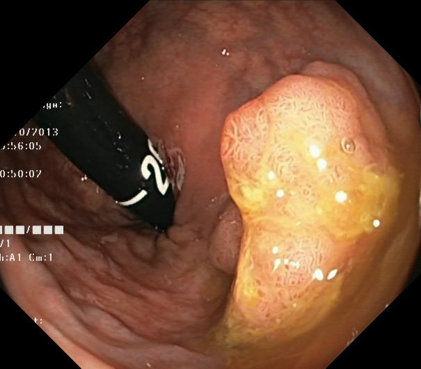 |  | 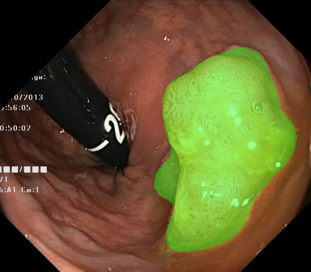 |

### Video Test — seq8 frames 0 & 1 (prompt: "large irregular polyp")

| Frame 1 (segmented) | Frame 2 (unused without correspondence) | Ground Truth (frame 1) | Prediction (overlay on frame 1) |
|---------------------|------------------------------------------|------------------------|---------------------------------|
|  | 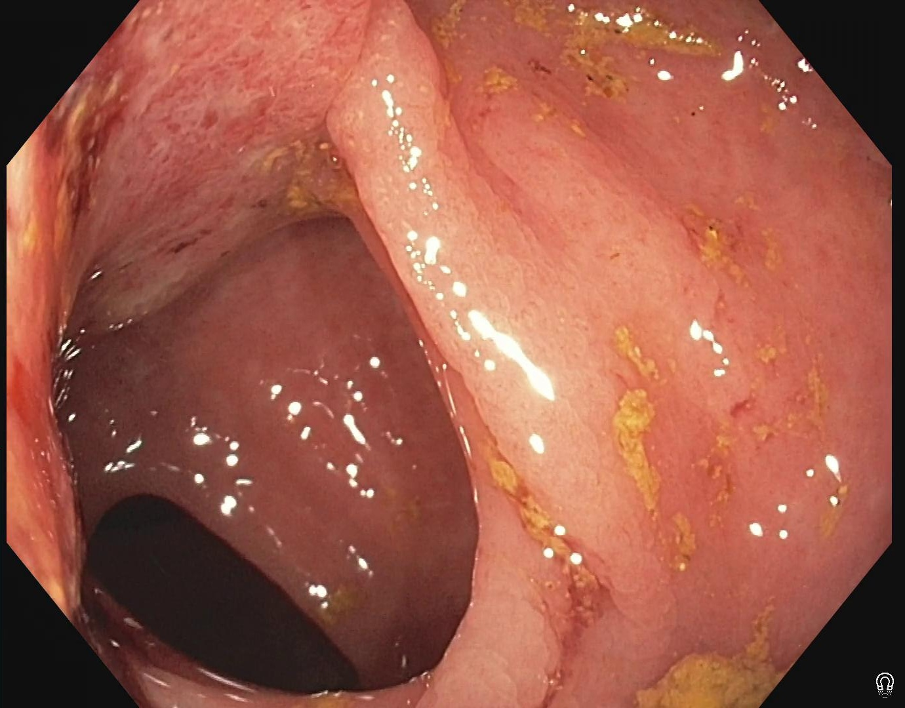 |  | 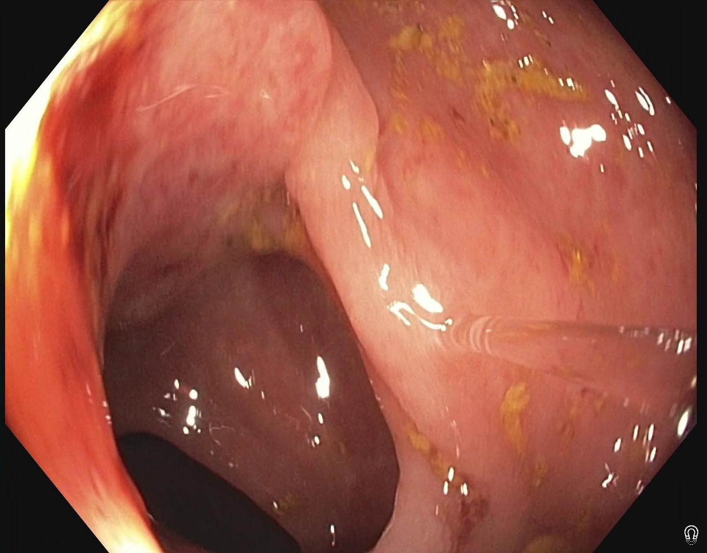 |

## Training Curves

Overview of the full run (best image-val Dice marked at epoch 32):

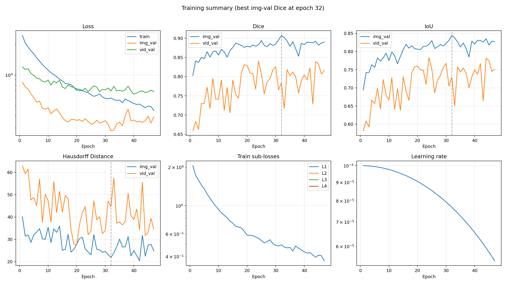

Individual plots:

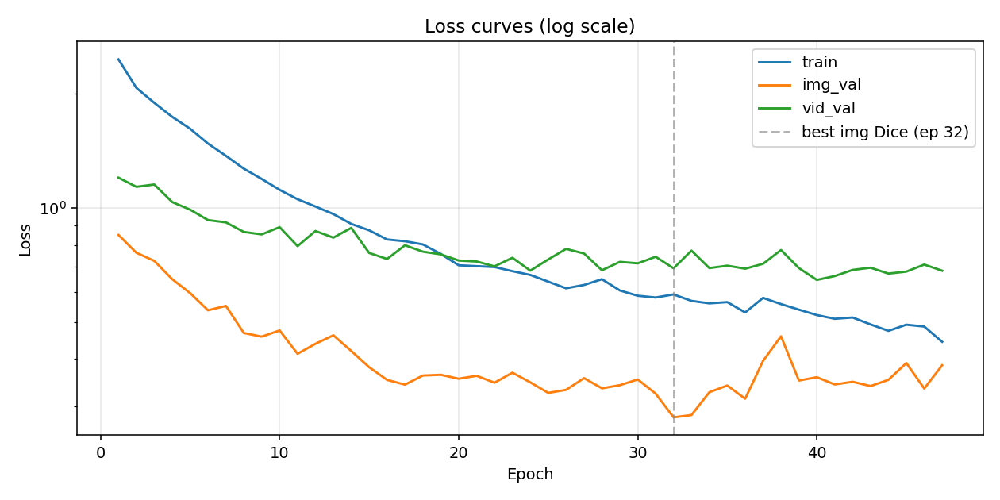

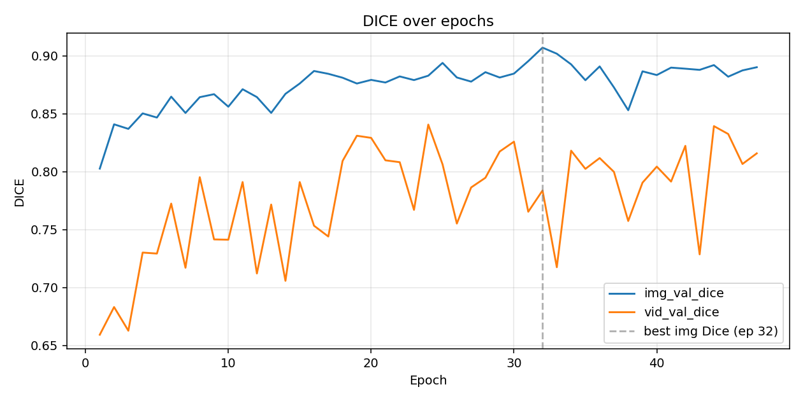

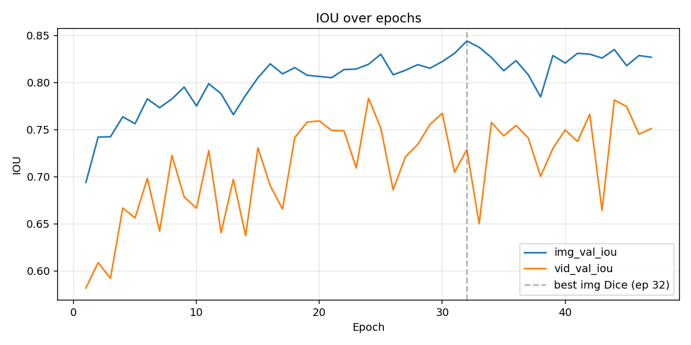

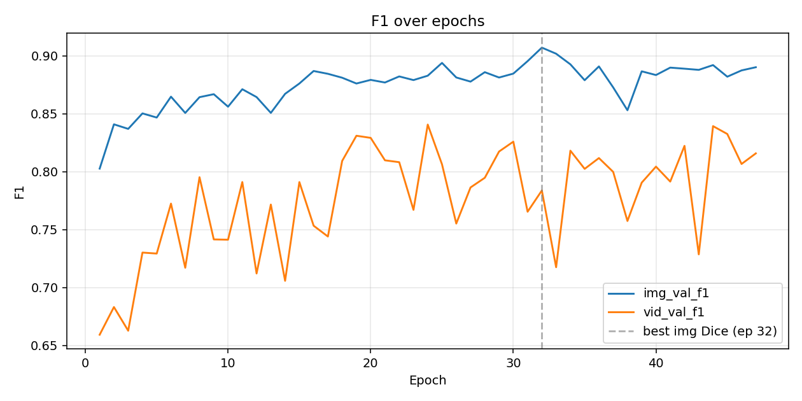

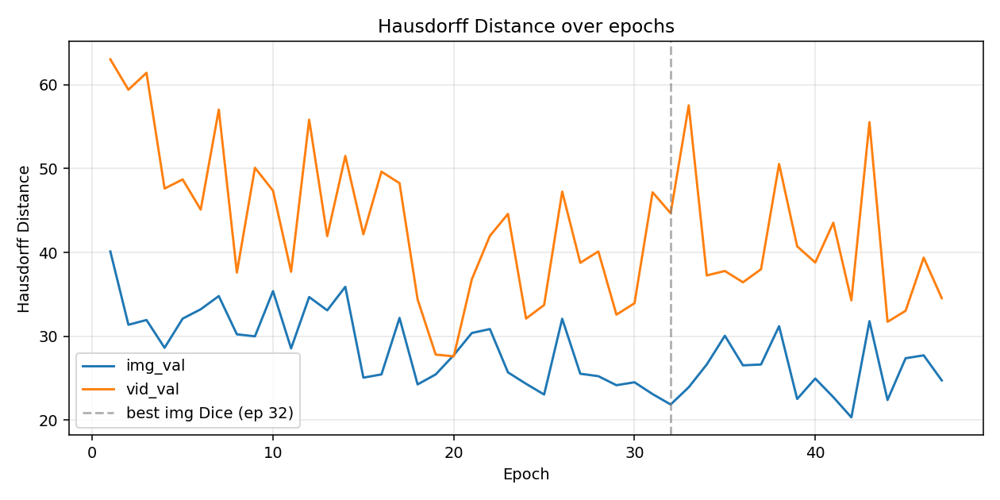

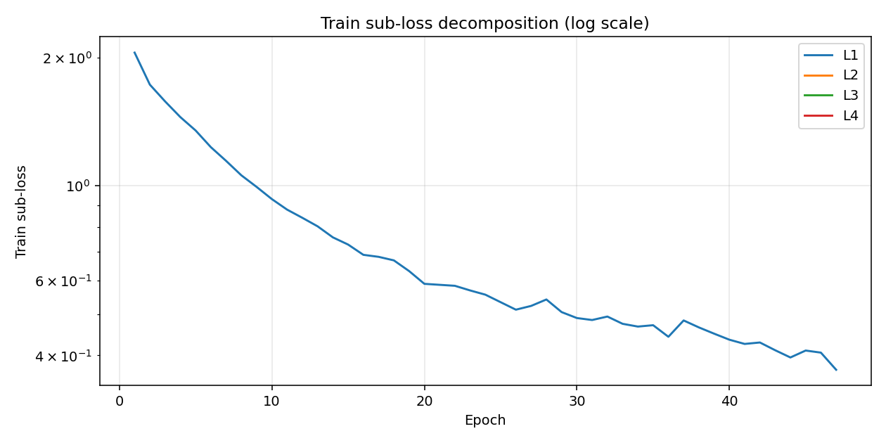

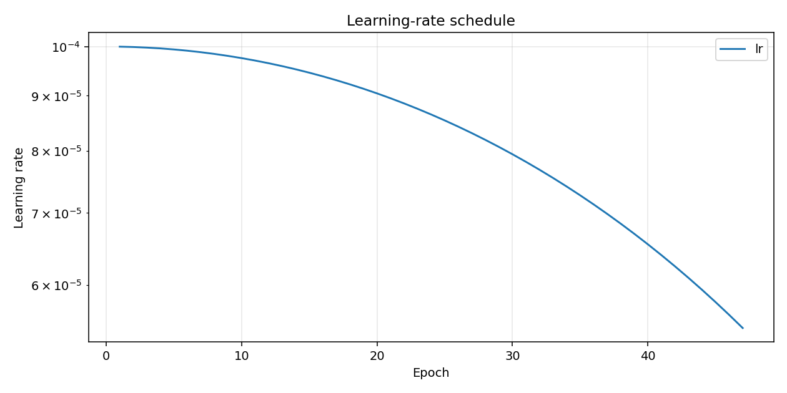

## Training Log

```
Epoch 001/100 (22.8s) | LR: 1.00e-04 | Train Loss: 2.4655 (L1: 2.0546)
  Img Val  | Loss: 0.8496 | Dice: 0.8026 | IoU: 0.6940 | F1: 0.8026 | HD: 40.12
  Vid Val  | Loss: 1.2027 | Dice: 0.6593 | IoU: 0.5819 | F1: 0.6593 | HD: 63.03
  -> New best model saved (Dice: 0.8026)
Epoch 002/100 (23.2s) | LR: 9.99e-05 | Train Loss: 2.0738 (L1: 1.7281)
  Img Val  | Loss: 0.7625 | Dice: 0.8408 | IoU: 0.7421 | F1: 0.8408 | HD: 31.38
  Vid Val  | Loss: 1.1378 | Dice: 0.6832 | IoU: 0.6088 | F1: 0.6832 | HD: 59.41
  -> New best model saved (Dice: 0.8408)
Epoch 003/100 (22.5s) | LR: 9.98e-05 | Train Loss: 1.8940 (L1: 1.5783)
  Img Val  | Loss: 0.7259 | Dice: 0.8369 | IoU: 0.7425 | F1: 0.8369 | HD: 31.94
  Vid Val  | Loss: 1.1538 | Dice: 0.6628 | IoU: 0.5923 | F1: 0.6628 | HD: 61.43
Epoch 004/100 (20.2s) | LR: 9.96e-05 | Train Loss: 1.7400 (L1: 1.4500)
  Img Val  | Loss: 0.6497 | Dice: 0.8502 | IoU: 0.7636 | F1: 0.8502 | HD: 28.63
  Vid Val  | Loss: 1.0374 | Dice: 0.7302 | IoU: 0.6668 | F1: 0.7302 | HD: 47.62
  -> New best model saved (Dice: 0.8502)
Epoch 005/100 (22.5s) | LR: 9.94e-05 | Train Loss: 1.6187 (L1: 1.3489)
  Img Val  | Loss: 0.5971 | Dice: 0.8466 | IoU: 0.7563 | F1: 0.8466 | HD: 32.11
  Vid Val  | Loss: 0.9906 | Dice: 0.7293 | IoU: 0.6563 | F1: 0.7293 | HD: 48.71
Epoch 006/100 (20.5s) | LR: 9.91e-05 | Train Loss: 1.4791 (L1: 1.2326)
  Img Val  | Loss: 0.5379 | Dice: 0.8647 | IoU: 0.7827 | F1: 0.8647 | HD: 33.22
  Vid Val  | Loss: 0.9299 | Dice: 0.7724 | IoU: 0.6983 | F1: 0.7724 | HD: 45.11
  -> New best model saved (Dice: 0.8647)
Epoch 007/100 (20.5s) | LR: 9.88e-05 | Train Loss: 1.3734 (L1: 1.1445)
  Img Val  | Loss: 0.5524 | Dice: 0.8506 | IoU: 0.7733 | F1: 0.8506 | HD: 34.80
  Vid Val  | Loss: 0.9170 | Dice: 0.7171 | IoU: 0.6422 | F1: 0.7171 | HD: 57.04
Epoch 008/100 (20.8s) | LR: 9.84e-05 | Train Loss: 1.2704 (L1: 1.0586)
  Img Val  | Loss: 0.4686 | Dice: 0.8642 | IoU: 0.7825 | F1: 0.8642 | HD: 30.24
  Vid Val  | Loss: 0.8652 | Dice: 0.7952 | IoU: 0.7226 | F1: 0.7952 | HD: 37.60
Epoch 009/100 (20.6s) | LR: 9.80e-05 | Train Loss: 1.1933 (L1: 0.9944)
  Img Val  | Loss: 0.4583 | Dice: 0.8668 | IoU: 0.7952 | F1: 0.8668 | HD: 30.00
  Vid Val  | Loss: 0.8526 | Dice: 0.7415 | IoU: 0.6786 | F1: 0.7415 | HD: 50.10
  -> New best model saved (Dice: 0.8668)
Epoch 010/100 (21.5s) | LR: 9.76e-05 | Train Loss: 1.1172 (L1: 0.9310)
  Img Val  | Loss: 0.4760 | Dice: 0.8560 | IoU: 0.7752 | F1: 0.8560 | HD: 35.39
  Vid Val  | Loss: 0.8908 | Dice: 0.7413 | IoU: 0.6667 | F1: 0.7413 | HD: 47.37
Epoch 011/100 (20.3s) | LR: 9.70e-05 | Train Loss: 1.0554 (L1: 0.8795)
  Img Val  | Loss: 0.4131 | Dice: 0.8711 | IoU: 0.7988 | F1: 0.8711 | HD: 28.56
  Vid Val  | Loss: 0.7940 | Dice: 0.7910 | IoU: 0.7277 | F1: 0.7910 | HD: 37.70
  -> New best model saved (Dice: 0.8711)
Epoch 012/100 (20.9s) | LR: 9.65e-05 | Train Loss: 1.0097 (L1: 0.8414)
  Img Val  | Loss: 0.4389 | Dice: 0.8643 | IoU: 0.7882 | F1: 0.8643 | HD: 34.68
  Vid Val  | Loss: 0.8702 | Dice: 0.7121 | IoU: 0.6407 | F1: 0.7121 | HD: 55.83
Epoch 013/100 (22.5s) | LR: 9.59e-05 | Train Loss: 0.9643 (L1: 0.8036)
  Img Val  | Loss: 0.4621 | Dice: 0.8507 | IoU: 0.7659 | F1: 0.8507 | HD: 33.10
  Vid Val  | Loss: 0.8359 | Dice: 0.7716 | IoU: 0.6972 | F1: 0.7716 | HD: 41.95
Epoch 014/100 (20.8s) | LR: 9.52e-05 | Train Loss: 0.9085 (L1: 0.7571)
  Img Val  | Loss: 0.4201 | Dice: 0.8671 | IoU: 0.7865 | F1: 0.8671 | HD: 35.91
  Vid Val  | Loss: 0.8868 | Dice: 0.7058 | IoU: 0.6375 | F1: 0.7058 | HD: 51.51
Epoch 015/100 (20.7s) | LR: 9.46e-05 | Train Loss: 0.8738 (L1: 0.7282)
  Img Val  | Loss: 0.3807 | Dice: 0.8760 | IoU: 0.8051 | F1: 0.8760 | HD: 25.07
  Vid Val  | Loss: 0.7616 | Dice: 0.7910 | IoU: 0.7306 | F1: 0.7910 | HD: 42.17
  -> New best model saved (Dice: 0.8760)
Epoch 016/100 (20.5s) | LR: 9.38e-05 | Train Loss: 0.8267 (L1: 0.6889)
  Img Val  | Loss: 0.3525 | Dice: 0.8868 | IoU: 0.8199 | F1: 0.8868 | HD: 25.46
  Vid Val  | Loss: 0.7343 | Dice: 0.7533 | IoU: 0.6906 | F1: 0.7533 | HD: 49.64
  -> New best model saved (Dice: 0.8868)
Epoch 017/100 (21.9s) | LR: 9.30e-05 | Train Loss: 0.8177 (L1: 0.6815)
  Img Val  | Loss: 0.3425 | Dice: 0.8844 | IoU: 0.8092 | F1: 0.8844 | HD: 32.19
  Vid Val  | Loss: 0.7981 | Dice: 0.7440 | IoU: 0.6657 | F1: 0.7440 | HD: 48.26
Epoch 018/100 (20.8s) | LR: 9.22e-05 | Train Loss: 0.8023 (L1: 0.6685)
  Img Val  | Loss: 0.3620 | Dice: 0.8810 | IoU: 0.8158 | F1: 0.8810 | HD: 24.26
  Vid Val  | Loss: 0.7677 | Dice: 0.8092 | IoU: 0.7417 | F1: 0.8092 | HD: 34.41
Epoch 019/100 (20.1s) | LR: 9.14e-05 | Train Loss: 0.7572 (L1: 0.6310)
  Img Val  | Loss: 0.3636 | Dice: 0.8760 | IoU: 0.8078 | F1: 0.8760 | HD: 25.45
  Vid Val  | Loss: 0.7551 | Dice: 0.8309 | IoU: 0.7580 | F1: 0.8309 | HD: 27.82
Epoch 020/100 (20.3s) | LR: 9.05e-05 | Train Loss: 0.7068 (L1: 0.5890)
  Img Val  | Loss: 0.3550 | Dice: 0.8791 | IoU: 0.8065 | F1: 0.8791 | HD: 27.75
  Vid Val  | Loss: 0.7275 | Dice: 0.8291 | IoU: 0.7593 | F1: 0.8291 | HD: 27.61
Epoch 021/100 (20.2s) | LR: 8.95e-05 | Train Loss: 0.7030 (L1: 0.5858)
  Img Val  | Loss: 0.3614 | Dice: 0.8769 | IoU: 0.8052 | F1: 0.8769 | HD: 30.40
  Vid Val  | Loss: 0.7232 | Dice: 0.8098 | IoU: 0.7492 | F1: 0.8098 | HD: 36.80
Epoch 022/100 (20.2s) | LR: 8.85e-05 | Train Loss: 0.6993 (L1: 0.5828)
  Img Val  | Loss: 0.3466 | Dice: 0.8821 | IoU: 0.8137 | F1: 0.8821 | HD: 30.87
  Vid Val  | Loss: 0.7022 | Dice: 0.8081 | IoU: 0.7487 | F1: 0.8081 | HD: 41.98
Epoch 023/100 (20.3s) | LR: 8.75e-05 | Train Loss: 0.6820 (L1: 0.5683)
  Img Val  | Loss: 0.3683 | Dice: 0.8790 | IoU: 0.8144 | F1: 0.8790 | HD: 25.70
  Vid Val  | Loss: 0.7397 | Dice: 0.7670 | IoU: 0.7093 | F1: 0.7670 | HD: 44.60
Epoch 024/100 (20.1s) | LR: 8.64e-05 | Train Loss: 0.6665 (L1: 0.5554)
  Img Val  | Loss: 0.3473 | Dice: 0.8827 | IoU: 0.8194 | F1: 0.8827 | HD: 24.34
  Vid Val  | Loss: 0.6842 | Dice: 0.8406 | IoU: 0.7833 | F1: 0.8406 | HD: 32.12
Epoch 025/100 (20.0s) | LR: 8.54e-05 | Train Loss: 0.6400 (L1: 0.5333)
  Img Val  | Loss: 0.3258 | Dice: 0.8938 | IoU: 0.8301 | F1: 0.8938 | HD: 23.06
  Vid Val  | Loss: 0.7321 | Dice: 0.8063 | IoU: 0.7515 | F1: 0.8063 | HD: 33.73
  -> New best model saved (Dice: 0.8938)
Epoch 026/100 (20.7s) | LR: 8.42e-05 | Train Loss: 0.6146 (L1: 0.5122)
  Img Val  | Loss: 0.3319 | Dice: 0.8812 | IoU: 0.8082 | F1: 0.8812 | HD: 32.09
  Vid Val  | Loss: 0.7808 | Dice: 0.7552 | IoU: 0.6861 | F1: 0.7552 | HD: 47.26
Epoch 027/100 (20.6s) | LR: 8.31e-05 | Train Loss: 0.6273 (L1: 0.5227)
  Img Val  | Loss: 0.3563 | Dice: 0.8776 | IoU: 0.8130 | F1: 0.8776 | HD: 25.54
  Vid Val  | Loss: 0.7591 | Dice: 0.7863 | IoU: 0.7211 | F1: 0.7863 | HD: 38.77
Epoch 028/100 (20.5s) | LR: 8.19e-05 | Train Loss: 0.6495 (L1: 0.5412)
  Img Val  | Loss: 0.3350 | Dice: 0.8858 | IoU: 0.8190 | F1: 0.8858 | HD: 25.24
  Vid Val  | Loss: 0.6858 | Dice: 0.7947 | IoU: 0.7343 | F1: 0.7947 | HD: 40.12
Epoch 029/100 (20.4s) | LR: 8.06e-05 | Train Loss: 0.6066 (L1: 0.5055)
  Img Val  | Loss: 0.3414 | Dice: 0.8812 | IoU: 0.8152 | F1: 0.8812 | HD: 24.17
  Vid Val  | Loss: 0.7216 | Dice: 0.8173 | IoU: 0.7556 | F1: 0.8173 | HD: 32.58
Epoch 030/100 (20.4s) | LR: 7.94e-05 | Train Loss: 0.5875 (L1: 0.4896)
  Img Val  | Loss: 0.3534 | Dice: 0.8845 | IoU: 0.8223 | F1: 0.8845 | HD: 24.52
  Vid Val  | Loss: 0.7151 | Dice: 0.8258 | IoU: 0.7674 | F1: 0.8258 | HD: 33.95
Epoch 031/100 (20.4s) | LR: 7.81e-05 | Train Loss: 0.5812 (L1: 0.4844)
  Img Val  | Loss: 0.3243 | Dice: 0.8953 | IoU: 0.8310 | F1: 0.8953 | HD: 23.11
  Vid Val  | Loss: 0.7443 | Dice: 0.7654 | IoU: 0.7050 | F1: 0.7654 | HD: 47.18
  -> New best model saved (Dice: 0.8953)
Epoch 032/100 (20.5s) | LR: 7.68e-05 | Train Loss: 0.5922 (L1: 0.4935)
  Img Val  | Loss: 0.2809 | Dice: 0.9070 | IoU: 0.8441 | F1: 0.9070 | HD: 21.87
  Vid Val  | Loss: 0.6940 | Dice: 0.7837 | IoU: 0.7289 | F1: 0.7837 | HD: 44.68
  -> New best model saved (Dice: 0.9070)
Epoch 033/100 (20.8s) | LR: 7.55e-05 | Train Loss: 0.5694 (L1: 0.4745)
  Img Val  | Loss: 0.2848 | Dice: 0.9017 | IoU: 0.8374 | F1: 0.9017 | HD: 23.93
  Vid Val  | Loss: 0.7726 | Dice: 0.7175 | IoU: 0.6501 | F1: 0.7175 | HD: 57.54
Epoch 034/100 (20.9s) | LR: 7.41e-05 | Train Loss: 0.5610 (L1: 0.4675)
  Img Val  | Loss: 0.3272 | Dice: 0.8925 | IoU: 0.8266 | F1: 0.8925 | HD: 26.65
  Vid Val  | Loss: 0.6949 | Dice: 0.8181 | IoU: 0.7577 | F1: 0.8181 | HD: 37.26
Epoch 035/100 (20.1s) | LR: 7.27e-05 | Train Loss: 0.5652 (L1: 0.4710)
  Img Val  | Loss: 0.3407 | Dice: 0.8789 | IoU: 0.8126 | F1: 0.8789 | HD: 30.07
  Vid Val  | Loss: 0.7052 | Dice: 0.8024 | IoU: 0.7434 | F1: 0.8024 | HD: 37.79
Epoch 036/100 (21.0s) | LR: 7.13e-05 | Train Loss: 0.5309 (L1: 0.4424)
  Img Val  | Loss: 0.3145 | Dice: 0.8908 | IoU: 0.8233 | F1: 0.8908 | HD: 26.54
  Vid Val  | Loss: 0.6924 | Dice: 0.8117 | IoU: 0.7545 | F1: 0.8117 | HD: 36.44
Epoch 037/100 (20.5s) | LR: 6.99e-05 | Train Loss: 0.5799 (L1: 0.4832)
  Img Val  | Loss: 0.3959 | Dice: 0.8727 | IoU: 0.8082 | F1: 0.8727 | HD: 26.64
  Vid Val  | Loss: 0.7133 | Dice: 0.7998 | IoU: 0.7411 | F1: 0.7998 | HD: 38.00
Epoch 038/100 (20.5s) | LR: 6.84e-05 | Train Loss: 0.5585 (L1: 0.4654)
  Img Val  | Loss: 0.4593 | Dice: 0.8529 | IoU: 0.7848 | F1: 0.8529 | HD: 31.21
  Vid Val  | Loss: 0.7753 | Dice: 0.7574 | IoU: 0.7005 | F1: 0.7574 | HD: 50.55
Epoch 039/100 (20.3s) | LR: 6.69e-05 | Train Loss: 0.5399 (L1: 0.4499)
  Img Val  | Loss: 0.3512 | Dice: 0.8865 | IoU: 0.8287 | F1: 0.8865 | HD: 22.53
  Vid Val  | Loss: 0.6950 | Dice: 0.7905 | IoU: 0.7301 | F1: 0.7905 | HD: 40.73
Epoch 040/100 (20.0s) | LR: 6.55e-05 | Train Loss: 0.5226 (L1: 0.4355)
  Img Val  | Loss: 0.3583 | Dice: 0.8833 | IoU: 0.8207 | F1: 0.8833 | HD: 24.96
  Vid Val  | Loss: 0.6467 | Dice: 0.8043 | IoU: 0.7496 | F1: 0.8043 | HD: 38.80
Epoch 041/100 (20.2s) | LR: 6.39e-05 | Train Loss: 0.5108 (L1: 0.4256)
  Img Val  | Loss: 0.3430 | Dice: 0.8897 | IoU: 0.8311 | F1: 0.8897 | HD: 22.75
  Vid Val  | Loss: 0.6619 | Dice: 0.7914 | IoU: 0.7374 | F1: 0.7914 | HD: 43.55
Epoch 042/100 (20.3s) | LR: 6.24e-05 | Train Loss: 0.5148 (L1: 0.4290)
  Img Val  | Loss: 0.3485 | Dice: 0.8888 | IoU: 0.8301 | F1: 0.8888 | HD: 20.34
  Vid Val  | Loss: 0.6871 | Dice: 0.8222 | IoU: 0.7664 | F1: 0.8222 | HD: 34.29
Epoch 043/100 (20.4s) | LR: 6.09e-05 | Train Loss: 0.4937 (L1: 0.4114)
  Img Val  | Loss: 0.3396 | Dice: 0.8878 | IoU: 0.8260 | F1: 0.8878 | HD: 31.80
  Vid Val  | Loss: 0.6965 | Dice: 0.7286 | IoU: 0.6643 | F1: 0.7286 | HD: 55.55
Epoch 044/100 (20.2s) | LR: 5.94e-05 | Train Loss: 0.4747 (L1: 0.3956)
  Img Val  | Loss: 0.3527 | Dice: 0.8919 | IoU: 0.8351 | F1: 0.8919 | HD: 22.41
  Vid Val  | Loss: 0.6720 | Dice: 0.8392 | IoU: 0.7815 | F1: 0.8392 | HD: 31.73
Epoch 045/100 (21.3s) | LR: 5.78e-05 | Train Loss: 0.4929 (L1: 0.4107)
  Img Val  | Loss: 0.3905 | Dice: 0.8819 | IoU: 0.8179 | F1: 0.8819 | HD: 27.38
  Vid Val  | Loss: 0.6802 | Dice: 0.8325 | IoU: 0.7745 | F1: 0.8325 | HD: 33.04
Epoch 046/100 (20.2s) | LR: 5.63e-05 | Train Loss: 0.4873 (L1: 0.4061)
  Img Val  | Loss: 0.3345 | Dice: 0.8873 | IoU: 0.8286 | F1: 0.8873 | HD: 27.73
  Vid Val  | Loss: 0.7099 | Dice: 0.8066 | IoU: 0.7452 | F1: 0.8066 | HD: 39.38
Epoch 047/100 (20.6s) | LR: 5.47e-05 | Train Loss: 0.4442 (L1: 0.3702)
  Img Val  | Loss: 0.3854 | Dice: 0.8901 | IoU: 0.8269 | F1: 0.8901 | HD: 24.74
  Vid Val  | Loss: 0.6839 | Dice: 0.8157 | IoU: 0.7511 | F1: 0.8157 | HD: 34.55

Early stopping: Val Dice did not improve for 15 epochs.

Training complete. Best validation Dice: 0.9070```
