# Results — Baseline (ViT-Base/16 encoder, no PGA / correspondence / text encoder)

**Ablation baseline.** Configuration: `configs/config_baseline_no_modules.yaml`
with `encoder_type: vit`. ViT-Base/16 encoder -> UNet decoder only. No prompt-guided
attention, no cross-frame correspondence, no BioMed CLIP text encoder.
Loss = L1 (Dice + BCE) only; L2/L3/L4 disabled (lambda_2 = lambda_3 = lambda_4 = 0).
Training stopped early at epoch 53 (no Val Dice improvement for 15 epochs after epoch 38).

## Dataset: Image Segmentation + Video Segmentation Dataset

| Split | Image seg | Video seg  |
|-------|-----------|------------|
| Train | 800       | 934 pairs  |
| Val   | 100       | 259 pairs  |
| Test  | 100       | 1009 pairs |

**Trainable params:** 98,581,545 / **Total:** 98,581,545
(All trainable: BioMed CLIP text encoder is absent in the baseline, so no frozen params.)

## Test Results

### Image Test (100 images)

| Metric | Value |
|--------|-------|
| Dice | 0.8570 |
| IoU | 0.7823 |
| F1 | 0.8570 |
| Hausdorff Distance | 26.80 |
| Loss | 0.3627 |

### Video Test (1009 pairs)

| Metric | Value |
|--------|-------|
| Dice | 0.5218 |
| IoU | 0.4703 |
| F1 | 0.5218 |
| Hausdorff Distance | 82.70 |
| Loss | 0.9719 |

**Best validation Dice:** 0.9067 (epoch 38)

## Comparison with CNN baselines (same ablation, no PGA / correspondence / text)

| Encoder | Img Dice | Img IoU | Img HD | Vid Dice | Vid IoU | Vid HD | Best val | Params |
|---|---:|---:|---:|---:|---:|---:|---:|---:|
| ResNet-50 | 0.8736 | 0.8000 | 31.38 | 0.6085 | 0.5559 | 71.27 | 0.8804 | 38.5M |
| VGG-16 | 0.8844 | 0.8171 | 26.22 | 0.5908 | 0.5511 | 75.17 | 0.9070 | 27.8M |
| DenseNet-121 | 0.8887 | 0.8231 | 22.53 | 0.6385 | 0.5849 | 65.54 | 0.9013 | 21.1M |
| Inception v3 | 0.8764 | 0.8083 | 23.45 | 0.5638 | 0.5138 | 80.21 | 0.8893 | 36.3M |
| **ViT-Base/16 (this run)** | 0.8570 | 0.7823 | 26.80 | 0.5218 | 0.4703 | 82.70 | 0.9067 | 98.6M |

ViT-Base has the best validation Dice during training (0.9067) but the worst test
generalisation among baselines on both image and video — likely because, without the
prompt-guided attention and cross-frame correspondence, the ViT's permutation-invariant
patch tokens give weaker pixel-localisation skip features for the UNet decoder than
the CNN feature pyramids do. (Note: ViT also has 2.5-4.7x more parameters than the
CNN baselines, yet underperforms.)

## Qualitative Predictions

Predictions from the best baseline checkpoint on one held-out test sample from each dataset. Overlay shows the predicted mask in green at threshold 0.5. Note: prompts are stored alongside each sample but the baseline does not consume them.

### Image Test — `cju8czvnztbf40871b4m7t78w.jpg` (prompt: "medium round polyp")

| Input | Ground Truth | Prediction (overlay) |
|-------|--------------|----------------------|
| 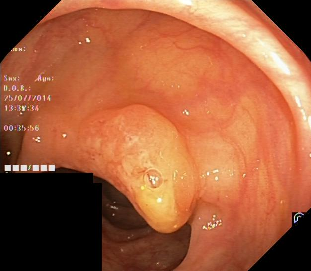 | 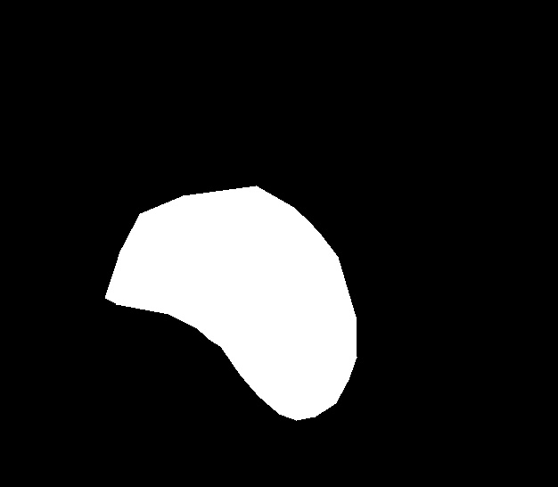 | 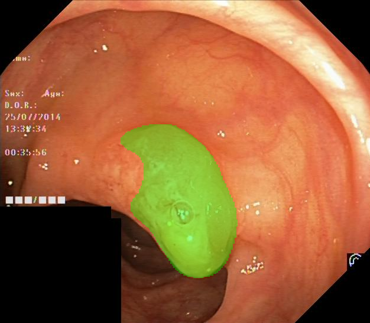 |

### Video Test — seq14 frames 30 & 31 (prompt: "medium irregular polyp")

(All 7 video-test sequences had been used as samples in earlier runs; for this
baseline a different frame range within seq14 was chosen.)

| Frame 1 (segmented) | Frame 2 (unused without correspondence) | Ground Truth (frame 1) | Prediction (overlay on frame 1) |
|---------------------|------------------------------------------|------------------------|---------------------------------|
| 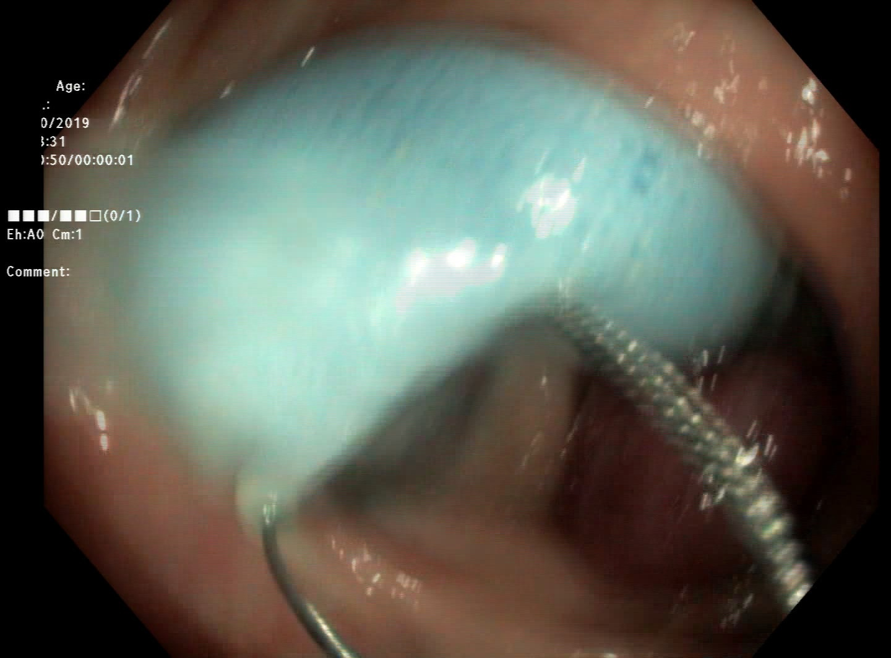 | 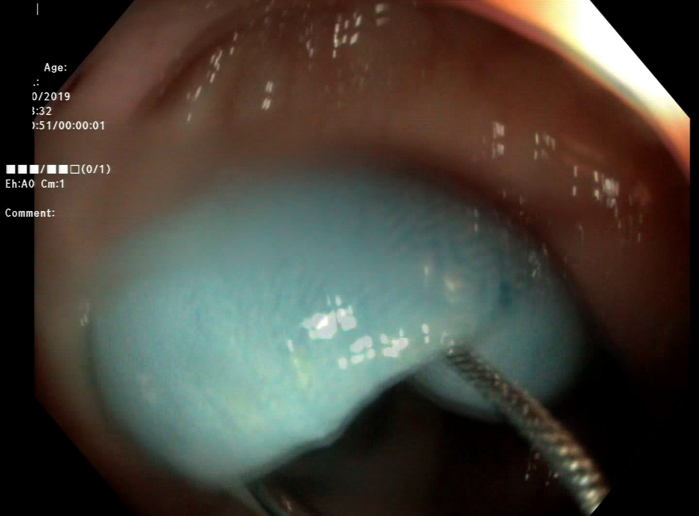 |  | 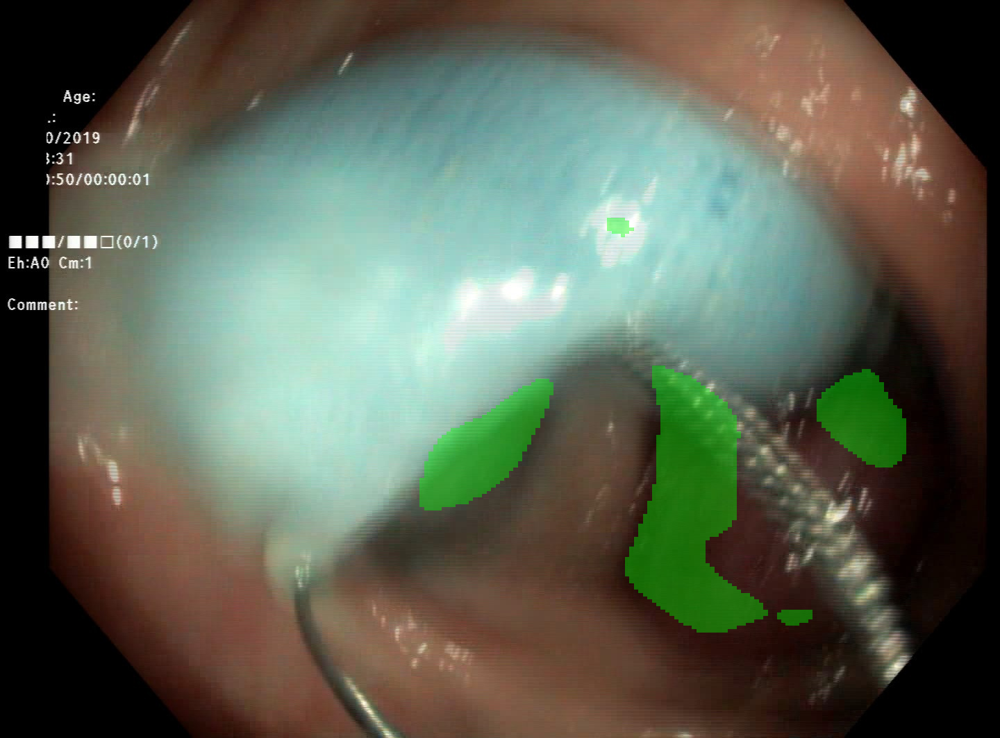 |

## Training Curves

Overview of the full run (best image-val Dice marked at epoch 38):

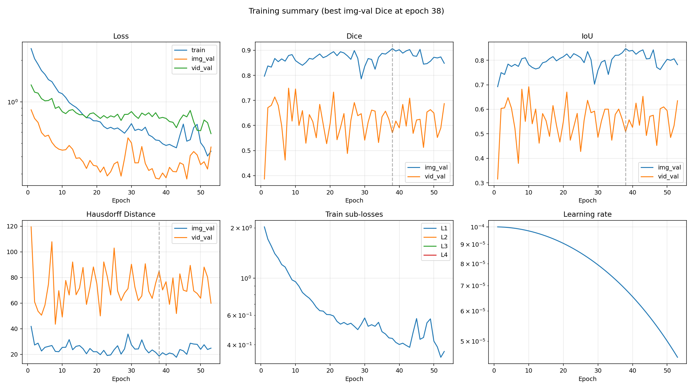

Individual plots:

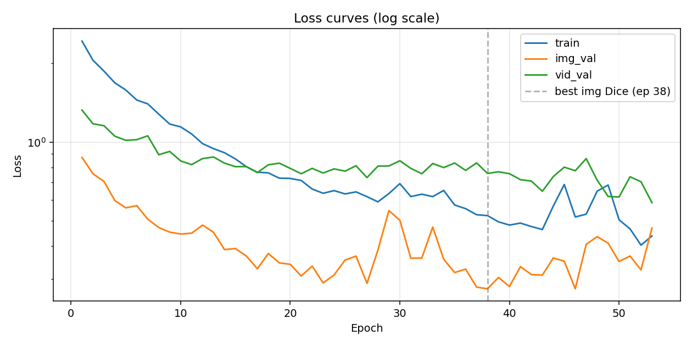

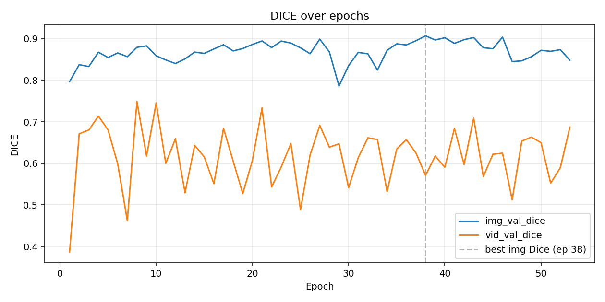

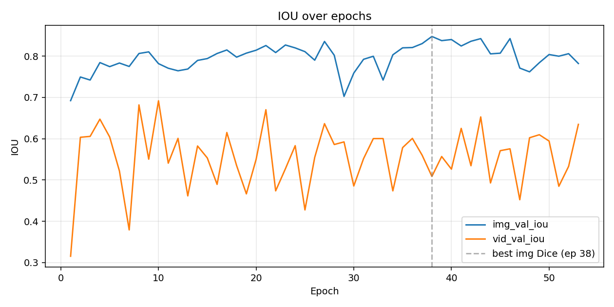

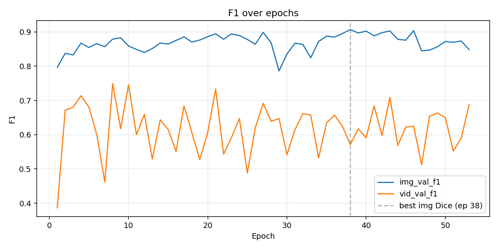

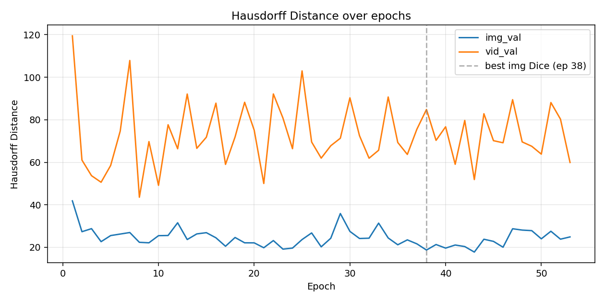

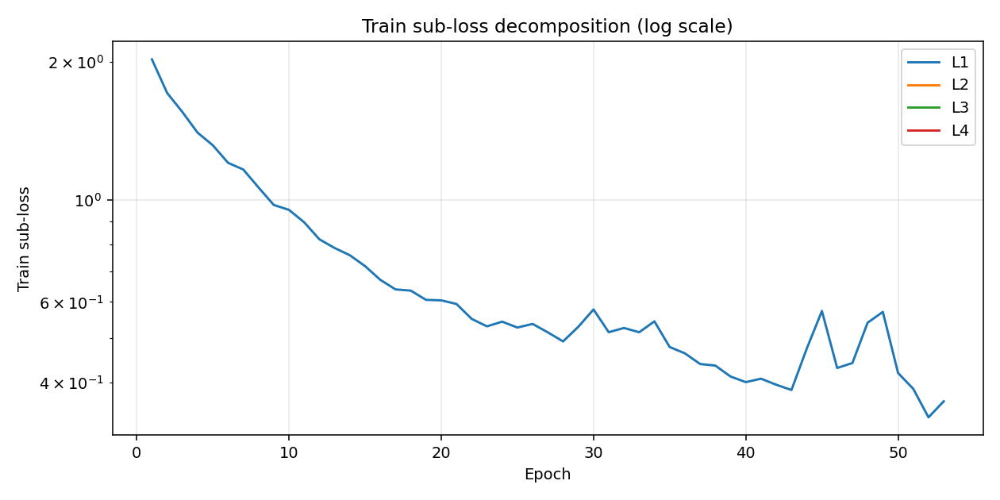

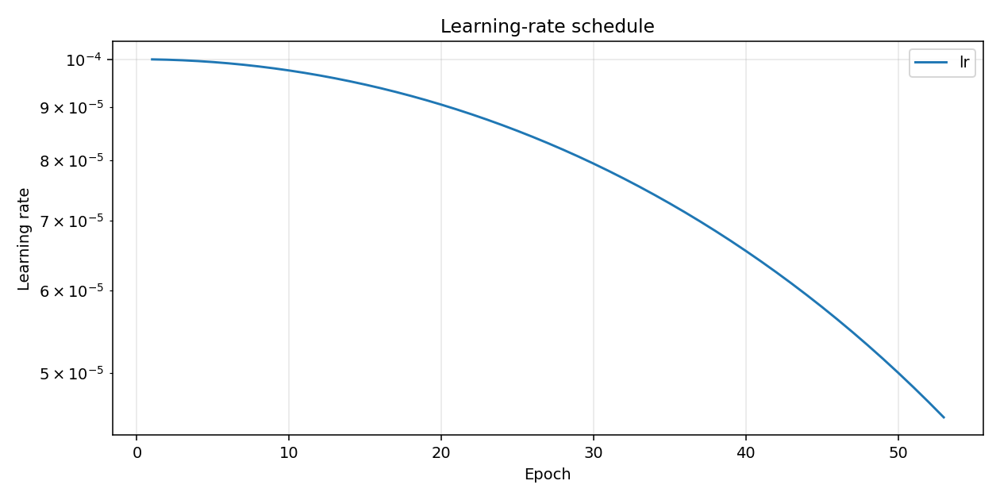

## Training Log

```
Epoch 001/100 (30.3s) | LR: 1.00e-04 | Train Loss: 2.4335 (L1: 2.0280)
  Img Val  | Loss: 0.8732 | Dice: 0.7965 | IoU: 0.6922 | F1: 0.7965 | HD: 41.85
  Vid Val  | Loss: 1.3252 | Dice: 0.3864 | IoU: 0.3154 | F1: 0.3864 | HD: 119.45
  -> New best model saved (Dice: 0.7965)
Epoch 002/100 (23.6s) | LR: 9.99e-05 | Train Loss: 2.0558 (L1: 1.7132)
  Img Val  | Loss: 0.7566 | Dice: 0.8374 | IoU: 0.7494 | F1: 0.8374 | HD: 27.34
  Vid Val  | Loss: 1.1745 | Dice: 0.6711 | IoU: 0.6035 | F1: 0.6711 | HD: 61.02
  -> New best model saved (Dice: 0.8374)
Epoch 003/100 (24.6s) | LR: 9.98e-05 | Train Loss: 1.8686 (L1: 1.5572)
  Img Val  | Loss: 0.7075 | Dice: 0.8328 | IoU: 0.7421 | F1: 0.8328 | HD: 28.78
  Vid Val  | Loss: 1.1552 | Dice: 0.6803 | IoU: 0.6056 | F1: 0.6803 | HD: 53.69
Epoch 004/100 (23.8s) | LR: 9.96e-05 | Train Loss: 1.6843 (L1: 1.4036)
  Img Val  | Loss: 0.5972 | Dice: 0.8673 | IoU: 0.7844 | F1: 0.8673 | HD: 22.65
  Vid Val  | Loss: 1.0529 | Dice: 0.7137 | IoU: 0.6473 | F1: 0.7137 | HD: 50.60
  -> New best model saved (Dice: 0.8673)
Epoch 005/100 (25.8s) | LR: 9.94e-05 | Train Loss: 1.5810 (L1: 1.3175)
  Img Val  | Loss: 0.5602 | Dice: 0.8546 | IoU: 0.7745 | F1: 0.8546 | HD: 25.52
  Vid Val  | Loss: 1.0153 | Dice: 0.6803 | IoU: 0.6043 | F1: 0.6803 | HD: 58.49
Epoch 006/100 (24.7s) | LR: 9.91e-05 | Train Loss: 1.4479 (L1: 1.2066)
  Img Val  | Loss: 0.5713 | Dice: 0.8656 | IoU: 0.7833 | F1: 0.8656 | HD: 26.24
  Vid Val  | Loss: 1.0212 | Dice: 0.5990 | IoU: 0.5219 | F1: 0.5990 | HD: 74.68
Epoch 007/100 (26.0s) | LR: 9.88e-05 | Train Loss: 1.4000 (L1: 1.1666)
  Img Val  | Loss: 0.5070 | Dice: 0.8566 | IoU: 0.7749 | F1: 0.8566 | HD: 26.95
  Vid Val  | Loss: 1.0568 | Dice: 0.4621 | IoU: 0.3792 | F1: 0.4621 | HD: 107.87
Epoch 008/100 (24.4s) | LR: 9.84e-05 | Train Loss: 1.2794 (L1: 1.0662)
  Img Val  | Loss: 0.4713 | Dice: 0.8791 | IoU: 0.8063 | F1: 0.8791 | HD: 22.35
  Vid Val  | Loss: 0.8946 | Dice: 0.7488 | IoU: 0.6819 | F1: 0.7488 | HD: 43.55
  -> New best model saved (Dice: 0.8791)
Epoch 009/100 (24.2s) | LR: 9.80e-05 | Train Loss: 1.1719 (L1: 0.9766)
  Img Val  | Loss: 0.4524 | Dice: 0.8827 | IoU: 0.8103 | F1: 0.8827 | HD: 22.12
  Vid Val  | Loss: 0.9209 | Dice: 0.6175 | IoU: 0.5505 | F1: 0.6175 | HD: 69.72
  -> New best model saved (Dice: 0.8827)
Epoch 010/100 (24.9s) | LR: 9.76e-05 | Train Loss: 1.1433 (L1: 0.9527)
  Img Val  | Loss: 0.4448 | Dice: 0.8588 | IoU: 0.7818 | F1: 0.8588 | HD: 25.48
  Vid Val  | Loss: 0.8469 | Dice: 0.7456 | IoU: 0.6919 | F1: 0.7456 | HD: 49.15
Epoch 011/100 (24.7s) | LR: 9.70e-05 | Train Loss: 1.0741 (L1: 0.8951)
  Img Val  | Loss: 0.4482 | Dice: 0.8488 | IoU: 0.7707 | F1: 0.8488 | HD: 25.56
  Vid Val  | Loss: 0.8200 | Dice: 0.5999 | IoU: 0.5408 | F1: 0.5999 | HD: 77.64
Epoch 012/100 (24.3s) | LR: 9.65e-05 | Train Loss: 0.9860 (L1: 0.8217)
  Img Val  | Loss: 0.4813 | Dice: 0.8401 | IoU: 0.7645 | F1: 0.8401 | HD: 31.54
  Vid Val  | Loss: 0.8646 | Dice: 0.6593 | IoU: 0.6008 | F1: 0.6593 | HD: 66.35
Epoch 013/100 (24.2s) | LR: 9.59e-05 | Train Loss: 0.9440 (L1: 0.7867)
  Img Val  | Loss: 0.4518 | Dice: 0.8513 | IoU: 0.7687 | F1: 0.8513 | HD: 23.65
  Vid Val  | Loss: 0.8767 | Dice: 0.5292 | IoU: 0.4616 | F1: 0.5292 | HD: 92.10
Epoch 014/100 (23.1s) | LR: 9.52e-05 | Train Loss: 0.9103 (L1: 0.7586)
  Img Val  | Loss: 0.3881 | Dice: 0.8676 | IoU: 0.7896 | F1: 0.8676 | HD: 26.30
  Vid Val  | Loss: 0.8306 | Dice: 0.6433 | IoU: 0.5824 | F1: 0.6433 | HD: 66.54
Epoch 015/100 (24.2s) | LR: 9.46e-05 | Train Loss: 0.8618 (L1: 0.7182)
  Img Val  | Loss: 0.3914 | Dice: 0.8645 | IoU: 0.7940 | F1: 0.8645 | HD: 26.88
  Vid Val  | Loss: 0.8053 | Dice: 0.6154 | IoU: 0.5534 | F1: 0.6154 | HD: 71.79
Epoch 016/100 (24.0s) | LR: 9.38e-05 | Train Loss: 0.8045 (L1: 0.6705)
  Img Val  | Loss: 0.3662 | Dice: 0.8752 | IoU: 0.8063 | F1: 0.8752 | HD: 24.48
  Vid Val  | Loss: 0.8057 | Dice: 0.5510 | IoU: 0.4895 | F1: 0.5510 | HD: 87.80
Epoch 017/100 (24.1s) | LR: 9.30e-05 | Train Loss: 0.7668 (L1: 0.6390)
  Img Val  | Loss: 0.3275 | Dice: 0.8853 | IoU: 0.8149 | F1: 0.8853 | HD: 20.50
  Vid Val  | Loss: 0.7642 | Dice: 0.6843 | IoU: 0.6151 | F1: 0.6843 | HD: 59.00
  -> New best model saved (Dice: 0.8853)
Epoch 018/100 (24.3s) | LR: 9.22e-05 | Train Loss: 0.7622 (L1: 0.6352)
  Img Val  | Loss: 0.3746 | Dice: 0.8704 | IoU: 0.7975 | F1: 0.8704 | HD: 24.62
  Vid Val  | Loss: 0.8186 | Dice: 0.6054 | IoU: 0.5350 | F1: 0.6054 | HD: 71.91
Epoch 019/100 (23.8s) | LR: 9.14e-05 | Train Loss: 0.7277 (L1: 0.6064)
  Img Val  | Loss: 0.3450 | Dice: 0.8762 | IoU: 0.8072 | F1: 0.8762 | HD: 22.12
  Vid Val  | Loss: 0.8303 | Dice: 0.5273 | IoU: 0.4665 | F1: 0.5273 | HD: 88.22
Epoch 020/100 (24.7s) | LR: 9.05e-05 | Train Loss: 0.7259 (L1: 0.6049)
  Img Val  | Loss: 0.3407 | Dice: 0.8860 | IoU: 0.8143 | F1: 0.8860 | HD: 22.09
  Vid Val  | Loss: 0.7930 | Dice: 0.6070 | IoU: 0.5502 | F1: 0.6070 | HD: 75.08
  -> New best model saved (Dice: 0.8860)
Epoch 021/100 (24.5s) | LR: 8.95e-05 | Train Loss: 0.7129 (L1: 0.5940)
  Img Val  | Loss: 0.3074 | Dice: 0.8944 | IoU: 0.8256 | F1: 0.8944 | HD: 19.79
  Vid Val  | Loss: 0.7566 | Dice: 0.7332 | IoU: 0.6702 | F1: 0.7332 | HD: 50.02
  -> New best model saved (Dice: 0.8944)
Epoch 022/100 (24.1s) | LR: 8.85e-05 | Train Loss: 0.6613 (L1: 0.5511)
  Img Val  | Loss: 0.3354 | Dice: 0.8785 | IoU: 0.8086 | F1: 0.8785 | HD: 23.17
  Vid Val  | Loss: 0.7933 | Dice: 0.5431 | IoU: 0.4738 | F1: 0.5431 | HD: 92.13
Epoch 023/100 (24.3s) | LR: 8.75e-05 | Train Loss: 0.6371 (L1: 0.5309)
  Img Val  | Loss: 0.2892 | Dice: 0.8941 | IoU: 0.8269 | F1: 0.8941 | HD: 19.15
  Vid Val  | Loss: 0.7614 | Dice: 0.5916 | IoU: 0.5274 | F1: 0.5916 | HD: 80.83
Epoch 024/100 (23.7s) | LR: 8.64e-05 | Train Loss: 0.6522 (L1: 0.5435)
  Img Val  | Loss: 0.3102 | Dice: 0.8893 | IoU: 0.8199 | F1: 0.8893 | HD: 19.63
  Vid Val  | Loss: 0.7897 | Dice: 0.6475 | IoU: 0.5832 | F1: 0.6475 | HD: 66.38
Epoch 025/100 (24.8s) | LR: 8.54e-05 | Train Loss: 0.6333 (L1: 0.5277)
  Img Val  | Loss: 0.3536 | Dice: 0.8779 | IoU: 0.8108 | F1: 0.8779 | HD: 23.65
  Vid Val  | Loss: 0.7740 | Dice: 0.4882 | IoU: 0.4276 | F1: 0.4882 | HD: 102.98
Epoch 026/100 (24.9s) | LR: 8.42e-05 | Train Loss: 0.6449 (L1: 0.5374)
  Img Val  | Loss: 0.3662 | Dice: 0.8638 | IoU: 0.7902 | F1: 0.8638 | HD: 26.76
  Vid Val  | Loss: 0.8116 | Dice: 0.6202 | IoU: 0.5549 | F1: 0.6202 | HD: 69.53
Epoch 027/100 (23.8s) | LR: 8.31e-05 | Train Loss: 0.6181 (L1: 0.5151)
  Img Val  | Loss: 0.2882 | Dice: 0.8988 | IoU: 0.8355 | F1: 0.8988 | HD: 20.23
  Vid Val  | Loss: 0.7312 | Dice: 0.6913 | IoU: 0.6364 | F1: 0.6913 | HD: 61.95
  -> New best model saved (Dice: 0.8988)
Epoch 028/100 (25.0s) | LR: 8.19e-05 | Train Loss: 0.5907 (L1: 0.4922)
  Img Val  | Loss: 0.3866 | Dice: 0.8681 | IoU: 0.8021 | F1: 0.8681 | HD: 24.27
  Vid Val  | Loss: 0.8091 | Dice: 0.6390 | IoU: 0.5860 | F1: 0.6390 | HD: 67.78
Epoch 029/100 (24.9s) | LR: 8.06e-05 | Train Loss: 0.6355 (L1: 0.5296)
  Img Val  | Loss: 0.5466 | Dice: 0.7860 | IoU: 0.7025 | F1: 0.7860 | HD: 35.89
  Vid Val  | Loss: 0.8103 | Dice: 0.6470 | IoU: 0.5923 | F1: 0.6470 | HD: 71.31
Epoch 030/100 (24.2s) | LR: 7.94e-05 | Train Loss: 0.6934 (L1: 0.5779)
  Img Val  | Loss: 0.5021 | Dice: 0.8352 | IoU: 0.7589 | F1: 0.8352 | HD: 27.48
  Vid Val  | Loss: 0.8482 | Dice: 0.5415 | IoU: 0.4856 | F1: 0.5415 | HD: 90.31
Epoch 031/100 (24.4s) | LR: 7.81e-05 | Train Loss: 0.6186 (L1: 0.5155)
  Img Val  | Loss: 0.3597 | Dice: 0.8669 | IoU: 0.7923 | F1: 0.8669 | HD: 24.15
  Vid Val  | Loss: 0.7933 | Dice: 0.6135 | IoU: 0.5517 | F1: 0.6135 | HD: 72.50
Epoch 032/100 (24.9s) | LR: 7.68e-05 | Train Loss: 0.6319 (L1: 0.5266)
  Img Val  | Loss: 0.3601 | Dice: 0.8635 | IoU: 0.7996 | F1: 0.8635 | HD: 24.29
  Vid Val  | Loss: 0.7563 | Dice: 0.6614 | IoU: 0.6003 | F1: 0.6614 | HD: 61.91
Epoch 033/100 (24.5s) | LR: 7.55e-05 | Train Loss: 0.6185 (L1: 0.5154)
  Img Val  | Loss: 0.4729 | Dice: 0.8245 | IoU: 0.7420 | F1: 0.8245 | HD: 31.37
  Vid Val  | Loss: 0.8279 | Dice: 0.6573 | IoU: 0.6004 | F1: 0.6573 | HD: 65.65
Epoch 034/100 (23.8s) | LR: 7.41e-05 | Train Loss: 0.6532 (L1: 0.5443)
  Img Val  | Loss: 0.3563 | Dice: 0.8719 | IoU: 0.8032 | F1: 0.8719 | HD: 24.40
  Vid Val  | Loss: 0.7987 | Dice: 0.5320 | IoU: 0.4738 | F1: 0.5320 | HD: 90.70
Epoch 035/100 (24.4s) | LR: 7.27e-05 | Train Loss: 0.5743 (L1: 0.4786)
  Img Val  | Loss: 0.3169 | Dice: 0.8875 | IoU: 0.8201 | F1: 0.8875 | HD: 21.19
  Vid Val  | Loss: 0.8315 | Dice: 0.6345 | IoU: 0.5785 | F1: 0.6345 | HD: 69.31
Epoch 036/100 (24.5s) | LR: 7.13e-05 | Train Loss: 0.5564 (L1: 0.4636)
  Img Val  | Loss: 0.3267 | Dice: 0.8848 | IoU: 0.8207 | F1: 0.8848 | HD: 23.50
  Vid Val  | Loss: 0.7792 | Dice: 0.6571 | IoU: 0.6008 | F1: 0.6571 | HD: 63.68
Epoch 037/100 (24.6s) | LR: 6.99e-05 | Train Loss: 0.5273 (L1: 0.4394)
  Img Val  | Loss: 0.2787 | Dice: 0.8950 | IoU: 0.8303 | F1: 0.8950 | HD: 21.62
  Vid Val  | Loss: 0.8323 | Dice: 0.6250 | IoU: 0.5601 | F1: 0.6250 | HD: 75.57
Epoch 038/100 (24.9s) | LR: 6.84e-05 | Train Loss: 0.5231 (L1: 0.4359)
  Img Val  | Loss: 0.2746 | Dice: 0.9067 | IoU: 0.8476 | F1: 0.9067 | HD: 18.71
  Vid Val  | Loss: 0.7584 | Dice: 0.5711 | IoU: 0.5088 | F1: 0.5711 | HD: 84.83
  -> New best model saved (Dice: 0.9067)
Epoch 039/100 (24.5s) | LR: 6.69e-05 | Train Loss: 0.4952 (L1: 0.4127)
  Img Val  | Loss: 0.3036 | Dice: 0.8967 | IoU: 0.8375 | F1: 0.8967 | HD: 21.31
  Vid Val  | Loss: 0.7697 | Dice: 0.6176 | IoU: 0.5569 | F1: 0.6176 | HD: 70.30
Epoch 040/100 (24.2s) | LR: 6.55e-05 | Train Loss: 0.4815 (L1: 0.4012)
  Img Val  | Loss: 0.2803 | Dice: 0.9022 | IoU: 0.8401 | F1: 0.9022 | HD: 19.62
  Vid Val  | Loss: 0.7569 | Dice: 0.5905 | IoU: 0.5263 | F1: 0.5905 | HD: 76.69
Epoch 041/100 (24.9s) | LR: 6.39e-05 | Train Loss: 0.4898 (L1: 0.4082)
  Img Val  | Loss: 0.3338 | Dice: 0.8886 | IoU: 0.8245 | F1: 0.8886 | HD: 21.08
  Vid Val  | Loss: 0.7180 | Dice: 0.6840 | IoU: 0.6250 | F1: 0.6840 | HD: 59.05
Epoch 042/100 (24.1s) | LR: 6.24e-05 | Train Loss: 0.4752 (L1: 0.3960)
  Img Val  | Loss: 0.3113 | Dice: 0.8975 | IoU: 0.8359 | F1: 0.8975 | HD: 20.35
  Vid Val  | Loss: 0.7092 | Dice: 0.5974 | IoU: 0.5346 | F1: 0.5974 | HD: 79.67
Epoch 043/100 (23.8s) | LR: 6.09e-05 | Train Loss: 0.4628 (L1: 0.3857)
  Img Val  | Loss: 0.3097 | Dice: 0.9027 | IoU: 0.8424 | F1: 0.9027 | HD: 17.76
  Vid Val  | Loss: 0.6482 | Dice: 0.7090 | IoU: 0.6528 | F1: 0.7090 | HD: 51.87
Epoch 044/100 (26.3s) | LR: 5.94e-05 | Train Loss: 0.5693 (L1: 0.4744)
  Img Val  | Loss: 0.3606 | Dice: 0.8782 | IoU: 0.8055 | F1: 0.8782 | HD: 23.80
  Vid Val  | Loss: 0.7380 | Dice: 0.5685 | IoU: 0.4929 | F1: 0.5685 | HD: 82.83
Epoch 045/100 (25.5s) | LR: 5.78e-05 | Train Loss: 0.6881 (L1: 0.5734)
  Img Val  | Loss: 0.3499 | Dice: 0.8758 | IoU: 0.8071 | F1: 0.8758 | HD: 22.79
  Vid Val  | Loss: 0.8018 | Dice: 0.6219 | IoU: 0.5711 | F1: 0.6219 | HD: 70.16
Epoch 046/100 (24.0s) | LR: 5.63e-05 | Train Loss: 0.5170 (L1: 0.4308)
  Img Val  | Loss: 0.2746 | Dice: 0.9036 | IoU: 0.8425 | F1: 0.9036 | HD: 20.05
  Vid Val  | Loss: 0.7768 | Dice: 0.6246 | IoU: 0.5756 | F1: 0.6246 | HD: 69.16
Epoch 047/100 (27.6s) | LR: 5.47e-05 | Train Loss: 0.5298 (L1: 0.4415)
  Img Val  | Loss: 0.4062 | Dice: 0.8448 | IoU: 0.7710 | F1: 0.8448 | HD: 28.73
  Vid Val  | Loss: 0.8644 | Dice: 0.5124 | IoU: 0.4523 | F1: 0.5124 | HD: 89.44
Epoch 048/100 (24.1s) | LR: 5.31e-05 | Train Loss: 0.6488 (L1: 0.5407)
  Img Val  | Loss: 0.4346 | Dice: 0.8466 | IoU: 0.7619 | F1: 0.8466 | HD: 28.10
  Vid Val  | Loss: 0.7151 | Dice: 0.6536 | IoU: 0.6024 | F1: 0.6536 | HD: 69.58
Epoch 049/100 (23.4s) | LR: 5.16e-05 | Train Loss: 0.6849 (L1: 0.5708)
  Img Val  | Loss: 0.4107 | Dice: 0.8565 | IoU: 0.7840 | F1: 0.8565 | HD: 27.84
  Vid Val  | Loss: 0.6195 | Dice: 0.6631 | IoU: 0.6097 | F1: 0.6631 | HD: 67.52
Epoch 050/100 (24.2s) | LR: 5.00e-05 | Train Loss: 0.5041 (L1: 0.4201)
  Img Val  | Loss: 0.3492 | Dice: 0.8720 | IoU: 0.8039 | F1: 0.8720 | HD: 23.99
  Vid Val  | Loss: 0.6165 | Dice: 0.6498 | IoU: 0.5944 | F1: 0.6498 | HD: 63.82
Epoch 051/100 (24.0s) | LR: 4.84e-05 | Train Loss: 0.4655 (L1: 0.3879)
  Img Val  | Loss: 0.3665 | Dice: 0.8694 | IoU: 0.7998 | F1: 0.8694 | HD: 27.56
  Vid Val  | Loss: 0.7367 | Dice: 0.5521 | IoU: 0.4848 | F1: 0.5521 | HD: 88.10
Epoch 052/100 (25.5s) | LR: 4.69e-05 | Train Loss: 0.4034 (L1: 0.3362)
  Img Val  | Loss: 0.3244 | Dice: 0.8734 | IoU: 0.8059 | F1: 0.8734 | HD: 23.83
  Vid Val  | Loss: 0.7049 | Dice: 0.5897 | IoU: 0.5331 | F1: 0.5897 | HD: 80.30
Epoch 053/100 (24.5s) | LR: 4.53e-05 | Train Loss: 0.4373 (L1: 0.3644)
  Img Val  | Loss: 0.4689 | Dice: 0.8481 | IoU: 0.7821 | F1: 0.8481 | HD: 24.89
  Vid Val  | Loss: 0.5864 | Dice: 0.6872 | IoU: 0.6348 | F1: 0.6872 | HD: 59.90

Early stopping: Val Dice did not improve for 15 epochs.

Training complete. Best validation Dice: 0.9067```
