# Model Architecture — Polyp Segmentation (Experiments / Ablation Variant)

This document is a deep, end-to-end walkthrough of every module that composes the polyp segmentation model in this repository. `project-experiments/` is the **experimental / ablation-friendly** variant of `project/`: the same overall pipeline, but rewired so that the encoder backbone, the prompt-guided attention path, and the cross-frame correspondence path are all independently switchable from `configs/config.yaml`.

> **Companion doc.** The non-experimental sibling `project/model_architecture.md` is the canonical, deep reference for the *fixed* ViT pipeline. This document focuses on what is new in `project-experiments/` and, where modules are byte-identical, recaps them more briefly and points you to the sibling doc for the full math.

---

## 1. Bird's-eye view

The model is a multi-modal, multi-scale encoder–decoder for binary polyp segmentation. Compared to `project/`, three runtime switches control the graph topology:

| Config flag                                | Type       | Purpose                                                          |
|--------------------------------------------|------------|------------------------------------------------------------------|
| `model.encoder_type`                       | str        | `vit` (ViT-Base) or one of `resnet50 / vgg16 / densenet121 / inception_v3` |
| `model.use_prompt_guided_attention`        | bool       | Turn the BioMed-CLIP text encoder + PGA on/off                   |
| `correspondence.enabled`                   | bool       | Turn the CEM + CAM cross-frame modules on/off                    |

Together with the four loss weights `lambda_1..lambda_4`, these flags define an entire ablation grid:

```
                 text prompt (str)              [optional, gated by use_prompt_guided_attention]
                        |
                        v
              BioMedCLIP text encoder (frozen)  [optional]
                        |
                        v
                  text_embedding (B, 512)
                        |
   image  ->  Encoder  ->  features1 {f1..f4} ----+
                                                  |
                                                  | (single image path)
                                                  v
                                Prompt-Guided Attention   [optional]
                                                  |
                                                  v
                                       UNet-style Decoder
                                                  |
                                                  v
                                       pred_mask (B, 1, 224, 224)


   image  ->  Encoder  ->  features1 {f1..f4} \
                                                \
                                                 Cross-Frame Correspondence [optional]
                                                /        (CEM + CAM)
   image2 ->  Encoder  ->  features2 {f1..f4} /
                                                  |
                                                  v
                                       f_enhanced {f1..f4}
                                                  |
                                                  v
                                Prompt-Guided Attention   [optional]
                                                  |
                                                  v
                                       UNet-style Decoder
                                                  |
                                                  v
                                       pred_mask (B, 1, 224, 224)
```

`Encoder` is whichever backbone `model.encoder_type` selects. The selected backbone always produces a dictionary `{f1, f2, f3, f4}` of `(B, 768, 14, 14)` feature maps regardless of which architecture it is — the CNN wrapper unifies them to that shape. Bypassing PGA simply routes the encoder/correspondence features straight to the decoder; bypassing correspondence keeps `images2` unused.

Defaults (from `configs/config.yaml`):
- input image size `224 × 224`
- `model.encoder_type: inception_v3`
- ViT patch size `16` ⇒ token grid `14 × 14`
- `encoder_dim = 768`, `target_size = 14` (CNN features bilinearly resized to this)
- `text_dim = 512`
- `decoder_channels = [512, 256, 128, 64]`
- `num_heads = 8`
- `correspondence.enabled = true`, `fusion_mode = add`
- `use_prompt_guided_attention = true`
- `lambda = (1.2, 0.5, 0.5, 0.8)`

---

## 2. Relationship to `project/`

`project-experiments/` reuses *all* shared modules byte-for-byte and changes only what is needed to make the pipeline configurable.

| File                                          | vs `project/` | Notes                                                       |
|-----------------------------------------------|---------------|-------------------------------------------------------------|
| `models/vit_encoder.py`                       | identical     | ViT-Base with multi-scale taps                              |
| `models/decoder.py`                           | identical     | UNet-style decoder, `14 → 224`                              |
| `models/cross_frame_correspondence.py`        | identical     | CEM + CAM modules                                           |
| `models/prompt_guided_attention.py`           | identical     | text→visual cross-attention blocks                          |
| `models/cnn_encoder.py`                       | **new**       | unified CNN backbone wrapper                                |
| `models/segmentation_model.py`                | rewritten     | adds `encoder_type` / PGA / correspondence toggles          |
| `models/losses.py`                            | extended      | adds `vl_loss_kwargs` / `correspondence_loss_kwargs` helpers; loss classes unchanged |
| `models/__init__.py`                          | extended      | exports `CNNEncoder`                                        |
| `train.py`, `test_video.py`                   | small diffs   | use the new kwargs helpers                                  |
| `data/*`, `utils/*`, `predict.py`, `predict_video.py`, `test.py` | identical | unchanged                                                   |
| `configs/config.yaml`                         | extended      | adds `encoder_type`, `cnn_model`, `cnn_pretrained`, `target_size`, `use_prompt_guided_attention`, `correspondence.enabled`, `early_stopping_patience: 15` |
| `configs/config_baseline_no_modules.yaml`     | **new**       | encoder + decoder only, L1 only                             |
| `checkpoints_base_{vit,resnet,vgg,dense,incept}/` | **new**       | per-backbone runs from this ablation framework              |

For the deep math of the *shared* modules (ViT encoder, CEM/CAM, PGA cross-attention math, UNet decoder stage-by-stage shapes, the four loss formulations) refer to `project/model_architecture.md` sections 3, 5, 6, 7, 9. Below we recap them briefly and concentrate on what is new.

---

## 3. Inputs

Same as `project/`:

| Argument        | Shape / Type                           | Meaning                                  |
|-----------------|-----------------------------------------|------------------------------------------|
| `images`        | `(B, 3, 224, 224)` float tensor         | Primary frame, ImageNet-normalized       |
| `text_prompts`  | `list[str]` of length `B`               | One prompt per image (ignored when no text encoder) |
| `images2`       | `(B, 3, 224, 224)` or `None`            | Optional second frame (used only when correspondence is enabled) |

Image preprocessing (`data/transforms.py`, `data/video_dataset.py`) is unchanged: resize to `224 × 224`, optional joint flip / rotation / color-jitter at train time, ImageNet normalization. Masks are binarised with `> 128/255` and returned as `(1, 224, 224)` float tensors.

Prompts are pre-computed by `data/prompt_generator.py` from each ground-truth mask, producing one of seven categories (`normal mucosa`, `{small/medium/large} {round/irregular} polyp`) based on `area_ratio` and circularity. They are cached in `data/prompt_cache.json` and `data/video_prompt_cache.json`.

When `use_prompt_guided_attention: false`, `text_prompts` are still accepted by the signature for API compatibility but the model neither tokenizes nor uses them.

---

## 4. Visual encoder

This variant supports **five** encoders. The `model.encoder_type` flag picks one and the rest of the pipeline is agnostic — every encoder produces the same dict contract:

```
features = {
    "f1": (B, 768, 14, 14),
    "f2": (B, 768, 14, 14),
    "f3": (B, 768, 14, 14),
    "f4": (B, 768, 14, 14),
}
```

### 4.1 ViT encoder — `models/vit_encoder.py::ViTEncoder`

Identical to the production project. `timm.create_model("vit_base_patch16_224", pretrained=True)`. A `forward_hook` is registered on each of the blocks listed in `model.feature_blocks` (default `[3, 6, 9, 12]`). For each tapped block the hook stores the output tokens; the encoder strips the `[CLS]` token, permutes from sequence to spatial layout, and reshapes to `(B, 768, 14, 14)`:

```
tokens        : (B, 197, 768)
drop CLS      : (B, 196, 768)
permute(0,2,1): (B, 768, 196)
reshape       : (B, 768, 14, 14)
```

All four ViT taps share the same `14 × 14` spatial size because the ViT does not downsample — they differ only in semantic depth.

### 4.2 CNN encoder — `models/cnn_encoder.py::CNNEncoder` *(new)*

A unified wrapper for four classical CNN backbones from `timm`. The point is to give the rest of the pipeline a single, shape-stable interface so the ViT/CNN choice becomes a config flag.

```python
backbone = timm.create_model(
    model_name,                     # "resnet50" | "vgg16" | "densenet121" | "inception_v3"
    pretrained=True,
    features_only=True,
    out_indices=(1, 2, 3, 4),       # four hierarchical stages
)
```

`features_only=True` makes `timm` return a list of intermediate feature maps from the chosen stages instead of a logits vector. The exact channel widths and spatial sizes vary by backbone:

| Backbone        | Stage channels (read from `feature_info.channels()`)            | Native spatial sizes for 224² input  |
|-----------------|------------------------------------------------------------------|--------------------------------------|
| `resnet50`      | `[256, 512, 1024, 2048]`                                         | `56, 28, 14, 7`                      |
| `vgg16`         | `[128, 256, 512, 512]` (typical timm config)                     | `112, 56, 28, 14`                    |
| `densenet121`   | `[128, 256, 512, 1024]` (typical)                                | `56, 28, 14, 7`                      |
| `inception_v3`  | `[192, 288, 768, 2048]` (typical, for 299² input — also runs at 224²) | varies; 5–25                    |

To make these compatible with the rest of the model, `CNNEncoder` does **two things per stage**:

1. **Channel projection** with a `Conv1×1 → BatchNorm → ReLU` block that maps the stage's native channel width to `out_dim = 768`.
2. **Spatial resize** to `target_size × target_size = 14 × 14` via bilinear interpolation if the stage's native resolution does not already match.

```python
def forward(self, x):
    feats = self.backbone(x)              # list[ (B, C_i, H_i, W_i) ]
    out = {}
    for i, (f, proj) in enumerate(zip(feats, self.projs), start=1):
        f = proj(f)                       # 1x1 conv: C_i -> 768  (+ BN + ReLU)
        if f.shape[-1] != self.target_size or f.shape[-2] != self.target_size:
            f = F.interpolate(f, (14, 14), mode="bilinear", align_corners=False)
        out[f"f{i}"] = f
    return out
```

This guarantees that `f1..f4` always come out as `(B, 768, 14, 14)` no matter which CNN backbone was selected. Conceptually it gives every backbone a "ViT-Base-shaped" output so the cross-frame correspondence, prompt-guided attention, and decoder do not have to know which encoder produced the features.

Two semantic differences from the ViT encoder:
- **CNN stages encode true multi-resolution features** (the bilinear upscale to `14 × 14` reintroduces some redundancy at the coarsest stages). ViT taps encode multi-*depth* features at fixed `14 × 14`.
- **CNN stages are actually shallower-to-deeper**: `f1` is a low-level edge/texture map and `f4` is a high-level semantic map. ViT taps `[3, 6, 9, 12]` follow the same shallow→deep convention but inside a single architecture.

The encoder is fully trainable; no parameters are frozen.

### 4.3 The unified contract

After `forward()`, every encoder returns the same dictionary shape, so all downstream modules (`CrossFrameCorrespondence`, `PromptGuidedAttention`, `UNetDecoder`) work unchanged. This is the single design decision that makes the rest of the pipeline backbone-agnostic.

---

## 5. Text encoder — `models/segmentation_model.py::BioMedCLIPTextEncoder` *(conditional)*

Only instantiated when `model.use_prompt_guided_attention: true`. When the flag is `false`, `self.text_encoder = None` and no text-side parameters are loaded at all.

When present, it is identical to the production version: a frozen `microsoft/BiomedCLIP-PubMedBERT_256-vit_base_patch16_224` text tower from `open_clip`. For each prompt it tokenizes, runs `encode_text` under `torch.no_grad()`, and L2-normalises to a `(B, 512)` unit-vector. All BioMed-CLIP parameters have `requires_grad=False`.

---

## 6. Cross-frame correspondence — `models/cross_frame_correspondence.py` *(conditional)*

Module file is identical to `project/`. It is *instantiated* only when `correspondence.enabled: true`, and *invoked* only when both `correspondence is not None` and `images2 is not None`.

Per scale (`f1..f4`):

**CEM (Correspondence Extraction Module).** Cross-attention from frame 1 (queries) to frame 2 (keys/values):

```
q = Conv1x1(ft1).flatten(2).permute(0,2,1)            # (B, 196, 768)
k = ft2.flatten(2).permute(0,2,1)
v = ft2.flatten(2).permute(0,2,1)
attn = MultiHeadAttention(q, k, v)                    # num_heads=8
out  = LayerNorm(attn + q)
f_corr = out.permute(0,2,1).reshape(B, 768, 14, 14)
```

**CAM (Correspondence Adaptation Module).** Fuses `f_corr` back into `ft1` (add or sigmoid-gated multiply) and runs a small Transformer block (self-attention + FFN + 2× LayerNorm):

```
fused = ft1 + f_corr           if fusion_mode == "add"
fused = ft1 * sigmoid(Conv1x1(f_corr))  if fusion_mode == "multiply"
x = LayerNorm(x + SelfAttention(x, x, x))
x = LayerNorm(x + FFN(x))      # 768 -> 3072 -> 768
```

The `CrossFrameCorrespondence` module owns four `(CEM, CAM)` pairs and returns two dicts `{f_corr, f_enhanced}` of `(B, 768, 14, 14)` per scale. `f_enhanced` is the input to the next stage; `f_corr` and `features2` are also returned to the loss functions for L2/L3.

When the toggle is off, `corr_outputs = None` is returned by the model and `features1` flows directly into PGA / the decoder.

---

## 7. Prompt-Guided Attention — `models/prompt_guided_attention.py` *(conditional)*

Module file identical to `project/`. Only instantiated when `use_prompt_guided_attention: true`. Per scale:

```
v = Conv1x1(visual_feat).flatten(2).permute(0,2,1)    # (B, 196, 768)
t = Linear(512 -> 768)(text_embedding).unsqueeze(1)   # (B,   1, 768)

attn, _ = MultiHeadAttention(q=v, k=t, v=t)           # cross-attn, num_heads=8
v       = LayerNorm(v + attn)
v       = LayerNorm(v + FFN(v))                       # 768 -> 3072 -> 768

guided  = v.permute(0,2,1).reshape(B, 768, 14, 14)
```

`PromptGuidedAttention` holds four such blocks, one per scale. When the toggle is off, `prompt_attention = None` and the model treats `guided_features = features_for_attention` (i.e. raw encoder/correspondence features) — the decoder consumes them directly. **In that mode the model has no path through which `text_embedding` could affect predictions, so L4 cannot be computed.**

---

## 8. UNet-style decoder — `models/decoder.py`

Identical to `project/`. Starts from `guided_features["f4"]` (the deepest scale) and runs four upsampling stages with the channel ladder `[512, 256, 128, 64]`. The first three stages take a channel-projected, bilinearly-resized skip from `f3, f2, f1`; the last stage has no skip. A final `Conv1×1 (64 → 1)` produces `(B, 1, 224, 224)` raw logits.

| Stage | Input (in_ch, H, W) | Skip src | Skip ch (after `skip_proj`) | Output (out_ch, H, W) |
|-------|---------------------|----------|------------------------------|-----------------------|
| 0     | (768,  14, 14)      | `f3`     | 512                          | (512, 28, 28)         |
| 1     | (512,  28, 28)      | `f2`     | 256                          | (256, 56, 56)         |
| 2     | (256,  56, 56)      | `f1`     | 128                          | (128, 112, 112)       |
| 3     | (128, 112, 112)     | none     | —                            | (64, 224, 224)        |

No sigmoid is applied inside the model; sigmoid is applied at inference and inside the Dice term of the loss, while BCE uses logits.

---

## 9. Pipeline assembly — `models/segmentation_model.py::PolypSegmentationModel`

This file is the main divergence from `project/`. The constructor reads three flags and conditionally instantiates each component:

```python
enc_type = model_cfg.get("encoder_type", "vit")
if enc_type == "vit":
    self.encoder = ViTEncoder(...)
else:
    self.encoder = CNNEncoder(model_name=model_cfg["cnn_model"],
                              out_dim=model_cfg["encoder_dim"],
                              target_size=model_cfg.get("target_size", 14))

if self.use_prompt_guided_attention:        # model.use_prompt_guided_attention
    self.text_encoder      = BioMedCLIPTextEncoder()
    self.prompt_attention  = PromptGuidedAttention(...)
else:
    self.text_encoder      = None
    self.prompt_attention  = None

self.decoder = UNetDecoder(...)             # always present

if self.use_correspondence:                 # correspondence.enabled
    self.correspondence = CrossFrameCorrespondence(...)
else:
    self.correspondence = None
```

The forward pass mirrors that conditional structure:

```python
def forward(self, images, text_prompts, images2=None):
    features1 = self.encoder(images)

    text_embedding = (
        self.text_encoder(text_prompts) if self.text_encoder is not None else None
    )

    corr_outputs = None
    if self.correspondence is not None and images2 is not None:
        features2          = self.encoder(images2)            # Siamese
        f_corr, f_enhanced = self.correspondence(features1, features2)
        corr_outputs = {
            "f_corr":     f_corr,
            "f_enhanced": f_enhanced,
            "features1":  features1,
            "features2":  features2,
        }
        features_for_attention = f_enhanced
    else:
        features_for_attention = features1

    if self.prompt_attention is not None:
        guided_features = self.prompt_attention(features_for_attention, text_embedding)
    else:
        guided_features = features_for_attention              # straight-through

    pred_mask = self.decoder(guided_features)
    return pred_mask, guided_features, text_embedding, corr_outputs
```

Important corner cases:

- **When PGA is off**, `text_embedding` is `None` and `guided_features` is whatever entered (`features1` or `f_enhanced`). The decoder then operates directly on encoder/correspondence features.
- **When correspondence is off**, `corr_outputs` is always `None`, regardless of whether `images2` is provided. The Siamese encoder is never called twice.
- **When both are off**, the model degenerates to `Encoder → UNet decoder` — i.e. the canonical encoder/decoder baseline used by `configs/config_baseline_no_modules.yaml`.
- The encoder is shared (Siamese) when correspondence is on: the same parameters process both `images` and `images2` and accumulate gradients from both calls.

---

## 10. Losses — `models/losses.py`

The four loss classes (`DiceBCELoss`, `TemporalLoss`, `FeatureCorrespondenceLoss`, `VisionLanguageAlignmentLoss`) and the `CombinedLoss` aggregator are **byte-identical** to `project/`. The aggregator already supports computing only those terms whose inputs are passed:

```
Loss = lambda_1 · DiceBCE
     + lambda_2 · Temporal InfoNCE         (only if f_corr & features2 given)
     + lambda_3 · Feature-Corr InfoNCE     (only if f_enhanced & features1 given)
     + lambda_4 · VL InfoNCE               (only if visual_features & text_embedding given)
```

Defaults `lambda = (1.2, 0.5, 0.5, 0.8)`. All three contrastive losses use symmetric InfoNCE with a learnable, CLIP-style temperature, and fall back to plain cosine when batch size is `1`. See `project/model_architecture.md` section 9 for the full math.

### 10.1 New helpers — `vl_loss_kwargs` and `correspondence_loss_kwargs`

To make conditional loss selection idiomatic from the training loop, this variant adds two trivial helpers:

```python
def vl_loss_kwargs(text_embedding, guided_features):
    """Omit VL inputs when the model has no text path (skips L4 in CombinedLoss)."""
    if text_embedding is None:
        return {}
    return {"visual_features": guided_features["f4"],
            "text_embedding":  text_embedding}

def correspondence_loss_kwargs(corr_outputs):
    """Omit L2/L3 inputs when correspondence is disabled or absent."""
    if corr_outputs is None:
        return {}
    return {"f_corr":     corr_outputs["f_corr"],
            "features2":  corr_outputs["features2"],
            "f_enhanced": corr_outputs["f_enhanced"],
            "features1":  corr_outputs["features1"]}
```

Then `train.py` and `test_video.py` simply do:

```python
loss, loss_dict = criterion(
    pred_mask=pred_mask,
    target_mask=target,
    **vl_loss_kwargs(text_embedding, guided_features),
    **correspondence_loss_kwargs(corr_outputs),
)
```

If PGA is off ⇒ `text_embedding is None` ⇒ no VL kwargs ⇒ L4 not computed.
If correspondence is off ⇒ `corr_outputs is None` ⇒ no L2/L3 kwargs ⇒ L2/L3 not computed.

This is the key plumbing change that lets the same training script handle every cell of the ablation grid.

### 10.2 Loss-term activation matrix

What is actually computed depends on (a) the flags and (b) whether the current batch is from the image or the video loader:

| Configuration                                                | Branch | L1 | L2 | L3 | L4 |
|--------------------------------------------------------------|--------|----|----|----|----|
| Full (`config.yaml`, both toggles on), image batch           | image  | ✅ |    |    | ✅ |
| Full (`config.yaml`, both toggles on), video batch           | video  | ✅ | ✅ | ✅ | ✅ |
| `--no-video` with full config                                | image  | ✅ |    |    | ✅ |
| `correspondence.enabled: false`, PGA on                      | both   | ✅ |    |    | ✅ |
| `use_prompt_guided_attention: false`, correspondence on      | image  | ✅ |    |    |    |
| `use_prompt_guided_attention: false`, correspondence on      | video  | ✅ | ✅ | ✅ |    |
| Baseline (`config_baseline_no_modules.yaml`, both off)       | image  | ✅ |    |    |    |
| Baseline, video batch                                        | video  | ✅ |    |    |    |

Even when a loss term is not computed, its `lambda_i` is still read from the config; setting it to `0` (as the baseline config does) is a defensive, documenting-the-intent choice but not strictly required.

---

## 11. Configuration matrix

The repository ships with two configs that occupy opposite corners of the ablation grid.

### 11.1 `configs/config.yaml` — full pipeline

```yaml
model:
  encoder_type: inception_v3        # any of: vit, resnet50, vgg16, densenet121, inception_v3
  vit_model: vit_base_patch16_224   # used iff encoder_type == vit
  vit_pretrained: true
  cnn_model: inception_v3           # used iff encoder_type != vit
  cnn_pretrained: true
  feature_blocks: [3, 6, 9, 12]     # ViT only
  encoder_dim: 768
  target_size: 14
  text_dim: 512
  decoder_channels: [512, 256, 128, 64]
  num_heads: 8
  use_prompt_guided_attention: true

correspondence:
  enabled: true
  fusion_mode: add
  num_heads: 8

loss: { lambda_1: 1.2, lambda_2: 0.5, lambda_3: 0.5, lambda_4: 0.8 }
```

### 11.2 `configs/config_baseline_no_modules.yaml` — encoder + decoder only

```yaml
model:
  encoder_type: vit
  use_prompt_guided_attention: false

correspondence:
  enabled: false

loss: { lambda_1: 1.2, lambda_2: 0.0, lambda_3: 0.0, lambda_4: 0.0 }
training:
  save_dir: ./checkpoints_baseline
```

This degenerates the model to a vanilla `ViT → UNet decoder` (or any other backbone if you switch `encoder_type`) trained only with Dice + BCE. It is the natural baseline against which the contribution of correspondence and prompt-guided attention is measured.

### 11.3 Per-encoder ablation

The `checkpoints_base_{vit, resnet, vgg, dense, incept}/` directories indicate the most common ablation in this repo: hold the rest of the pipeline constant and sweep `model.encoder_type` ∈ `{vit, resnet50, vgg16, densenet121, inception_v3}`. Each run writes its own `metrics.jsonl`, `results.md`, `plots/`, and `samples/`.

To switch backbones you only change two keys:

```yaml
model:
  encoder_type: resnet50
  cnn_model:    resnet50
training:
  save_dir: ./checkpoints_base_resnet
```

The rest of the config — encoder dim, target size, decoder channels, losses — stays the same precisely because the `CNNEncoder` wrapper unifies the output contract.

---

## 12. Training flow — `train.py`

Same overall structure as the production script; the only difference is that loss kwargs are gated through the helpers from §10.1.

### 12.1 Optimization

```
optimizer = AdamW( model.parameters() ⊕ criterion.parameters(), lr=1e-4, wd=1e-4 )
scheduler = CosineAnnealingLR(T_max = epochs)        # default 100
```

The criterion's parameters (visual/text projection layers and the three `logit_scale`s) are added to the optimizer alongside model weights — but if PGA is off, the VL projections still exist inside `CombinedLoss` and receive zero gradient (their L4 is never computed). That is harmless: they cost a few hundred kilobytes of state and never update.

### 12.2 Mixed training step (`train_one_epoch_mixed`)

For each mini-batch:

1. Pull a `seg_batch` from the image loader.
2. Pull a `vid_batch` from the video loader (restart on `StopIteration`).
3. **Image forward** with `images2=None`:
   ```python
   pred, guided, txt, _ = model(images, prompts, images2=None)
   seg_loss, seg_d = criterion(
       pred_mask=pred, target_mask=masks,
       **vl_loss_kwargs(txt, guided),
   )
   ```
4. **Video forward** with `images2=vid_imgs2`:
   ```python
   vpred, vguided, vtxt, corr = model(vid_imgs1, vid_prompts, images2=vid_imgs2)
   vid_loss, vid_d = criterion(
       pred_mask=vpred, target_mask=vid_masks1,
       **vl_loss_kwargs(vtxt, vguided),
       **correspondence_loss_kwargs(corr),
   )
   ```
5. **Combined backward**: `loss = seg_loss + vid_loss`, `loss.backward()`, `optimizer.step()`. Both forward passes share encoder/PGA/decoder weights, so `.backward()` accumulates gradients from both branches into a single update.
6. Per-component scalar losses are summed across the two branches for logging.

If `--no-video` is passed, only step 3 runs (`train_one_epoch`), and only L1 + (optionally) L4 are active.

### 12.3 Validation and checkpointing

After each epoch:
- `validate(...)` on the image validation split.
- `validate_video(...)` on the video validation split (same `**correspondence_loss_kwargs` plumbing — naturally produces `None` and skips L2/L3 if correspondence is disabled).
- Cosine LR step.
- Append a JSON record to `<save_dir>/metrics.jsonl`.
- If image-validation Dice improved, save `best_model.pth` (full bundle: model, optimizer, scheduler, criterion, best_dice, cfg, epoch).
- Optional early stopping monitors image-val Dice (`training.early_stopping_patience`, default `15` here vs `0` in `project/`).

After training, the best checkpoint is reloaded and evaluated on the image and video test splits.

---

## 13. Inference flow

`predict.py`, `predict_video.py`, and `test.py` are unchanged from `project/`. They call the model with the same signature and read the same checkpoint format. The model's conditional graph means a checkpoint trained with the baseline config (no PGA, no correspondence) will *not* have the `text_encoder`, `prompt_attention`, or `correspondence` parameters in its `state_dict`, and reloading it requires the matching config — so checkpoint files *are not interchangeable* across configs.

`test_video.py` was updated minimally to use `**vl_loss_kwargs` and `**correspondence_loss_kwargs` so the same script works whether the loaded checkpoint has those modules or not.

---

## 14. End-to-end tensor-shape cheat-sheet

For `B = 8`, image size `224`, encoder dim `768`, with all toggles ON:

```
images           : (8, 3, 224, 224)
images2          : (8, 3, 224, 224)        # video branch only
text_prompts     : list[str] len=8
text_embedding   : (8, 512)                # PGA on; otherwise None

Encoder(images):                           # ViT or CNN, same contract
  f1, f2, f3, f4 : each (8, 768, 14, 14)

CrossFrameCorrespondence(features1, features2):     # if enabled and images2 given
  f_corr     {f1..f4}: each (8, 768, 14, 14)
  f_enhanced {f1..f4}: each (8, 768, 14, 14)

PromptGuidedAttention(features_for_attention, text_embedding):   # if PGA on
  guided     {f1..f4}: each (8, 768, 14, 14)
  # else: guided = features_for_attention (no projection / no text fusion)

UNetDecoder(guided):
  stage 0 in: (8, 768,  14,  14)  +  skip from f3 -> (8, 512,  28,  28)
  stage 1 in: (8, 512,  28,  28)  +  skip from f2 -> (8, 256,  56,  56)
  stage 2 in: (8, 256,  56,  56)  +  skip from f1 -> (8, 128, 112, 112)
  stage 3 in: (8, 128, 112, 112)  +  no skip       -> (8,  64, 224, 224)
  final_conv 64 -> 1                                -> (8,   1, 224, 224)

pred_mask        : (8, 1, 224, 224)        # raw logits
```

CNN encoders compute their stages at native CNN resolutions (e.g. ResNet50: `56, 28, 14, 7`) and then bilinearly resize each to `14 × 14` after the `1 × 1` channel projection — so by the time the rest of the pipeline sees them, the contract is identical to the ViT case.

---

## 15. Parameter count by configuration

`train.py` prints both `trainable` and `total` parameter counts at startup. Approximate orders of magnitude:

| Module                                 | Params | Trainable? | Notes                                             |
|----------------------------------------|--------|------------|---------------------------------------------------|
| ViT-Base encoder                       | ~86 M  | ✅          | When `encoder_type: vit`                          |
| ResNet50 backbone                      | ~25 M  | ✅          | When `encoder_type: resnet50`                     |
| VGG16 backbone                         | ~14 M  | ✅          |                                                   |
| DenseNet121 backbone                   | ~8 M   | ✅          |                                                   |
| InceptionV3 backbone                   | ~24 M  | ✅          |                                                   |
| CNN `projs` (4 × 1×1 convs + BN)       | <1 M   | ✅          | tiny, depends on backbone                         |
| BioMed-CLIP text encoder               | ~110 M | ❌ frozen   | only present when PGA is on                       |
| PromptGuidedAttention (4 blocks)       | a few M| ✅          | only present when PGA is on                       |
| CrossFrameCorrespondence (4 × CEM+CAM) | ~tens M| ✅          | only present when correspondence is on            |
| UNetDecoder                            | ~few M | ✅          | always present                                    |
| `CombinedLoss` projections + 3 logit_scale | <1 M | ✅          | always present; some heads receive no gradient when their term is gated off |

So the smallest configuration in this repo (`config_baseline_no_modules.yaml` with a CNN backbone) is roughly an order of magnitude smaller in trainable parameters than the largest (`config.yaml` with ViT + correspondence + PGA), which makes the ablation framework also a useful budget-vs-quality study.

---

## 16. Design rationale

What `project-experiments/` adds, and why:

- **`encoder_type` switch + `CNNEncoder`** — Lets you compare ViT against four widely-used CNN backbones with no other code changes. The unified `(B, 768, 14, 14) × 4` contract is achieved by stage-wise `1×1` projection plus bilinear resize, so the rest of the pipeline does not need to know which encoder ran.
- **`use_prompt_guided_attention` toggle** — Cleanly removes the BioMed-CLIP text path (no text encoder loaded, no PGA params, no L4) so you can quantify the contribution of vision–language conditioning in isolation.
- **`correspondence.enabled` toggle** — Cleanly removes CEM+CAM (no L2/L3, no second encoder pass) so you can quantify the contribution of cross-frame correspondence in isolation.
- **`vl_loss_kwargs` / `correspondence_loss_kwargs`** — Idiomatic kwargs-unpacking that lets the same training/eval scripts handle every cell of the ablation grid without any `if`-branches in the loop body.
- **`config_baseline_no_modules.yaml`** — Provides a fair `Encoder → UNet` baseline, supervised only by Dice+BCE, against which everything else is compared.
- **`early_stopping_patience: 15`** — Default in this variant (vs `0` in `project/`), reflecting that ablation runs are intended to be shorter and budget-aware.

Beyond those changes, every architectural decision (multi-scale features, InfoNCE losses with learned temperatures, Siamese encoder for video, UNet-style upsampling with skip projections) is inherited from the production project — see its companion doc for the full reasoning.

---

## 17. File map

```
project-experiments/
├── configs/
│   ├── config.yaml                              # full pipeline (default: InceptionV3 + PGA + CFC)
│   └── config_baseline_no_modules.yaml          # encoder + decoder only, L1 only
├── models/
│   ├── vit_encoder.py                           # ViT-Base (identical to project/)
│   ├── cnn_encoder.py                           # NEW: unified ResNet/VGG/DenseNet/Inception wrapper
│   ├── prompt_guided_attention.py               # text->visual cross-attention (identical)
│   ├── cross_frame_correspondence.py            # CEM + CAM (identical)
│   ├── decoder.py                               # UNet-style decoder (identical)
│   ├── losses.py                                # losses + NEW vl/correspondence kwargs helpers
│   └── segmentation_model.py                    # REWRITTEN: encoder/PGA/CFC toggles
├── data/                                        # identical to project/
│   ├── dataset.py
│   ├── video_dataset.py
│   ├── transforms.py
│   ├── prompt_generator.py
│   ├── prompt_cache.json
│   └── video_prompt_cache.json
├── utils/
│   ├── metrics.py                               # Dice, IoU, F1, Hausdorff (identical)
│   └── plot_metrics.py
├── checkpoints_base_vit/                        # one per backbone in the ablation sweep
├── checkpoints_base_resnet/
├── checkpoints_base_vgg/
├── checkpoints_base_dense/
├── checkpoints_base_incept/
├── train.py                                     # uses **vl_loss_kwargs / **correspondence_loss_kwargs
├── test.py                                      # identical to project/
├── test_video.py                                # uses the new kwargs helpers
├── predict.py / predict_video.py                # identical to project/
└── requirements.txt
```

---

## 18. Architecture flowchart (visual summary)

The flowchart below is the experiments-variant sibling of `project/model_architecture.md` §16. Compared to the production diagram, three extra **diamond decision nodes** mark the new toggles:

- 🟦 `encoder_type?` — picks ViT or one of the CNNs.
- 🟧 `correspondence.enabled?` — gates CEM + CAM (and L2 / L3).
- 🟪 `use_prompt_guided_attention?` — gates BioMed-CLIP + PGA (and L4).

**Legend.** Solid arrows / solid nodes are always active. Dashed arrows / dashed nodes are conditional (active only when the corresponding flag is `true` *and*, for correspondence, `images2 is not None`).

```mermaid
flowchart TB
    %% =========== INPUTS ===========
    subgraph IN ["INPUTS"]
        direction TB
        img1["Image 1<br/>(B, 3, 224, 224)"]
        img2["Image 2 — video only<br/>(B, 3, 224, 224)"]
        txt["Text prompt<br/>list[str], len = B"]
        tgt["Target mask<br/>(B, 1, 224, 224)"]
    end

    %% =========== ENCODER SELECTION ===========
    encsel{{"encoder_type?"}}
    img1 --> encsel
    img2 -.-> encsel

    subgraph ENC ["ENCODERS (one is selected; both produce 4× (B,768,14,14))"]
        direction TB
        vit["ViT-Base (Siamese, trainable)<br/>blocks 3, 6, 9, 12 tapped<br/>output: 4× (B, 768, 14, 14)"]
        cnn["CNNEncoder (Siamese, trainable)<br/>resnet50 / vgg16 / densenet121 / inception_v3<br/>per stage: Conv1×1 → BN → ReLU + bilinear → 14×14<br/>output: 4× (B, 768, 14, 14)"]
    end

    encsel -- "vit" --> vit
    encsel -- "resnet50/vgg16/densenet121/inception_v3" --> cnn

    %% =========== TEXT ENCODER (CONDITIONAL) ===========
    pgaq{{"use_prompt_guided_attention?"}}
    txt --> pgaq

    subgraph TXT ["TEXT ENCODER (only if PGA enabled)"]
        clip["BioMedCLIP text encoder<br/>FROZEN (no grad)<br/>output: (B, 512)"]
    end

    pgaq -. "true" .-> clip

    f1["features1 = {f1..f4}<br/>each (B, 768, 14, 14)"]
    f2["features2 = {f1..f4}<br/>each (B, 768, 14, 14)"]
    te["text_embedding<br/>(B, 512)<br/>(or None if PGA off)"]

    vit --> f1
    cnn --> f1
    vit -.-> f2
    cnn -.-> f2
    clip -.-> te

    %% =========== CORRESPONDENCE TOGGLE ===========
    corrq{{"correspondence.enabled?<br/>AND images2 is not None?"}}
    f1 --> corrq
    f2 -.-> corrq

    subgraph CFC ["CROSS-FRAME CORRESPONDENCE (only if enabled)"]
        direction TB
        cem["CEM<br/>cross-attn(Q=ft1, K=V=ft2)<br/>+ residual + LayerNorm"]
        cam["CAM<br/>fuse(ft1, f_corr) [add or *gate]<br/>self-attn + FFN + 2× LayerNorm"]
        fcorr["f_corr {f1..f4}<br/>each (B, 768, 14, 14)"]
        fenh["f_enhanced {f1..f4}<br/>each (B, 768, 14, 14)"]
        cem --> fcorr
        fcorr --> cam
        cam --> fenh
    end

    corrq -. "true" .-> cem
    corrq -. "true" .-> cam

    %% =========== BRANCH SELECTOR ===========
    sel{{"features_for_attention =<br/>f_enhanced if (corr ON & images2)<br/>else features1"}}
    f1 --> sel
    fenh -.-> sel

    %% =========== PGA (CONDITIONAL) ===========
    pgapath{{"use_prompt_guided_attention?"}}
    sel --> pgapath

    subgraph PGA ["PROMPT-GUIDED ATTENTION (only if enabled)"]
        pga["per scale (×4):<br/>v = Conv1×1(visual_feat) → tokens<br/>t = Linear(512→768)(text)<br/>cross-attn(Q=v, K=V=t) + residual + LN<br/>FFN(768→3072→768) + residual + LN"]
    end

    pgapath -. "true" .-> pga
    te -.-> pga

    guided["guided_features = {f1..f4}<br/>each (B, 768, 14, 14)<br/>(= features_for_attention if PGA off)"]
    pga -.-> guided
    pgapath -- "false (passthrough)" --> guided

    %% =========== DECODER ===========
    subgraph DEC ["UNET-STYLE DECODER (14 → 28 → 56 → 112 → 224)"]
        direction TB
        d0["Stage 0:<br/>upsample (14→28) + skip Conv1×1(f3)→512<br/>Conv3×3 + BN + ReLU ×2 → (B, 512, 28, 28)"]
        d1["Stage 1:<br/>upsample (28→56) + skip Conv1×1(f2)→256<br/>Conv3×3 + BN + ReLU ×2 → (B, 256, 56, 56)"]
        d2["Stage 2:<br/>upsample (56→112) + skip Conv1×1(f1)→128<br/>Conv3×3 + BN + ReLU ×2 → (B, 128, 112, 112)"]
        d3["Stage 3:<br/>upsample (112→224), no skip<br/>Conv3×3 + BN + ReLU ×2 → (B, 64, 224, 224)"]
        fc["final_conv: Conv1×1 (64 → 1)"]
        d0 --> d1 --> d2 --> d3 --> fc
    end

    guided --> d0
    mask["pred_mask (logits)<br/>(B, 1, 224, 224)"]
    fc --> mask

    %% =========== LOSSES ===========
    subgraph LOSS ["LOSSES (CombinedLoss + kwargs gating helpers)"]
        direction TB
        L1["L1 = DiceBCE(pred_mask, target)"]
        L4["L4 = VL InfoNCE(GAP(guided.f4) ↔ text_embedding)<br/>(skipped if text_embedding is None)"]
        L2["L2 = Temporal InfoNCE(GAP(f_corr) ↔ GAP(features2))<br/>(skipped if corr_outputs is None)"]
        L3["L3 = FeatureCorr InfoNCE(GAP(f_enhanced) ↔ GAP(features1))<br/>(skipped if corr_outputs is None)"]
        tot["Total = λ1·L1 + λ2·L2 + λ3·L3 + λ4·L4<br/>defaults: (1.2, 0.5, 0.5, 0.8)"]
        L1 --> tot
        L2 -.-> tot
        L3 -.-> tot
        L4 -.-> tot
    end

    mask  --> L1
    tgt   --> L1
    guided -.-> L4
    te    -.-> L4
    fcorr -.-> L2
    f2    -.-> L2
    fenh  -.-> L3
    f1    -.-> L3

    %% =========== STYLES ===========
    classDef cond stroke-dasharray: 5 5,stroke:#888,color:#444;
    class img2,f2,clip,te,cem,cam,fcorr,fenh,pga,L2,L3,L4 cond;
    classDef frozen fill:#f4f4f4,stroke:#888,color:#444;
    class clip frozen;
    classDef out fill:#eef7ff,stroke:#3a7;
    class mask,tot out;
    classDef decision fill:#fff7e6,stroke:#c80;
    class encsel,pgaq,corrq,sel,pgapath decision;
```



### Data-flow narrative (matches the diagram, top to bottom)

1. **Inputs** — one image (always), an optional second frame, an optional text prompt, and (during training) the target mask.
2. **Encoder selection** — `model.encoder_type` picks ViT-Base or one of the four CNNs. The CNN path projects each native stage to `768` channels and bilinearly resizes to `14 × 14`. Either way, the output contract is `4 × (B, 768, 14, 14)`.
3. **Text encoder** *(if PGA on)* — frozen BioMed-CLIP turns the prompt into a `(B, 512)` unit-vector. Otherwise `text_embedding = None`.
4. **Cross-frame correspondence** *(if enabled and `images2` given)* — Siamese second encoder pass, then per-scale CEM + CAM produces `f_corr` and `f_enhanced`.
5. **Branch selector** — `features_for_attention = f_enhanced` if correspondence ran this step, else `features1`.
6. **Prompt-Guided Attention** *(if PGA on)* — four cross-attention blocks where the visual tokens query the single text-token key/value. If PGA is off, `guided_features = features_for_attention` straight through.
7. **UNet decoder** — starts from `guided.f4`, progressively upsamples `14 → 28 → 56 → 112 → 224`, concatenating channel-projected skips from `f3, f2, f1`.
8. **Losses** — `L1` (Dice + BCE) anchors pixels and is always computed. `L4` (VL InfoNCE) is skipped iff `text_embedding is None`. `L2` and `L3` (Temporal / Feature-correspondence InfoNCE) are skipped iff `corr_outputs is None`. The total is the λ-weighted sum of whichever terms were activated for the current `(config × branch)`.
