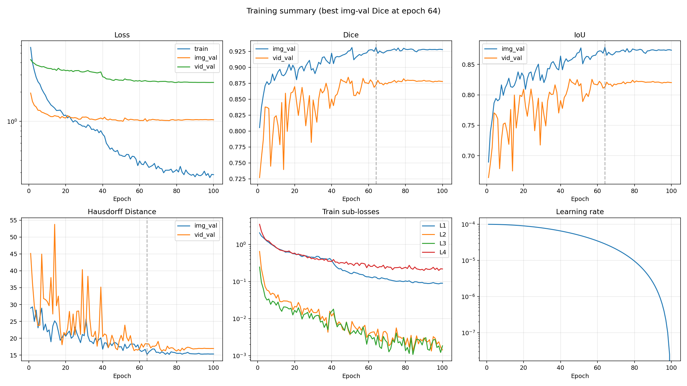
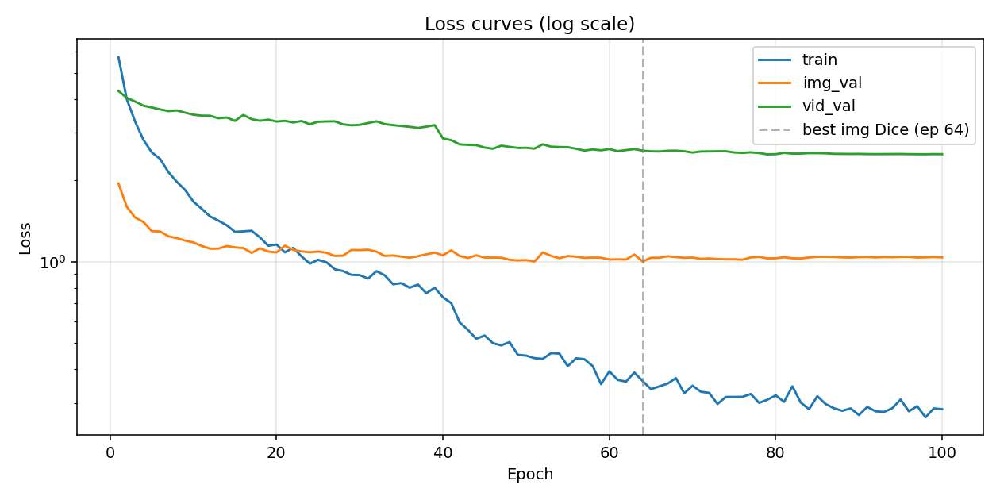
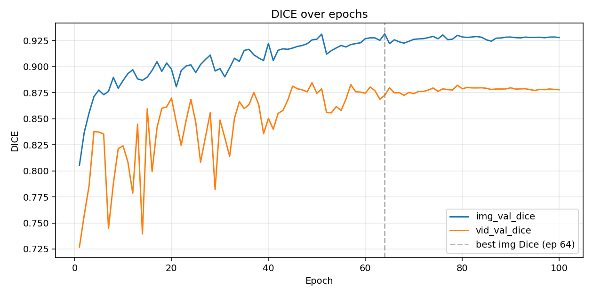
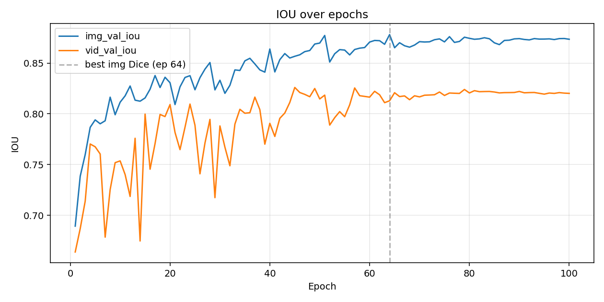
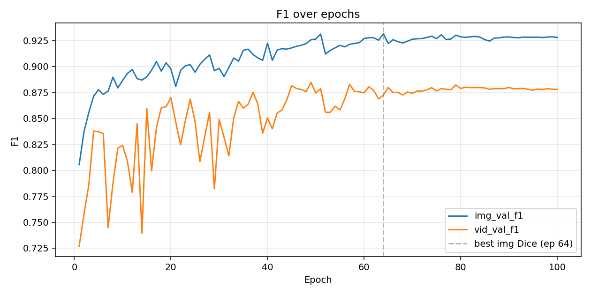
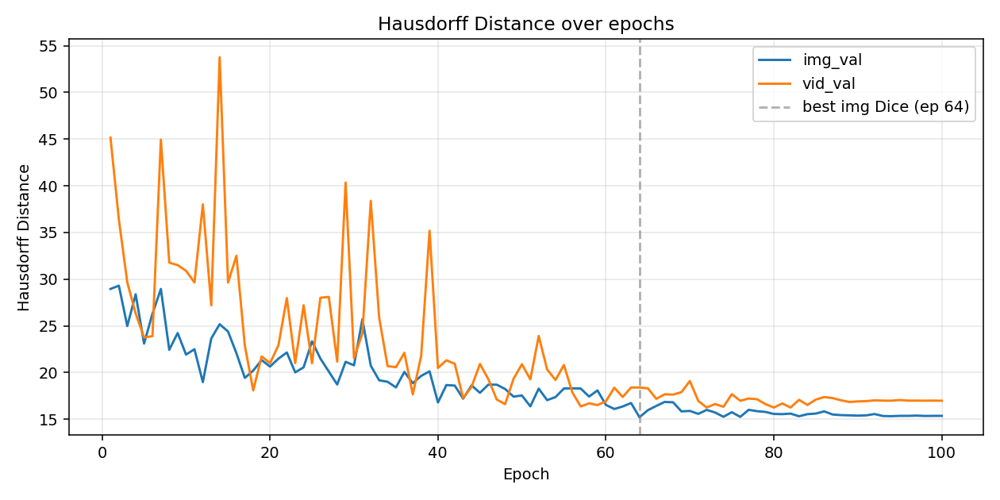
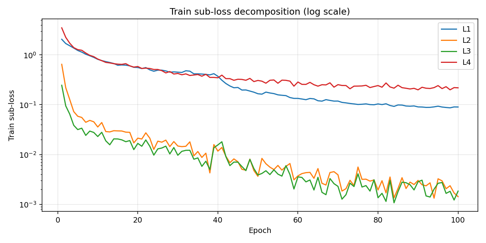
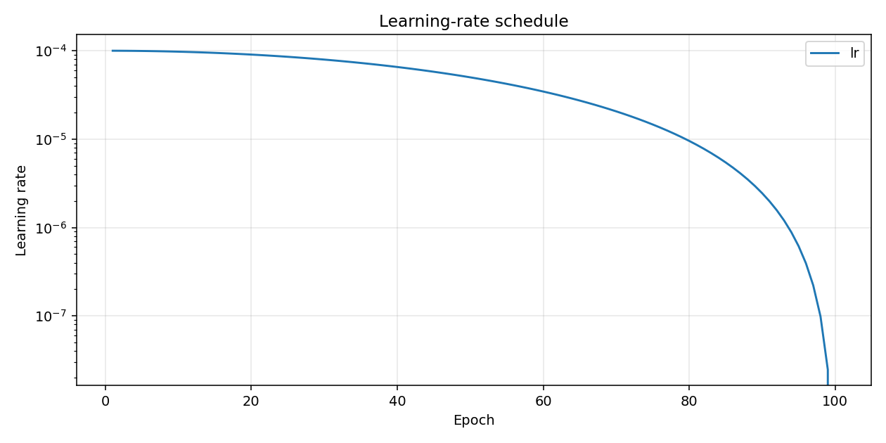

# Results (100-epoch run)

## Dataset: Image Segmentation + Video Segmentation Dataset

| Split | Image seg | Video seg |
|-------|-----------|-----------|
| Train | 800       | 934 pairs |
| Val   | 100       | 259 pairs |
| Test  | 100       | 1009 pairs |

**Trainable params:** 171,040,809 / **Total:** 366,943,530

## Test Results

### Image Test (100 images)

| Metric | Value |
|--------|-------|
| Dice | 0.9034 |
| IoU | 0.8376 |
| F1 | 0.9034 |
| Hausdorff Distance | 21.54 |
| Loss | 0.9442 |

### Video Test (1009 pairs)

| Metric | Value |
|--------|-------|
| Dice | 0.7486 |
| IoU | 0.6879 |
| F1 | 0.7486 |
| Hausdorff Distance | 42.52 |
| Loss | 2.7242 |

## Training Curves

Overview of the full run (best image-val Dice marked at epoch 64):



Individual plots:















## Training Log

```
Epoch 001/100 (47.6s) | LR: 1.00e-04 | Train Loss: 5.7192 (L1: 2.0608, L2: 0.6475, L3: 0.2459, L4: 3.4994)
  Img Val  | Loss: 1.9488 | Dice: 0.8054 | IoU: 0.6894 | F1: 0.8054 | HD: 28.95
  Vid Val  | Loss: 4.2902 | Dice: 0.7269 | IoU: 0.6639 | F1: 0.7269 | HD: 45.14
  -> New best model saved (Dice: 0.8054)
Epoch 002/100 (44.3s) | LR: 9.99e-05 | Train Loss: 3.9933 (L1: 1.6933, L2: 0.2198, L3: 0.0948, L4: 2.2551)
  Img Val  | Loss: 1.5969 | Dice: 0.8371 | IoU: 0.7386 | F1: 0.8371 | HD: 29.30
  Vid Val  | Loss: 4.0427 | Dice: 0.7578 | IoU: 0.6870 | F1: 0.7578 | HD: 36.38
  -> New best model saved (Dice: 0.8371)
Epoch 003/100 (48.3s) | LR: 9.98e-05 | Train Loss: 3.3027 (L1: 1.5269, L2: 0.1269, L3: 0.0647, L4: 1.7184)
  Img Val  | Loss: 1.4572 | Dice: 0.8557 | IoU: 0.7599 | F1: 0.8557 | HD: 24.98
  Vid Val  | Loss: 3.9201 | Dice: 0.7859 | IoU: 0.7140 | F1: 0.7859 | HD: 29.65
  -> New best model saved (Dice: 0.8557)
Epoch 004/100 (46.9s) | LR: 9.96e-05 | Train Loss: 2.8254 (L1: 1.3737, L2: 0.0727, L3: 0.0386, L4: 1.4018)
  Img Val  | Loss: 1.4032 | Dice: 0.8713 | IoU: 0.7867 | F1: 0.8713 | HD: 28.38
  Vid Val  | Loss: 3.7836 | Dice: 0.8378 | IoU: 0.7703 | F1: 0.8378 | HD: 26.32
  -> New best model saved (Dice: 0.8713)
Epoch 005/100 (46.1s) | LR: 9.94e-05 | Train Loss: 2.5418 (L1: 1.2287, L2: 0.0586, L3: 0.0316, L4: 1.2778)
  Img Val  | Loss: 1.2982 | Dice: 0.8775 | IoU: 0.7940 | F1: 0.8775 | HD: 23.10
  Vid Val  | Loss: 3.7264 | Dice: 0.8372 | IoU: 0.7676 | F1: 0.8372 | HD: 23.75
  -> New best model saved (Dice: 0.8775)
Epoch 006/100 (47.8s) | LR: 9.91e-05 | Train Loss: 2.4021 (L1: 1.1383, L2: 0.0555, L3: 0.0338, L4: 1.2394)
  Img Val  | Loss: 1.2937 | Dice: 0.8731 | IoU: 0.7902 | F1: 0.8731 | HD: 26.30
  Vid Val  | Loss: 3.6669 | Dice: 0.8354 | IoU: 0.7604 | F1: 0.8354 | HD: 23.90
Epoch 007/100 (44.9s) | LR: 9.88e-05 | Train Loss: 2.1466 (L1: 1.0321, L2: 0.0443, L3: 0.0242, L4: 1.0923)
  Img Val  | Loss: 1.2417 | Dice: 0.8762 | IoU: 0.7932 | F1: 0.8762 | HD: 28.95
  Vid Val  | Loss: 3.6131 | Dice: 0.7447 | IoU: 0.6785 | F1: 0.7447 | HD: 44.94
Epoch 008/100 (43.8s) | LR: 9.84e-05 | Train Loss: 1.9784 (L1: 0.9626, L2: 0.0484, L3: 0.0295, L4: 0.9804)
  Img Val  | Loss: 1.2230 | Dice: 0.8896 | IoU: 0.8164 | F1: 0.8896 | HD: 22.43
  Vid Val  | Loss: 3.6349 | Dice: 0.7876 | IoU: 0.7254 | F1: 0.7876 | HD: 31.77
  -> New best model saved (Dice: 0.8896)
Epoch 009/100 (44.8s) | LR: 9.80e-05 | Train Loss: 1.8453 (L1: 0.8920, L2: 0.0454, L3: 0.0277, L4: 0.9231)
  Img Val  | Loss: 1.1973 | Dice: 0.8792 | IoU: 0.7991 | F1: 0.8792 | HD: 24.23
  Vid Val  | Loss: 3.5660 | Dice: 0.8213 | IoU: 0.7519 | F1: 0.8213 | HD: 31.50
Epoch 010/100 (46.1s) | LR: 9.76e-05 | Train Loss: 1.6695 (L1: 0.8160, L2: 0.0357, L3: 0.0230, L4: 0.8262)
  Img Val  | Loss: 1.1791 | Dice: 0.8866 | IoU: 0.8114 | F1: 0.8866 | HD: 21.92
  Vid Val  | Loss: 3.5035 | Dice: 0.8240 | IoU: 0.7537 | F1: 0.8240 | HD: 30.89
Epoch 011/100 (44.2s) | LR: 9.70e-05 | Train Loss: 1.5708 (L1: 0.7684, L2: 0.0439, L3: 0.0279, L4: 0.7660)
  Img Val  | Loss: 1.1437 | Dice: 0.8932 | IoU: 0.8177 | F1: 0.8932 | HD: 22.49
  Vid Val  | Loss: 3.4761 | Dice: 0.8085 | IoU: 0.7402 | F1: 0.8085 | HD: 29.64
  -> New best model saved (Dice: 0.8932)
Epoch 012/100 (44.7s) | LR: 9.65e-05 | Train Loss: 1.4711 (L1: 0.7344, L2: 0.0289, L3: 0.0188, L4: 0.7075)
  Img Val  | Loss: 1.1176 | Dice: 0.8970 | IoU: 0.8274 | F1: 0.8970 | HD: 18.97
  Vid Val  | Loss: 3.4735 | Dice: 0.7786 | IoU: 0.7186 | F1: 0.7786 | HD: 38.00
  -> New best model saved (Dice: 0.8970)
Epoch 013/100 (45.6s) | LR: 9.59e-05 | Train Loss: 1.4203 (L1: 0.7050, L2: 0.0284, L3: 0.0157, L4: 0.6904)
  Img Val  | Loss: 1.1181 | Dice: 0.8882 | IoU: 0.8134 | F1: 0.8882 | HD: 23.64
  Vid Val  | Loss: 3.4002 | Dice: 0.8448 | IoU: 0.7759 | F1: 0.8448 | HD: 27.20
Epoch 014/100 (44.3s) | LR: 9.52e-05 | Train Loss: 1.3650 (L1: 0.6718, L2: 0.0300, L3: 0.0206, L4: 0.6669)
  Img Val  | Loss: 1.1432 | Dice: 0.8868 | IoU: 0.8124 | F1: 0.8868 | HD: 25.17
  Vid Val  | Loss: 3.4224 | Dice: 0.7395 | IoU: 0.6748 | F1: 0.7395 | HD: 53.76
Epoch 015/100 (45.0s) | LR: 9.46e-05 | Train Loss: 1.2904 (L1: 0.6192, L2: 0.0298, L3: 0.0205, L4: 0.6528)
  Img Val  | Loss: 1.1302 | Dice: 0.8899 | IoU: 0.8156 | F1: 0.8899 | HD: 24.39
  Vid Val  | Loss: 3.3241 | Dice: 0.8594 | IoU: 0.7997 | F1: 0.8594 | HD: 29.63
Epoch 016/100 (44.0s) | LR: 9.38e-05 | Train Loss: 1.2953 (L1: 0.6283, L2: 0.0296, L3: 0.0197, L4: 0.6458)
  Img Val  | Loss: 1.1232 | Dice: 0.8964 | IoU: 0.8243 | F1: 0.8964 | HD: 22.06
  Vid Val  | Loss: 3.4962 | Dice: 0.7994 | IoU: 0.7455 | F1: 0.7994 | HD: 32.50
Epoch 017/100 (44.7s) | LR: 9.30e-05 | Train Loss: 1.3027 (L1: 0.6216, L2: 0.0281, L3: 0.0181, L4: 0.6671)
  Img Val  | Loss: 1.0778 | Dice: 0.9047 | IoU: 0.8377 | F1: 0.9047 | HD: 19.42
  Vid Val  | Loss: 3.3751 | Dice: 0.8411 | IoU: 0.7707 | F1: 0.8411 | HD: 22.88
  -> New best model saved (Dice: 0.9047)
Epoch 018/100 (44.4s) | LR: 9.22e-05 | Train Loss: 1.2304 (L1: 0.6040, L2: 0.0278, L3: 0.0190, L4: 0.6026)
  Img Val  | Loss: 1.1214 | Dice: 0.8954 | IoU: 0.8259 | F1: 0.8954 | HD: 20.21
  Vid Val  | Loss: 3.3273 | Dice: 0.8600 | IoU: 0.7994 | F1: 0.8600 | HD: 18.08
Epoch 019/100 (43.9s) | LR: 9.14e-05 | Train Loss: 1.1460 (L1: 0.5630, L2: 0.0171, L3: 0.0125, L4: 0.5694)
  Img Val  | Loss: 1.0898 | Dice: 0.9034 | IoU: 0.8360 | F1: 0.9034 | HD: 21.33
  Vid Val  | Loss: 3.3600 | Dice: 0.8613 | IoU: 0.7973 | F1: 0.8613 | HD: 21.72
Epoch 020/100 (45.4s) | LR: 9.05e-05 | Train Loss: 1.1576 (L1: 0.5589, L2: 0.0213, L3: 0.0167, L4: 0.5848)
  Img Val  | Loss: 1.0825 | Dice: 0.8975 | IoU: 0.8306 | F1: 0.8975 | HD: 20.64
  Vid Val  | Loss: 3.3051 | Dice: 0.8698 | IoU: 0.8091 | F1: 0.8698 | HD: 21.00
Epoch 021/100 (44.2s) | LR: 8.95e-05 | Train Loss: 1.0831 (L1: 0.5315, L2: 0.0205, L3: 0.0146, L4: 0.5347)
  Img Val  | Loss: 1.1465 | Dice: 0.8806 | IoU: 0.8091 | F1: 0.8806 | HD: 21.48
  Vid Val  | Loss: 3.3264 | Dice: 0.8463 | IoU: 0.7817 | F1: 0.8463 | HD: 22.91
Epoch 022/100 (44.2s) | LR: 8.85e-05 | Train Loss: 1.1252 (L1: 0.5567, L2: 0.0272, L3: 0.0196, L4: 0.5421)
  Img Val  | Loss: 1.1064 | Dice: 0.8961 | IoU: 0.8266 | F1: 0.8961 | HD: 22.14
  Vid Val  | Loss: 3.2796 | Dice: 0.8245 | IoU: 0.7648 | F1: 0.8245 | HD: 27.97
Epoch 023/100 (44.1s) | LR: 8.75e-05 | Train Loss: 1.0463 (L1: 0.5008, L2: 0.0213, L3: 0.0146, L4: 0.5343)
  Img Val  | Loss: 1.0915 | Dice: 0.9005 | IoU: 0.8358 | F1: 0.9005 | HD: 20.01
  Vid Val  | Loss: 3.3200 | Dice: 0.8480 | IoU: 0.7868 | F1: 0.8480 | HD: 21.01
Epoch 024/100 (44.4s) | LR: 8.64e-05 | Train Loss: 0.9836 (L1: 0.4703, L2: 0.0126, L3: 0.0097, L4: 0.5101)
  Img Val  | Loss: 1.0833 | Dice: 0.9017 | IoU: 0.8376 | F1: 0.9017 | HD: 20.56
  Vid Val  | Loss: 3.2312 | Dice: 0.8685 | IoU: 0.8096 | F1: 0.8685 | HD: 27.20
Epoch 025/100 (44.8s) | LR: 8.54e-05 | Train Loss: 1.0164 (L1: 0.4937, L2: 0.0185, L3: 0.0130, L4: 0.5102)
  Img Val  | Loss: 1.0911 | Dice: 0.8943 | IoU: 0.8237 | F1: 0.8943 | HD: 23.34
  Vid Val  | Loss: 3.3007 | Dice: 0.8468 | IoU: 0.7887 | F1: 0.8468 | HD: 20.99
Epoch 026/100 (44.4s) | LR: 8.42e-05 | Train Loss: 0.9948 (L1: 0.4941, L2: 0.0177, L3: 0.0135, L4: 0.4829)
  Img Val  | Loss: 1.0788 | Dice: 0.9020 | IoU: 0.8356 | F1: 0.9020 | HD: 21.49
  Vid Val  | Loss: 3.3080 | Dice: 0.8082 | IoU: 0.7409 | F1: 0.8082 | HD: 28.01
Epoch 027/100 (44.7s) | LR: 8.31e-05 | Train Loss: 0.9372 (L1: 0.4769, L2: 0.0194, L3: 0.0147, L4: 0.4348)
  Img Val  | Loss: 1.0505 | Dice: 0.9068 | IoU: 0.8440 | F1: 0.9068 | HD: 20.10
  Vid Val  | Loss: 3.3116 | Dice: 0.8324 | IoU: 0.7712 | F1: 0.8324 | HD: 28.10
  -> New best model saved (Dice: 0.9068)
Epoch 028/100 (44.5s) | LR: 8.19e-05 | Train Loss: 0.9233 (L1: 0.4500, L2: 0.0144, L3: 0.0103, L4: 0.4636)
  Img Val  | Loss: 1.0531 | Dice: 0.9110 | IoU: 0.8505 | F1: 0.9110 | HD: 18.72
  Vid Val  | Loss: 3.2270 | Dice: 0.8557 | IoU: 0.7945 | F1: 0.8557 | HD: 21.16
  -> New best model saved (Dice: 0.9110)
Epoch 029/100 (44.5s) | LR: 8.06e-05 | Train Loss: 0.8938 (L1: 0.4561, L2: 0.0182, L3: 0.0138, L4: 0.4132)
  Img Val  | Loss: 1.1055 | Dice: 0.8958 | IoU: 0.8236 | F1: 0.8958 | HD: 21.14
  Vid Val  | Loss: 3.2013 | Dice: 0.7821 | IoU: 0.7175 | F1: 0.7821 | HD: 40.34
Epoch 030/100 (44.4s) | LR: 7.94e-05 | Train Loss: 0.8921 (L1: 0.4503, L2: 0.0148, L3: 0.0097, L4: 0.4244)
  Img Val  | Loss: 1.1040 | Dice: 0.8981 | IoU: 0.8331 | F1: 0.8981 | HD: 20.77
  Vid Val  | Loss: 3.2140 | Dice: 0.8487 | IoU: 0.7881 | F1: 0.8487 | HD: 21.53
Epoch 031/100 (44.3s) | LR: 7.81e-05 | Train Loss: 0.8659 (L1: 0.4445, L2: 0.0144, L3: 0.0116, L4: 0.3994)
  Img Val  | Loss: 1.1074 | Dice: 0.8902 | IoU: 0.8202 | F1: 0.8902 | HD: 25.70
  Vid Val  | Loss: 3.2633 | Dice: 0.8319 | IoU: 0.7671 | F1: 0.8319 | HD: 24.18
Epoch 032/100 (43.9s) | LR: 7.68e-05 | Train Loss: 0.9227 (L1: 0.4804, L2: 0.0146, L3: 0.0121, L4: 0.4161)
  Img Val  | Loss: 1.0900 | Dice: 0.8989 | IoU: 0.8281 | F1: 0.8989 | HD: 20.72
  Vid Val  | Loss: 3.3128 | Dice: 0.8139 | IoU: 0.7488 | F1: 0.8139 | HD: 38.38
Epoch 033/100 (44.1s) | LR: 7.55e-05 | Train Loss: 0.8905 (L1: 0.4719, L2: 0.0180, L3: 0.0122, L4: 0.3864)
  Img Val  | Loss: 1.0507 | Dice: 0.9080 | IoU: 0.8433 | F1: 0.9080 | HD: 19.17
  Vid Val  | Loss: 3.2345 | Dice: 0.8504 | IoU: 0.7898 | F1: 0.8504 | HD: 25.86
Epoch 034/100 (44.7s) | LR: 7.41e-05 | Train Loss: 0.8252 (L1: 0.4171, L2: 0.0094, L3: 0.0080, L4: 0.3948)
  Img Val  | Loss: 1.0544 | Dice: 0.9050 | IoU: 0.8427 | F1: 0.9050 | HD: 19.01
  Vid Val  | Loss: 3.2050 | Dice: 0.8664 | IoU: 0.8044 | F1: 0.8664 | HD: 20.69
Epoch 035/100 (44.1s) | LR: 7.27e-05 | Train Loss: 0.8329 (L1: 0.4167, L2: 0.0115, L3: 0.0085, L4: 0.4037)
  Img Val  | Loss: 1.0445 | Dice: 0.9155 | IoU: 0.8522 | F1: 0.9155 | HD: 18.41
  Vid Val  | Loss: 3.1830 | Dice: 0.8598 | IoU: 0.8006 | F1: 0.8598 | HD: 20.57
  -> New best model saved (Dice: 0.9155)
Epoch 036/100 (44.6s) | LR: 7.13e-05 | Train Loss: 0.8013 (L1: 0.4125, L2: 0.0087, L3: 0.0058, L4: 0.3737)
  Img Val  | Loss: 1.0349 | Dice: 0.9166 | IoU: 0.8547 | F1: 0.9166 | HD: 20.06
  Vid Val  | Loss: 3.1602 | Dice: 0.8636 | IoU: 0.8011 | F1: 0.8636 | HD: 22.11
  -> New best model saved (Dice: 0.9166)
Epoch 037/100 (44.6s) | LR: 6.99e-05 | Train Loss: 0.8230 (L1: 0.4066, L2: 0.0106, L3: 0.0073, L4: 0.4075)
  Img Val  | Loss: 1.0480 | Dice: 0.9113 | IoU: 0.8491 | F1: 0.9113 | HD: 18.86
  Vid Val  | Loss: 3.1305 | Dice: 0.8751 | IoU: 0.8165 | F1: 0.8751 | HD: 17.66
Epoch 038/100 (44.7s) | LR: 6.84e-05 | Train Loss: 0.7640 (L1: 0.3972, L2: 0.0043, L3: 0.0050, L4: 0.3534)
  Img Val  | Loss: 1.0648 | Dice: 0.9083 | IoU: 0.8433 | F1: 0.9083 | HD: 19.64
  Vid Val  | Loss: 3.1637 | Dice: 0.8637 | IoU: 0.8041 | F1: 0.8637 | HD: 21.77
Epoch 039/100 (46.1s) | LR: 6.69e-05 | Train Loss: 0.8010 (L1: 0.4198, L2: 0.0158, L3: 0.0136, L4: 0.3532)
  Img Val  | Loss: 1.0805 | Dice: 0.9058 | IoU: 0.8410 | F1: 0.9058 | HD: 20.13
  Vid Val  | Loss: 3.2068 | Dice: 0.8356 | IoU: 0.7701 | F1: 0.8356 | HD: 35.18
Epoch 040/100 (44.1s) | LR: 6.55e-05 | Train Loss: 0.7384 (L1: 0.3725, L2: 0.0117, L3: 0.0156, L4: 0.3473)
  Img Val  | Loss: 1.0562 | Dice: 0.9223 | IoU: 0.8638 | F1: 0.9223 | HD: 16.79
  Vid Val  | Loss: 2.8621 | Dice: 0.8503 | IoU: 0.7906 | F1: 0.8503 | HD: 20.48
  -> New best model saved (Dice: 0.9223)
Epoch 041/100 (45.2s) | LR: 6.39e-05 | Train Loss: 0.7018 (L1: 0.3101, L2: 0.0138, L3: 0.0180, L4: 0.3923)
  Img Val  | Loss: 1.1016 | Dice: 0.9058 | IoU: 0.8413 | F1: 0.9058 | HD: 18.66
  Vid Val  | Loss: 2.8197 | Dice: 0.8399 | IoU: 0.7777 | F1: 0.8399 | HD: 21.31
Epoch 042/100 (45.0s) | LR: 6.24e-05 | Train Loss: 0.5961 (L1: 0.2665, L2: 0.0092, L3: 0.0091, L4: 0.3340)
  Img Val  | Loss: 1.0498 | Dice: 0.9157 | IoU: 0.8533 | F1: 0.9157 | HD: 18.60
  Vid Val  | Loss: 2.7216 | Dice: 0.8551 | IoU: 0.7956 | F1: 0.8551 | HD: 20.93
Epoch 043/100 (44.4s) | LR: 6.09e-05 | Train Loss: 0.5590 (L1: 0.2380, L2: 0.0068, L3: 0.0060, L4: 0.3338)
  Img Val  | Loss: 1.0323 | Dice: 0.9171 | IoU: 0.8593 | F1: 0.9171 | HD: 17.20
  Vid Val  | Loss: 2.7100 | Dice: 0.8579 | IoU: 0.8008 | F1: 0.8579 | HD: 17.26
Epoch 044/100 (45.2s) | LR: 5.94e-05 | Train Loss: 0.5180 (L1: 0.2192, L2: 0.0082, L3: 0.0070, L4: 0.3093)
  Img Val  | Loss: 1.0558 | Dice: 0.9166 | IoU: 0.8550 | F1: 0.9166 | HD: 18.62
  Vid Val  | Loss: 2.7034 | Dice: 0.8678 | IoU: 0.8112 | F1: 0.8678 | HD: 18.47
Epoch 045/100 (44.5s) | LR: 5.78e-05 | Train Loss: 0.5329 (L1: 0.2218, L2: 0.0072, L3: 0.0070, L4: 0.3247)
  Img Val  | Loss: 1.0364 | Dice: 0.9178 | IoU: 0.8567 | F1: 0.9178 | HD: 17.83
  Vid Val  | Loss: 2.6490 | Dice: 0.8813 | IoU: 0.8260 | F1: 0.8813 | HD: 20.92
Epoch 046/100 (44.6s) | LR: 5.63e-05 | Train Loss: 0.4994 (L1: 0.1971, L2: 0.0050, L3: 0.0057, L4: 0.3219)
  Img Val  | Loss: 1.0359 | Dice: 0.9194 | IoU: 0.8581 | F1: 0.9194 | HD: 18.70
  Vid Val  | Loss: 2.6212 | Dice: 0.8787 | IoU: 0.8210 | F1: 0.8787 | HD: 19.29
Epoch 047/100 (44.5s) | LR: 5.47e-05 | Train Loss: 0.4897 (L1: 0.1978, L2: 0.0048, L3: 0.0047, L4: 0.3096)
  Img Val  | Loss: 1.0347 | Dice: 0.9203 | IoU: 0.8612 | F1: 0.9203 | HD: 18.70
  Vid Val  | Loss: 2.6909 | Dice: 0.8777 | IoU: 0.8192 | F1: 0.8777 | HD: 17.11
Epoch 048/100 (44.4s) | LR: 5.31e-05 | Train Loss: 0.5038 (L1: 0.1880, L2: 0.0081, L3: 0.0080, L4: 0.3378)
  Img Val  | Loss: 1.0169 | Dice: 0.9219 | IoU: 0.8624 | F1: 0.9219 | HD: 18.23
  Vid Val  | Loss: 2.6641 | Dice: 0.8758 | IoU: 0.8168 | F1: 0.8758 | HD: 16.61
Epoch 049/100 (44.6s) | LR: 5.16e-05 | Train Loss: 0.4521 (L1: 0.1784, L2: 0.0048, L3: 0.0052, L4: 0.2913)
  Img Val  | Loss: 1.0110 | Dice: 0.9256 | IoU: 0.8687 | F1: 0.9256 | HD: 17.42
  Vid Val  | Loss: 2.6397 | Dice: 0.8845 | IoU: 0.8249 | F1: 0.8845 | HD: 19.32
  -> New best model saved (Dice: 0.9256)
Epoch 050/100 (44.6s) | LR: 5.00e-05 | Train Loss: 0.4488 (L1: 0.1661, L2: 0.0036, L3: 0.0039, L4: 0.3072)
  Img Val  | Loss: 1.0138 | Dice: 0.9263 | IoU: 0.8697 | F1: 0.9263 | HD: 17.54
  Vid Val  | Loss: 2.6424 | Dice: 0.8744 | IoU: 0.8147 | F1: 0.8744 | HD: 20.89
  -> New best model saved (Dice: 0.9263)
Epoch 051/100 (44.5s) | LR: 4.84e-05 | Train Loss: 0.4392 (L1: 0.1628, L2: 0.0084, L3: 0.0042, L4: 0.2969)
  Img Val  | Loss: 1.0014 | Dice: 0.9311 | IoU: 0.8772 | F1: 0.9311 | HD: 16.38
  Vid Val  | Loss: 2.6241 | Dice: 0.8786 | IoU: 0.8184 | F1: 0.8786 | HD: 19.26
  -> New best model saved (Dice: 0.9311)
Epoch 052/100 (44.5s) | LR: 4.69e-05 | Train Loss: 0.4368 (L1: 0.1791, L2: 0.0065, L3: 0.0047, L4: 0.2704)
  Img Val  | Loss: 1.0826 | Dice: 0.9119 | IoU: 0.8510 | F1: 0.9119 | HD: 18.28
  Vid Val  | Loss: 2.7220 | Dice: 0.8559 | IoU: 0.7889 | F1: 0.8559 | HD: 23.91
Epoch 053/100 (44.0s) | LR: 4.53e-05 | Train Loss: 0.4586 (L1: 0.1720, L2: 0.0056, L3: 0.0040, L4: 0.3093)
  Img Val  | Loss: 1.0514 | Dice: 0.9154 | IoU: 0.8592 | F1: 0.9154 | HD: 17.04
  Vid Val  | Loss: 2.6678 | Dice: 0.8557 | IoU: 0.7962 | F1: 0.8557 | HD: 20.32
Epoch 054/100 (44.2s) | LR: 4.37e-05 | Train Loss: 0.4565 (L1: 0.1671, L2: 0.0050, L3: 0.0049, L4: 0.3138)
  Img Val  | Loss: 1.0304 | Dice: 0.9179 | IoU: 0.8632 | F1: 0.9179 | HD: 17.37
  Vid Val  | Loss: 2.6601 | Dice: 0.8617 | IoU: 0.8022 | F1: 0.8617 | HD: 19.20
Epoch 055/100 (44.4s) | LR: 4.22e-05 | Train Loss: 0.4103 (L1: 0.1578, L2: 0.0060, L3: 0.0040, L4: 0.2698)
  Img Val  | Loss: 1.0494 | Dice: 0.9203 | IoU: 0.8628 | F1: 0.9203 | HD: 18.29
  Vid Val  | Loss: 2.6572 | Dice: 0.8580 | IoU: 0.7972 | F1: 0.8580 | HD: 20.81
Epoch 056/100 (44.4s) | LR: 4.06e-05 | Train Loss: 0.4388 (L1: 0.1546, L2: 0.0049, L3: 0.0037, L4: 0.3112)
  Img Val  | Loss: 1.0441 | Dice: 0.9188 | IoU: 0.8580 | F1: 0.9188 | HD: 18.31
  Vid Val  | Loss: 2.6206 | Dice: 0.8687 | IoU: 0.8088 | F1: 0.8687 | HD: 17.88
Epoch 057/100 (44.8s) | LR: 3.91e-05 | Train Loss: 0.4355 (L1: 0.1522, L2: 0.0058, L3: 0.0060, L4: 0.3088)
  Img Val  | Loss: 1.0332 | Dice: 0.9212 | IoU: 0.8633 | F1: 0.9212 | HD: 18.28
  Vid Val  | Loss: 2.5804 | Dice: 0.8827 | IoU: 0.8255 | F1: 0.8827 | HD: 16.36
Epoch 058/100 (45.3s) | LR: 3.76e-05 | Train Loss: 0.4104 (L1: 0.1393, L2: 0.0066, L3: 0.0040, L4: 0.2976)
  Img Val  | Loss: 1.0362 | Dice: 0.9220 | IoU: 0.8647 | F1: 0.9220 | HD: 17.42
  Vid Val  | Loss: 2.6065 | Dice: 0.8759 | IoU: 0.8179 | F1: 0.8759 | HD: 16.70
Epoch 059/100 (44.5s) | LR: 3.61e-05 | Train Loss: 0.3520 (L1: 0.1339, L2: 0.0031, L3: 0.0020, L4: 0.2359)
  Img Val  | Loss: 1.0343 | Dice: 0.9228 | IoU: 0.8653 | F1: 0.9228 | HD: 18.08
  Vid Val  | Loss: 2.5864 | Dice: 0.8755 | IoU: 0.8171 | F1: 0.8755 | HD: 16.51
Epoch 060/100 (44.4s) | LR: 3.45e-05 | Train Loss: 0.3928 (L1: 0.1339, L2: 0.0037, L3: 0.0036, L4: 0.2857)
  Img Val  | Loss: 1.0187 | Dice: 0.9268 | IoU: 0.8707 | F1: 0.9268 | HD: 16.53
  Vid Val  | Loss: 2.6138 | Dice: 0.8745 | IoU: 0.8164 | F1: 0.8745 | HD: 16.91
Epoch 061/100 (44.4s) | LR: 3.31e-05 | Train Loss: 0.3648 (L1: 0.1301, L2: 0.0041, L3: 0.0035, L4: 0.2561)
  Img Val  | Loss: 1.0205 | Dice: 0.9276 | IoU: 0.8723 | F1: 0.9276 | HD: 16.09
  Vid Val  | Loss: 2.5679 | Dice: 0.8804 | IoU: 0.8222 | F1: 0.8804 | HD: 18.38
Epoch 062/100 (44.5s) | LR: 3.16e-05 | Train Loss: 0.3596 (L1: 0.1261, L2: 0.0043, L3: 0.0028, L4: 0.2558)
  Img Val  | Loss: 1.0188 | Dice: 0.9275 | IoU: 0.8720 | F1: 0.9275 | HD: 16.36
  Vid Val  | Loss: 2.5908 | Dice: 0.8768 | IoU: 0.8188 | F1: 0.8768 | HD: 17.38
Epoch 063/100 (44.7s) | LR: 3.01e-05 | Train Loss: 0.3886 (L1: 0.1334, L2: 0.0044, L3: 0.0031, L4: 0.2810)
  Img Val  | Loss: 1.0630 | Dice: 0.9252 | IoU: 0.8685 | F1: 0.9252 | HD: 16.73
  Vid Val  | Loss: 2.6131 | Dice: 0.8687 | IoU: 0.8110 | F1: 0.8687 | HD: 18.40
Epoch 064/100 (44.7s) | LR: 2.87e-05 | Train Loss: 0.3615 (L1: 0.1311, L2: 0.0033, L3: 0.0019, L4: 0.2520)
  Img Val  | Loss: 1.0022 | Dice: 0.9314 | IoU: 0.8780 | F1: 0.9314 | HD: 15.21
  Vid Val  | Loss: 2.5795 | Dice: 0.8724 | IoU: 0.8128 | F1: 0.8724 | HD: 18.39
  -> New best model saved (Dice: 0.9314)
Epoch 065/100 (44.5s) | LR: 2.73e-05 | Train Loss: 0.3372 (L1: 0.1201, L2: 0.0052, L3: 0.0035, L4: 0.2359)
  Img Val  | Loss: 1.0342 | Dice: 0.9220 | IoU: 0.8651 | F1: 0.9220 | HD: 15.97
  Vid Val  | Loss: 2.5647 | Dice: 0.8797 | IoU: 0.8208 | F1: 0.8797 | HD: 18.30
Epoch 066/100 (44.5s) | LR: 2.59e-05 | Train Loss: 0.3452 (L1: 0.1179, L2: 0.0026, L3: 0.0017, L4: 0.2520)
  Img Val  | Loss: 1.0338 | Dice: 0.9257 | IoU: 0.8700 | F1: 0.9257 | HD: 16.42
  Vid Val  | Loss: 2.5609 | Dice: 0.8748 | IoU: 0.8170 | F1: 0.8748 | HD: 17.18
Epoch 067/100 (44.4s) | LR: 2.45e-05 | Train Loss: 0.3535 (L1: 0.1263, L2: 0.0024, L3: 0.0016, L4: 0.2500)
  Img Val  | Loss: 1.0481 | Dice: 0.9237 | IoU: 0.8670 | F1: 0.9237 | HD: 16.85
  Vid Val  | Loss: 2.5766 | Dice: 0.8750 | IoU: 0.8176 | F1: 0.8750 | HD: 17.66
Epoch 068/100 (44.0s) | LR: 2.32e-05 | Train Loss: 0.3704 (L1: 0.1220, L2: 0.0043, L3: 0.0033, L4: 0.2753)
  Img Val  | Loss: 1.0404 | Dice: 0.9225 | IoU: 0.8656 | F1: 0.9225 | HD: 16.81
  Vid Val  | Loss: 2.5782 | Dice: 0.8725 | IoU: 0.8139 | F1: 0.8725 | HD: 17.64
Epoch 069/100 (44.7s) | LR: 2.19e-05 | Train Loss: 0.3254 (L1: 0.1181, L2: 0.0045, L3: 0.0026, L4: 0.2251)
  Img Val  | Loss: 1.0339 | Dice: 0.9243 | IoU: 0.8677 | F1: 0.9243 | HD: 15.84
  Vid Val  | Loss: 2.5661 | Dice: 0.8753 | IoU: 0.8178 | F1: 0.8753 | HD: 17.90
Epoch 070/100 (44.5s) | LR: 2.06e-05 | Train Loss: 0.3474 (L1: 0.1183, L2: 0.0039, L3: 0.0023, L4: 0.2529)
  Img Val  | Loss: 1.0362 | Dice: 0.9262 | IoU: 0.8711 | F1: 0.9262 | HD: 15.89
  Vid Val  | Loss: 2.5371 | Dice: 0.8740 | IoU: 0.8167 | F1: 0.8740 | HD: 19.09
Epoch 071/100 (44.5s) | LR: 1.94e-05 | Train Loss: 0.3298 (L1: 0.1113, L2: 0.0018, L3: 0.0013, L4: 0.2434)
  Img Val  | Loss: 1.0247 | Dice: 0.9266 | IoU: 0.8707 | F1: 0.9266 | HD: 15.57
  Vid Val  | Loss: 2.5604 | Dice: 0.8762 | IoU: 0.8183 | F1: 0.8762 | HD: 16.96
Epoch 072/100 (44.3s) | LR: 1.81e-05 | Train Loss: 0.3265 (L1: 0.1088, L2: 0.0021, L3: 0.0016, L4: 0.2427)
  Img Val  | Loss: 1.0281 | Dice: 0.9268 | IoU: 0.8709 | F1: 0.9268 | HD: 15.99
  Vid Val  | Loss: 2.5625 | Dice: 0.8761 | IoU: 0.8185 | F1: 0.8761 | HD: 16.25
Epoch 073/100 (44.2s) | LR: 1.69e-05 | Train Loss: 0.2972 (L1: 0.1059, L2: 0.0030, L3: 0.0027, L4: 0.2091)
  Img Val  | Loss: 1.0230 | Dice: 0.9278 | IoU: 0.8730 | F1: 0.9278 | HD: 15.72
  Vid Val  | Loss: 2.5655 | Dice: 0.8775 | IoU: 0.8188 | F1: 0.8775 | HD: 16.62
Epoch 074/100 (44.3s) | LR: 1.58e-05 | Train Loss: 0.3154 (L1: 0.1036, L2: 0.0024, L3: 0.0023, L4: 0.2359)
  Img Val  | Loss: 1.0206 | Dice: 0.9290 | IoU: 0.8738 | F1: 0.9290 | HD: 15.26
  Vid Val  | Loss: 2.5655 | Dice: 0.8795 | IoU: 0.8215 | F1: 0.8795 | HD: 16.33
Epoch 075/100 (44.4s) | LR: 1.46e-05 | Train Loss: 0.3155 (L1: 0.1011, L2: 0.0056, L3: 0.0041, L4: 0.2367)
  Img Val  | Loss: 1.0207 | Dice: 0.9267 | IoU: 0.8708 | F1: 0.9267 | HD: 15.75
  Vid Val  | Loss: 2.5392 | Dice: 0.8763 | IoU: 0.8181 | F1: 0.8763 | HD: 17.68
Epoch 076/100 (44.3s) | LR: 1.36e-05 | Train Loss: 0.3157 (L1: 0.1021, L2: 0.0032, L3: 0.0022, L4: 0.2381)
  Img Val  | Loss: 1.0172 | Dice: 0.9304 | IoU: 0.8760 | F1: 0.9304 | HD: 15.25
  Vid Val  | Loss: 2.5300 | Dice: 0.8786 | IoU: 0.8205 | F1: 0.8786 | HD: 16.97
Epoch 077/100 (44.9s) | LR: 1.25e-05 | Train Loss: 0.3237 (L1: 0.1038, L2: 0.0032, L3: 0.0024, L4: 0.2454)
  Img Val  | Loss: 1.0371 | Dice: 0.9258 | IoU: 0.8703 | F1: 0.9258 | HD: 16.00
  Vid Val  | Loss: 2.5418 | Dice: 0.8779 | IoU: 0.8203 | F1: 0.8779 | HD: 17.21
Epoch 078/100 (44.4s) | LR: 1.15e-05 | Train Loss: 0.2999 (L1: 0.1006, L2: 0.0029, L3: 0.0018, L4: 0.2210)
  Img Val  | Loss: 1.0421 | Dice: 0.9264 | IoU: 0.8713 | F1: 0.9264 | HD: 15.86
  Vid Val  | Loss: 2.5270 | Dice: 0.8775 | IoU: 0.8201 | F1: 0.8775 | HD: 17.14
Epoch 079/100 (44.6s) | LR: 1.05e-05 | Train Loss: 0.3083 (L1: 0.0997, L2: 0.0031, L3: 0.0031, L4: 0.2318)
  Img Val  | Loss: 1.0286 | Dice: 0.9300 | IoU: 0.8755 | F1: 0.9300 | HD: 15.78
  Vid Val  | Loss: 2.4977 | Dice: 0.8821 | IoU: 0.8240 | F1: 0.8821 | HD: 16.61
Epoch 080/100 (45.1s) | LR: 9.55e-06 | Train Loss: 0.3198 (L1: 0.1036, L2: 0.0019, L3: 0.0014, L4: 0.2422)
  Img Val  | Loss: 1.0297 | Dice: 0.9285 | IoU: 0.8744 | F1: 0.9285 | HD: 15.56
  Vid Val  | Loss: 2.5019 | Dice: 0.8787 | IoU: 0.8205 | F1: 0.8787 | HD: 16.25
Epoch 081/100 (44.6s) | LR: 8.65e-06 | Train Loss: 0.3027 (L1: 0.1006, L2: 0.0030, L3: 0.0017, L4: 0.2246)
  Img Val  | Loss: 1.0384 | Dice: 0.9280 | IoU: 0.8734 | F1: 0.9280 | HD: 15.54
  Vid Val  | Loss: 2.5314 | Dice: 0.8800 | IoU: 0.8228 | F1: 0.8800 | HD: 16.68
Epoch 082/100 (44.4s) | LR: 7.78e-06 | Train Loss: 0.3454 (L1: 0.1044, L2: 0.0017, L3: 0.0011, L4: 0.2734)
  Img Val  | Loss: 1.0296 | Dice: 0.9284 | IoU: 0.8738 | F1: 0.9284 | HD: 15.60
  Vid Val  | Loss: 2.5139 | Dice: 0.8796 | IoU: 0.8218 | F1: 0.8796 | HD: 16.25
Epoch 083/100 (44.5s) | LR: 6.96e-06 | Train Loss: 0.3010 (L1: 0.0964, L2: 0.0035, L3: 0.0030, L4: 0.2275)
  Img Val  | Loss: 1.0277 | Dice: 0.9289 | IoU: 0.8749 | F1: 0.9289 | HD: 15.31
  Vid Val  | Loss: 2.5149 | Dice: 0.8795 | IoU: 0.8220 | F1: 0.8795 | HD: 17.08
Epoch 084/100 (44.7s) | LR: 6.18e-06 | Train Loss: 0.2841 (L1: 0.0925, L2: 0.0013, L3: 0.0011, L4: 0.2149)
  Img Val  | Loss: 1.0365 | Dice: 0.9282 | IoU: 0.8739 | F1: 0.9282 | HD: 15.54
  Vid Val  | Loss: 2.5254 | Dice: 0.8797 | IoU: 0.8220 | F1: 0.8797 | HD: 16.53
Epoch 085/100 (44.6s) | LR: 5.45e-06 | Train Loss: 0.3175 (L1: 0.0988, L2: 0.0021, L3: 0.0018, L4: 0.2462)
  Img Val  | Loss: 1.0430 | Dice: 0.9257 | IoU: 0.8699 | F1: 0.9257 | HD: 15.60
  Vid Val  | Loss: 2.5238 | Dice: 0.8792 | IoU: 0.8215 | F1: 0.8792 | HD: 17.10
Epoch 086/100 (44.4s) | LR: 4.76e-06 | Train Loss: 0.2970 (L1: 0.0983, L2: 0.0034, L3: 0.0028, L4: 0.2199)
  Img Val  | Loss: 1.0430 | Dice: 0.9244 | IoU: 0.8682 | F1: 0.9244 | HD: 15.84
  Vid Val  | Loss: 2.5205 | Dice: 0.8780 | IoU: 0.8206 | F1: 0.8780 | HD: 17.37
Epoch 087/100 (44.4s) | LR: 4.11e-06 | Train Loss: 0.2865 (L1: 0.0942, L2: 0.0021, L3: 0.0027, L4: 0.2139)
  Img Val  | Loss: 1.0414 | Dice: 0.9272 | IoU: 0.8723 | F1: 0.9272 | HD: 15.50
  Vid Val  | Loss: 2.5096 | Dice: 0.8785 | IoU: 0.8209 | F1: 0.8785 | HD: 17.26
Epoch 088/100 (44.5s) | LR: 3.51e-06 | Train Loss: 0.2803 (L1: 0.0934, L2: 0.0028, L3: 0.0025, L4: 0.2071)
  Img Val  | Loss: 1.0378 | Dice: 0.9274 | IoU: 0.8725 | F1: 0.9274 | HD: 15.44
  Vid Val  | Loss: 2.5086 | Dice: 0.8785 | IoU: 0.8209 | F1: 0.8785 | HD: 17.02
Epoch 089/100 (44.7s) | LR: 2.96e-06 | Train Loss: 0.2862 (L1: 0.0944, L2: 0.0025, L3: 0.0019, L4: 0.2133)
  Img Val  | Loss: 1.0359 | Dice: 0.9282 | IoU: 0.8738 | F1: 0.9282 | HD: 15.41
  Vid Val  | Loss: 2.5069 | Dice: 0.8786 | IoU: 0.8210 | F1: 0.8786 | HD: 16.84
Epoch 090/100 (44.5s) | LR: 2.45e-06 | Train Loss: 0.2705 (L1: 0.0903, L2: 0.0030, L3: 0.0028, L4: 0.1989)
  Img Val  | Loss: 1.0403 | Dice: 0.9283 | IoU: 0.8740 | F1: 0.9283 | HD: 15.38
  Vid Val  | Loss: 2.5083 | Dice: 0.8797 | IoU: 0.8220 | F1: 0.8797 | HD: 16.91
Epoch 091/100 (44.6s) | LR: 1.99e-06 | Train Loss: 0.2898 (L1: 0.0898, L2: 0.0025, L3: 0.0030, L4: 0.2240)
  Img Val  | Loss: 1.0413 | Dice: 0.9278 | IoU: 0.8732 | F1: 0.9278 | HD: 15.41
  Vid Val  | Loss: 2.5043 | Dice: 0.8784 | IoU: 0.8207 | F1: 0.8784 | HD: 16.93
Epoch 092/100 (44.5s) | LR: 1.57e-06 | Train Loss: 0.2792 (L1: 0.0882, L2: 0.0023, L3: 0.0015, L4: 0.2142)
  Img Val  | Loss: 1.0372 | Dice: 0.9275 | IoU: 0.8728 | F1: 0.9275 | HD: 15.55
  Vid Val  | Loss: 2.5030 | Dice: 0.8786 | IoU: 0.8209 | F1: 0.8786 | HD: 17.02
Epoch 093/100 (44.4s) | LR: 1.20e-06 | Train Loss: 0.2776 (L1: 0.0885, L2: 0.0027, L3: 0.0014, L4: 0.2117)
  Img Val  | Loss: 1.0407 | Dice: 0.9283 | IoU: 0.8741 | F1: 0.9283 | HD: 15.34
  Vid Val  | Loss: 2.5040 | Dice: 0.8788 | IoU: 0.8210 | F1: 0.8788 | HD: 16.99
Epoch 094/100 (44.5s) | LR: 8.86e-07 | Train Loss: 0.2865 (L1: 0.0904, L2: 0.0013, L3: 0.0020, L4: 0.2203)
  Img Val  | Loss: 1.0391 | Dice: 0.9280 | IoU: 0.8736 | F1: 0.9280 | HD: 15.32
  Vid Val  | Loss: 2.5051 | Dice: 0.8779 | IoU: 0.8202 | F1: 0.8779 | HD: 16.98
Epoch 095/100 (44.4s) | LR: 6.16e-07 | Train Loss: 0.3086 (L1: 0.0934, L2: 0.0033, L3: 0.0026, L4: 0.2420)
  Img Val  | Loss: 1.0417 | Dice: 0.9280 | IoU: 0.8736 | F1: 0.9280 | HD: 15.36
  Vid Val  | Loss: 2.5059 | Dice: 0.8771 | IoU: 0.8194 | F1: 0.8771 | HD: 17.05
Epoch 096/100 (44.5s) | LR: 3.94e-07 | Train Loss: 0.2792 (L1: 0.0898, L2: 0.0030, L3: 0.0027, L4: 0.2107)
  Img Val  | Loss: 1.0422 | Dice: 0.9281 | IoU: 0.8738 | F1: 0.9281 | HD: 15.36
  Vid Val  | Loss: 2.5026 | Dice: 0.8782 | IoU: 0.8205 | F1: 0.8782 | HD: 16.99
Epoch 097/100 (44.5s) | LR: 2.22e-07 | Train Loss: 0.2916 (L1: 0.0880, L2: 0.0021, L3: 0.0017, L4: 0.2302)
  Img Val  | Loss: 1.0362 | Dice: 0.9277 | IoU: 0.8731 | F1: 0.9277 | HD: 15.38
  Vid Val  | Loss: 2.5013 | Dice: 0.8778 | IoU: 0.8201 | F1: 0.8778 | HD: 16.99
Epoch 098/100 (44.5s) | LR: 9.87e-08 | Train Loss: 0.2653 (L1: 0.0866, L2: 0.0024, L3: 0.0018, L4: 0.1991)
  Img Val  | Loss: 1.0380 | Dice: 0.9283 | IoU: 0.8741 | F1: 0.9283 | HD: 15.35
  Vid Val  | Loss: 2.5004 | Dice: 0.8785 | IoU: 0.8209 | F1: 0.8785 | HD: 16.98
Epoch 099/100 (44.6s) | LR: 2.47e-08 | Train Loss: 0.2861 (L1: 0.0902, L2: 0.0017, L3: 0.0012, L4: 0.2205)
  Img Val  | Loss: 1.0408 | Dice: 0.9284 | IoU: 0.8742 | F1: 0.9284 | HD: 15.36
  Vid Val  | Loss: 2.5035 | Dice: 0.8781 | IoU: 0.8204 | F1: 0.8781 | HD: 16.99
Epoch 100/100 (44.6s) | LR: 0.00e+00 | Train Loss: 0.2842 (L1: 0.0900, L2: 0.0014, L3: 0.0018, L4: 0.2183)
  Img Val  | Loss: 1.0372 | Dice: 0.9279 | IoU: 0.8734 | F1: 0.9279 | HD: 15.36
  Vid Val  | Loss: 2.5018 | Dice: 0.8778 | IoU: 0.8201 | F1: 0.8778 | HD: 16.98
```

**Best validation Dice:** 0.9314 (epoch 64)
